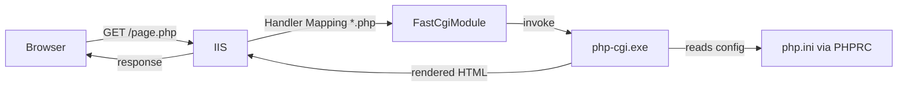

# Setting Up PHP on Windows Server

Setting up PHP on a Windows Server means installing the PHP runtime and wiring it into a web server — most commonly **IIS** — so that `.php` requests are executed rather than served as plain text. This note walks through a FastCGI-based PHP install on IIS end to end.

## Overview

On Windows, PHP is not a native IIS module. Instead, IIS hands `.php` requests to PHP through **FastCGI**, calling the `php-cgi.exe` interpreter for each request. This is why the **Non Thread Safe (NTS)** build of PHP is used with IIS: FastCGI manages a pool of single-threaded interpreter processes, so PHP's own thread safety is unnecessary and the NTS build is faster.

The setup has four stages: install and extract PHP, configure `php.ini`, register the PHP FastCGI handler in [Internet-Information-Services(IIS)](Internet-Information-Services(IIS).md), then verify with a `phpinfo()` page. Once running, this stack is the foundation for PHP applications such as [phpMyAdmin-on-Windows-Server-with-IIS](phpMyAdmin-on-Windows-Server-with-IIS.md).

## How It Works

When a browser requests a `.php` file, IIS matches the request path against its **Handler Mappings**, routes it to the **FastCGI module**, and FastCGI invokes `php-cgi.exe`, which loads `php.ini` (located via the `PHPRC` environment variable) and returns the rendered output.



> [!TIP]
> **Why Non Thread Safe (NTS)**
> Under IIS/FastCGI each PHP request runs in its own single-threaded process, so the thread-safety overhead of the TS build is wasted. Always download the **NTS** build for IIS; use the Thread Safe build only for the legacy Apache `mod_php` scenario.

## Installation

### 1. Download PHP

Navigate to the official PHP for Windows site and download the appropriate **Non Thread Safe (NTS)** build for IIS:

- [https://windows.php.net/download/](https://windows.php.net/download/)

```text
https://windows.php.net/downloads/releases/php-8.4.5-nts-Win32-vs17-x64.zip
```

Example naming pattern: `php-8.x.x-nts-Win32-vs17-x64.zip`. This version is optimized for use with IIS and FastCGI.

### 2. Extract PHP

Extract the downloaded ZIP to a directory on your system. Recommended path:

```text
C:\PHP
```

This becomes your PHP root directory.

### 3. Configure php.ini

Copy the default development configuration file and rename it to create a working `php.ini`:

```cmd
copy C:\PHP\php.ini-development C:\PHP\php.ini
```

Open `C:\PHP\php.ini` in a text editor and set the timezone:

```ini
date.timezone = "UTC"
```

You can replace `"UTC"` with `"Asia/Kolkata"`, `"America/New_York"`, etc.

Uncomment or add the extension directory and the extensions your applications need:

```ini
extension_dir = "ext"
extension=mysqli
extension=mbstring
extension=openssl
extension=curl
extension=zip
extension=gd
extension=intl
```

These are commonly used in most PHP applications.

## Configuration

### Set Up the PHP Handler in IIS

In **IIS Manager**, navigate to your server (or site), open **Handler Mappings**, then choose **Add Module Mapping** and fill the form:

```text
Request path:   *.php
Module:         FastCgiModule
Executable:     C:\PHP\php-cgi.exe
Name:           PHP via FastCGI
```

This tells IIS to send `.php` files to the PHP FastCGI executable.

### Configure FastCGI Settings

Open **FastCGI Settings** in IIS and add the interpreter:

```text
C:\PHP\php-cgi.exe
```

Edit the entry and add an environment variable so FastCGI can locate `php.ini`:

```text
Name:   PHPRC
Value:  C:\PHP
```

> [!IMPORTANT]
> **Handler + FastCGI must both be registered**
> Adding the module mapping alone is not enough — IIS also needs the `php-cgi.exe` process registered under **FastCGI Settings**. If the handler exists but the FastCGI entry (and `PHPRC`) is missing, PHP either fails to start or loads the wrong `php.ini`.

## Test PHP Setup

### Create a Test Page

Create a test PHP file in the default IIS web root:

```text
C:\inetpub\wwwroot\phpinfo.php
```

Contents of `phpinfo.php`:

```php
<?php

    phpinfo();

?>
```

### Visit in the Browser

Open a browser and request the page from the server's IP or hostname:

```text
http://192.168.1.51/phpinfo.php
```

If PHP is configured correctly, you will see a page with the full PHP environment info.

> [!WARNING]
> **Remove test pages after verifying**
> A live `phpinfo()` page leaks the PHP version, loaded extensions, absolute paths, and environment variables — a reconnaissance goldmine for attackers. Delete `phpinfo.php` immediately after confirming the install works.

## Security Considerations

A default PHP install exposes several information-leaking and code-execution surfaces that are routinely targeted on internet-facing hosts.

> [!WARNING]
> **Harden php.ini before exposure**
> - **`display_errors`** left `On` leaks file paths, SQL fragments, and stack context to anyone triggering an error. Set it `Off` in production and log to a file instead.
> - **Dangerous functions** (`exec`, `passthru`, `shell_exec`, `system`) turn a file-upload or injection flaw into remote command execution — disable them unless an application genuinely needs them.
> - **`phpinfo()` pages** are prime recon targets; never leave them deployed.
> - Run the IIS **app pool under a least-privilege identity** so a PHP compromise does not immediately yield SYSTEM.

Configure logging so errors are recorded without being shown to visitors:

```ini
error_log = "C:\PHP\php_errors.log"
log_errors = On
display_errors = Off
```

Disable functions commonly abused for command execution:

```ini
disable_functions = exec,passthru,shell_exec,system
```

From an offensive standpoint, these same settings are what a penetration tester probes for: a reachable `phpinfo.php`, verbose error output, or enabled `system`/`exec` are direct paths from web access to code execution. See Web-Application-Penetration-Test.

## Best Practices

- Use the **NTS** PHP build with FastCGI on IIS and keep PHP patched to a supported release.
- Set `display_errors = Off` and `log_errors = On` in production; never ship a `phpinfo()` page.
- Disable unneeded and dangerous functions via `disable_functions`.
- Run each site's IIS app pool under a distinct least-privilege identity for isolation.
- Restrict PHP admin tools such as [phpMyAdmin-on-Windows-Server-with-IIS](phpMyAdmin-on-Windows-Server-with-IIS.md) to trusted networks and require authentication.

## Troubleshooting

| Symptom | Likely cause & fix |
| --- | --- |
| PHP pages download or display as raw source instead of executing | The `*.php` handler mapping is missing — add the FastCGI module mapping to `php-cgi.exe` |
| `500` error / FastCGI process fails to start | `php.ini` not found or malformed — verify the `PHPRC` FastCGI environment variable points to `C:\PHP` |
| Extension not loaded (e.g. `mysqli` missing) | `extension_dir = "ext"` not set, or the `extension=` line still commented — uncomment and restart the app pool |
| Wrong or missing timezone warnings | `date.timezone` not set in `php.ini` — set a valid timezone value |
| Page loads but leaks paths/errors | `display_errors = On` — switch it `Off` and rely on `error_log` |

## References

- [Install and Configure PHP on IIS — Microsoft Learn](https://learn.microsoft.com/en-us/iis/application-frameworks/install-and-configure-php-on-iis/)
- [PHP for Windows downloads](https://windows.php.net/download/)
- [PHP Manual — Installation on Windows systems](https://www.php.net/manual/en/install.windows.php)
- [PHP Manual — php.ini directives](https://www.php.net/manual/en/ini.list.php)

## Related

- [Enterprise Windows Infrastructure Security](../Readme.md) — course hub
- [Internet-Information-Services(IIS)](Internet-Information-Services(IIS).md) — web server that runs PHP via FastCGI
- [phpMyAdmin-on-Windows-Server-with-IIS](phpMyAdmin-on-Windows-Server-with-IIS.md) — PHP app deployed on this stack
- [Types-of-Site-Binding-in-IIS](Types-of-Site-Binding-in-IIS.md) — mapping requests to IIS sites
- [Authentication-Methods-in-Windows](Authentication-Methods-in-Windows.md) — guarding IIS-hosted apps
- Web-Application-Penetration-Test — attacking PHP web applications
