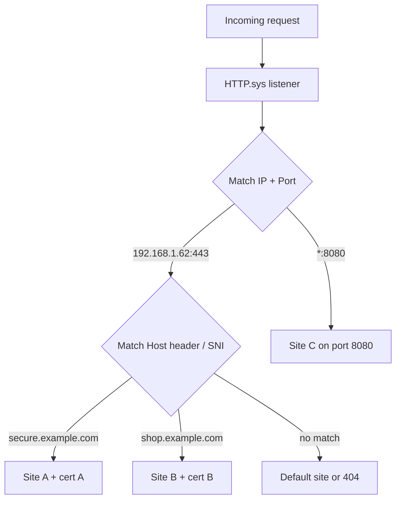

# Types of Site Bindings in IIS

In [Internet-Information-Services(IIS)](Internet-Information-Services(IIS).md) a **site binding** defines how a website or web application answers incoming network requests. Each binding is a combination of an **IP address**, a **TCP port**, an optional **host header** (domain name), and a **protocol** (http, https, ftp). Together these values decide which site receives a given request.

## Overview

A single IIS server usually hosts many sites, but every request that arrives is just a TCP connection to an IP and port carrying an HTTP `Host:` header. Bindings are the mapping table that lets IIS (via the kernel-mode `HTTP.sys` listener) route each request to the correct site. Understanding bindings is essential for [Hosting](../Software-Development-Life-Cycle/Hosting.md) multiple sites on one box, for adding TLS with the right certificate, and — from an attacker's view — for Web-Enumeration, where discovering unlisted host headers or extra ports on a shared IP exposes hidden virtual hosts.

The four binding elements can be mixed freely: sites can share an IP but differ by port, share IP and port but differ by host header (name-based hosting), or be fully isolated on a dedicated IP.

## Binding Elements

A binding is expressed internally as `IP:Port:HostHeader` for a given protocol (for example `*:80:www.example.com`). The sections below cover each element.

### IP Address Binding

- Binds the website to a specific network IP address.
- Useful for servers hosting multiple sites with unique public/private IPs, or when a site must be isolated on its own address.
- Example:
  - IP Address: `192.168.10.51`
  - Port: `80`
  - Hostname: _(optional)_

> [!NOTE]
> **IPv6 and dual stack**
> Modern Windows Server builds bind IPv6 addresses natively alongside IPv4, so a site can be reachable in dual-stack environments. Use `All Unassigned` (`*`) only when the site should answer on every address the machine owns.

**Effect:** the site responds only on the specifically assigned IP address (e.g. `192.168.10.51:80`).

### Port Number Binding

- Binds the site to a distinct TCP port.
- Allows multiple websites to share one IP address while listening on different ports.
- Example:
  - IP Address: `All Unassigned`
  - Port: `8080`
  - Protocol: `http`

Non-default ports (anything other than 80/443) are frequently blocked by perimeter firewalls and should be documented for both users and network admins.

**Effect:** the site is accessed via `http://yourdomain.com:8080`.

### Host Header (Domain Name) Binding

- Uses the HTTP `Host:` header (and **SNI** for HTTPS) to distinguish websites that share the same IP and port.
- This is *name-based virtual hosting* — essential for shared hosting and cloud scenarios where public IPs are scarce.
- Example:
  - IP: `192.168.1.62`
  - Port: `80`
  - Hostname: `www.example.com`

> [!TIP]
> **Prefer FQDNs and SNI**
> Always bind using the Fully Qualified Domain Name. When serving multiple secure sites over HTTPS on one IP:port, enable **SNI (Server Name Indication)** so IIS can select the correct certificate from the host name in the TLS handshake.

**Effect:** IIS routes each request to the appropriate site based on the domain name in the HTTP(S) request.

### Protocol (Type) Binding

- Specifies the communication protocol:
  - `http` — unencrypted
  - `https` — encrypted via SSL/TLS (requires an assigned certificate)
  - `ftp` — file transfer (see [FTP-Setup-in-IIS](../FTP-Server-Administration/FTP-Setup-in-IIS.md))
- Example:
  - Type: `https`
  - IP: `192.168.1.62`
  - Port: `443`
  - Hostname: `secure.example.com`
  - SSL Certificate: required for the HTTPS binding

> [!IMPORTANT]
> **TLS version**
> Bind HTTPS only with modern TLS (1.2 or 1.3); TLS 1.0/1.1 are deprecated and disabled by default on current Windows Server. An HTTPS binding without a correctly assigned certificate produces protocol/handshake errors.

**Effect:** the site is securely accessible at `https://secure.example.com`.

## How Request Routing Works

When a request arrives, `HTTP.sys` matches it against the registered bindings, using IP and port first, then the host header to disambiguate name-based sites sharing that IP:port.



## Configuration

List existing sites and their bindings with `appcmd` or the `WebAdministration` PowerShell module.

```cmd
appcmd list sites
```

Add an HTTP binding (IP + port + host header) to a site:

```powershell
Import-Module WebAdministration
New-WebBinding -Name "MySite" -Protocol http -IPAddress "192.168.1.62" -Port 80 -HostHeader "www.example.com"
```

Add an HTTPS binding with **SNI** enabled (`-SslFlags 1`), then assign a certificate by thumbprint:

```powershell
New-WebBinding -Name "MySite" -Protocol https -Port 443 -HostHeader "secure.example.com" -SslFlags 1
# Bind the certificate (thumbprint from Cert:\LocalMachine\My) to the SNI binding
New-Item -Path "IIS:\SslBindings\!443!secure.example.com" -Value (Get-Item Cert:\LocalMachine\My\<THUMBPRINT>) -SSLFlags 1  # untested
```

Review current bindings:

```powershell
Get-WebBinding -Name "MySite"
```

## Summary Table

| Binding Type        | Key Element              | Example                     | Security Note                                        |
|---------------------|--------------------------|-----------------------------|-----------------------------------------------------|
| IP Address Binding  | Specific IPv4/IPv6       | `192.168.1.50`              | Full IPv6 support; dual stack is best practice      |
| Port Binding        | Custom port              | Port `8080` for HTTP        | Document alternative ports for firewall access      |
| Domain Name Binding | Host header / FQDN / SNI | `www.example.com`           | Use SNI with HTTPS for multi-site SSL               |
| Protocol Binding    | Protocol (http/https)    | HTTPS with SSL certificate  | Require TLS 1.2+ (TLS 1.0/1.1 deprecated)           |

## Security Considerations

> [!WARNING]
> **Bindings are an attack surface**
> - **Virtual-host discovery** — a shared IP may serve hidden sites reachable only by their host header. During Web-Enumeration attackers brute-force host headers and scan non-default ports to reveal admin panels or staging sites that are not otherwise linked.
> - **Missing host header = catch-all** — a binding with a blank host header answers *any* `Host:` value on that IP:port, which can expose internal apps and enables Host-header injection and cache-poisoning tricks.
> - **Weak TLS** — an HTTPS binding still permitting TLS 1.0/1.1 or weak ciphers is downgrade-attackable; enforce TLS 1.2/1.3.
> - **Wrong or wildcard certificate** — an over-broad certificate on a public binding leaks the certificate to unintended sites and complicates revocation.

- Bind sensitive/admin sites to a specific internal IP or non-routable interface rather than `All Unassigned`.
- Always set an explicit host header on internet-facing sites so IIS rejects unmatched `Host:` values.
- Pair every HTTPS binding with a valid certificate and enable SNI for multi-tenant TLS.

## Best Practices

- Always serve production sites over HTTPS/TLS with SNI and valid certificates; redirect plain HTTP to HTTPS.
- Avoid IP-only bindings unless the site genuinely needs address-level isolation.
- Document all custom (non-80/443) port bindings for the network and firewall teams.
- For multiple secure sites on one IP, use SNI with distinct strong certificates.
- Remove deprecated protocols and versions (unused FTP, TLS 1.0/1.1) from production hosts.

## Troubleshooting

| Symptom | Likely cause & fix |
|---------|--------------------|
| Requests reach the wrong site | Overlapping bindings — make the IP/port/host-header tuple unique per site and check binding precedence |
| HTTPS site returns a certificate mismatch | Wrong certificate assigned, or SNI not enabled where multiple certs share the IP:port |
| Site unreachable on a custom port | Port blocked by Windows Firewall / perimeter — open the port and confirm `HTTP.sys` is listening (`netsh http show servicestate`) |
| "Cannot start site — binding in use" | Another site already claims that IP:port:host — change one binding element to make it unique |

## References

- [Microsoft Learn — Binding `<binding>` element (IIS)](https://learn.microsoft.com/en-us/iis/configuration/system.applicationhost/sites/site/bindings/binding)
- [Microsoft Learn — Server Name Indication (SNI) in IIS](https://learn.microsoft.com/en-us/iis/get-started/whats-new-in-iis-8/iis-80-server-name-indication-sni-ssl-scalability)
- [Microsoft Learn — WebAdministration `New-WebBinding`](https://learn.microsoft.com/en-us/powershell/module/webadministration/new-webbinding)

## Related

- [Enterprise Windows Infrastructure Security](../Readme.md) — course hub and map of content
- [Internet-Information-Services(IIS)](Internet-Information-Services(IIS).md) — the server that uses these bindings
- [Hosting](../Software-Development-Life-Cycle/Hosting.md) — bindings underpin multi-site hosting
- [FTP-Setup-in-IIS](../FTP-Server-Administration/FTP-Setup-in-IIS.md) — FTP sites also rely on bindings
- Web-Enumeration — host-header/binding discovery during recon
