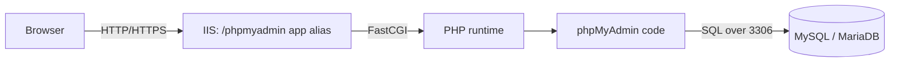

# phpMyAdmin on Windows Server with IIS

phpMyAdmin is a PHP web application that provides a browser-based front end for administering MySQL/MariaDB databases. This note walks through deploying it as an application under Internet Information Services (IIS) on Windows Server, then hardening the result.

## Overview

Running phpMyAdmin on Windows means stacking three moving parts: [IIS](Internet-Information-Services(IIS).md) serves the site, a PHP runtime (see [Setting-Up-PHP-on-Windows-Server](Setting-Up-PHP-on-Windows-Server.md)) executes the phpMyAdmin code through a FastCGI handler, and a MySQL or MariaDB server holds the actual data. IIS maps an incoming request to the phpMyAdmin folder via an application alias (a form of URL-to-path mapping — compare [Types-of-Site-Binding-in-IIS](Types-of-Site-Binding-in-IIS.md)), PHP renders the page, and phpMyAdmin proxies your SQL to the database. Because it is a highly recognisable, internet-facing database admin panel, phpMyAdmin is also a frequent target — see Web-Application-Penetration-Test.



## Prerequisites

Before you start, make sure you have:

- **IIS installed** (the Web Server role)
- **PHP installed and configured with IIS** (via the FastCGI handler) — see [Setting-Up-PHP-on-Windows-Server](Setting-Up-PHP-on-Windows-Server.md)
- **MySQL or MariaDB server installed and running**

## Deployment

### Step 1: Download phpMyAdmin

1. Go to the [official download page](https://www.phpmyadmin.net/downloads/)
2. Download the **latest `.zip`** version
3. Extract to:

```text
C:\inetpub\wwwroot\phpmyadmin
```

### Step 2: Configure IIS

1. Open **IIS Manager** (`inetmgr`)
2. In the left panel, expand **Sites > Default Web Site**
3. Right-click `Default Web Site` -> **Add Application**
   - **Alias**: `phpmyadmin`
   - **Physical Path**: `C:\inetpub\wwwroot\phpmyadmin`
4. Click **OK**

### Step 3: Test PHP Support

Create a file at `C:\inetpub\wwwroot\phpmyadmin\phpinfo.php` with the following content:

```php
<?php phpinfo(); ?>
```

Browse to `http://localhost/phpmyadmin/phpinfo.php` — you should see a PHP info page. If not, PHP is not correctly wired into IIS; revisit the FastCGI handler mapping in [Setting-Up-PHP-on-Windows-Server](Setting-Up-PHP-on-Windows-Server.md).

> [!WARNING]
> **Delete phpinfo.php when done**
> `phpinfo()` leaks the full PHP configuration — module list, paths, versions, and more. It is a reconnaissance goldmine for an attacker. Remove it immediately after testing (see Step 7).

### Step 4: Configure phpMyAdmin

1. Go to `C:\inetpub\wwwroot\phpmyadmin`
2. Duplicate `config.sample.inc.php` and rename the copy to `config.inc.php`
3. Edit `config.inc.php`:

```php
$cfg['blowfish_secret'] = 'random32charstring1234567890abcd'; // Must be at least 32 chars
$cfg['Servers'][1]['auth_type'] = 'cookie';  // Recommended
$cfg['Servers'][1]['host'] = 'localhost';    // Or your MySQL host
```

The `blowfish_secret` must be a unique, random passphrase of at least 32 characters — it encrypts the auth cookie. Generate one with a password tool, for example:

```bash
pwgen 32 -1
```

### Step 5: Set Permissions

1. Right-click the `phpmyadmin` folder -> **Properties**
2. Go to the **Security** tab -> click **Edit**
3. Add permissions for the IIS worker identities:
   - `IUSR`
   - `IIS_IUSRS`
4. Grant at least **Read & Execute** permissions

> [!TIP]
> **Least privilege on the web root**
> Grant only Read & Execute — the web identities do not need Write access to the phpMyAdmin code. Writable web content is a common foothold for web-shell upload during exploitation.

### Step 6: Access phpMyAdmin

Open your browser and go to:

```text
http://localhost/phpmyadmin
```

You should see the login page.

### Step 7: (Optional) Remove Test File

Delete the `phpinfo.php` file created in Step 3 for security:

```text
C:\inetpub\wwwroot\phpmyadmin\phpinfo.php
```

> [!NOTE]
> **Restart IIS after changes**
> After each configuration change, restart IIS from an elevated prompt:
>
> ```cmd
> iisreset
> ```

## PHP Configuration (`php.ini`)

phpMyAdmin depends on several PHP extensions and settings. Edit `php.ini` and restart IIS to apply.

### Enable Required PHP Extensions

Uncomment these lines in `php.ini` (remove the leading `;`):

```ini
extension=bz2
extension=curl
extension=gd
extension=intl
extension=mbstring
extension=mysqli
extension=openssl
extension=pdo_mysql
extension=zip
extension=xml
extension=json
```

### Set Timezone (to Avoid Warnings)

Find and update this line:

```ini
date.timezone = "UTC"
```

Or set it to your local timezone, for example:

```ini
date.timezone = "America/New_York"
```

The full list of timezone identifiers is at the [PHP timezone reference](https://www.php.net/manual/en/timezones.php).

### Enable Error Reporting (Optional, for Debugging)

```ini
error_reporting = E_ALL & ~E_DEPRECATED & ~E_STRICT
;error_reporting = E_ALL
display_errors = On
log_errors = On
error_log = "C:\php\logs\php_errors.log"
```

Make sure `C:\php\logs\` exists and is writable.

> [!WARNING]
> **Turn display_errors off in production**
> `display_errors = On` sends PHP errors — including file paths, SQL fragments, and stack context — straight to the browser. Keep it on only for local debugging; on any exposed host set it `Off` and rely on `log_errors` instead.

### Increase Upload and Memory Limits (Optional)

```ini
upload_max_filesize = 64M
post_max_size = 64M
memory_limit = 256M
max_execution_time = 300
```

### Configure Sessions (Optional)

Ensure the session save path is set and writable:

```ini
session.save_path = "C:\Windows\Temp"
```

### Restart IIS to Apply Changes

```cmd
iisreset
```

## Security Considerations

> [!WARNING]
> **Never expose phpMyAdmin unauthenticated to the internet**
> phpMyAdmin is one of the most heavily scanned and brute-forced apps on the web. Automated bots probe `/phpmyadmin`, `/pma`, `/dbadmin`, and dozens of other default paths. A reachable panel plus weak MySQL credentials is a direct path to full database compromise — and MySQL primitives like `INTO OUTFILE` or `LOAD_FILE` can escalate a DB compromise into web-shell code execution on the host.

From an offensive perspective, phpMyAdmin is attractive because it centralises database access behind a predictable URL and login form: default/weak credentials, credential reuse, exposed `phpinfo.php`, verbose PHP errors, and outdated versions with known CVEs are all common entry points. Defensively, treat it as a privileged admin console:

- Restrict access by source IP (IIS **IP Address and Domain Restrictions**) or bind it to a management VLAN/VPN only.
- Front it with **HTTPS** and add a second authentication layer (IIS authentication or a reverse-proxy gate) on top of the phpMyAdmin login.
- Do not use the MySQL `root` account for day-to-day logins; create scoped database users.
- Rename or relocate the app alias away from the default `/phpmyadmin` to cut down on automated scanning.

## Best Practices

- Keep phpMyAdmin, PHP, and MySQL/MariaDB fully patched — old phpMyAdmin releases carry known RCE/XSS CVEs.
- Set a strong, unique `blowfish_secret` and use `cookie` auth so credentials are never stored in `config.inc.php`.
- Grant the IIS identities only **Read & Execute** on the web root; never leave it writable.
- Remove `phpinfo.php` and any other diagnostic files after setup, and disable `display_errors` on exposed hosts.
- Restrict access by IP and require HTTPS; never publish the panel on the open internet without a network-layer gate.

## Troubleshooting

| Symptom | Likely cause & fix |
| --- | --- |
| PHP page downloads instead of running | FastCGI/PHP handler not mapped in IIS — configure the PHP handler for the site (see [Setting-Up-PHP-on-Windows-Server](Setting-Up-PHP-on-Windows-Server.md)) |
| `phpinfo.php` shows no `mysqli`/`pdo_mysql` | Extension lines still commented in `php.ini` — uncomment them and run `iisreset` |
| "The mbstring extension is missing" | `extension=mbstring` not enabled in `php.ini` |
| Login fails with "Cannot connect: invalid settings" | Wrong `host`/port in `config.inc.php` or MySQL service not running |
| Blank page or 500 after editing `config.inc.php` | PHP syntax error in the config — check the PHP error log |
| "The secret passphrase in configuration is too short" | `blowfish_secret` under 32 characters — set a longer random value |

## References

- [phpMyAdmin documentation](https://docs.phpmyadmin.net/)
- [phpMyAdmin downloads](https://www.phpmyadmin.net/downloads/)
- [Install and configure PHP on IIS (Microsoft Learn)](https://learn.microsoft.com/en-us/iis/application-frameworks/install-and-configure-php-on-iis/)
- [PHP timezone reference](https://www.php.net/manual/en/timezones.php)

## Related

- [Enterprise Windows Infrastructure Security](../Readme.md) — course hub
- [Setting-Up-PHP-on-Windows-Server](Setting-Up-PHP-on-Windows-Server.md) — PHP runtime prerequisite for phpMyAdmin
- [Internet-Information-Services(IIS)](Internet-Information-Services(IIS).md) — web server hosting phpMyAdmin
- [Types-of-Site-Binding-in-IIS](Types-of-Site-Binding-in-IIS.md) — how IIS maps requests to sites/apps
- [Authentication-Methods-in-Windows](Authentication-Methods-in-Windows.md) — layering IIS auth in front of the panel
- [Website](../Software-Development-Life-Cycle/Website.md) — site context for the phpMyAdmin app
- Web-Application-Penetration-Test — attacking phpMyAdmin/DB admin panels
