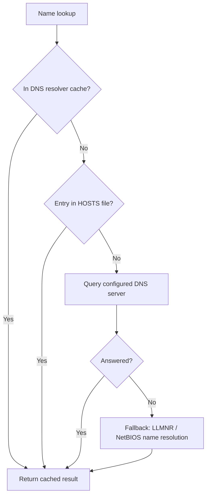

# Network Enumeration

Network enumeration is the first-pass reconnaissance step that maps a Windows host's interfaces, connectivity, name resolution, routing, and active connections using only built-in command-line tools.

## Overview

**Network enumeration** on Windows uses built-in command-line utilities to inspect interfaces, connectivity, name resolution, routing, and active connections. These tools (`ipconfig`, `ping`, `tracert`, `arp`, `nslookup`, `route`, `netstat`) form the first-pass reconnaissance toolkit for both administrators and penetration testers. They complement the wider utility families in this module — [Net-Services-Suite](Net-Services-Suite.md) for shares and sessions, [WMIC-Commands](WMIC-Commands.md) for WMI queries, [NETSH-Command](NETSH-Command.md) for interface/firewall configuration, and [PowerShell-Commands-for-Penetration-Testing](PowerShell-Commands-for-Penetration-Testing.md) for the PowerShell equivalents.

> [!TIP]
> **Living-off-the-land recon**
> Every command below ships with Windows, so host reconnaissance leaves no dropped tools on disk. During post-exploitation this "living-off-the-land" enumeration is the quiet first step before touching the network with noisier scanners.

## Commands

### IP Configuration

The `ipconfig` command displays and manages the network configuration of a Windows machine.

List all network interfaces:

```cmd
ipconfig
```

Display full configuration information:

```cmd
ipconfig /all
```

Release the IPv4 address for the specified adapter:

```cmd
ipconfig /release
```

Release the IPv6 address for the specified adapter:

```cmd
ipconfig /release6
```

Renew the IPv4 address for the specified adapter:

```cmd
ipconfig /renew
```

Renew the IPv6 address for the specified adapter:

```cmd
ipconfig /renew6
```

Display the contents of the DNS resolver cache:

```cmd
ipconfig /displaydns
```

Purge the DNS resolver cache:

```cmd
ipconfig /flushdns
```

Refresh all DHCP leases and register DNS names:

```cmd
ipconfig /registerdns
```

### Ping

The `ping` command checks communication or connectivity between computers.

Check connectivity:

```cmd
ping 192.168.1.7
```

Ping indefinitely:

```cmd
ping 192.168.1.7 -t
```

Specify the number of echo requests to send:

```cmd
ping -n 1 192.168.1.7
```

Adjust the size of the ping packet:

```cmd
ping -n 1 -l 65500 192.168.1.7
```

### Traceroute

The `tracert` command traces the path or route to a specified remote host.

```cmd
tracert 192.168.1.7
```

### Pathping

The `pathping` command combines the features of `ping` and `tracert`, providing information on network latency and packet loss.

```cmd
pathping 192.168.1.7
```

### ARP (Address Resolution Protocol)

The `arp` command views and manages the ARP cache.

Display the ARP cache:

```cmd
arp -a
```

### NSLookup

The `nslookup` command looks up DNS-related information.

Find the hostname associated with an IP address:

```cmd
nslookup 192.168.1.7
```

Find the IP address associated with a domain name:

```cmd
nslookup armour.local
```

Windows resolves a name in a fixed order before it ever queries the configured DNS server. Understanding this order explains why `ipconfig /displaydns` and `ipconfig /flushdns` matter during enumeration and troubleshooting:



> [!NOTE]
> **HOSTS file precedence**
> Static entries in `C:\Windows\System32\drivers\etc\hosts` are consulted before DNS and load into the resolver cache, so a stale or tampered HOSTS entry silently overrides DNS. Inspect it when name resolution disagrees with `nslookup`, which queries the DNS server directly and bypasses the cache.

### Route Table

The `route` command manipulates the IP routing table.

List the current routing table:

```cmd
route print
```

### Netstat

The `netstat` command displays network statistics, connections, and routing tables.

Display active connections numerically:

```cmd
netstat -n
```

Display all active connections and listening ports numerically:

```cmd
netstat -an
```

Display all active connections with process IDs:

```cmd
netstat -ano
```

Show TCP connections with process information:

```cmd
netstat -anop tcp
```

Show UDP connections with process information:

```cmd
netstat -anop udp
```

Display network connections with the associated executable:

```cmd
netstat -nob
```

Show all active connections, listening ports, and associated executables:

```cmd
netstat -anob
```

## Best Practices

- Start with `ipconfig /all` to capture DNS servers, gateways, and DHCP details in one view.
- Use `netstat -ano` and map PIDs with Task Manager or `tasklist` to attribute connections to processes.
- Flush the DNS cache (`ipconfig /flushdns`) when troubleshooting stale name resolution.
- Prefer `-n` numeric flags to avoid slow reverse-DNS lookups during enumeration.

## Security Considerations

- `netstat -anob` requires elevation but reveals which binaries own listening ports, useful for spotting backdoors.
- Excessive `ping`/`tracert` sweeps are easily detected by network monitoring.
- ARP cache inspection can reveal hosts on the local segment and support ARP-spoofing awareness.
- DNS cache contents (`ipconfig /displaydns`) can leak recently contacted hosts.

> [!WARNING]
> **A double-edged reconnaissance surface**
> The same built-in commands defenders use to diagnose a host are the attacker's first enumeration step after landing on a Windows box. `ipconfig /all`, `arp -a`, `route print`, and `netstat -ano` fingerprint the network, name servers, neighboring hosts, and running services without dropping any tooling — behavior that blends into normal administration and evades signature-based detection. Defensively, monitor for anomalous bursts of these commands (for example via Sysmon process-creation events) and remember that leaked DNS/ARP caches expose internal topology.

## Troubleshooting

| Symptom | Likely cause | Resolution |
| --- | --- | --- |
| `ping` times out | Host down, ICMP blocked, or firewall filtering | Verify the host is up and confirm ICMP is permitted |
| `netstat -b` shows no executable names | Command not run elevated | Run Command Prompt as Administrator |
| `nslookup` returns SERVFAIL | DNS server unreachable or misconfigured | Check `ipconfig /all` for the configured DNS server |
| Stale IP after network change | Old DHCP lease cached | Run `ipconfig /release` then `ipconfig /renew` |

## References

- <https://learn.microsoft.com/en-us/windows-server/administration/windows-commands/ipconfig>
- <https://learn.microsoft.com/en-us/windows-server/administration/windows-commands/netstat>

## Related

- [Enterprise Windows Infrastructure Security](../Readme.md) — course hub and map of content
- [Net-Services-Suite](Net-Services-Suite.md) — `net view`/`net share` commands used for enumeration
- [NETSH-Command](NETSH-Command.md) — configuring interfaces and firewall from the CLI
- [WMIC-Commands](WMIC-Commands.md) — WMI queries for additional host and network data
- [PowerShell-Commands-for-Penetration-Testing](PowerShell-Commands-for-Penetration-Testing.md) — PowerShell equivalents for network recon
- [Windows-Firewall-and-AV-Commands](Windows-Firewall-and-AV-Commands.md) — inspecting firewall state during host recon
