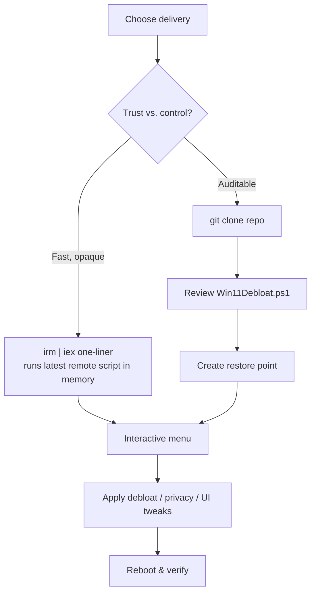

# Win11Debloat

**Win11Debloat** is an open-source PowerShell script by Raphire that removes preinstalled bloatware, disables telemetry, and customizes the Windows 10/11 UI/UX and performance profile in a single, largely automated pass.

## Overview

Win11Debloat is a maintenance and hardening convenience tool rather than an exploit: it bundles dozens of registry edits, `Appx` package removals, and service tweaks behind a menu-driven front end so an operator does not have to remember each individual change. In an offensive-security lab it is useful for building a clean, low-noise Windows image, and it is a good study case for two recurring themes in [Windows registry](Windows-Registry.md) work and [offensive PowerShell](PowerShell-Commands-for-Penetration-Testing.md): the risk of piping remote code straight into an interpreter, and the many places Windows stores telemetry, AI, and advertising settings. It sits alongside [Windows-Defender-Remover](Windows-Defender-Remover.md) as lab-hardening / component-stripping tooling.

- Repository: [Raphire/Win11Debloat](https://github.com/raphire/win11debloat)
- Supported: Windows 10 and Windows 11

## How It Works

The script exists in two delivery forms. The **remote one-liner** fetches the current script from the author's redirect and executes it in memory; the **cloned copy** lets you read the exact `.ps1` before it runs. Both ultimately drive the same interactive menu that applies the selected debloat, privacy, and UI changes.



> [!WARNING]
> **Never pipe unseen code into an interpreter**
> The convenience one-liner downloads whatever the remote endpoint currently serves and runs it immediately, with no visibility or integrity check. Remote content can change at any time, so a script that is safe today is not guaranteed safe tomorrow. Prefer the reviewable clone-and-inspect path on any host you care about.

## Execution Methods

### Quick execution (remote, not recommended for beginners)

Downloads the latest script, converts it to executable code, and runs it instantly:

```powershell
& ([scriptblock]::Create((irm "https://debloat.raphi.re/")))
```

### Recommended safe method (clone, review, run)

1. Clone the repository so you have a fixed, inspectable copy:

```bash
git clone https://github.com/raphire/win11debloat.git
cd win11debloat
```

2. Review the script before running anything:

```powershell
notepad Win11Debloat.ps1
```

3. Execute the local script (bypassing execution policy only for this invocation):

```powershell
powershell -ExecutionPolicy Bypass -File .\Win11Debloat.ps1
```

## Key Features

What the script changes, grouped by intent:

| Category | Representative changes |
| --- | --- |
| Debloat apps | Removes Xbox services, Cortana, Microsoft Teams, and third-party stubs (Candy Crush, TikTok, etc.) |
| Privacy | Disables telemetry and diagnostic data collection, removes targeted ads, disables activity tracking |
| AI & Microsoft features | Disables Copilot, removes Bing search integration, disables Recall |
| UI customization | Restores the classic right-click menu, disables widgets, cleans the Start Menu, tweaks the taskbar |
| Performance | Reduces background services, disables unnecessary startup apps, improves responsiveness |

## Execution Modes

| Mode | Command | Notes |
| --- | --- | --- |
| Interactive (default) | `.\Win11Debloat.ps1` | Menu-driven, beginner-friendly |
| Silent / automated | `.\Win11Debloat.ps1 -Silent` | Runs with predefined defaults; less control |
| With restore point | `.\Win11Debloat.ps1 -CreateRestorePoint` | Creates a System Restore point before applying changes |

> [!TIP]
> **Create a restore point first**
> Run with `-CreateRestorePoint` (or make a snapshot on a VM) before applying changes. Many tweaks can be undone, but not all of them cleanly, and a restore point is the fastest way back.

## Reversibility

Some changes can be reverted, but do not assume everything is:

- Removed apps can often be reinstalled from the Microsoft Store.
- System Restore can roll back registry and service changes if a restore point exists.
- Some services must be re-enabled manually.

> [!NOTE]
> **Not perfectly reversible**
> Certain package removals and policy changes have no clean built-in undo. Treat a debloat pass as semi-permanent and test on a disposable VM before touching a machine you rely on.

## Security Considerations

> [!WARNING]
> **Supply-chain and integrity risk**
> Blindly running `irm <url> | iex` is a textbook supply-chain exposure: the remote code can change at any time, there is no signature or hash verification, and a compromised endpoint would execute with your privileges. The same pattern attackers use for stager delivery is exactly what the convenience one-liner relies on.

- Aggressive debloating can break **Windows Update**, damage built-in Microsoft apps, remove features (OneDrive, Store), and conflict with **enterprise/Group Policy** management — do not run it on domain-joined or production hosts.
- Disabling telemetry, Defender-adjacent features, or update components on a real, network-reachable machine reduces its security posture; treat component stripping as a **lab convenience only**.
- Always review the exact script version you intend to run — pin to a cloned commit rather than "latest from the internet."

## Best Practices

- Always read the script (or diff the cloned commit) before executing it.
- Run inside a VM or snapshot first, and create a restore point before applying changes.
- Avoid a "remove everything" mindset; keep the Microsoft Store and update stack unless you have a specific reason to strip them.
- Apply changes incrementally and verify system behavior after each major change.
- Keep a backup of important data before large debloat passes.

## Alternatives

- **WinUtil** (Chris Titus Tech) — combined debloat/utility toolkit
- **O&O ShutUp10++** — privacy/telemetry toggles
- **ThisIsWin11** — Windows 11 tweaking front end

## Troubleshooting

| Symptom | Likely cause & fix |
| --- | --- |
| `running scripts is disabled on this system` | Execution policy blocks the script — launch with `powershell -ExecutionPolicy Bypass -File .\Win11Debloat.ps1` from an elevated shell |
| Changes have no effect / "Access denied" | Not running elevated — reopen PowerShell as Administrator |
| Windows Update or Store broken after run | Over-aggressive removal — restore from the System Restore point / snapshot and re-run with a narrower selection |
| Feature returns after an update | Some tweaks are re-applied by Windows Update; re-run the relevant option or re-tweak manually |

## References

- [Raphire/Win11Debloat — GitHub repository](https://github.com/raphire/win11debloat)
- [about_Execution_Policies (Microsoft Learn)](https://learn.microsoft.com/en-us/powershell/module/microsoft.powershell.core/about/about_execution_policies)
- [System Restore overview (Microsoft Support)](https://support.microsoft.com/en-us/windows/use-system-restore-a5ae3ed9-07c4-fd56-45ee-096777ecd14e)

## Related

- [Custom-build-Windows-11-ISO](../Lab-Setup-and-Virtualization/Custom-build-Windows-11-ISO.md) — debloating during a custom Windows build
- [Windows-Defender-Remover](Windows-Defender-Remover.md) — related component-stripping / lab-hardening tooling
- [Windows-Registry](Windows-Registry.md) — where most debloat tweaks are written
- [PowerShell-Commands-for-Penetration-Testing](PowerShell-Commands-for-Penetration-Testing.md) — offensive PowerShell context for the execution one-liner
- [Enterprise Windows Infrastructure Security](../Readme.md) — course hub
