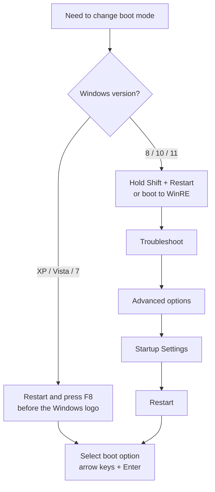

# Windows Advanced Boot Options

The **Windows Advanced Boot Options** menu provides specialized startup modes that help diagnose and recover from system startup issues, driver failures, hardware conflicts, and configuration problems. Because these modes deliberately load a reduced set of drivers and services, they are also relevant to both attackers (as an evasion surface) and defenders (as a hardening concern).

## Overview

Advanced Boot Options let administrators and users start Windows with alternate configurations for troubleshooting and recovery. Each mode changes *which* drivers, services, and shell load at boot — from a near-minimal **Safe Mode** environment to a full recovery **Command Prompt**.

> [!NOTE]
> **Where the menu lives**
> The classic **Advanced Boot Options** menu is reached by pressing **F8** during startup on **Windows XP, Vista, and 7**. On **Windows 8, 10, and 11**, the same functionality moved into the **Windows Recovery Environment (WinRE)** under **Troubleshoot → Advanced options → Startup Settings**, because fast boot on modern firmware (UEFI/SSD) leaves almost no window to catch an F8 keypress.

Underlying boot behavior is controlled by **Boot Configuration Data (BCD)**, which can be inspected and edited with [bcdedit](BCDEDIT-Command.md); several of the modes below correspond to `bcdedit` safeboot options.

## Boot Modes

### Safe Mode

Starts Windows with only the essential drivers and services required for the operating system to function.

**Loaded components:**

- Keyboard driver
- Mouse driver
- Basic video (VGA) driver
- Monitor driver
- Mass storage drivers
- Core Windows system services

**Not loaded:**

- Third-party drivers
- Startup programs
- Network drivers
- Non-essential Windows services

**Common uses:** removing malware, uninstalling problematic software, rolling back device drivers, and troubleshooting startup failures.

### Safe Mode with Networking

Starts Windows in **Safe Mode** while additionally loading the networking stack.

**Additional components:** network adapter drivers, the TCP/IP protocol stack, and network-related services.

**Common uses:** downloading drivers, updating antivirus signatures, accessing shared network resources, and remote troubleshooting.

> [!NOTE]
> **Minimal networking only**
> Only the essential networking services are loaded — expect reduced functionality compared with a normal boot.

### Safe Mode with Command Prompt

Starts Windows with the same minimal configuration as **Safe Mode**, but launches **Command Prompt (`cmd.exe`)** instead of the graphical shell (`explorer.exe`).

**Common uses:** running administrative commands, repairing corrupted system files, using recovery utilities, and troubleshooting systems where Windows Explorer fails to load.

### Enable Boot Logging

Creates a log file listing the drivers and services loaded during system startup.

Log file location:

```text
%SystemRoot%\ntbtlog.txt
```

**Common uses:** identifying driver load failures, diagnosing boot problems, and reviewing the startup sequence.

### Enable VGA Mode

Starts Windows using the standard Microsoft VGA display driver.

- Resolution: **640 × 480**
- Color depth: **256 colors (8-bit)**

**Common uses:** recovering from an incompatible graphics driver, fixing an unsupported display resolution, and troubleshooting video driver issues.

> [!NOTE]
> **Renamed in Windows 8+**
> In Windows 8 and later this option is replaced by **Enable Low-Resolution Video**.

### Last Known Good Configuration

Starts Windows using the most recent control set that successfully completed the boot process and user logon.

The mode restores the control set referenced by the **`LastKnownGood`** value under:

```text
HKEY_LOCAL_MACHINE\SYSTEM\Select
```

The `Select` key holds pointers (`Current`, `Default`, `Failed`, `LastKnownGood`) to numbered `ControlSetNNN` keys; **Last Known Good** boots the one flagged as last good rather than the current set.

**Common uses:** recovering from a faulty driver installation, reverting an unsuccessful hardware configuration change, and fixing startup issues caused by registry configuration changes. See [Windows-Registry](Windows-Registry.md) for the underlying hive structure.

> [!IMPORTANT]
> **The window closes after logon**
> **Last Known Good Configuration** is updated after every successful logon. If you log on successfully *after* a problematic change, that bad configuration becomes the new "last known good" and can no longer be reverted with this option.

### Start Windows Normally

Starts Windows using the normal startup process without any special boot options — used to exit troubleshooting mode or verify whether an issue is resolved.

### Reboot

Restarts the computer — used after making hardware/configuration changes or to retry the boot process after resolving an issue.

## Accessing Advanced Boot Options



### Windows XP, Vista, and Windows 7

1. Restart the computer.
2. Press **F8** repeatedly before the Windows logo appears.
3. Select the desired boot option with the arrow keys.
4. Press **Enter**.

### Windows 8, Windows 10, and Windows 11

1. Hold **Shift** and select **Restart**.
2. Navigate to **Troubleshoot → Advanced options → Startup Settings**.
3. Select **Restart**.
4. Choose the required startup option.

You can also force the next boot into safe mode from a running system with `bcdedit` (see [BCDEDIT-Command](BCDEDIT-Command.md)):

```cmd
bcdedit /set {current} safeboot minimal        # standard Safe Mode
bcdedit /set {current} safeboot network         # Safe Mode with Networking
bcdedit /deletevalue {current} safeboot         # revert to normal boot
```

## Summary

| Boot Option | Network Support | Graphical Interface | Primary Purpose |
| --- | --- | --- | --- |
| Safe Mode | No | Yes | Minimal troubleshooting environment |
| Safe Mode with Networking | Yes | Yes | Troubleshooting with network access |
| Safe Mode with Command Prompt | No | No | Command-line troubleshooting and recovery |
| Enable Boot Logging | Optional | Yes | Record loaded drivers during startup |
| Enable VGA Mode | No | Yes | Recover from display driver issues |
| Last Known Good Configuration | Depends | Yes | Restore the last working control set |
| Start Windows Normally | Normal | Yes | Standard Windows startup |
| Reboot | N/A | N/A | Restart the computer |

## Security Considerations

Recovery boot modes reduce the running software surface — which is exactly why they matter offensively and defensively.

> [!WARNING]
> **Safe Mode is an EDR/AV evasion surface**
> In **Safe Mode**, third-party drivers and non-essential services do **not** load — and many endpoint protection products (AV/EDR) run as third-party services. Attackers who have already gained local administrator or SYSTEM access have abused this by rebooting a host into Safe Mode (often via `bcdedit /set {current} safeboot minimal`) to run malware, ransomware, or credential theft with security tooling effectively disabled. Treat unexpected `safeboot` BCD changes and Safe-Mode boots on servers as high-signal indicators.

Additional offensive/defensive relevance:

- **Offline recovery Command Prompt** — a Command Prompt obtained from **WinRE** or install/boot media runs *outside* the installed OS with no logon required. This is the classic vector for accessibility-binary hijacks (replacing `utilman.exe` or `sethc.exe` with `cmd.exe` to spawn a **SYSTEM** shell at the login screen) and for offline password/registry tampering. This is why physical/boot-media access equals compromise on an unencrypted disk.
- **Full-volume encryption is the mitigation** — with **BitLocker** enabled, entering WinRE or booting from external media prompts for the recovery key, blocking offline registry/binary tampering.
- **Last Known Good** only rolls back the `SYSTEM` control set (drivers/services); it does not undo file changes or user-profile-level persistence, so it is not a malware-removal tool.

## Best Practices

- Use **Safe Mode** for general troubleshooting and malware removal; use **Safe Mode with Networking** only when network access is genuinely required.
- Use **Safe Mode with Command Prompt** when the graphical shell fails to load.
- Enable **Boot Logging** when diagnosing driver-related startup failures, and use **Last Known Good Configuration** immediately after a bad driver/hardware change (before logging on again).
- Protect boot access: enable **BitLocker**, set a firmware/BIOS password, and control physical access so WinRE/boot-media recovery cannot be abused.
- Monitor for unexpected `bcdedit` `safeboot` changes and off-hours Safe-Mode boots, especially on servers.
- Always reboot normally after confirming the issue is resolved.

## Troubleshooting

| Symptom | Likely cause & fix |
| --- | --- |
| **F8 does nothing** on Windows 8/10/11 | Fast startup / UEFI leaves no keypress window — use **Shift + Restart** to reach WinRE, or run `bcdedit /set {default} bootmenupolicy legacy` to restore the legacy F8 menu. |
| Stuck booting into Safe Mode every restart | A `safeboot` flag is set in BCD — clear it with `bcdedit /deletevalue {current} safeboot`, or uncheck **Safe boot** in `msconfig` → Boot. |
| WinRE prompts for a **BitLocker recovery key** | Expected on encrypted volumes — supply the recovery key from the Microsoft account / AD / MDM escrow. |
| `ntbtlog.txt` not found | Boot Logging was not enabled for that boot — re-select **Enable Boot Logging** and reboot. |
| Last Known Good is missing/ineffective | A successful logon already overwrote it — recover with **System Restore** or a repair install instead. |

## References

- Microsoft Support — Advanced startup options (including safe mode): https://support.microsoft.com/en-us/windows/advanced-startup-options-including-safe-mode-b90e7808-80b5-a291-d4b8-1a1af602b617
- Microsoft Support — Start your PC in safe mode in Windows: https://support.microsoft.com/en-us/windows/start-your-pc-in-safe-mode-in-windows-92c27cff-db89-8644-1ce4-b3e5e56fe234
- Microsoft Learn — Windows Recovery Environment (Windows RE) technical reference: https://learn.microsoft.com/en-us/windows-hardware/manufacture/desktop/windows-recovery-environment--windows-re--technical-reference
- Microsoft Learn — BCDEdit command-line options: https://learn.microsoft.com/en-us/windows-hardware/manufacture/desktop/bcdedit-command-line-options

## Related

- [Enterprise Windows Infrastructure Security](../Readme.md) — course hub
- [BCDEDIT-Command](BCDEDIT-Command.md) — related note (editing Boot Configuration Data, incl. `safeboot`)
- [Windows-Registry](Windows-Registry.md) — related note (the `SYSTEM\Select` control sets behind Last Known Good)
- [Windows-Shell](Windows-Shell.md) — related note (CMD vs PowerShell, the recovery shell)
- [DISKPART-Command](DISKPART-Command.md) — related note (disk repair from a recovery environment)
- [Windows-Firewall-and-AV-Commands](Windows-Firewall-and-AV-Commands.md) — related note (endpoint protection that Safe Mode may not start)
