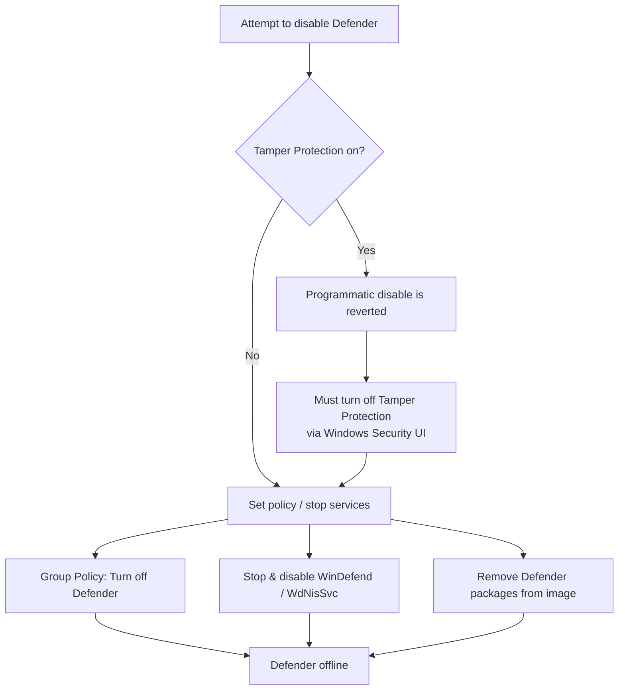

# Windows Defender Remover

Windows Defender Remover is a category of third-party tool that strips or permanently disables Microsoft Defender Antivirus from a Windows install. This note collects links to such external tools (and a companion Windows Update disabler), explains how they work against Defender's built-in protections, and — because removing the OS antivirus is a high-risk action — frames it strictly as a lab/authorized convenience. The tools themselves are not reproduced here.

## Overview

Microsoft Defender Antivirus is the antivirus/anti-malware engine built into Windows 10, Windows 11, and Windows Server. On a modern install it cannot simply be uninstalled — the Windows Security app only lets you toggle real-time protection temporarily, and **Tamper Protection** actively reverts programmatic attempts to turn it off. "Defender remover" tools exist to bypass those guards and take the engine offline for good, typically for building lean lab images, malware-analysis sandboxes, or performance testing.

The same capability is dual-use: disabling or evading Defender is a routine post-exploitation objective, which is why the [Windows-Firewall-and-AV-Commands](Windows-Firewall-and-AV-Commands.md) and [PowerShell-Commands-for-Penetration-Testing](PowerShell-Commands-for-Penetration-Testing.md) notes cover the built-in `Set-MpPreference` / `netsh` levers, and why Tamper Protection was added to blunt exactly this behaviour. Related debloat tooling ([Win11Debloat](Win11Debloat.md)) can strip components more surgically.

> [!WARNING]
> **Removing Windows Defender leaves the host with no built-in antivirus protection**
> A machine with Defender stripped has no real-time scanning, no cloud-delivered protection, and no attack-surface-reduction rules. Do this only on isolated lab VMs you can revert from a snapshot. Never on a host that touches a production or internet-facing network.

## Tools

- <https://github.com/jbara2002/windows-defender-remover>
- <https://github.com/tsgrgo/windows-update-disabler>

## Defender Components Targeted

Removal tools act on the services, driver, and process that make up the engine:

| Component | Name | Role |
| --- | --- | --- |
| Antivirus service | `WinDefend` (process `MsMpEng.exe`) | Core real-time and scheduled scanning engine |
| Network Inspection | `WdNisSvc` | Inspects network traffic for known exploits |
| Security Center | `wscsvc` / `SecurityHealthService` | Reports protection status; UI in Windows Security |
| EDR sensor (managed) | `Sense` | Microsoft Defender for Endpoint telemetry (enterprise) |

```powershell
# Inspect Defender's current state before any changes
Get-MpComputerStatus
sc query WinDefend
```

## How It Works

Because Windows protects the engine, a remover tool generally has to defeat several layers in order:



The levers these tools pull are the same ones an administrator can reach manually:

- **Tamper Protection gate.** With Tamper Protection enabled, `Set-MpPreference`, service edits, and the `DisableAntiSpyware` policy are all silently undone. It must be switched off in **Windows Security > Virus & threat protection > Manage settings** first — it cannot reliably be scripted away.
- **Group Policy / registry policy.** The classic policy lives at `HKLM\SOFTWARE\Policies\Microsoft\Windows Defender` (`DisableAntiSpyware` = `1`), configured via *Computer Configuration > Administrative Templates > Windows Components > Microsoft Defender Antivirus > Turn off Microsoft Defender Antivirus*.
- **Service teardown.** Stopping and disabling `WinDefend` / `WdNisSvc` so the engine does not start.
- **Package removal.** Aggressive tools delete Defender's packages/binaries from the running image so it cannot be re-enabled.

> [!IMPORTANT]
> **`DisableAntiSpyware` is deprecated on consumer Windows**
> Microsoft removed the effect of the `DisableAntiSpyware` registry value on consumer platforms in the August 2020 Defender platform update. On current Windows 10/11 it no longer turns Defender off by itself, which is why third-party removers resort to disabling Tamper Protection and deleting the engine outright.

```powershell
# Legacy policy value — no longer honored on modern consumer Windows
# Shown for reference; requires Tamper Protection OFF and admin rights
reg add "HKLM\SOFTWARE\Policies\Microsoft\Windows Defender" /v DisableAntiSpyware /t REG_DWORD /d 1 /f  # untested
```

## Security Considerations

> [!WARNING]
> **Disabling AV is a post-exploitation TTP, not just admin housekeeping**
> Attackers who reach a host routinely try to neutralise Defender — turning off real-time monitoring, adding exclusion paths that hide their payloads, or killing the service — before dropping their tooling. The exact commands a "remover" automates (`Set-MpPreference -DisableRealtimeMonitoring`, `Add-MpPreference -ExclusionPath`, stopping `WinDefend`) map directly to MITRE ATT&CK **Impair Defenses (T1562.001)**.

- **No safety net.** A stripped host has no signature, heuristic, or cloud protection; a single careless click can fully compromise it.
- **Detection signal for defenders.** On a managed network, Tamper Protection changes and Defender being disabled generate telemetry (Windows Security / Defender for Endpoint alerts) — treat an unexpectedly-disabled Defender as an incident.
- **Persistence risk.** Package-removal tools can make Defender difficult or impossible to restore without reinstalling Windows.
- **Exclusions are quieter than disabling.** Enumerating existing exclusion paths (`Get-MpPreference | Select ExclusionPath`) often reveals where an attacker — or a careless admin — has told Defender not to look.

## Best Practices

- Only run remover tools on **isolated lab VMs** with a clean snapshot to revert to.
- Prefer **temporary, reversible** measures (toggle real-time protection in the UI, or add a scoped exclusion) over permanently deleting the engine.
- If a machine will ever leave the lab, **restore Defender** (or reinstall Windows) before it does.
- Keep **Tamper Protection enabled** on every host you actually care about — it is the single control that defeats casual AV-disable tooling.
- On managed fleets, **alert on** Defender being disabled or on Tamper Protection state changes.

## Troubleshooting

| Symptom | Likely cause & fix |
| --- | --- |
| Disable command runs but Defender re-enables itself | Tamper Protection is on — turn it off in Windows Security first |
| `Set-MpPreference` / `sc` returns "Access is denied" | Not in an elevated shell — reopen PowerShell/CMD as Administrator |
| `DisableAntiSpyware=1` has no effect | Deprecated on modern consumer Windows — no longer honored |
| Windows Update silently reinstalls Defender | Pair removal with an update disabler, or expect it to return |
| Cannot re-enable Defender after using a remover | Packages were deleted — repair with `DISM`/SFC or reinstall Windows |

## References

- [Microsoft Defender Antivirus in Windows (Microsoft Learn)](https://learn.microsoft.com/en-us/defender-endpoint/microsoft-defender-antivirus-windows)
- [Protect security settings with Tamper Protection (Microsoft Learn)](https://learn.microsoft.com/en-us/defender-endpoint/prevent-changes-to-security-settings-with-tamper-protection)
- [Set-MpPreference cmdlet reference (Microsoft Learn)](https://learn.microsoft.com/en-us/powershell/module/defender/set-mppreference)
- [MITRE ATT&CK T1562.001 — Impair Defenses: Disable or Modify Tools](https://attack.mitre.org/techniques/T1562/001/)

## Related
- [Windows-Firewall-and-AV-Commands](Windows-Firewall-and-AV-Commands.md) — disabling/tuning Defender and the firewall from the command line
- [PowerShell-Commands-for-Penetration-Testing](PowerShell-Commands-for-Penetration-Testing.md) — `Set-MpPreference`/exclusion tradecraft
- [Win11Debloat](Win11Debloat.md) — companion Windows stripping tool
- [Custom-build-Windows-11-ISO](../Lab-Setup-and-Virtualization/Custom-build-Windows-11-ISO.md) — removing Defender in a custom build
- [Enterprise Windows Infrastructure Security](../Readme.md) — course hub
