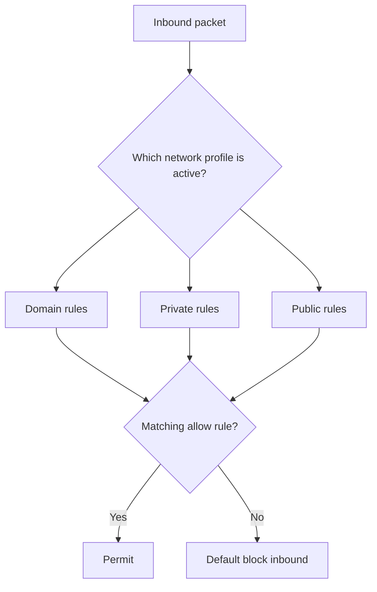

# Windows Firewall and AV Commands

Command-line reference for managing **Windows Defender Firewall** (service `MpsSvc`) and **Microsoft Defender Antivirus** (service `WinDefend`) from `cmd`, `netsh`, and PowerShell. These commands cover both administrative hardening and the offensive manipulation an attacker performs after gaining a foothold.

## Overview

Windows ships two host-based defensive layers that are routinely driven from the command line: the **host firewall** (Windows Defender Firewall with Advanced Security, backed by the `MpsSvc` service) and the built-in **antivirus/EDR** (Microsoft Defender, backed by the `WinDefend` service). Administrators use these commands to open ports, author rules, and check status; attackers use the same commands to disable protection, whitelist their tooling, and punch holes for command-and-control.

Rules are managed through two `netsh` sub-contexts — the modern `netsh advfirewall` and the legacy `netsh firewall` — as well as the newer `NetSecurity` PowerShell module (`Get-NetFirewallRule`, `Set-NetFirewallProfile`). See [NETSH-Command](NETSH-Command.md) for the broader `netsh` surface, [Service-Controller-Utility-Commands](Service-Controller-Utility-Commands.md) for `sc` service control, Firewall for the underlying firewall concepts, and [Network-Enumeration](Network-Enumeration.md) for checking firewall state during host reconnaissance.

## How It Works

Windows Defender Firewall is a **stateful, host-based firewall** that filters inbound and outbound traffic against a rule set. Every network connection is classified into one of three **profiles**, and only the rules for the currently active profile are evaluated:

| Profile | Applies to |
| --- | --- |
| **Domain** | Networks where the host authenticates to an Active Directory domain controller |
| **Private** | Trusted networks the user has marked private (home/office) |
| **Public** | Untrusted networks (café, airport) — most restrictive by default |



> [!NOTE]
> **Two netsh contexts**
> `netsh advfirewall` is the **modern** context for Windows Firewall with Advanced Security. `netsh firewall` (e.g. `set opmode`, `add portopening`) is a **legacy**, deprecated context kept for backward compatibility — it still runs but prints a deprecation notice and cannot express profile-scoped or program-scoped rules. Prefer `advfirewall` or the PowerShell `NetSecurity` cmdlets for new work.

## Windows Firewall Service Management

The firewall itself is the `MpsSvc` service, controlled with the [service controller](Service-Controller-Utility-Commands.md) (`sc`).

### Check Windows Firewall Service Status

- Retrieves the configuration details of the Windows Firewall service.
```cmd
sc qc MpsSvc
```

- Checks the current status of the Windows Firewall service.
```cmd
sc query MpsSvc
```

### Start and Stop Windows Firewall Service

- Stops the Windows Firewall service.
```cmd
sc stop MpsSvc
```

- Starts the Windows Firewall service.
```cmd
sc start MpsSvc
```

> [!TIP]
> **MpsSvc is protected**
> On modern Windows, `MpsSvc` is a protected service and a direct `sc stop MpsSvc` is often refused even from an elevated shell. Disabling protection is more commonly done by turning the firewall state off per profile (`netsh advfirewall set allprofiles state off`) rather than by stopping the service.

## Configuring Windows Firewall Using `netsh`

### Access Windows Firewall Settings

- Opens the Windows Firewall settings in the command-line interface.
```cmd
netsh advfirewall firewall
```

### Display Help for Firewall Commands

- Displays the help menu for Windows Firewall advanced settings.
```cmd
netsh advfirewall /?
```

- Shows available options for displaying firewall settings.
```cmd
netsh advfirewall show /?
```

### Display Firewall Profiles

- Displays the current firewall profile.
```cmd
netsh advfirewall show currentprofile
```

- Shows the firewall settings for the public profile.
```cmd
netsh advfirewall show publicprofile
```

- Shows the firewall settings for the private profile.
```cmd
netsh advfirewall show privateprofile
```

- Displays settings for all firewall profiles.
```cmd
netsh advfirewall show allprofiles
```

### Enable or Disable Windows Firewall

- Disables the Windows Firewall (legacy context).
```cmd
netsh firewall set opmode disable
```

- Enables the Windows Firewall (legacy context).
```cmd
netsh firewall set opmode enable
```

- Turns off the firewall for all profiles.
```cmd
netsh advfirewall set allprofiles state off
```

- Turns on the firewall for all profiles.
```cmd
netsh advfirewall set allprofiles state on
```

### View and Modify Firewall Rules

- Displays help for firewall rule commands.
```cmd
netsh advfirewall firewall /?
```

- Dumps the current firewall configuration.
```cmd
netsh advfirewall firewall dump
```

- Opens TCP port 23 for Telnet Server (legacy context).
```cmd
netsh firewall add portopening tcp 23 "Telnet Server"
```

- Displays the current state of the firewall (legacy context).
```cmd
netsh firewall show state
```

- Adds a rule to allow inbound FTP client connections.
```cmd
netsh advfirewall firewall add rule name="Permit FTP Client" dir=in action=allow enable=yes profile=any program=%SystemRoot%\System32\ftp.exe
```

- Adds a rule to allow inbound `nc` connections.
```cmd
netsh advfirewall firewall add rule name="nc64" dir=in action=allow enable=yes profile=any program=%SystemRoot%\nc64.exe
```

- Displays all configured firewall rules.
```cmd
netsh advfirewall firewall show rule
```

- Displays details of the "nc64" rule.
```cmd
netsh advfirewall firewall show rule name=nc64
```

- Displays details of the "Permit FTP Client" rule.
```cmd
netsh advfirewall firewall show rule name="Permit FTP Client"
```

- Displays all dynamic inbound rules.
```cmd
netsh advfirewall firewall show rule name=all dir=in type=dynamic
```

### Adding and Removing Specific Rules

- Allows inbound RDP traffic on port 3389.
```cmd
netsh advfirewall firewall add rule name="RDP" dir=in action=allow enable=yes profile=any protocol=TCP localport=3389
```

- Displays details of the "RDP" rule.
```cmd
netsh advfirewall firewall show rule name="RDP"
```

- Allows inbound HTTP traffic on port 80.
```cmd
netsh advfirewall firewall add rule name="HTTP 80" dir=in action=allow enable=yes profile=any protocol=TCP localport=80
```

- Displays details of the "HTTP 80" rule.
```cmd
netsh advfirewall firewall show rule name="HTTP 80"
```

- Deletes the "RDP" rule.
```cmd
netsh advfirewall firewall delete rule name="RDP" dir=in
```

### Modifying Firewall Rules

- Displays help for firewall rule modifications.
```cmd
netsh advfirewall firewall set /?
```

- Displays help for modifying existing firewall rules.
```cmd
netsh advfirewall firewall set rule /?
```

- Modifies the "HTTP 80" rule to allow traffic on additional ports (80, 81, 82, 83).
```cmd
netsh advfirewall firewall set rule name="HTTP 80" new localport=80,81,82,83 action=allow
```

## Managing Windows Firewall Using PowerShell

The `NetSecurity` module exposes the firewall through native cmdlets, which are preferred over `netsh` for scripting.

- Lists all firewall rules.
```powershell
Get-NetFirewallRule -All
```

- Lists all firewall rules from the configurable service store.
```powershell
Get-NetFirewallRule -PolicyStore configurableservicestore -All
```

- Shows the enabled/disabled state of each profile.
```powershell
Get-NetFirewallProfile
```

- Disables the firewall for all three profiles.
```powershell
Set-NetFirewallProfile -Profile Domain,Public,Private -Enabled False
```

## Windows Defender Antivirus Management

Microsoft Defender Antivirus runs as the `WinDefend` service and is queried with `sc` and the `Defender` PowerShell module.

### Check Windows Defender Status

- Checks the status of Windows Defender.
```cmd
sc query windefend
```

- Retrieves the configuration details of Windows Defender.
```cmd
sc qc windefend
```

- Shows full Defender AV status (signature versions, real-time protection, engine state).
```powershell
Get-MpComputerStatus
```

- Lists Defender's currently active preferences (exclusions, protection toggles).
```powershell
Get-MpPreference
```

- Disables real-time protection (commonly abused post-exploitation; requires Tamper Protection to be off).
```powershell
Set-MpPreference -DisableRealtimeMonitoring $true
```

## Security Considerations

> [!WARNING]
> **These commands are dual-use**
> Almost every hardening command here has an offensive twin. After gaining an elevated foothold, attackers routinely:
> - Turn the firewall off (`netsh advfirewall set allprofiles state off`) or add allow rules to permit inbound C2 / reverse-shell tooling (the `nc64` rule above is exactly this).
> - Open ports for lateral movement (RDP 3389, SMB) via `add rule`.
> - Disable Defender real-time protection (`Set-MpPreference -DisableRealtimeMonitoring $true`) or add path exclusions to stage payloads unscanned.
> `netsh`, `sc`, and `reg` are classic **living-off-the-land binaries** — the activity blends into normal administration, so defenders must baseline and alert on it rather than rely on the binaries being "trusted".

- **Tamper Protection** blocks most programmatic attempts to disable Defender (including `Set-MpPreference` changes); it cannot be turned off from the command line and must be disabled in the Security Center UI or by policy, which raises the bar for attackers.
- Firewall rule additions, profile state changes, and Defender setting changes are logged — see Troubleshooting for the relevant sources. Absence of these logs is itself suspicious.
- Disabling AV/firewall to run tools (see [Windows-Defender-Remover](Windows-Defender-Remover.md), Privilege-Escalation) is a **lab convenience** — never do it on anything reachable from a production or hostile network.

## Best Practices

- Prefer the `NetSecurity` / `Defender` PowerShell modules over the deprecated `netsh firewall` legacy context for anything scripted or auditable.
- Keep the firewall **enabled on all three profiles**; scope allow rules to a specific program and profile rather than `profile=any`.
- Leave **Tamper Protection** on so Defender settings cannot be silently changed by malware or a low-privilege compromise.
- Log and baseline firewall/AV changes (Event IDs below); alert on rule additions and profile-off transitions.
- Remove temporary allow rules (RDP, custom tool rules) once no longer needed — stale rules widen the attack surface.

## Troubleshooting

| Symptom | Likely cause & fix |
| --- | --- |
| `sc stop MpsSvc` returns "Access is denied" | `MpsSvc` is a protected service — use `netsh advfirewall set allprofiles state off` to disable the firewall instead of stopping the service |
| `netsh firewall …` prints a deprecation warning | Legacy context — switch to `netsh advfirewall firewall …` or the PowerShell cmdlets |
| `Set-MpPreference -DisableRealtimeMonitoring $true` has no effect | **Tamper Protection** is enabled and reverts the change — it must be turned off in the Security Center UI/policy first |
| A new allow rule doesn't take effect | Rule is scoped to a profile that isn't currently active — check `netsh advfirewall show currentprofile` and match the rule's `profile=` |
| Need to audit who changed a rule | Firewall rule changes log to Event IDs **2004** (rule added) / **2006** (rule deleted) in `Microsoft-Windows-Windows Firewall With Advanced Security/Firewall`; Defender changes appear in the `Microsoft-Windows-Windows Defender/Operational` log |

## References

- [Windows Defender Firewall with Advanced Security (Microsoft Learn)](https://learn.microsoft.com/en-us/windows/security/operating-system-security/network-security/windows-firewall/)
- [Netsh advfirewall firewall command reference (Microsoft Learn)](https://learn.microsoft.com/en-us/windows-server/networking/technologies/netsh/netsh-advfirewall-firewall)
- [NetSecurity PowerShell module reference (Microsoft Learn)](https://learn.microsoft.com/en-us/powershell/module/netsecurity/)
- [Microsoft Defender Antivirus PowerShell module (Microsoft Learn)](https://learn.microsoft.com/en-us/powershell/module/defender/)

## Related

- [Enterprise Windows Infrastructure Security](../Readme.md) — course hub and map of content
- Firewall — general firewall concepts behind these commands
- [NETSH-Command](NETSH-Command.md) — the broader `netsh` configuration surface
- [Service-Controller-Utility-Commands](Service-Controller-Utility-Commands.md) — `sc` service control used for `MpsSvc` / `WinDefend`
- [Network-Enumeration](Network-Enumeration.md) — checking firewall state during host recon
- [PowerShell-Commands-for-Penetration-Testing](PowerShell-Commands-for-Penetration-Testing.md) — offensive PowerShell that pairs with disabling AV/firewall
- [Windows-Defender-Remover](Windows-Defender-Remover.md) — fully stripping Defender in a lab
- Privilege-Escalation — disabling AV/firewall aids post-exploitation
