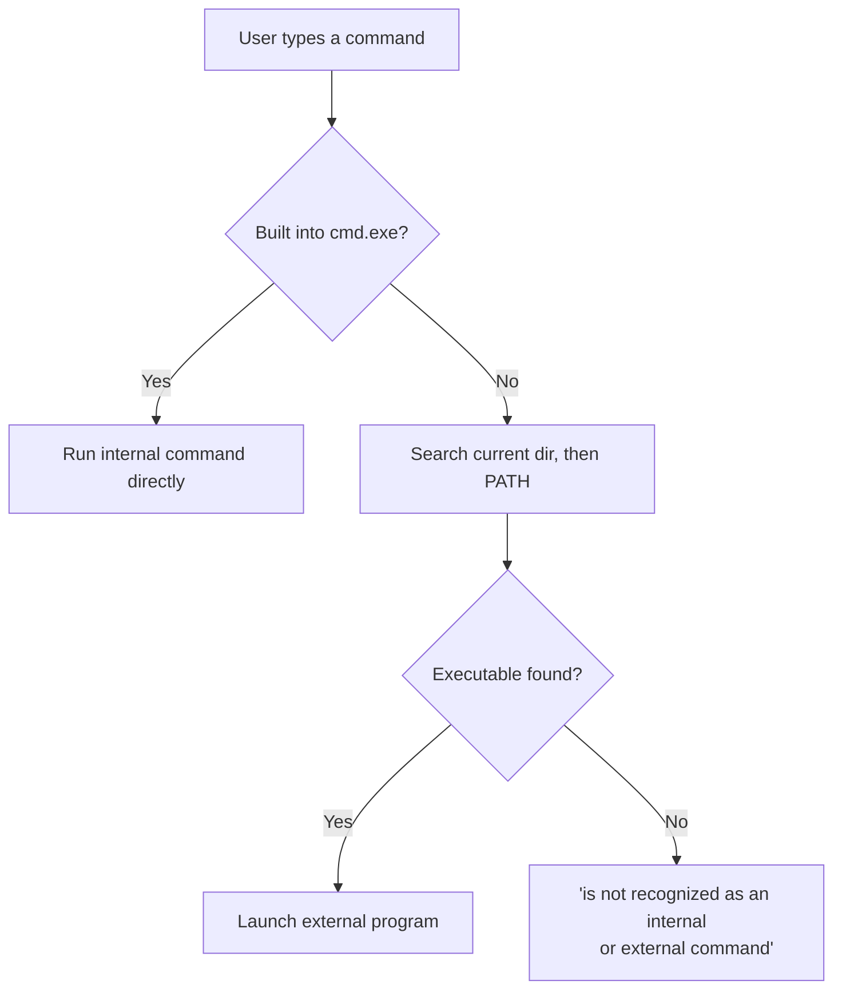

# Windows Shell

The Windows Shell is the primary user interface for Microsoft Windows, letting users interact with the operating system through both graphical and command-line elements. It provides access to core functions such as launching applications, managing files, and configuring system settings.

## Overview

"Shell" refers to any program that exposes the operating system to the user. On Windows this spans a **graphical shell** (the desktop, taskbar, and Start Menu presented by `explorer.exe`) and one or more **command-line interfaces** — the classic Command Prompt (`cmd.exe`) and [PowerShell](PowerShell-Commands-for-Penetration-Testing.md). The CLI shells parse the text you type, decide whether a command is built into the interpreter or an external program, and hand execution to the right component. Understanding this layer matters for both administration and offense: the shell is where every [command](Windows-Basic-Commands.md), script, and living-off-the-land binary is driven.

> [!NOTE]
> **Which shell is "the shell"?**
> The default user shell is set by the **`Shell`** value under `HKLM\SOFTWARE\Microsoft\Windows NT\CurrentVersion\Winlogon`, which is normally `explorer.exe`. Winlogon launches whatever program that value names at logon — a detail that is both an administration fact and a well-known persistence surface (see [Windows-Registry](Windows-Registry.md)).

## Types of Windows Shells

### Graphical Shell

- **Executable**: `explorer.exe`
- **Location**: `C:\Windows\explorer.exe`
- **Description**: the default Windows interface providing the desktop environment, taskbar, Start Menu, and File Explorer.

### Command-Line Interfaces (CLI)

- **Command Prompt (`cmd.exe`)**
    - **Location**: `C:\Windows\System32\cmd.exe`
    - **Purpose**: traditional text-based command interpreter used for executing batch commands and administrative tasks. See [Windows-Batch-Scripting](Windows-Batch-Scripting.md).
- **Windows PowerShell (`powershell.exe`)**
    - **Location**: `C:\Windows\System32\WindowsPowerShell\v1.0\powershell.exe`
    - **Purpose**: a modern, scriptable shell built on .NET for automation and configuration management using cmdlets.
- **PowerShell 7+ (`pwsh.exe`)**
    - **Purpose**: the cross-platform successor built on .NET Core, installed alongside (not replacing) the built-in Windows PowerShell 5.1.

## Types of Commands in CLI

Commands in Windows command-line environments fall into two main categories:

1. **Internal commands** — built directly into the command interpreter (`cmd.exe`). They do not rely on external executable files.
    - `echo` — displays messages or variable output.
    - `cls` — clears the command window screen.
    - `dir` — lists files and directories.
    - `del` — deletes specified files.
2. **External commands** — stored as independent executables on the system. They rely on external binaries and are often associated with installed software.
    - `firefox.exe` — launches Mozilla Firefox (if installed).
    - `notepad.exe` — opens Notepad.
    - `ping.exe` — tests network connectivity to a specific host.

### How a command is resolved

When you enter a command, `cmd.exe` first checks whether it is an internal (built-in) command. If not, it searches the current directory and each directory on the `PATH` environment variable for a matching executable.



> [!TIP]
> **Find where a command lives**
> Use `where <name>` in CMD to locate an external command on the `PATH`, and `Get-Command <name>` in PowerShell to reveal whether a name resolves to a cmdlet, function, alias, or external executable.

```cmd
where ping
```

```powershell
Get-Command ping
```

## Command Prompt vs PowerShell

| Feature | Command Prompt (`cmd.exe`) | PowerShell (`powershell.exe` / `pwsh.exe`) |
| :-- | :-- | :-- |
| Scripting Language | Batch (`.bat` / `.cmd`) scripts | PowerShell (`.ps1`) scripts |
| Data model | Text-based output | Object-oriented (outputs .NET objects) |
| Functionality | Basic command execution | Advanced automation and scripting |
| Administrative control | Limited to surface-level commands | Granular control over system management |
| Remote management | Limited | Native (`WinRM` / `Enter-PSSession`) |

## Security Considerations

> [!WARNING]
> **The shell is dual-use**
> The same interpreters that administer Windows are the **living-off-the-land** entry points attackers rely on to avoid dropping their own tools. `cmd.exe` and `powershell.exe` are among the most-abused binaries in real intrusions — for command execution, downloading payloads, and running fileless scripts entirely in memory.

- **Persistence via the shell value** — replacing or appending to the Winlogon `Shell` registry value runs an attacker program at every interactive logon (MITRE ATT&CK **T1547.004**, Winlogon Helper DLL). Baseline this value; anything other than `explorer.exe` is suspicious.
- **PowerShell abuse** — because PowerShell can execute encoded or downloaded script blocks in memory, enable **Script Block Logging**, **Module Logging**, and **Transcription**, and keep **AMSI** on so defenders retain visibility. See [PowerShell-Commands-for-Penetration-Testing](PowerShell-Commands-for-Penetration-Testing.md).
- **Process lineage** — `explorer.exe` spawning `cmd.exe`/`powershell.exe`, or Office applications spawning a shell, are high-signal detections. Monitor command-line arguments, not just process names.
- **Constrained shells** — in restricted or non-interactive footholds (e.g. a raw reverse shell), knowing the CMD/`net`/`wmic` equivalents of GUI actions is essential. Tools like [rlwrap](rlwrap.md) add readline/history to raw shells.

## Best Practices

- Prefer **PowerShell** for new automation, but keep the CMD / `net` / `wmic` equivalents in reach for constrained or legacy shells.
- Run destructive or system-level commands only from an **elevated (Administrator)** shell, and understand what each does before executing.
- Enable PowerShell logging (script block, module, transcription) and leave AMSI enabled on managed hosts.
- Baseline and monitor the Winlogon `Shell` registry value and shell process lineage.
- Avoid pasting untrusted one-liners into an elevated shell — the command line is a primary initial-access and execution vector.

## Troubleshooting

| Symptom | Likely cause & fix |
| :-- | :-- |
| `'x' is not recognized as an internal or external command` | The name is neither a built-in nor on `PATH` — verify the executable exists and add its directory to `PATH`, or use its full path. |
| PowerShell script won't run (`running scripts is disabled`) | Execution policy blocks `.ps1` files — set an appropriate policy (e.g. `Set-ExecutionPolicy -Scope CurrentUser RemoteSigned`) after understanding the risk. |
| "Access is denied" running a command | Not in an elevated shell — reopen CMD/PowerShell as Administrator (UAC). |
| A command works in one shell but not the other | Some names are `cmd.exe` built-ins (e.g. `dir`, `copy`) or PowerShell aliases with different behavior — confirm with `where` / `Get-Command`. |

## References

- [Windows Shell overview (Microsoft Learn)](https://learn.microsoft.com/en-us/windows/win32/shell/shell-entry)
- [`cmd` command reference (Microsoft Learn)](https://learn.microsoft.com/en-us/windows-server/administration/windows-commands/cmd)
- [PowerShell documentation (Microsoft Learn)](https://learn.microsoft.com/en-us/powershell/)
- [MITRE ATT&CK T1547.004 — Winlogon Helper DLL](https://attack.mitre.org/techniques/T1547/004/)

## Related

- [Enterprise Windows Infrastructure Security](../Readme.md) — course hub
- [Windows-Basic-Commands](Windows-Basic-Commands.md) — core commands run inside the shell
- [PowerShell-Commands-for-Penetration-Testing](PowerShell-Commands-for-Penetration-Testing.md) — offensive PowerShell one-liners
- [Windows-Batch-Scripting](Windows-Batch-Scripting.md) — batch scripting built on the cmd shell
- [Windows-Registry](Windows-Registry.md) — where the Winlogon `Shell` value lives
- [rlwrap](rlwrap.md) — readline/history for raw shells
- Remote-Code-Execution-to-Reverse-shell — obtaining an interactive Windows shell remotely
