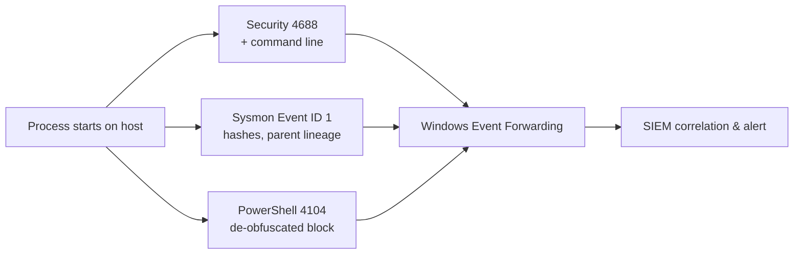

# Command-Line and Process Auditing

Command-line and process auditing records **what programs run, who started them, from which parent process, and with which arguments**. Because most Windows attacks eventually spawn a process — a LOLBin, an encoded PowerShell one-liner, a scheduled-task payload — this telemetry is one of the highest-value detection sources on an endpoint. This note covers process-creation events, command-line capture, PowerShell logging, and Sysmon.

## Overview

Default Windows auditing does **not** record process creation, and even when enabled it does **not** capture the command line unless you explicitly turn that on. Attackers rely on this blind spot: the difference between seeing `powershell.exe` and seeing `powershell.exe -nop -w hidden -enc <base64>` is the difference between noise and a high-confidence alert. Full coverage combines three layers — the Security-log **process-creation** audit (Event `4688`), **PowerShell** script-block/module logging, and **[Sysmon](Sysmon-Deployment-and-Configuration.md)** Event ID `1` for depth (hashes, parent lineage, integrity level). These feed the wider pipeline described in [Windows-Advanced-Audit-Policy](Windows-Advanced-Audit-Policy.md), [Key-Security-Event-IDs](Key-Security-Event-IDs.md), and [Windows-Event-Forwarding-WEF-WEC](Windows-Event-Forwarding-WEF-WEC.md). This maps directly to MITRE ATT&CK **T1059 – Command and Scripting Interpreter**.

## Process-Creation Auditing (Event 4688)

The **Audit Process Creation** subcategory writes Security Event ID **`4688` – A new process has been created** each time a process starts. Key fields:

| Field | Why it matters |
|-------|----------------|
| **New Process Name** | The image that was launched (e.g. `C:\Windows\System32\cmd.exe`) |
| **Creator Process Name / ID** | The **parent** — critical for spotting `winword.exe → cmd.exe` and similar anomalies |
| **Process Command Line** | The full arguments — **only present if command-line capture is enabled** |
| **Token Elevation Type** | `%%1937` full token, `%%1938` limited — flags UAC elevation |
| **Subject (SID / Account)** | Which security principal started the process |

The companion **`4689` – A process has exited** helps bound process lifetime.

### Enabling process auditing and command-line capture

Enable the subcategory (Advanced Audit Policy is the reliable way — see [Windows-Advanced-Audit-Policy](Windows-Advanced-Audit-Policy.md)):

```cmd
auditpol /set /subcategory:"Process Creation" /success:enable
```

Command-line capture is a **separate** setting. Via GPO:

```text
Computer Configuration > Administrative Templates > System >
Audit Process Creation > Include command line in process creation events  = Enabled
```

The equivalent registry value:

```text
HKLM\SOFTWARE\Microsoft\Windows\CurrentVersion\Policies\System\Audit\
    ProcessCreationIncludeCmdLine_Enabled = 1  (REG_DWORD)
```

> [!TIP]
> **Two switches, not one**
> Turning on Audit Process Creation gives you `4688` events **without** arguments. You must also enable "Include command line in process creation events" to get the `Process Command Line` field — the part attackers actually reveal themselves in.

> [!WARNING]
> **Command lines can leak secrets**
> Command-line auditing captures arguments verbatim, which sometimes includes passwords, tokens, or connection strings passed on the command line. Restrict read access to the Security log and forward events to a hardened collector so this telemetry does not itself become a credential source.

## PowerShell Command-Line Logging

PowerShell is the most-abused Windows scripting host, so it has its own logging that survives obfuscation better than `4688` alone. All are enabled under GPO **Administrative Templates > Windows Components > Windows PowerShell**.

| Mechanism | Event ID | Channel | Records |
|-----------|----------|---------|---------|
| **Script Block Logging** | `4104` | `Microsoft-Windows-PowerShell/Operational` | The **de-obfuscated** script block content actually executed |
| **Module Logging** | `4103` | `Microsoft-Windows-PowerShell/Operational` | Pipeline execution details per configured module |
| **Transcription** | — (text files) | Output directory | A full input/output transcript of the session |

Script Block Logging is the standout: PowerShell logs the block **after** decoding, so a base64 `-EncodedCommand` payload is recorded in cleartext. Registry equivalents:

```text
HKLM\SOFTWARE\Policies\Microsoft\Windows\PowerShell\ScriptBlockLogging\
    EnableScriptBlockLogging = 1
HKLM\SOFTWARE\Policies\Microsoft\Windows\PowerShell\ModuleLogging\
    EnableModuleLogging = 1
```

> [!NOTE]
> **Windows PowerShell vs PowerShell 7**
> Event IDs `4103`/`4104` apply to Windows PowerShell 5.1 in the `Microsoft-Windows-PowerShell/Operational` log. **PowerShell 7 (Core)** logs the same event IDs to a separate `PowerShellCore/Operational` channel and reads policy from `HKLM\SOFTWARE\Policies\Microsoft\PowerShellCore\ScriptBlockLogging`. Enable and collect both, or an attacker simply runs `pwsh.exe`.

## Sysmon Process Telemetry

Where `4688` is coarse, **Sysmon Event ID `1` – Process Create** adds high-fidelity fields that make hunting far easier:

- Full **CommandLine** and **ParentCommandLine** (parent arguments — `4688` does not give you these)
- Image **Hashes** (MD5/SHA256/IMPHASH) for reputation lookups
- **OriginalFileName**, **Company**, **IntegrityLevel**, and the **ProcessGuid** that links the whole process tree

Deployment and config tuning are covered in [Sysmon-Deployment-and-Configuration](Sysmon-Deployment-and-Configuration.md).

## Detection Pipeline

The following shows how a single process launch becomes a detection.



See [Querying-Logs-with-Get-WinEvent](Querying-Logs-with-Get-WinEvent.md) for hunting these events locally and [SIEM-Integration](SIEM-Integration.md) for centralized correlation.

## Security Considerations

> [!WARNING]
> **What attackers do to your visibility**
> - **Obfuscated / encoded commands** — `powershell -enc <base64>` hides intent from a casual `4688` view; **Script Block Logging (`4104`)** defeats this by logging the decoded block.
> - **Living-off-the-Land Binaries (LOLBins)** — signed tools like `certutil`, `mshta`, `rundll32`, `regsvr32`, and `wmic` execute payloads without dropping obvious malware, so the **arguments and parent process** are the only signal — useless without command-line capture.
> - **PowerShell version downgrade** — invoking `powershell -version 2` sidesteps 5.1's script-block logging; block PowerShell v2 via optional-feature removal.
> - **ETW / logging tampering** — advanced actors patch ETW (e.g. `EtwEventWrite`) or clear logs (Event ID `1102`) to blind endpoint telemetry. Forward events off-host so a local wipe does not erase evidence.

Defensive priorities: enable `4688` **with** command line, enable Script Block Logging (both PowerShell editions), deploy Sysmon, and forward everything to a collector the endpoint's credentials cannot reach.

## Best Practices

- Enable **Audit Process Creation (Success)** and **Include command line in process creation events** via a GPO baseline — never rely on defaults.
- Turn on **Script Block Logging** and **Module Logging** for both Windows PowerShell 5.1 and PowerShell 7, plus transcription to a protected share.
- Deploy **Sysmon** with a curated, tuned config for parent lineage and image hashes that `4688` cannot provide.
- **Forward** process and PowerShell events with WEF/WEC or a SIEM agent so log clearing does not destroy the record.
- Alert on high-signal patterns: Office apps spawning shells, LOLBin arguments, encoded PowerShell, and unusual parent/child chains.

## Troubleshooting

| Symptom | Likely cause & fix |
|---------|--------------------|
| `4688` events appear but no command line | "Include command line in process creation events" not enabled — set the GPO / `ProcessCreationIncludeCmdLine_Enabled = 1` |
| No `4688` events at all | Process Creation subcategory not enabled — `auditpol /set /subcategory:"Process Creation" /success:enable` |
| No PowerShell `4104` events | Script Block Logging not enabled, or attacker used `pwsh.exe` — enable it for both editions and collect `PowerShellCore/Operational` |
| Security log fills / rolls too fast | High process volume — increase Security log size, tune noisy sources, and forward off-host rather than dropping the audit |

## References

- Microsoft Learn — Event 4688 (A new process has been created): https://learn.microsoft.com/en-us/windows/security/threat-protection/auditing/event-4688
- Microsoft Learn — Command line process auditing: https://learn.microsoft.com/en-us/previous-versions/windows/it-pro/windows-server-2012-r2-and-2012/dn535776(v=ws.11)
- Microsoft Learn — about_Logging_Windows (PowerShell script block & module logging): https://learn.microsoft.com/en-us/powershell/module/microsoft.powershell.core/about/about_logging_windows
- MITRE ATT&CK — T1059 Command and Scripting Interpreter: https://attack.mitre.org/techniques/T1059/

## Related

- [Windows-Advanced-Audit-Policy](Windows-Advanced-Audit-Policy.md) — related note (the audit subcategory that enables 4688)
- [Key-Security-Event-IDs](Key-Security-Event-IDs.md) — related note (4688/4689 in the wider event-ID catalog)
- [Querying-Logs-with-Get-WinEvent](Querying-Logs-with-Get-WinEvent.md) — related note (hunting these events)
- [Sysmon-Deployment-and-Configuration](Sysmon-Deployment-and-Configuration.md) — related note (Sysmon Event ID 1 depth)
- [Windows-Event-Forwarding-WEF-WEC](Windows-Event-Forwarding-WEF-WEC.md) — related note (centralizing the telemetry)
- [SIEM-Integration](SIEM-Integration.md) — related note (correlation and alerting)
- [Windows-Event-Logs](../Windows-Operating-System-Administration/Windows-Event-Logs.md) — related note (the underlying log channels)
- [Group-Policy(GPO)](../Group-Policy-Objects-GPO/Group-Policy(GPO).md) — related note (deploying these settings at scale)
- [Enterprise Windows Infrastructure Security](../Readme.md) — course hub
