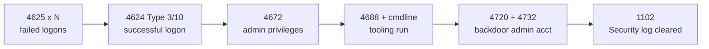

# Key Security Event IDs

Windows records security-relevant activity as numbered events in the Event Log. A small, well-known set of these **event IDs** carries most of the detection value — logons, account changes, privilege use, process creation, and log tampering. Knowing them lets you both hunt for attacks and reason about the traces your own actions leave behind.

## Overview

The [advanced audit policy](Windows-Advanced-Audit-Policy.md) decides *what* gets logged; the event IDs below are *what you look for* once it does. Most live in the **Security** channel and are written by the Local Security Authority. Others — PowerShell, service installation, log-clear on non-Security channels — live in dedicated operational channels and are covered in [Command-Line-and-Process-Auditing](Command-Line-and-Process-Auditing.md) and [Querying-Logs-with-Get-WinEvent](Querying-Logs-with-Get-WinEvent.md).

Because attackers and defenders read the same events, this note maps each ID to its security meaning rather than just its label. For endpoint depth beyond the built-in log, see [Sysmon-Deployment-and-Configuration](Sysmon-Deployment-and-Configuration.md); to centralize these events off the host that generates them, see [Windows-Event-Forwarding-WEF-WEC](Windows-Event-Forwarding-WEF-WEC.md).

> [!NOTE]
> **Where these events live**
> On modern Windows the Security log is the primary source (`4xxx` IDs). A few high-value events sit elsewhere: `7045` (service install) in the **System** log, `4104` (PowerShell script block) in `Microsoft-Windows-PowerShell/Operational`, and `104` (log cleared) in the channel that was cleared. Domain-wide authentication events (Kerberos/NTLM) are only complete on **Domain Controllers**.

## Authentication and Logon Events

The logon events are the backbone of most detections. On a Domain Controller they reveal domain-wide authentication; on a member host they reveal local access.

| Event ID | Meaning | Why it matters |
| --- | --- | --- |
| 4624 | Successful logon | Baseline of who accessed what; the **Logon Type** field is critical |
| 4625 | Failed logon | Brute force, password spraying, mistyped creds |
| 4634 / 4647 | Logoff / user-initiated logoff | Session teardown |
| 4648 | Logon using explicit credentials | `runas`, lateral movement with alternate creds |
| 4672 | Special privileges assigned to new logon | An administrative/privileged logon occurred |
| 4964 | Special groups assigned to a logon | Watchlisted (sensitive) accounts logging on |

The **Logon Type** in a 4624/4625 tells you *how* the session was established:

> [!TIP]
> **Read the Logon Type, not just the event**
> A 4624 alone is noise; the Logon Type turns it into signal. Type **3 (Network)** from an unusual host, **9 (NewCredentials)** from `runas /netonly`, or **10 (RemoteInteractive/RDP)** off-hours are classic lateral-movement tells.

| Type | Name | Typical source |
| --- | --- | --- |
| 2 | Interactive | Console logon |
| 3 | Network | SMB / file share, WMI, remote auth |
| 4 | Batch | Scheduled task |
| 5 | Service | Service starting under an account |
| 7 | Unlock | Workstation unlock |
| 8 | NetworkCleartext | Basic auth (e.g. IIS), password sent in cleartext |
| 9 | NewCredentials | `runas /netonly` — network identity differs from console |
| 10 | RemoteInteractive | RDP / Terminal Services |
| 11 | CachedInteractive | Logon with cached domain credentials (offline DC) |

## Account and Group Management Events

These track creation, modification, and privilege grants — the footprints of persistence and privilege escalation.

| Event ID | Meaning |
| --- | --- |
| 4720 | User account created |
| 4722 / 4725 | Account enabled / disabled |
| 4723 / 4724 | Password change / password reset |
| 4726 | User account deleted |
| 4738 | User account changed |
| 4740 | Account locked out |
| 4767 | Account unlocked |
| 4728 / 4732 / 4756 | Member added to a global / local / universal security group |
| 4735 | Security-enabled local group changed |

Adding a freshly created account to a privileged group (for example a 4720 followed shortly by a 4732 for the local **Administrators** group, or a 4728 for **Domain Admins**) is a high-fidelity backdoor-account pattern.

## Kerberos and NTLM Authentication Events

Collected on Domain Controllers, these underpin many [Kerberos](../Active-Directory-Domain-Services-AD-DS/Kerberos-Authentication.md) and [NTLM](../Active-Directory-Domain-Services-AD-DS/NTLM.md) attack detections.

| Event ID | Meaning | Attack relevance |
| --- | --- | --- |
| 4768 | Kerberos TGT requested (AS-REQ) | AS-REP roasting hunts on accounts without pre-auth |
| 4769 | Kerberos service ticket requested (TGS-REQ) | **Kerberoasting** — bursts of RC4 tickets for service accounts |
| 4771 | Kerberos pre-authentication failed | Password guessing against Kerberos |
| 4776 | NTLM credential validation (DC) | Tracks NTLM authentications; NTLM relay / pass-the-hash context |

## Process, Service, and Persistence Events

| Event ID | Channel | Meaning |
| --- | --- | --- |
| 4688 | Security | Process creation (enable **command-line capture** to record arguments) |
| 4689 | Security | Process termination |
| 4697 | Security | A service was installed by the system |
| 7045 | System | A new service was installed |
| 4698 | Security | Scheduled task created |
| 4702 | Security | Scheduled task updated |

Event **4688 with command line** plus PowerShell **4104** (script block logging) is the pairing that catches living-off-the-land and fileless activity; both are detailed in [Command-Line-and-Process-Auditing](Command-Line-and-Process-Auditing.md).

## Log Tampering Events

Clearing logs is a standard post-exploitation step ([MITRE ATT&CK T1070.001](https://attack.mitre.org/techniques/T1070/001/)). The clear itself generates an event, which is often the *only* trace left.

| Event ID | Channel | Meaning |
| --- | --- | --- |
| 1102 | Security | The **Security** audit log was cleared |
| 104 | System (any) | An event log was cleared |

The chain above sketches how a single intrusion threads through multiple event IDs — the reason correlation across IDs beats alerting on any one in isolation.

## Security Considerations

> [!WARNING]
> **The absence of events is itself an indicator**
> A sudden gap in the Security log, or a lone **1102 / 104**, means logs were cleared — treat it as a high-severity alert, not a benign maintenance action. Attackers also **stop or reconfigure** the Event Log / Sysmon services and abuse `wevtutil cl` to wipe channels. Because the clearing host can reach its own logs, on-host logs are not trustworthy after compromise; forward them to a collector the endpoint's credentials cannot modify (see [Windows-Event-Forwarding-WEF-WEC](Windows-Event-Forwarding-WEF-WEC.md) and [SIEM-Integration](SIEM-Integration.md)).

- **Offensive relevance**: knowing which IDs fire lets a tester anticipate detection — e.g. Kerberoasting lights up **4769**, a new backdoor admin lights up **4720/4732**, and clearing tracks fires **1102**.
- **Defensive relevance**: alert on log-clear (**1102/104**), privileged group changes (**4728/4732/4756**), off-hours **4672**, and anomalous logon types in **4624**.
- Many high-value IDs (**4688**, **4663**, **5145**) only appear when the corresponding audit subcategory is enabled — see [Windows-Advanced-Audit-Policy](Windows-Advanced-Audit-Policy.md).

## Best Practices

- Enable process-creation auditing (**4688**) **with** command-line capture, and PowerShell script-block logging (**4104**) — the default policy records neither.
- Build alerts on the highest-signal IDs first: **1102**, **4720+4732**, **4672**, **4769** bursts, and **4625** spikes.
- Correlate IDs into behaviors (logon chain -> privilege -> execution -> tamper) rather than alerting on single events.
- Forward Security logs to a central collector/SIEM so a wiped endpoint doesn't erase the evidence.
- Baseline normal logon types and service-account behavior so anomalies stand out.

## Troubleshooting

| Symptom | Likely cause & fix |
| --- | --- |
| 4688 events lack command-line arguments | Enable **Include command line in process creation events** (Administrative Templates) in addition to the Audit Process Creation subcategory |
| No 4768/4769 events on a member server | Kerberos events are logged on **Domain Controllers**, not member hosts — query the DCs |
| Expected 4663 (object access) not appearing | Object-access auditing needs both the audit subcategory **and** a SACL on the object |
| Logon events missing entirely | Audit Logon/Account Logon subcategories not enabled — set via Advanced Audit Policy GPO |

## References

- Microsoft Learn — Advanced security audit policy settings: https://learn.microsoft.com/en-us/windows/security/threat-protection/auditing/advanced-security-audit-policy-settings
- Microsoft Learn — Appendix L: Events to Monitor: https://learn.microsoft.com/en-us/windows-server/identity/ad-ds/plan/appendix-l--events-to-monitor
- Microsoft Learn — Event 4624 (An account was successfully logged on): https://learn.microsoft.com/en-us/windows/security/threat-protection/auditing/event-4624
- MITRE ATT&CK — T1070.001 Clear Windows Event Logs: https://attack.mitre.org/techniques/T1070/001/

## Related

- [Windows-Advanced-Audit-Policy](Windows-Advanced-Audit-Policy.md) — what must be enabled for these IDs to appear
- [Querying-Logs-with-Get-WinEvent](Querying-Logs-with-Get-WinEvent.md) — filtering and hunting these events
- [Command-Line-and-Process-Auditing](Command-Line-and-Process-Auditing.md) — 4688 command line + PowerShell 4104
- [Sysmon-Deployment-and-Configuration](Sysmon-Deployment-and-Configuration.md) — higher-fidelity endpoint telemetry
- [Windows-Event-Forwarding-WEF-WEC](Windows-Event-Forwarding-WEF-WEC.md) — centralizing logs off-host
- [SIEM-Integration](SIEM-Integration.md) — correlating and alerting on these events
- [NTLM](../Active-Directory-Domain-Services-AD-DS/NTLM.md) — 4776 and NTLM authentication context
- [Kerberos-Authentication](../Active-Directory-Domain-Services-AD-DS/Kerberos-Authentication.md) — 4768/4769/4771 context
- [Enterprise Windows Infrastructure Security](../Readme.md) — course hub
