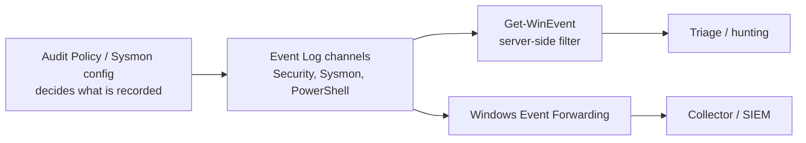

# Querying Logs with Get-WinEvent

`Get-WinEvent` is the modern PowerShell cmdlet for reading Windows event logs — both the classic logs (System, Application, Security) and the newer Windows Event Log channels (Sysmon, PowerShell/Operational). It is the primary tool for hunting through, filtering, and triaging security telemetry on a live or remote host.

## Overview

`Get-WinEvent` replaces the older `Get-EventLog` cmdlet. It reads from the Windows Event Log service, so it can query every channel exposed there, not just the six legacy logs, and it can read from saved `.evtx` files and remote machines. For defenders it is the fastest way to answer "did this happen, when, and who did it" against the [key security event IDs](Key-Security-Event-IDs.md); for an attacker with a shell it is a way to reconnoiter what auditing is enabled before acting. Its power comes from **server-side filtering** — filters are pushed to the Event Log engine rather than applied after everything is loaded into memory, which is what makes it fast against logs with millions of records.

> [!TIP]
> **Prefer Get-WinEvent over Get-EventLog**
> `Get-EventLog` only reads the classic logs and is markedly slower. `Get-WinEvent` reaches the `Microsoft-Windows-*` channels (Sysmon, PowerShell, Windows Defender, WMI-Activity) that most detections actually depend on. Use `Get-WinEvent` for anything new.

## Discovering Log Channels

Before filtering you need the exact channel name. List channels and their record counts, then inspect one.

```powershell
# List every log channel and how many records each holds
Get-WinEvent -ListLog * | Where-Object { $_.RecordCount -gt 0 } |
    Sort-Object RecordCount -Descending | Format-Table LogName, RecordCount

# Metadata for a single channel (max size, retention, provider)
Get-WinEvent -ListLog Security | Format-List *

# Enumerate providers (useful to find a provider's event IDs)
Get-WinEvent -ListProvider Microsoft-Windows-Sysmon | Select-Object -ExpandProperty Events
```

Reading the **Security** log requires administrative privileges; most other channels are readable by lower-privileged users.

## Filtering Events

Never pipe a whole log into `Where-Object` — that loads every record into memory first. Push the filter into the engine instead. There are three filter mechanisms.

### FilterHashtable (recommended)

The hashtable filter is the most readable and is evaluated server-side. Common keys are `LogName`, `ProviderName`, `Id`, `Level`, `StartTime`, `EndTime`, `Keywords`, `UserID`, and `Data`.

```powershell
# Failed logons (4625) in the last 24 hours
Get-WinEvent -FilterHashtable @{
    LogName   = 'Security'
    Id        = 4625
    StartTime = (Get-Date).AddDays(-1)
}

# Multiple event IDs from one channel at once
Get-WinEvent -FilterHashtable @{ LogName='Security'; Id=4624,4625,4634 } -MaxEvents 100

# Sysmon process-creation events (Event ID 1)
Get-WinEvent -FilterHashtable @{ LogName='Microsoft-Windows-Sysmon/Operational'; Id=1 }

# PowerShell script-block logging (4104) — surfaces deobfuscated script content
Get-WinEvent -FilterHashtable @{ LogName='Microsoft-Windows-PowerShell/Operational'; Id=4104 }
```

`Level` accepts numeric severities (`1`=Critical, `2`=Error, `3`=Warning, `4`=Information, `5`=Verbose). The `Data` key matches any `<Data>` field in the event payload, which is a quick way to search for a username or string without writing XPath.

### FilterXPath

XPath gives precise control, including filtering on **event-data fields** that the hashtable cannot target by name.

```powershell
# All logons for a specific target account, by EventData field
Get-WinEvent -LogName Security -FilterXPath "*[System[EventID=4624] and EventData[Data[@Name='TargetUserName']='Administrator']]"

# Simple ID selector
Get-WinEvent -LogName Security -FilterXPath "*[System[EventID=4720]]"   # user account created
```

### FilterXml

`-FilterXml` takes a full structured query (the same XML the Event Viewer's "filter current log" dialog can export), useful for reusing complex, saved queries verbatim.

## Reading Event Details

Each returned object is an `EventLogRecord`. The rendered `Message` is human-readable; the structured `Properties` array and the raw XML expose the individual fields for parsing.

```powershell
$e = Get-WinEvent -FilterHashtable @{ LogName='Security'; Id=4624 } -MaxEvents 1

$e.Message                     # full rendered description
$e.Properties                  # ordered array of raw field values
$e.TimeCreated, $e.Id          # convenience properties

# Structured field access via XML (field names, not positions)
[xml]$xml = $e.ToXml()
$xml.Event.EventData.Data | Where-Object { $_.Name -eq 'TargetUserName' } |
    Select-Object -ExpandProperty '#text'
```

## Querying Remote Hosts and Saved Logs

```powershell
# Query a domain controller remotely
Get-WinEvent -ComputerName DC01 -Credential (Get-Credential) `
    -FilterHashtable @{ LogName='Security'; Id=4625 } -MaxEvents 50

# Read from an exported .evtx (offline triage / IR). -Oldest reads oldest-first.
Get-WinEvent -Path 'C:\Cases\Security.evtx' -Oldest `
    -FilterHashtable @{ LogName='Security'; Id=1102 }   # untested
```

## Where Get-WinEvent Sits in the Pipeline



`Get-WinEvent` reads from the same channels that [WEF/WEC](Windows-Event-Forwarding-WEF-WEC.md) forwards and that [a SIEM](SIEM-Integration.md) ingests — it is the local, ad-hoc window onto data that a mature pipeline also ships off-host.

## Security Considerations

> [!WARNING]
> **Local logs are attacker-reachable and attacker-erasable**
> An attacker who reads the Security log with `Get-WinEvent` learns exactly what auditing is enabled — and can then choose techniques that produce no monitored events. Worse, on a host they control the logs are **local evidence they can destroy**. Clearing the Security log is [MITRE ATT&CK **T1070.001** (Clear Windows Event Logs)](https://attack.mitre.org/techniques/T1070/001/) and generates **Event ID 1102**; disabling the Event Log service is **T1562.002 (Impair Defenses: Disable Windows Event Logging)**. Because the artifacts live on the endpoint the intruder owns, querying them locally is necessary but never sufficient.

- **Detect the anti-forensics, don't just query around it.** Alert on `1102` (Security log cleared) and on Event Log service stop/tamper — these often *are* the intrusion signal.
- **Forward before you lose it.** A local `Get-WinEvent` query is worthless once the host is wiped; ship logs off-host with [WEF/WEC](Windows-Event-Forwarding-WEF-WEC.md) so the collector holds a copy the endpoint's credentials cannot reach.
- **Correlate, don't single-event.** A `4625` storm followed by a `4624` is a bruteforce success; `4688`/Sysmon-1 with a suspicious command line is execution. Single events rarely tell the story — chain them across [Key-Security-Event-IDs](Key-Security-Event-IDs.md).

## Best Practices

- Filter **server-side** with `-FilterHashtable` or `-FilterXPath`; never load a full log into `Where-Object`.
- Always bound queries with `StartTime`/`EndTime` and `-MaxEvents` so a query against a busy log stays fast and returns a usable slice.
- Parse structured fields via `.Properties` or `ToXml()` rather than regex over `.Message` — the rendered text is localized and can change.
- Enable script-block logging and process-creation auditing (see [Command-Line-and-Process-Auditing](Command-Line-and-Process-Auditing.md)) first — `Get-WinEvent` can only surface events the [audit policy](Windows-Advanced-Audit-Policy.md) actually recorded.
- Wrap recurring hunts in reusable functions and, for scale, run them against forwarded logs on the collector rather than host-by-host.

## Troubleshooting

| Symptom | Likely cause & fix |
| --- | --- |
| `No events were found that match the specified selection criteria` | The filter matched nothing, or the audit subcategory isn't enabled — confirm with `auditpol /get` and check the [Windows-Advanced-Audit-Policy](Windows-Advanced-Audit-Policy.md) baseline. |
| `Attempted to perform an unauthorized operation` on the Security log | Reading Security requires elevation — run the session as Administrator. |
| Filtering on a channel returns an ordering/`-Oldest` error | Classic and file-based logs may require `-Oldest`; add it when reading from `-Path` or older channels. |
| `Data` / named-field filter returns nothing | Use `-FilterXPath` with an explicit `EventData[Data[@Name='...']]` selector — the hashtable `Data` key matches values, not named fields. |

## References

- Microsoft Learn — Get-WinEvent cmdlet reference: https://learn.microsoft.com/en-us/powershell/module/microsoft.powershell.diagnostics/get-winevent
- Microsoft Scripting — Creating Get-WinEvent queries with FilterHashtable: https://devblogs.microsoft.com/scripting/use-filterhashtable-to-filter-event-log-with-powershell/
- MITRE ATT&CK — T1070.001 Clear Windows Event Logs: https://attack.mitre.org/techniques/T1070/001/
- MITRE ATT&CK — T1562.002 Impair Defenses: Disable Windows Event Logging: https://attack.mitre.org/techniques/T1562/002/

## Related

- [Key-Security-Event-IDs](Key-Security-Event-IDs.md) — related note (the event IDs you filter for)
- [Windows-Advanced-Audit-Policy](Windows-Advanced-Audit-Policy.md) — related note (what gets recorded in the first place)
- [Command-Line-and-Process-Auditing](Command-Line-and-Process-Auditing.md) — related note (4688 / script-block content to query)
- [Sysmon-Deployment-and-Configuration](Sysmon-Deployment-and-Configuration.md) — related note (high-fidelity channel to query)
- [Windows-Event-Forwarding-WEF-WEC](Windows-Event-Forwarding-WEF-WEC.md) — related note (centralizing the logs off-host)
- [SIEM-Integration](SIEM-Integration.md) — related note (correlating the telemetry at scale)
- [NTLM](../Active-Directory-Domain-Services-AD-DS/NTLM.md) — related note (Event ID 4776 traces NTLM validation)
- [Enterprise Windows Infrastructure Security](../Readme.md) — course hub
