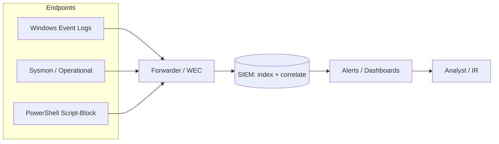

# SIEM Integration

A Security Information and Event Management (SIEM) platform is the central system that ingests, normalizes, correlates, and alerts on security telemetry from across an estate. SIEM integration is the discipline of reliably shipping Windows event data off the hosts that generate it and turning that raw stream into detections, dashboards, and investigable evidence.

## Overview

Windows produces rich security telemetry — the Security, System, and Application logs, [Sysmon](Sysmon-Deployment-and-Configuration.md) operational events, and PowerShell script-block logs — but on its own that data stays trapped on each endpoint, where an attacker with local access can read or erase it. A SIEM is the destination that solves this: logs are forwarded to a collector and then into the SIEM, where events from thousands of hosts are correlated into a single timeline.

SIEM integration sits at the top of the monitoring pipeline built in this module. It consumes the audit policy configured in [Windows-Advanced-Audit-Policy](Windows-Advanced-Audit-Policy.md), the [key security event IDs](Key-Security-Event-IDs.md) those policies emit, the [process and command-line auditing](Command-Line-and-Process-Auditing.md) data, and the centralized stream produced by [Windows Event Forwarding](Windows-Event-Forwarding-WEF-WEC.md). Where WEF/WEC centralizes logs *within* the Windows ecosystem, a SIEM adds cross-source correlation, long-term retention, and alerting.

## The Collection Pipeline

Telemetry flows from the endpoint, through a forwarding mechanism, into the SIEM, and out to an analyst. Understanding each hop is essential, because every hop is also a point an attacker can attack or a defender can lose visibility.



### Log sources worth shipping

| Source (channel) | Why it matters |
|------------------|----------------|
| `Security` | Logon/logoff, privilege use, account changes, log-clear (see [Key-Security-Event-IDs](Key-Security-Event-IDs.md)) |
| `System` | Service installs, driver loads, time-service changes |
| `Microsoft-Windows-Sysmon/Operational` | Process creation, network connections, image loads, registry — high-fidelity endpoint telemetry |
| `Microsoft-Windows-PowerShell/Operational` | Script-block logging (Event ID 4104) for fileless/PowerShell activity |
| `Microsoft-Windows-Windows Defender/Operational` | AV/EDR detections and tampering |
| `ForwardedEvents` | The collector-side channel populated by [WEF](Windows-Event-Forwarding-WEF-WEC.md) |

## Collection Methods

There is no single "SIEM protocol" — most integrations use one of three patterns. Which you choose is usually dictated by the SIEM vendor.

- **Agent-based forwarding** — a lightweight agent on each host reads the event logs and ships them to the SIEM (for example, Splunk Universal Forwarder, Elastic Winlogbeat, or the Azure Monitor Agent for Microsoft Sentinel). Agents give the richest control over which channels and filters are sent.
- **WEF-to-collector, then SIEM** — endpoints forward to a Windows Event Collector using native WinRM, and a single agent on the collector ships the aggregated `ForwardedEvents` log. This minimizes per-endpoint software. See [Windows-Event-Forwarding-WEF-WEC](Windows-Event-Forwarding-WEF-WEC.md).
- **Syslog / CEF** — Windows events are converted (often at a collector) into Syslog or the Common Event Format and sent to the SIEM's syslog listener. Common for feeding appliances and non-Windows SIEMs.

> [!NOTE]
> **Normalization is the point**
> Raw Windows XML events are verbose and vendor-inconsistent. A SIEM parses each source into a common schema (fields such as `user`, `host`, `process`, `src_ip`) so a single query can correlate a failed logon (`4625`), a process creation (`4688`), and a Sysmon network connection across hosts. Bad parsing is the most common reason a "collected" log is still effectively invisible.

## Detection and Correlation

The value of a SIEM is asking questions that span many events and many hosts — something no single endpoint log can answer.

> [!TIP]
> **Correlation beats single events**
> A burst of `4625` (failed logon) followed by a `4624` (successful logon) for the same account from the same source is a likely password-spray success — a pattern only visible once both events land in one place. Likewise, a `4688`/Sysmon Event ID 1 process-creation for `wevtutil` or `Clear-EventLog` correlated with a `1102` (Security log cleared) points squarely at anti-forensic activity.

Verify the collected data with a query on the SIEM side or, on the host, confirm the source events exist with [Get-WinEvent](Querying-Logs-with-Get-WinEvent.md):

```powershell
# Confirm the source events the SIEM should be receiving exist locally
Get-WinEvent -FilterHashtable @{ LogName = 'Security'; Id = 1102 } -MaxEvents 5
```

## Security Considerations

> [!WARNING]
> **The SIEM pipeline is itself an attack surface**
> - **Log clearing and tampering** — clearing the Security log (Event ID **1102**) or the System log (**104**) is a standard anti-forensic step (MITRE ATT&CK **T1070.001**, *Indicator Removal: Clear Windows Event Logs*). If logs are already forwarded to a SIEM, the cleared evidence survives off-host — this is the single biggest reason to integrate.
> - **Killing the forwarder** — an attacker with admin rights can stop the forwarding agent or the Windows Event Collector service (`Wecsvc`) to create a blind spot. Absence of the regular heartbeat/log flow should itself be an alert.
> - **Audit-policy downgrade** — disabling audit subcategories with `auditpol` starves the SIEM of events at the source without touching the pipeline. Alert on `4719` (audit policy changed).
> - **Collector as a target** — the collector aggregates credentials-adjacent visibility from many hosts; compromising it blinds the whole estate. Isolate it on a network segment the monitored endpoints' credentials cannot reach.

The defensive control is layered: forward promptly so cleared logs are already gone; alert on the *loss* of telemetry (missing heartbeat, `Wecsvc`/agent stop, `1102`/`4719`); and keep the SIEM and collector outside the blast radius of the hosts they watch.

## Best Practices

- **Forward before you need it** — logs only survive an endpoint wipe if they were already shipped; make the pipeline continuous, not on-demand.
- **Alert on silence** — treat a host that stops sending logs, or a stopped forwarder/`Wecsvc`, as a high-priority signal, not a gap to ignore.
- **Prioritize sources** — ship Security, Sysmon, and PowerShell operational logs first; tune verbosity so high-value events aren't buried in noise.
- **Protect and time-sync the pipeline** — restrict who can read/modify the collector and SIEM, and keep all hosts on synchronized time so correlation across sources is accurate.
- **Validate parsing end-to-end** — confirm each source is normalized into searchable fields; an unparsed log is collected but not usable.

## Troubleshooting

| Symptom | Likely cause & fix |
|---------|--------------------|
| Events reach the collector but not the SIEM | Forwarder/agent on the collector misconfigured or stopped — check the agent service and its output/index config |
| Log volume suddenly drops for a host | Forwarder stopped, audit subcategory disabled (`4719`), or channel filter too aggressive — verify agent status and audit policy |
| Events arrive but fields are empty/unsearchable | Parser/normalization mismatch — confirm the SIEM's source type / ingest pipeline matches the Windows channel format |
| Timeline correlation is wrong | Clock skew between hosts — enforce time sync (domain PDC emulator / NTP) |

## References

- [Use Windows Event Forwarding to assist in intrusion detection (Microsoft Learn)](https://learn.microsoft.com/en-us/windows/security/threat-protection/use-windows-event-forwarding-to-assist-in-intrusion-detection)
- [MITRE ATT&CK T1070.001 — Indicator Removal: Clear Windows Event Logs](https://attack.mitre.org/techniques/T1070/001/)
- [Sysmon (Sysinternals)](https://learn.microsoft.com/en-us/sysinternals/downloads/sysmon)
- [Connect Windows Security Events to Microsoft Sentinel (Microsoft Learn)](https://learn.microsoft.com/en-us/azure/sentinel/connect-windows-security-events)

## Related

- [Windows-Advanced-Audit-Policy](Windows-Advanced-Audit-Policy.md) — related note (what gets recorded at the source)
- [Key-Security-Event-IDs](Key-Security-Event-IDs.md) — related note (the events a SIEM correlates)
- [Querying-Logs-with-Get-WinEvent](Querying-Logs-with-Get-WinEvent.md) — related note (validating source events on-host)
- [Sysmon-Deployment-and-Configuration](Sysmon-Deployment-and-Configuration.md) — related note (high-fidelity endpoint telemetry)
- [Windows-Event-Forwarding-WEF-WEC](Windows-Event-Forwarding-WEF-WEC.md) — related note (centralizing logs before the SIEM)
- [Command-Line-and-Process-Auditing](Command-Line-and-Process-Auditing.md) — related note (process/command-line telemetry)
- [Windows-Event-Logs](../Windows-Operating-System-Administration/Windows-Event-Logs.md) — related note (the Windows logging subsystem)
- [NTLM](../Active-Directory-Domain-Services-AD-DS/NTLM.md) — related note (auth events such as 4776 that feed detections)
- [Kerberos-Authentication](../Active-Directory-Domain-Services-AD-DS/Kerberos-Authentication.md) — related note (ticket/auth events for correlation)
- [Group-Policy(GPO)](../Group-Policy-Objects-GPO/Group-Policy(GPO).md) — related note (deploying audit policy and forwarding config)
- [Enterprise Windows Infrastructure Security](../Readme.md) — course hub
