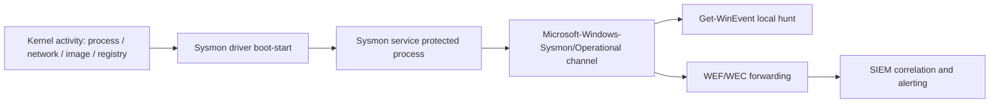

# Sysmon Deployment and Configuration

System Monitor (Sysmon) is a Sysinternals Windows service and device driver that logs high-fidelity endpoint activity — process creation with full command lines, network connections, image loads, and more — to a dedicated event channel. It fills the gaps left by the built-in Windows audit policy and is a cornerstone of endpoint detection.

## Overview

The native Windows [event logs](../Windows-Operating-System-Administration/Windows-Event-Logs.md) and [advanced audit policy](Windows-Advanced-Audit-Policy.md) cover a lot, but they miss detail defenders need: parent/child process lineage, file and image hashes, and network connections tied back to the process that made them. Sysmon adds that depth. Once installed it stays resident across reboots, writing structured events to `Microsoft-Windows-Sysmon/Operational` that you can query with [Get-WinEvent](Querying-Logs-with-Get-WinEvent.md), forward with [WEF/WEC](Windows-Event-Forwarding-WEF-WEC.md), and correlate in a [SIEM](SIEM-Integration.md).

Sysmon runs its service as a Windows **protected process** and installs a **boot-start driver**, so it captures activity from early in the boot sequence and resists casual user-mode tampering. It does not analyze events or hide itself — it is a sensor, not an EDR.

> [!NOTE]
> **Why Sysmon matters**
> Standard process-creation auditing ([Event ID 4688](Key-Security-Event-IDs.md)) tells you a process ran. Sysmon Event ID 1 adds the **parent process, image hash, ProcessGUID, and full command line** in one record, letting analysts reconstruct an attack chain rather than guess at it.

## Architecture

Sysmon's driver hooks kernel-mode events; the service serializes them into the Windows event log, where collection tooling takes over.



## Deployment

Download Sysmon from Sysinternals, then install from an elevated prompt. Installation does not require a reboot.

```cmd
:: Install with a configuration file (recommended)
sysmon -accepteula -i sysmonconfig.xml

:: Install with defaults (SHA1 hashing, no network monitoring)
sysmon -accepteula -i
```

Update the active configuration in place, dump the running config, or print the schema:

```cmd
:: Apply a new/updated configuration
sysmon -c sysmonconfig.xml

:: Dump the currently loaded configuration
sysmon -c

:: Print the full configuration schema (field names and types)
sysmon -s
```

Uninstall the service and driver:

```cmd
sysmon -u
```

> [!TIP]
> **Deploy with a curated config, not defaults**
> The default install is noisy in some places and blind in others. Start from a community baseline such as **SwiftOnSecurity's sysmon-config** or **Olaf Hartong's sysmon-modular**, then tune to your environment. These configs are annotated and map rules to MITRE ATT&CK techniques.

At scale, deploy the binary and config via Group Policy ([GPO](../Group-Policy-Objects-GPO/Group-Policy(GPO).md)) startup scripts, SCCM/Intune, or a configuration-management tool. Push config updates by re-running `sysmon -c` against the new file so all endpoints stay on a consistent baseline.

## Key Event IDs

Sysmon writes to `Microsoft-Windows-Sysmon/Operational`. The security-relevant events include:

| Event ID | Name | Detection value |
| --- | --- | --- |
| 1 | Process creation | Command-line and parent lineage — the workhorse for detection |
| 3 | Network connection | Ties outbound connections to a process (disabled by default) |
| 6 | Driver loaded | Malicious/unsigned drivers, BYOVD |
| 7 | Image loaded | DLL side-loading, unsigned modules (verbose — filter carefully) |
| 8 | CreateRemoteThread | Classic process-injection primitive |
| 10 | ProcessAccess | Handle opens to `lsass.exe` — credential theft |
| 11 | FileCreate | Drops in Startup, Temp, and download paths |
| 12–14 | RegistryEvent | Autostart/Run-key persistence, config tampering |
| 13 | Registry value set | Specific value writes (e.g. Run keys) |
| 17–18 | PipeEvent | Named-pipe C2 and lateral-movement tooling |
| 22 | DNS query | Beaconing and DNS-based exfiltration |
| 23 / 26 | FileDelete | Anti-forensics / evidence destruction |
| 25 | ProcessTampering | Process hollowing / herpaderping |

## Configuration Basics

A config is XML with an `EventFiltering` section. Each event tag uses `onmatch="include"` (log only matches) or `onmatch="exclude"` (log everything except matches); exclude rules take precedence.

```xml
<Sysmon schemaversion="4.82">
  <HashAlgorithms>SHA256</HashAlgorithms>
  <EventFiltering>
    <!-- Log any process that opens a handle to LSASS -->
    <ProcessAccess onmatch="include">
      <TargetImage condition="end with">lsass.exe</TargetImage>
    </ProcessAccess>
    <!-- Log outbound connections except from a trusted browser -->
    <NetworkConnect onmatch="exclude">
      <Image condition="end with">msedge.exe</Image>
    </NetworkConnect>
  </EventFiltering>
</Sysmon>
```

Supported hash algorithms are `MD5`, `SHA1`, `SHA256`, `IMPHASH`, or `*` for all. IMPHASH is useful for clustering related malware samples.

## Security Considerations

Sysmon is a defensive control, which makes it an attacker target. Sophisticated actors enumerate and attempt to blind it before continuing.

> [!WARNING]
> **Attackers hunt and disable your sensor**
> - **Service/driver tampering** — stopping the Sysmon service or unloading the driver kills telemetry. Sysmon logs its own **Event ID 4** (service state change); alert on unexpected stops and on service/driver deletion.
> - **Config manipulation** — pushing a permissive config with `sysmon -c` silences rules. Sysmon logs **Event ID 16 (ServiceConfigurationChange)** — treat any unexpected config change as suspicious.
> - **Renamed driver evasion** — attackers who know the default driver/service name may look for it; some deployments randomize `DriverName`. Do not rely on obscurity as your primary defense.
> - **Log clearing** — clearing the Sysmon channel (or the Security log, [Event ID 1102](Key-Security-Event-IDs.md)) destroys local evidence.

The durable mitigation is to **forward events off-host in near real time** with [WEF/WEC](Windows-Event-Forwarding-WEF-WEC.md) to a collector the endpoint's credentials cannot reach. Once a record is on the collector, tampering on the endpoint cannot retract it. Also restrict who can stop services or write the config, and alert on Sysmon Event IDs 4 and 16 in your [SIEM](SIEM-Integration.md).

## Best Practices

- Deploy from a curated, ATT&CK-mapped baseline config and version-control it; never ship raw defaults to production.
- Forward Sysmon logs to a central collector/SIEM so a compromised host cannot erase its own telemetry.
- Enable network (ID 3) and DNS (ID 22) logging, but tune `ImageLoad` (ID 7) and `ProcessAccess` (ID 10) tightly — they are the noisiest.
- Monitor for Sysmon tampering: alert on Event ID 4 (service state) and Event ID 16 (config change).
- Increase the `Microsoft-Windows-Sysmon/Operational` channel's maximum log size so bursty activity is not overwritten before it forwards.

## Troubleshooting

| Symptom | Likely cause & fix |
| --- | --- |
| No events after install | Confirm the service is running and check the `Microsoft-Windows-Sysmon/Operational` channel, not the Security log |
| Expected network/DNS events missing | Those event types are disabled by default — enable them explicitly in the config |
| Channel fills and overwrites quickly | Log too small or config too verbose — raise the max log size and tighten noisy filters |
| Config change not taking effect | Re-apply with `sysmon -c <file>`; verify the running config with `sysmon -c` (no argument) |

## References

- [Sysmon — Sysinternals (Microsoft Learn)](https://learn.microsoft.com/en-us/sysinternals/downloads/sysmon)
- [MITRE ATT&CK — Data Source: Process Creation](https://attack.mitre.org/datasources/DS0009/)
- [SwiftOnSecurity/sysmon-config (curated baseline)](https://github.com/SwiftOnSecurity/sysmon-config)
- [Olaf Hartong/sysmon-modular (modular ATT&CK-mapped config)](https://github.com/olafhartong/sysmon-modular)

## Related

- [Windows-Advanced-Audit-Policy](Windows-Advanced-Audit-Policy.md) — the native audit layer Sysmon complements
- [Key-Security-Event-IDs](Key-Security-Event-IDs.md) — built-in security event IDs (4688 vs Sysmon ID 1)
- [Querying-Logs-with-Get-WinEvent](Querying-Logs-with-Get-WinEvent.md) — hunting in the Sysmon channel
- [Windows-Event-Forwarding-WEF-WEC](Windows-Event-Forwarding-WEF-WEC.md) — getting Sysmon logs off the host
- [Command-Line-and-Process-Auditing](Command-Line-and-Process-Auditing.md) — process/command-line telemetry sources
- [SIEM-Integration](SIEM-Integration.md) — correlating and alerting on Sysmon events
- [Windows-Event-Logs](../Windows-Operating-System-Administration/Windows-Event-Logs.md) — the event log subsystem Sysmon writes to
- [Group-Policy(GPO)](../Group-Policy-Objects-GPO/Group-Policy(GPO).md) — deploying Sysmon and its config at scale
- [Enterprise Windows Infrastructure Security](../Readme.md) — course hub
