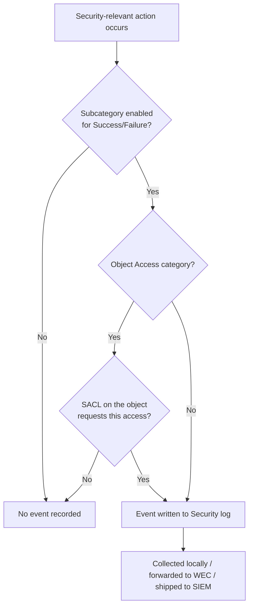

# Windows Advanced Audit Policy

Advanced Audit Policy is the granular auditing configuration in Windows that decides **which security events get written to the event log**. It replaces the nine legacy "basic" audit categories with ten categories broken into roughly sixty subcategories, letting defenders capture exactly the logon, privilege-use, process-creation, and object-access events attacks depend on — without drowning in noise.

## Overview

Auditing is the front of the Windows telemetry pipeline: if a subcategory is not enabled, the corresponding event is **never recorded**, and no amount of downstream [querying](Querying-Logs-with-Get-WinEvent.md), [forwarding](Windows-Event-Forwarding-WEF-WEC.md), or [SIEM correlation](SIEM-Integration.md) can recover it. Windows ships with sparse default auditing, so most estates need an explicit baseline deployed through [Group Policy](../Group-Policy-Objects-GPO/Group-Policy(GPO).md) to see attacks at all.

Advanced Audit Policy configures the **local Security Policy** consumed by the Local Security Authority (LSA), which writes results to the **Security** event log. Each subcategory can audit **Success**, **Failure**, or both. The generated event IDs are the raw material for detection — see [Key-Security-Event-IDs](Key-Security-Event-IDs.md) for the ones that matter.

## Categories and Subcategories

The ten top-level categories group related subcategories:

| Category | What it captures | Notable event IDs |
|----------|------------------|-------------------|
| **Account Logon** | Credential validation, Kerberos AS/TGS on the authenticating authority (DC) | 4776, 4768, 4769, 4771 |
| **Account Management** | User/group/computer object changes | 4720, 4726, 4738, 4740, 4728, 4732, 4756 |
| **Detailed Tracking** | Process creation/termination, RPC, PNP | 4688, 4689 |
| **DS Access** | Active Directory object access and changes | 4662, 5136 |
| **Logon/Logoff** | Interactive/network logons, special logons, lockouts | 4624, 4625, 4634, 4647, 4648, 4672 |
| **Object Access** | File, registry, SAM, and other object access (needs SACLs) | 4656, 4663, 4660 |
| **Policy Change** | Audit policy, authentication policy, firewall changes | 4719, 4670 |
| **Privilege Use** | Use of sensitive privileges | 4673, 4674 |
| **System** | Security state, service extensions, IPsec driver | 4608, 4697 |
| **Global Object Access Auditing** | Machine-wide SACLs for the file system and registry | — |

> [!IMPORTANT]
> **Enable the subcategory override**
> Advanced Audit Policy is ignored if legacy basic auditing wins the tie. Enable **Audit: Force audit policy subcategory settings (Windows Vista or later) to override audit policy category settings** (registry value `SCENoApplyLegacyAuditPolicy = 1` under `HKLM\System\CurrentControlSet\Control\Lsa`). Without it, mixing basic and advanced policy produces unpredictable, silently-dropped auditing.

## Configuring with auditpol

`auditpol.exe` is the built-in tool for viewing and setting the effective audit policy on a host. It operates on the **live** policy, so it is the fastest way to confirm what is actually being audited (as opposed to what a GPO intends).

View the current policy for all categories:

```cmd
auditpol /get /category:*
```

Enable success and failure auditing for a specific subcategory:

```cmd
auditpol /set /subcategory:"Process Creation" /success:enable /failure:enable
```

List every category and subcategory name (useful for exact spelling):

```cmd
auditpol /list /subcategory:*
```

Back up and restore the full policy as CSV:

```cmd
auditpol /backup /file:C:\audit-baseline.csv
auditpol /restore /file:C:\audit-baseline.csv
```

> [!WARNING]
> **auditpol changes are local and transient**
> Settings applied with `auditpol /set` are overwritten at the next Group Policy refresh if a GPO also defines Advanced Audit Policy. For durable configuration, deploy through GPO; use `auditpol` for inspection and lab work.

## Deploying via Group Policy

For a domain, define the baseline once and let it apply everywhere:

```text
Computer Configuration > Policies > Windows Settings > Security Settings >
Advanced Audit Policy Configuration > Audit Policies > <category> > <subcategory>
```

GPO writes the policy to `audit.csv` in the GPO's SYSVOL folder, which each client merges into its local policy at refresh.

### Command-line process auditing

Process Creation auditing (**event 4688**) records that a process started, but not its arguments by default. Enabling command-line capture is a separate control and one of the highest-value auditing settings for detection:

```text
Computer Configuration > Policies > Administrative Templates > System >
Audit Process Creation > Include command line in process creation events
```

This sets the registry value `ProcessCreationIncludeCmdLine_Enabled = 1` under `HKLM\SOFTWARE\Microsoft\Windows\CurrentVersion\Policies\System\Audit`. See [Command-Line-and-Process-Auditing](Command-Line-and-Process-Auditing.md) for the detection detail, and pair it with [Sysmon](Sysmon-Deployment-and-Configuration.md) event 1 for parent-process and hash context.

### Object Access needs SACLs

Enabling an **Object Access** subcategory alone produces nothing. Windows only audits an object when a **System Access Control List (SACL)** on that specific file, folder, or registry key requests it. The subcategory is the master switch; the SACL is the per-object trigger. This two-part design is why "I enabled File System auditing but see no 4663 events" is a common pitfall.

## How an event reaches the log



## Security Considerations

> [!WARNING]
> **Attackers tamper with audit policy first**
> Disabling auditing is a standard defense-evasion step (MITRE ATT&CK **T1562.002 — Impair Defenses: Disable Windows Event Logging**). An attacker with SYSTEM or admin rights can run `auditpol /clear` or selectively `auditpol /set /subcategory:"..." /success:disable /failure:disable` to blind specific detections while leaving the estate looking healthy. The change itself is auditable: **event 4719 — System audit policy was changed** — fires when policy is altered, and clearing the Security log raises **event 1102**. Alert on both, and treat their *absence* on a busy host as suspicious.

Offensively, the audit policy is reconnaissance: reading `auditpol /get /category:*` tells an attacker which of their actions are visible. Defensively, a documented, GPO-enforced baseline resists local tampering because Group Policy re-applies it at each refresh, and forwarding events off-host (see [Windows-Event-Forwarding-WEF-WEC](Windows-Event-Forwarding-WEF-WEC.md)) preserves evidence even if the endpoint's log is cleared. The controls that matter most: enable process creation **with command line**, audit account and group management, capture logon/logoff and special-logon (admin) events, and monitor the audit policy for change.

## Best Practices

- Deploy a **documented baseline via GPO**, not ad-hoc `auditpol` edits; enable the subcategory-override setting so advanced policy actually takes effect.
- Turn on **Process Creation (4688) with command-line capture** and **Account/Security Group Management** auditing — cheap settings with outsized detection value.
- Scope **Object Access** with SACLs on the files, registry keys, and shares that actually matter; broad file auditing floods the log.
- Forward the Security log off-host and **alert on 4719 and 1102** so audit-policy tampering and log clearing are themselves detected.
- Periodically export the policy (`auditpol /backup`) and diff it against the intended baseline to catch drift or tampering.

## Troubleshooting

| Symptom | Likely cause & fix |
|---------|--------------------|
| Expected events never appear | Subcategory not enabled — verify with `auditpol /get /category:*` |
| GPO policy seems ignored | Legacy basic auditing overriding — enable the subcategory-override setting (`SCENoApplyLegacyAuditPolicy`) |
| File/registry auditing enabled but no 4663 | No SACL on the object — set auditing entries in the object's Security > Advanced > Auditing tab |
| 4688 events have no command line | `Include command line in process creation events` not enabled |
| Local `auditpol` changes revert | A GPO redefines Advanced Audit Policy and wins at refresh — change it in the GPO |

## References

- [Advanced security audit policy settings (Microsoft Learn)](https://learn.microsoft.com/en-us/windows/security/threat-protection/auditing/advanced-security-audit-policy-settings)
- [auditpol command reference (Microsoft Learn)](https://learn.microsoft.com/en-us/windows-server/administration/windows-commands/auditpol)
- [Audit Process Creation / command line in 4688 events (Microsoft Learn)](https://learn.microsoft.com/en-us/windows/security/threat-protection/auditing/event-4688)
- [MITRE ATT&CK T1562.002 — Disable Windows Event Logging](https://attack.mitre.org/techniques/T1562/002/)

## Related

- [Key-Security-Event-IDs](Key-Security-Event-IDs.md) — the event IDs advanced auditing produces
- [Querying-Logs-with-Get-WinEvent](Querying-Logs-with-Get-WinEvent.md) — reading and hunting in the resulting logs
- [Command-Line-and-Process-Auditing](Command-Line-and-Process-Auditing.md) — 4688 with command line, and script-block logging
- [Sysmon-Deployment-and-Configuration](Sysmon-Deployment-and-Configuration.md) — higher-fidelity endpoint telemetry alongside audit policy
- [Windows-Event-Forwarding-WEF-WEC](Windows-Event-Forwarding-WEF-WEC.md) — centralizing logs off the hosts that generate them
- [SIEM-Integration](SIEM-Integration.md) — shipping and correlating the collected telemetry
- [Group-Policy(GPO)](../Group-Policy-Objects-GPO/Group-Policy(GPO).md) — how the baseline is enforced across the domain
- [NTLM](../Active-Directory-Domain-Services-AD-DS/NTLM.md) — credential-validation auditing (event 4776)
- [Kerberos-Authentication](../Active-Directory-Domain-Services-AD-DS/Kerberos-Authentication.md) — Account Logon auditing on domain controllers (4768/4769)
- [Enterprise Windows Infrastructure Security](../Readme.md) — course hub
