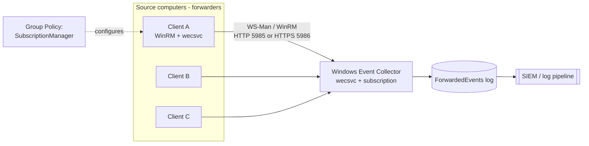

# Windows Event Forwarding (WEF/WEC)

Windows Event Forwarding (WEF) is the built-in Windows mechanism for shipping event logs off the hosts that generate them to a central **Windows Event Collector (WEC)**. It moves evidence out of an attacker's reach in near real time and is the agentless foundation for feeding Windows telemetry into a [SIEM](SIEM-Integration.md).

## Overview

WEF uses the standards-based **WS-Management (WS-Man)** protocol carried over **WinRM (Windows Remote Management)** to replicate selected events from **source computers** (forwarders) to one or more **collector** servers. It requires no third-party agent — the forwarder and collector services ship with Windows — which makes it attractive for large estates.

Forwarded events are written into a dedicated **`ForwardedEvents`** log on the collector by default, where they can be queried with [Get-WinEvent](Querying-Logs-with-Get-WinEvent.md) or picked up by a SIEM forwarder. WEF pairs naturally with an aggressive audit baseline (see [Windows-Advanced-Audit-Policy](Windows-Advanced-Audit-Policy.md) and [Key-Security-Event-IDs](Key-Security-Event-IDs.md)) and with [Sysmon](Sysmon-Deployment-and-Configuration.md) channels for high-fidelity endpoint telemetry.

> [!NOTE]
> **WEF vs. WEC**
> **WEF** is the forwarding capability as a whole; **WEC** is the collector role — the **Windows Event Collector** service (`wecsvc`) that hosts subscriptions and receives events. In practice the terms are used together to describe the source-to-collector pipeline.

## Subscription Models

A **subscription** defines *which* events are collected, from *whom*, and *how*. There are two models:

| Model | Who initiates | Configuration | Scales to |
|-------|---------------|---------------|-----------|
| **Source-initiated** (push) | The source pushes to the collector | Sources pointed at the collector by **GPO**; collector holds one subscription definition | Large fleets (recommended) |
| **Collector-initiated** (pull) | The collector pulls from named sources | Every source enumerated explicitly on the collector | Small, fixed sets of hosts |

Source-initiated is preferred at scale: you define the subscription once on the collector and enroll thousands of clients via a single Group Policy setting, with no need to name each source.

> [!TIP]
> **Delivery optimization**
> Each subscription has a delivery mode — **Normal** (batched, default), **Minimize Bandwidth**, or **Minimize Latency**. Use *Minimize Latency* for security-critical channels (e.g. the Security log) so alerts arrive quickly, and *Normal/Minimize Bandwidth* for chatty operational logs.

## Architecture

The following diagram shows the source-initiated pipeline: clients push over WinRM to the collector, which lands events in `ForwardedEvents` for the SIEM to ingest.



## Configuration

### On the collector

Enable WinRM and the Windows Event Collector service, then create a subscription:

```cmd
winrm qc -q
wecutil qc /q
```

A source-initiated subscription is defined in an XML file (`SubscriptionType` = `SourceInitiated`) that names the target `LogFile` (typically `ForwardedEvents`) and an event-selection **XPath query**, then registered with:

```cmd
wecutil cs subscription.xml
```

```text
Computer Configuration > Windows Components > Event Forwarding subscription XML
- <SubscriptionType>SourceInitiated</SubscriptionType>
- <ConfigurationMode>Normal | MinLatency | MinBandwidth | Custom</ConfigurationMode>
- <Query> ... XPath selecting channels/event IDs ... </Query>
- <LogFile>ForwardedEvents</LogFile>
```

### On the source (via GPO)

Point clients at the collector through Group Policy (see [Group-Policy(GPO)](../Group-Policy-Objects-GPO/Group-Policy(GPO).md)):

```text
Computer Configuration > Administrative Templates > Windows Components >
Event Forwarding > Configure target Subscription Manager
```

The **SubscriptionManager** value is a connection string identifying the collector:

```text
Server=http://collector.corp.local:5985/wsman/SubscriptionManager/WEC,Refresh=60
```

For HTTPS/non-domain sources, use `HTTPS://…:5986/…` and append `IssuerCA=<thumbprint>` — certificate authentication replaces Kerberos when the source is not domain-joined.

> [!IMPORTANT]
> **Forwarding the Security log**
> To forward the **Security** channel, the **`NETWORK SERVICE`** account on the source must be a member of the local **Event Log Readers** group; otherwise WEF cannot read the log and those events silently fail to forward.

### Verifying the subscription

```cmd
wecutil gr SubscriptionName
wecutil gs SubscriptionName
```

`wecutil gr` (get runtime status) shows how many sources are **Active**; on a healthy source, event **100** ("subscription created successfully") appears in `Microsoft-Windows-Eventlog-ForwardingPlugin/Operational`.

## Security Considerations

WEF's value to defenders is exactly what makes it a target for attackers: it copies logs **off the endpoint** almost immediately, so wiping local logs no longer erases the evidence — unless the attacker breaks the pipeline first.

> [!WARNING]
> **Blinding the forwarder**
> An attacker with local admin can attempt to break WEF as a post-exploitation step, mapping to **MITRE ATT&CK T1562 (Impair Defenses)** and **T1070.001 (Clear Windows Event Logs)**:
> - **Stop or disable services** — `wecsvc` (collector) or `WinRM` (transport) to halt collection.
> - **Delete or disable the subscription / GPO** so clients stop forwarding.
> - **Block outbound WinRM** (TCP 5985/5986) at the host firewall to isolate the source.
> - **Clear local logs** (event **1102** = Security log cleared) *hoping* the pipeline is already down.
> - **Compromise the collector** itself — a single high-value box holding many hosts' logs.

Defensive relevance:

- Because events replicate near-instantly, forwarded copies of `1102`, `4624/4625`, `4688`, `4720`, and Sysmon events usually survive local tampering — hunt for the **gap** (a source that stops heart-beating) as a tampering signal.
- Alert on WEF/WinRM **service stop/disable** and on **subscription runtime status** dropping to zero active sources.
- Harden and isolate the **collector**: it should not be reachable or modifiable with the credentials of the endpoints it collects from.

## Best Practices

- Prefer **source-initiated** subscriptions driven by GPO — one definition, fleet-wide enrollment, no per-host bookkeeping.
- Forward a **curated** set of channels (Security, System, PowerShell/Operational, Sysmon) rather than everything — over-collection buries signal and strains the collector.
- Add `NETWORK SERVICE` to **Event Log Readers** on sources so the **Security** log actually forwards.
- Use **Minimize Latency** for security-critical subscriptions and **HTTPS (5986)** with certificate auth for non-domain or cross-trust forwarders.
- **Monitor the monitor**: alert on missing heartbeats, `wecsvc`/WinRM tampering, and event **1102**, and treat the collector as a Tier-0-adjacent asset.

## Troubleshooting

| Symptom | Likely cause & fix |
| --- | --- |
| Source never appears / 0 active in `wecutil gr` | GPO not applied or wrong `SubscriptionManager` URL/port — run `gpupdate /force`, confirm WinRM reachable on 5985/5986 |
| All logs forward *except* Security | `NETWORK SERVICE` not in **Event Log Readers** on the source |
| No events although source is Active | Subscription XPath **query** matches nothing, or the audit subcategory isn't enabled — see [Windows-Advanced-Audit-Policy](Windows-Advanced-Audit-Policy.md) |
| Non-domain source can't connect | Missing/invalid **client certificate**, wrong `IssuerCA` thumbprint, or no HTTPS listener on 5986 |
| WinRM errors on setup | WinRM service not configured — run `winrm qc -q`; verify firewall allows the listener port |

## References

- [Setting up a Source Initiated Subscription (Microsoft Learn)](https://learn.microsoft.com/en-us/windows/win32/wec/setting-up-a-source-initiated-subscription)
- [Use Windows Event Forwarding to assist in intrusion detection (Microsoft Learn)](https://learn.microsoft.com/en-us/windows/security/threat-protection/use-windows-event-forwarding-to-assist-in-intrusion-detection)
- [MITRE ATT&CK T1562.002 — Impair Defenses: Disable or Modify Tools / Windows Event Logging](https://attack.mitre.org/techniques/T1562/002/)
- [MITRE ATT&CK T1070.001 — Indicator Removal: Clear Windows Event Logs](https://attack.mitre.org/techniques/T1070/001/)

## Related

- [Windows-Advanced-Audit-Policy](Windows-Advanced-Audit-Policy.md) — related note (decides what gets logged before it is forwarded)
- [Key-Security-Event-IDs](Key-Security-Event-IDs.md) — related note (the events worth forwarding)
- [Querying-Logs-with-Get-WinEvent](Querying-Logs-with-Get-WinEvent.md) — related note (reading the ForwardedEvents log)
- [Sysmon-Deployment-and-Configuration](Sysmon-Deployment-and-Configuration.md) — related note (high-fidelity channel to forward)
- [Command-Line-and-Process-Auditing](Command-Line-and-Process-Auditing.md) — related note (4688 / command-line telemetry to centralize)
- [SIEM-Integration](SIEM-Integration.md) — related note (where forwarded events ultimately land)
- [Group-Policy(GPO)](../Group-Policy-Objects-GPO/Group-Policy(GPO).md) — related note (mechanism that enrolls source computers)
- [Enterprise Windows Infrastructure Security](../Readme.md) — course hub
