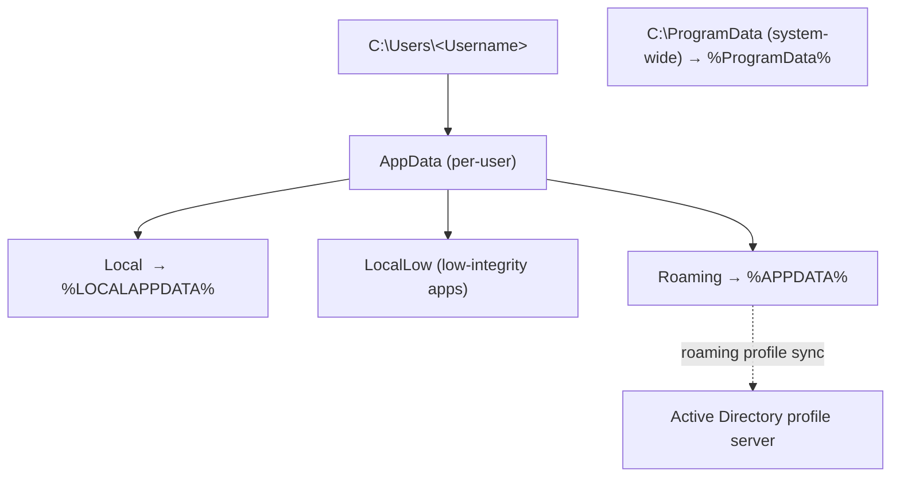

# AppData and ProgramData

**AppData** and **ProgramData** are the two hidden directories Windows uses to store application data outside `Program Files`. AppData holds **per-user** settings, caches, and profiles; ProgramData holds **system-wide** data shared by every user and service. Both are core to understanding where a Windows application actually keeps its state.

## Overview

Windows deliberately separates application *code* (under `Program Files`, which standard users cannot write to) from application *data*. That data lands in one of two places depending on who it belongs to: `C:\Users\<Username>\AppData` for a single user, or `C:\ProgramData` for the whole machine. Knowing this split matters for administration (roaming profiles, backups), for troubleshooting (settings that "disappear" on a new machine), and for security — both directories are common hunting grounds during investigations and privilege-escalation work because they frequently contain credentials, tokens, and misconfigured permissions. Where these paths sit under a user's profile relates directly to [User-Management](User-Management.md) and the profile paths described in [Windows-Local-Administrator-Account-and-SID](Windows-Local-Administrator-Account-and-SID.md).



## Concepts

### AppData (`C:\Users\<Username>\AppData`)

AppData stores user-specific application data. Each user account has its own separate AppData directory.

- Scope: Per-user
- Location: `C:\Users\<Username>\AppData`
- Hidden by default
- Used for application settings, caches, and user data

AppData contains three subfolders:

| Subfolder | Purpose | Roams? |
| --- | --- | --- |
| `Local` | Machine-specific data — cache files, temporary files, logs | No |
| `LocalLow` | Data for low-integrity / sandboxed apps (e.g. legacy browsers in protected mode) | No |
| `Roaming` | Data that follows a roaming profile in Active Directory environments — app settings, user preferences, browser profiles | Yes (when roaming profiles are enabled) |

Typical AppData contents:

- Browser data (history, cookies, cache)
- Application configuration files
- User-specific data and session files

> [!NOTE]
> **Local vs. Roaming**
> The `Local` vs. `Roaming` distinction is what an application chooses, not the user. Apps put large or machine-bound data (caches, GPU shaders, per-machine tokens) in `Local` so it does **not** follow the user between machines, and small portable preferences in `Roaming` so they do. This is why the same app can "remember" settings on one workstation but not another.

### ProgramData (`C:\ProgramData`)

ProgramData stores system-wide application data shared across all users.

- Scope: System-wide
- Location: `C:\ProgramData`
- Hidden by default
- Accessible by all users and system services (based on permissions)

Typical uses:

- Shared application settings
- Service-related data
- Data required before user login

Examples:

- Antivirus definitions
- Licensing and activation files
- Shared configuration files
- Background service data

## Key Differences

| Feature | AppData | ProgramData |
| --- | --- | --- |
| Scope | Per-user | System-wide (all users) |
| Path | `C:\Users\<Username>\AppData` | `C:\ProgramData` |
| Accessibility | Single user | All users (permission-based) |
| Roaming Support | Yes (`Roaming` folder only) | No |
| Data Type | User settings, cache, preferences | Shared configs, service data |
| Visibility | Hidden by default | Hidden by default |

## Configuration

### Environment Variables

| Variable | Points to |
| --- | --- |
| `%APPDATA%` | The `Roaming` folder |
| `%LOCALAPPDATA%` | The `Local` folder |
| `%ProgramData%` | `C:\ProgramData` |

> [!TIP]
> **Use the variables, not hardcoded paths**
> The username, and even the drive letter, can differ between machines. Referencing `%APPDATA%`, `%LOCALAPPDATA%`, and `%ProgramData%` keeps scripts and application configs portable and avoids assuming `C:\Users\<Username>`.

## Commands

Open each location quickly in Explorer:

```cmd
explorer.exe %APPDATA%
```

```cmd
explorer.exe %LOCALAPPDATA%
```

```cmd
explorer.exe %ProgramData%
```

Inspect the ACLs on a ProgramData subfolder (useful when auditing installer-created directories):

```cmd
icacls "C:\ProgramData\SomeApp"
```

See [ICACLS-Command](../File-Services-and-DFS/ICACLS-Command.md) for the full permission-inspection reference.

## Examples

### When to Use AppData

- Data is user-specific
- Settings should persist per user
- Temporary or session-based data is required

### When to Use ProgramData

- Data must be shared across users
- Services need access before login
- Application-wide configuration is required

## Security Considerations

> [!WARNING]
> **Both directories are attacker real estate**
> - **Writable `ProgramData` subfolders referenced by a SYSTEM service** are a classic privilege-escalation primitive — installers often create these world-writable, letting a low-privileged user replace a binary or config the service later loads.
> - **Sensitive data in `AppData`** — browser cookies, saved credentials, and session tokens under `%LOCALAPPDATA%` and `%APPDATA%` — is routinely harvested during post-exploitation.
> - **Staging and persistence** — because both folders are hidden and writable by their owner, attackers stage payloads under `%LOCALAPPDATA%` and add persistence there to blend in.

- Misconfigured `ProgramData` permissions (a writable subfolder referenced by a service running as SYSTEM) can lead to privilege escalation — verify ACLs with `icacls`.
- Sensitive data in `AppData` is frequently targeted during post-exploitation and is equally useful to defenders during investigations or audits.
- Because both folders are hidden, defenders should still audit them; hidden does not mean protected.

## Best Practices

- Store per-user settings in `AppData`; only place genuinely shared data in `ProgramData`.
- Keep both directories hidden and rely on environment variables rather than hardcoded paths.
- Review ACLs on `ProgramData` subfolders that applications create — installers often leave them world-writable.
- Store roamable settings under `Roaming` and machine-bound data under `Local` so profiles sync correctly.

## Troubleshooting

| Symptom | Likely cause | Resolution |
| --- | --- | --- |
| Folder not visible in Explorer | Hidden by default | Enable "Show hidden items" or use `%APPDATA%` |
| Roaming settings not syncing | Roaming profiles not enabled / data in `Local` | Confirm roaming profile setup; move data to `Roaming` |
| Access denied under `ProgramData` | Restrictive ACLs on a subfolder | Verify permissions with `icacls` |
| App loses settings on new machine | Data stored in `Local`, not `Roaming` | Store roamable settings under `Roaming` |

## References

- [Known Folder IDs (Microsoft Learn)](https://learn.microsoft.com/en-us/windows/win32/shell/knownfolderid)
- [CSIDL constants (Microsoft Learn)](https://learn.microsoft.com/en-us/windows/win32/shell/csidl)

## Related

- [User-Management](User-Management.md) — user profiles and where per-user data lives
- [Windows-Local-Administrator-Account-and-SID](Windows-Local-Administrator-Account-and-SID.md) — profile paths under `C:\Users`
- [ICACLS-Command](../File-Services-and-DFS/ICACLS-Command.md) — inspecting and fixing the ACLs discussed above
- Windows-Privilege-Escalation — how writable data dirs become an escalation path
- [Enterprise Windows Infrastructure Security](../Readme.md) — course hub and map of content
