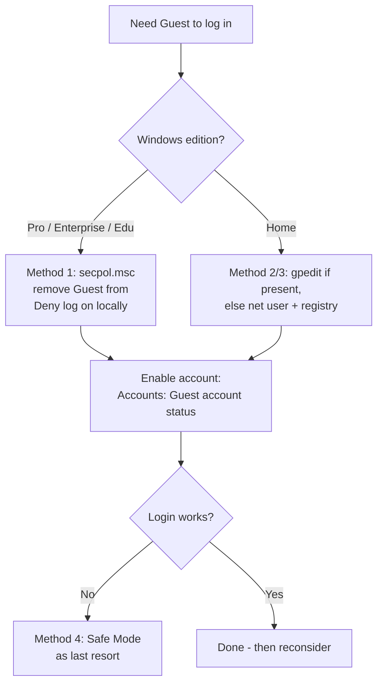

# Enable Guest Login

The built-in **Guest** account is a disabled-by-default local account meant for temporary, unauthenticated access. Even after you enable it, modern Windows (10/11) often still **blocks it from interactively logging on** because of hardened default security policy. This note collects the standard workarounds and — just as importantly — why you generally should not use them.

## Overview

The Guest account is a well-known local principal (RID `501`) that ships **disabled** and, on client editions, is additionally denied interactive logon. Enabling *login* therefore takes two separate steps: enabling the **account** (`Accounts: Guest account status`) and clearing the policy that **denies it logon** (`Deny log on locally`). See [Windows-Local-Administrator-Account-and-SID](Windows-Local-Administrator-Account-and-SID.md) for how well-known accounts and SIDs work, and [User-Management](User-Management.md) / [PowerShell-User-Group-Management](PowerShell-User-Group-Management.md) for the general account-management tooling this note builds on.

Because a working Guest login is an unauthenticated, low-privilege foothold, it is far more useful to an attacker than to an administrator — treat this note as "know how it works so you can find and disable it," not as a recommended configuration.

> [!IMPORTANT]
> **Enabling ≠ logging in**
> On Windows 10/11 client editions the Guest account is both **disabled** and **denied local logon**. Turning the account on (`net user guest /active:yes`) is not enough — you must also remove **Guest** from the **Deny log on locally** right. Home editions lack `secpol.msc`/`gpedit.msc`, so those hosts need the command-line or registry route.

## Choosing a Method



## Method 0: Enable the Account (Command Line)

The quickest way to enable (activate) the Guest account itself works on all editions, including Home:

```cmd
net user guest /active:yes
```

To confirm its state:

```cmd
net user guest
```

This activates the account but does **not** override the `Deny log on locally` policy — pair it with one of the methods below to actually reach a logon.

## Method 1: Modify Local Security Policy (secpol.msc)

This method clears the policy that blocks the Guest account from logging on locally.

1. Press `Win + R`, type **secpol.msc**, and press **Enter** (not available in Windows 11 Home).
2. Navigate to:

   ```text
   Local Policies > User Rights Assignment
   ```

3. Open **"Deny log on locally"** (double-click).
4. If **Guest** is listed, select it and click **Remove**.
5. Click **Apply > OK**.
6. Restart and try logging in to the **Guest** account.

## Method 2: Modify Group Policy (gpedit.msc)

If the Group Policy Editor is available, use it to set the Guest account status to enabled.

1. Press `Win + R`, type **gpedit.msc**, and press **Enter**.
2. Navigate to:

   ```text
   Computer Configuration > Windows Settings > Security Settings > Local Policies > Security Options
   ```

3. Open **Accounts: Guest account status** (double-click).
4. Set it to **Enabled** and click **Apply > OK**.
5. Restart.

> [!NOTE]
> **Home edition workaround**
> If `gpedit.msc` is not available (Windows 11 Home), use **Method 0** to enable the account and **Method 3** for the registry side.

## Method 3: Registry Editor

If the policy routes don't apply, the same behavior can be set through the registry.

1. Press `Win + R`, type **regedit**, and press **Enter**.
2. Navigate to:

   ```text
   HKEY_LOCAL_MACHINE\SOFTWARE\Microsoft\Windows NT\CurrentVersion\Winlogon
   ```

3. Find **AllowGuestAccountLogon** (if it doesn't exist, create a new `DWORD` value).
4. Set its value to `1`.
5. Restart.

The same change from an **elevated** PowerShell session:

```powershell
# Define registry path
$regPath = "HKLM:\SOFTWARE\Microsoft\Windows NT\CurrentVersion\Winlogon"

# Create the key if it doesn't exist (usually exists)
if (-not (Test-Path $regPath)) {
    New-Item -Path $regPath -Force
}

# Create or set AllowGuestAccountLogon DWORD to 1
New-ItemProperty -Path $regPath `
    -Name "AllowGuestAccountLogon" `
    -Value 1 `
    -PropertyType DWord `
    -Force    # untested

# Verify the value
Get-ItemProperty -Path $regPath | Select-Object AllowGuestAccountLogon

# Restart the system
Restart-Computer -Force
```

Compact one-liner:

```powershell
New-ItemProperty -Path "HKLM:\SOFTWARE\Microsoft\Windows NT\CurrentVersion\Winlogon" -Name "AllowGuestAccountLogon" -Value 1 -PropertyType DWord -Force    # untested
```

> [!NOTE]
> **Registry method caveats**
> - Must run **PowerShell as Administrator**.
> - Takes effect only after a **restart**.
> - `AllowGuestAccountLogon` is not a documented Microsoft policy value and may be ignored on newer builds where the Guest account is restricted — prefer Methods 1/2. The commands above are marked `# untested` accordingly.

## Method 4: Safe Mode (Last Resort)

If Guest login is still blocked, Safe Mode sometimes bypasses the restriction long enough to log in once.

1. Press `Win + R`, type **msconfig**, and press **Enter**.
2. On the **Boot** tab, check **Safe boot**.
3. Click **Apply > OK**, then restart.
4. Try logging in to the **Guest** account.
5. Afterwards, reopen `msconfig` and **uncheck Safe boot** to return to normal mode.

## Security Considerations

> [!WARNING]
> **The Guest account is an attacker's gift**
> A functioning Guest login is an **unauthenticated, low-privilege foothold** on the host — exactly the kind of initial access an attacker wants.
> - It provides a local logon and shell context that can be used for local enumeration and as a launch point for Privilege-Escalation.
> - Guest sits in the well-known `Guests` group; misconfigured share, file, or service ACLs that grant `Everyone`/`Guests` access become reachable.
> - Legacy insecure guest SMB access (`AllowInsecureGuestAuth`) exposes shares without authentication and is a separate hardening concern.
> - Enabling Guest widens the attack surface for no defensible business reason on almost every modern deployment.

From a defensive standpoint, the Guest account should stay **disabled** (its default) and be denied logon; treat any host where it is enabled as a finding worth investigating.

## Best Practices

- **Leave Guest disabled.** If you need low-trust access, create a dedicated **standard user** account instead — it is auditable and revocable.
- Keep **Guest** in **Deny log on locally** and **Deny access to this computer from the network**.
- For shared/public devices, use **Assigned Access (Kiosk mode)** rather than the Guest account.
- Audit for Guest-enabled hosts across the fleet and alert on the account being activated.
- Avoid the undocumented registry route in production; policy (`secpol`/GPO) is the supported control surface.

## Troubleshooting

| Symptom | Likely cause & fix |
| --- | --- |
| Guest enabled but login still blocked | **Deny log on locally** still lists Guest — remove it (Method 1) |
| `secpol.msc`/`gpedit.msc` won't open | Windows Home edition — use `net user guest /active:yes` plus the registry route |
| Registry change has no effect | Newer build restricts Guest logon; `AllowGuestAccountLogon` is ignored — use policy methods instead |
| Change not applied | Setting takes effect only after **restart**; also confirm the console is **elevated** |
| Login works only in Safe Mode | Interactive Guest logon is policy-restricted in normal mode — reconsider whether you should enable it at all |

## References

- [Accounts: Guest account status (Microsoft Learn)](https://learn.microsoft.com/en-us/previous-versions/windows/it-pro/windows-10/security/threat-protection/security-policy-settings/accounts-guest-account-status)
- [Deny log on locally (Microsoft Learn)](https://learn.microsoft.com/en-us/previous-versions/windows/it-pro/windows-10/security/threat-protection/security-policy-settings/deny-log-on-locally)
- [net user command reference (Microsoft Learn)](https://learn.microsoft.com/en-us/windows-server/administration/windows-commands/net-user)
- [Set up a kiosk / Assigned Access (Microsoft Learn)](https://learn.microsoft.com/en-us/windows/configuration/kiosk-methods)

## Related

- [Enterprise Windows Infrastructure Security](../Readme.md) — course hub
- [User-Management](User-Management.md) — parent topic for Windows local accounts
- [PowerShell-User-Group-Management](PowerShell-User-Group-Management.md) — enabling/managing accounts via PowerShell
- [Windows-Local-Administrator-Account-and-SID](Windows-Local-Administrator-Account-and-SID.md) — built-in accounts and well-known SIDs
- [Computer-Management-in-Windows-OS](../Windows-Server-Management/Computer-Management-in-Windows-OS.md) — GUI account management
- Privilege-Escalation — low-priv/guest accounts as a foothold
