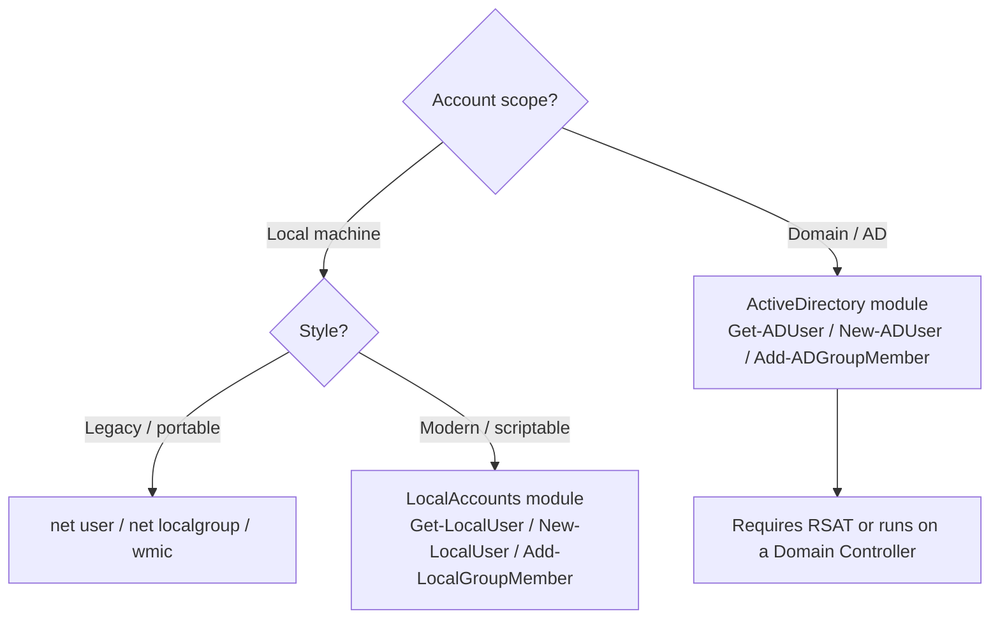

# PowerShell User & Group Management

Managing Windows user accounts and group memberships from the console — using the legacy `net`/`wmic` commands, the modern `*-LocalUser`/`*-LocalGroupMember` cmdlets, and their Active Directory equivalents. These are the everyday primitives an administrator, an incident responder, and an attacker all reach for.

## Overview

Windows exposes three overlapping toolsets for account administration. The legacy **command-line** utilities (`net user`, `net localgroup`, `wmic`) work in `cmd.exe` and PowerShell alike and remain the most portable. The **`Microsoft.PowerShell.LocalAccounts`** module (`Get-LocalUser`, `New-LocalUser`, `Add-LocalGroupMember`) is the modern, object-oriented way to manage the local **SAM** database. When a host is domain-joined, the **Active Directory module** (`Get-ADUser`, `New-ADUser`, `Add-ADGroupMember`) manages directory objects instead. Choosing the right tool comes down to scope (local vs domain) and whether you need scriptable objects or one-off commands.

See [User-Management](User-Management.md) for the GUI equivalents, [User-Management-Command](User-Management-Command.md) for the pure command-line reference, and [Managing-Domain-Users-and-Groups-with-PowerShell](../Active-Directory-Domain-Services-AD-DS/Managing-Domain-Users-and-Groups-with-PowerShell.md) for the domain-side workflow.

## Choosing the Right Tool



> [!NOTE]
> **Legacy vs. modern**
> `net user`, `net localgroup`, and `wmic` are `cmd.exe` built-ins but run unchanged in a PowerShell session. Prefer the `*-Local*` cmdlets for new scripts — they return objects you can filter and pipe, and `wmic` is deprecated in current Windows builds.

## Command-Line User Management (Local Users)

- View all users

```cmd
net user
```

- Create a new user

```cmd
net user username password /add
```

```cmd
net user testuser testpassword /add
```

- Add user to a group (e.g., Administrators)

```cmd
net localgroup Administrators username /add
```

```cmd
net localgroup Administrators testuser /add
```

- Remove user from a group

```cmd
net localgroup Administrators username /delete
```

```cmd
net localgroup Administrators testuser /delete
```

- Delete a user

```cmd
net user username /delete
```

```cmd
net user testuser /delete
```

## User Password Management

- Change password

```cmd
net user username newpassword
```

```cmd
net user testuser newpassword
```

- Force password change at next login

```cmd
wmic useraccount where name='username' set PasswordExpires=True
```

```cmd
wmic useraccount where name='testuser' set PasswordExpires=True
```

> [!WARNING]
> **`wmic` is deprecated**
> `wmic` is deprecated in newer Windows versions and disabled by default in recent builds. Prefer the PowerShell CIM equivalent, e.g. `Set-LocalUser -Name testuser -PasswordNeverExpires $false`. To require a change at next logon on a domain, use `Set-ADUser -Identity jdoe -ChangePasswordAtLogon $true`.

- Disable account

```cmd
net user username /active:no
```

```cmd
net user testuser /active:no
```

- Enable account

```cmd
net user username /active:yes
```

```cmd
net user testuser /active:yes
```

## PowerShell Advanced User Management

- List all local users

```powershell
Get-LocalUser
```

- Create a local user

```powershell
New-LocalUser -Name "username" `
    -Password (ConvertTo-SecureString "password" -AsPlainText -Force) `
    -FullName "User Name" `
    -Description "Description"
```

```powershell
New-LocalUser -Name "testuser" `
    -Password (ConvertTo-SecureString "123" -AsPlainText -Force) `
    -FullName "User Name" `
    -Description "Description"
```

- Add a user to a group

```powershell
Add-LocalGroupMember -Group "Administrators" -Member "username"
```

```powershell
Add-LocalGroupMember -Group "Administrators" -Member "testuser"
```

## Domain Environment (Active Directory)

Requirements:

- An Active Directory environment.
- The **RSAT: Active Directory** tools installed, or running directly on a Domain Controller.

- List domain users

```powershell
Get-ADUser -Filter *
```

- Create a domain user

```powershell
New-ADUser -Name "John Doe" `
    -AccountPassword (ConvertTo-SecureString "pass" -AsPlainText -Force) `
    -Enabled $true
```

- Add a user to a domain group

```powershell
Add-ADGroupMember -Identity "Domain Admins" -Members "jdoe"
```

> [!TIP]
> **The same cmdlets enumerate as well as manage**
> `Get-ADUser`, `Get-ADGroupMember`, and `Get-LocalGroupMember` are read-only discovery tools. In offensive AD work they are used to map users, find members of privileged groups, and identify targets — see Offensive-Active-Directory.

## Automation — Bulk User & Group Provisioning

These example scripts create departmental groups and populate them idempotently (they check for existence before creating), which is the pattern you want for repeatable lab or classroom setup.

### Create HR Users and Group

Create the HR group only if it does not already exist:

```powershell
if (-not (Get-LocalGroup -Name "HR" -ErrorAction SilentlyContinue)) {
    New-LocalGroup -Name "HR" -Description "HR Department Group"
}
```

Create the HR users and add each to the group:

```powershell
$hrUsers = @("hr1", "hr2", "hr3")
$password = ConvertTo-SecureString "123" -AsPlainText -Force

foreach ($user in $hrUsers) {
    if (-not (Get-LocalUser -Name $user -ErrorAction SilentlyContinue)) {
        New-LocalUser -Name $user -Password $password `
            -FullName $user `
            -Description "HR Department User" `
            -AccountNeverExpires
    }
    Add-LocalGroupMember -Group "HR" -Member $user
    Add-LocalGroupMember -Group "Users" -Member $user
}
```

Verify the HR group members:

```powershell
Get-LocalGroupMember -Group "HR"
```

### Create Sales Users and Group

Create the Sales group:

```powershell
if (-not (Get-LocalGroup -Name "SALES" -ErrorAction SilentlyContinue)) {
    New-LocalGroup -Name "SALES" -Description "Sales Department Group"
}
```

Create the Sales users (reuses the `$password` variable from above):

```powershell
$salesUsers = @("sales1", "sales2", "sales3")

foreach ($user in $salesUsers) {
    if (-not (Get-LocalUser -Name $user -ErrorAction SilentlyContinue)) {
        New-LocalUser -Name $user -Password $password `
            -FullName $user `
            -Description "Sales Department User" `
            -AccountNeverExpires
    }
    Add-LocalGroupMember -Group "SALES" -Member $user
    Add-LocalGroupMember -Group "Users" -Member $user
}
```

Verify the Sales group:

```powershell
Get-LocalGroupMember -Group "SALES"
```

### Create Manager (MGR) Users and Group

Create the MGR group:

```powershell
if (-not (Get-LocalGroup -Name "MGR" -ErrorAction SilentlyContinue)) {
    New-LocalGroup -Name "MGR" -Description "Manager Department Group"
}
```

Create the manager users:

```powershell
$mgrUsers = @("mgr1", "mgr2", "mgr3")

foreach ($user in $mgrUsers) {
    if (-not (Get-LocalUser -Name $user -ErrorAction SilentlyContinue)) {
        New-LocalUser -Name $user -Password $password `
            -FullName $user `
            -Description "Manager Department User" `
            -AccountNeverExpires
    }
    Add-LocalGroupMember -Group "MGR" -Member $user
    Add-LocalGroupMember -Group "Users" -Member $user
}
```

Verify the MGR group:

```powershell
Get-LocalGroupMember -Group "MGR"
```

> [!WARNING]
> **Plaintext passwords in scripts**
> These teaching examples embed weak plaintext passwords (`"123"`) with `-AsPlainText -Force`. Never do this in production — the credential sits in the script file, in shell history, and in memory. Prompt with `Read-Host -AsSecureString`, pull from a secrets vault, or use `Get-Credential`.

## Security Considerations

> [!WARNING]
> **These commands are dual-use**
> The exact cmdlets above are core post-exploitation tradecraft. After privilege escalation, an attacker uses `net user /add` + `net localgroup Administrators /add` (or `New-LocalUser` + `Add-LocalGroupMember`) to plant a **backdoor local admin** for persistence, and `Add-ADGroupMember "Domain Admins"` to escalate in a domain. The read-only `Get-*` variants are used for enumeration — see Remote-Code-Execution-to-Reverse-shell for how PowerShell serves as the attacker's shell.

Defensive detection — watch the Windows **Security** log for these account-management events:

| Event ID | Meaning |
|----------|---------|
| 4720 | A user account was created |
| 4726 | A user account was deleted |
| 4722 | A user account was enabled |
| 4725 | A user account was disabled |
| 4732 | A member was added to a security-enabled **local** group |
| 4728 | A member was added to a security-enabled **global** group (e.g. Domain Admins) |
| 4738 | A user account was changed |

Adding a member to a high-value group such as Administrators or Domain Admins should be a high-fidelity alert. See [Windows-Audit-Policy](Windows-Audit-Policy.md) and [Windows-Event-Logs](Windows-Event-Logs.md) for enabling and reading these.

## Best Practices

- Apply the **least-privilege principle** — do not grant Administrators/Domain Admins membership casually, and remove it when no longer needed.
- Disable or rename the built-in Administrator account and enforce strong password policy via Local Security Policy or Group Policy.
- Never hardcode passwords in scripts — use `Read-Host -AsSecureString`, `Get-Credential`, or a secrets vault.
- Prefer the modern `*-Local*` / `*-AD*` cmdlets over deprecated `wmic`; they return objects and fail more predictably.
- Enable account-management auditing and forward the Security log off-host so a wiped machine does not erase the evidence.

## Troubleshooting

| Symptom | Likely cause & fix |
|---------|--------------------|
| `Get-LocalUser`/`New-LocalUser` not recognized | The `LocalAccounts` module is unavailable (older/Core hosts) — fall back to `net user`, or import `Microsoft.PowerShell.LocalAccounts`. |
| `Get-ADUser` not recognized | AD module missing — install **RSAT: Active Directory** or run on a Domain Controller, then `Import-Module ActiveDirectory`. |
| "Access is denied" on create/add | Not elevated — run the console **as Administrator**; local group edits need admin rights. |
| `wmic` command fails or is missing | `wmic` is deprecated/removed in current Windows — use the PowerShell CIM/`Set-LocalUser` equivalent. |
| `New-LocalUser` rejects the password | Password does not meet the local complexity policy — satisfy the policy or adjust it via `secpol.msc`. |

## References

- [Microsoft Learn — `New-LocalUser`](https://learn.microsoft.com/en-us/powershell/module/microsoft.powershell.localaccounts/new-localuser)
- [Microsoft Learn — `Add-LocalGroupMember`](https://learn.microsoft.com/en-us/powershell/module/microsoft.powershell.localaccounts/add-localgroupmember)
- [Microsoft Learn — `New-ADUser`](https://learn.microsoft.com/en-us/powershell/module/activedirectory/new-aduser)
- [Microsoft Learn — `net user` command](https://learn.microsoft.com/en-us/windows-server/administration/windows-commands/net-user)

## Related

- [Enterprise Windows Infrastructure Security](../Readme.md) — course hub
- [User-Management](User-Management.md) — managing local users and groups via the GUI
- [User-Management-Command](User-Management-Command.md) — the pure command-line reference
- [Add-User-to-Administrators](Add-User-to-Administrators.md) — granting local admin rights
- [Windows-Local-Administrator-Account-and-SID](Windows-Local-Administrator-Account-and-SID.md) — the built-in Administrator account and SIDs
- [Managing-Domain-Users-and-Groups-with-PowerShell](../Active-Directory-Domain-Services-AD-DS/Managing-Domain-Users-and-Groups-with-PowerShell.md) — the domain-side (AD) workflow
- [Windows-Audit-Policy](Windows-Audit-Policy.md) — enabling account-management auditing
- [Windows-Event-Logs](Windows-Event-Logs.md) — reading the resulting events
- [Computer-Management-in-Windows-OS](../Windows-Server-Management/Computer-Management-in-Windows-OS.md) — the MMC console equivalent of these tasks
- Offensive-Active-Directory — the same cmdlets used for AD enumeration
- Privilege-Escalation — abusing group membership for escalation
- Remote-Code-Execution-to-Reverse-shell — PowerShell as an attacker shell
