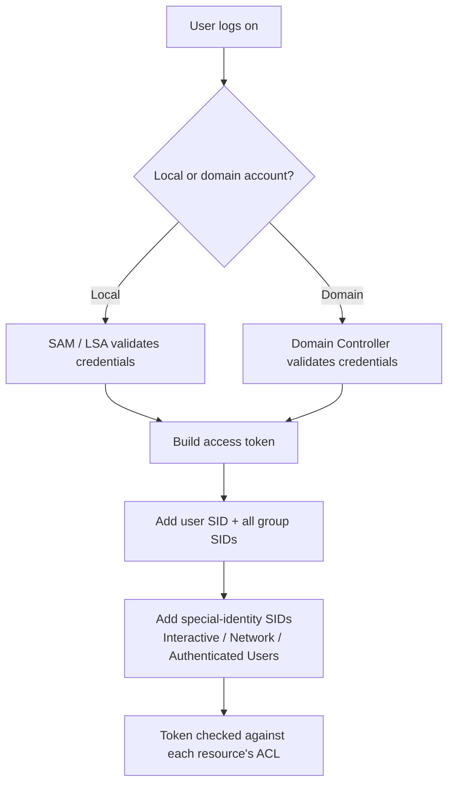

# User Management

A user in Windows is an identity that lets a person (or a service) log on and access files, applications, and system resources according to the permissions granted to that identity. User management is the day-to-day work of creating, modifying, grouping, and securing those identities on a local machine or across an Active Directory domain.

## Overview

Every Windows account is identified internally by a **Security Identifier (SID)**, not by its name — so renaming an account never changes its access. Permissions are rarely assigned to individual users; instead users are placed into **groups**, and permissions are assigned to the groups. At logon, Windows builds an **access token** for the session that carries the user's SID plus the SIDs of every group they belong to, and that token is checked against each resource's security descriptor.

Accounts come in two scopes: **local accounts**, stored on a single machine in the SAM database, and **domain accounts**, stored centrally in [Active Directory](../Active-Directory-Domain-Services-AD-DS/Active-Directory-Domain-Services.md) on a Domain Controller. This note focuses on local user/group administration through the GUI; for command-line and scripted management see [User-Management-Command](User-Management-Command.md) and [PowerShell-User-Group-Management](PowerShell-User-Group-Management.md).

## Types of Users

|User Type|Description|
|---|---|
|Administrator|Full access to the system. Can install software, change settings, and manage other users.|
|Standard User|Can use applications and change basic settings but cannot make system-wide changes.|
|Guest User|Limited access, temporary account, usually disabled by default.|

> [!NOTE]
> **The built-in Administrator (RID 500)**
> The original local Administrator account always carries the well-known Relative Identifier **500** (e.g. `S-1-5-21-...-500`), and the Guest account carries **501**. Because the `-500` account cannot be locked out by policy and is exempt from some UAC restrictions, defenders rename and disable it, while attackers specifically hunt for it. See [Windows-Local-Administrator-Account-and-SID](Windows-Local-Administrator-Account-and-SID.md).

## User Account Location

- User profile data is stored in:

```text
C:\Users\
```

Examples:

- `C:\Users\Administrator`
- `C:\Users\John`

This contains user-specific files such as:

- Desktop
- Documents
- AppData (hidden) — see [AppData-and-ProgramData](AppData-and-ProgramData.md)

## User Properties

Each user has attributes such as:

- Username
- Full Name
- Description
- Group Membership (e.g., Administrators, Users)
- Password Policy (expiration, change required)

## Local User vs Domain

|Local User|Domain User|
|---|---|
|Exists only on one computer|Exists across network domain|
|Managed on local machine|Managed via Domain Controller (AD)|
|Suitable for home or standalone PC|Used in enterprise networks|

The scope of an account also depends on the network model the machine participates in — see [Workgroup-vs-Peer-to-Peer-vs-Point-to-Point](../Networking-Fundamentals/Workgroup-vs-Peer-to-Peer-vs-Point-to-Point.md).

## How Group Membership Becomes Access

The following diagram shows how a user's group memberships are resolved into the access token that Windows uses for every authorization check.



## GUI Tools for User Management

### 1. Computer Management Console

- `Win + X` → Computer Management → Local Users and Groups
- Create, delete, or modify users/groups.

### 2. Control Panel

- Control Panel → User Accounts

### 3. Settings App

- Settings → Accounts → Family & other users

> [!TIP]
> **Verify membership from a shell**
> The GUI is convenient, but during administration or an assessment you can confirm exactly what an account is and belongs to with built-in commands:
> ```cmd
> whoami /user
> whoami /groups
> net user %USERNAME%
> net localgroup Administrators
> ```

## Types of Groups in Windows

Windows operating systems use various groups to manage permissions and access control. These groups help administrators define roles and access levels for different users.

### 1. Local Groups

Local groups exist on a single computer and are used to manage access and permissions for users on that machine. They are stored in the Local Security Authority (LSA) database.

#### Common Local Groups and Their Roles:

- Administrators
  - Have full control over the system, including installing software, managing system settings, and modifying other user accounts.
  - Example: A user in the Administrators group can enable or disable the firewall and change system policies.

- Power Users
  - Have more privileges than standard users but fewer than administrators. They can install software and modify system settings that do not affect other users.
  - Example: A department head who needs to install specialized software without requiring full administrator rights.

- Users
  - Can run most applications but cannot make system-wide changes or install software.
  - Example: A company employee using office applications without the ability to modify network settings.

- Guests
  - Have very limited access, typically used for temporary access without the ability to change settings or install software.
  - Example: A visiting consultant logging in to check emails but restricted from accessing confidential files.

### 2. Built-in Security Groups

Built-in security groups are automatically created during the installation of Windows and are used to manage system-wide permissions.

#### Key Built-in Security Groups:

- Authenticated Users
  - Includes all users who have logged in with valid credentials.
  - Example: Any employee logging in with their corporate username and password.

- Everyone
  - Includes all users, including guests and those who have not been authenticated.
  - Example: A public folder accessible by both employees and visitors.

- System
  - Represents the operating system itself and has full control over system processes and security settings.
  - Example: The Windows Update service running system-level updates.

- Creator Owner
  - Assigns special permissions to the user who created a file or folder.
  - Example: A user creating a private document and automatically becoming its owner.

- Service
  - Includes all accounts running services (e.g., background processes).
  - Example: The "Local Service" or "Network Service" account used by system processes.

### 3. Special Identity Groups

Special identity groups do not have explicit members; their membership is determined dynamically by how a user accesses the system.

#### Common Special Identity Groups:

- Backup Operators
  - Can override file permissions to back up and restore files on the computer.
  - Example: IT staff responsible for scheduled backups of important data.

- Remote Desktop Users
  - Can access the system remotely via Remote Desktop Protocol (RDP).
  - Example: A remote employee connecting to the office workstation from home.

- Network Configuration Operators
  - Can modify networking settings without full administrative privileges.
  - Example: A network technician assigned to troubleshoot and configure network adapters.

- Anonymous Logon
  - Includes users who access the system without authentication.
  - Example: A public-facing web server allowing anonymous access to view basic information.

- Interactive
  - Includes users who log in to the system locally.
  - Example: A user physically logging into their workstation.

- Network
  - Includes users accessing the system over a network.
  - Example: A file server being accessed from another machine in the office.

- Dialup
  - Includes users connecting via dial-up modems.
  - Example: A legacy system allowing remote access via a telephone line.

- Terminal Server Users
  - Includes users logged in via a remote session through a Terminal Server.
  - Example: Employees using a corporate remote desktop server to access company resources.

- Remote Interactive Logon
  - Includes users logging in remotely using tools like Remote Desktop Connection (RDC).
  - Example: A support technician accessing a client's computer remotely.

### 4. Domain Groups (in Active Directory environments)

Domain groups exist in Active Directory (AD) environments and provide centralized management of users and resources across multiple computers.

#### Common Domain Groups in Active Directory:

- Enterprise Admins
  - Have administrative control over all domains in a forest (a collection of domains).
  - Example: A global IT administrator managing user accounts and policies across different company branches.

- Domain Admins
  - Have full administrative control within a single domain.
  - Example: A system administrator responsible for managing all computers and users in a corporate office.

- Domain Users
  - Includes all standard user accounts in the domain.
  - Example: Every employee with a company login ID.

- Domain Guests
  - Includes guest accounts with very limited access.
  - Example: A contractor temporarily accessing non-sensitive company resources.

- Schema Admins
  - Can modify the Active Directory schema (the database structure of AD).
  - Example: A specialist adding new user attributes to support an HR system integration.

- Group Policy Creator Owners
  - Can create and manage Group Policy Objects (GPOs) in Active Directory.
  - Example: An IT security officer defining password complexity rules for all users.

### 5. Custom Groups

Administrators can create custom groups to manage access to specific resources or applications. These groups help enforce the Principle of Least Privilege (PoLP) by restricting permissions only to what is necessary.

#### Examples of Custom Groups:

- Finance Team
  - Members have access to financial records and accounting software but cannot access HR or IT data.

- Developers
  - Members can modify code repositories but do not have administrative privileges over production servers.

- Help Desk Technicians
  - Members can reset passwords and troubleshoot IT issues but cannot install new software without approval.

By effectively using built-in and custom groups, organizations can enhance security, streamline user management, and prevent unauthorized access to critical resources.

## Built-in Group Reference

### Administrative Groups

- Administrators
  - Full control over the system. Members can install software, manage users, change settings, and access any files.

- Power Users
  - Legacy group with limited administrative privileges. Can install programs and manage user accounts (except admin-level tasks). Mostly deprecated in modern Windows versions.

### Standard User Groups

- Users
  - Default group for regular users. Can use most software but cannot install system-wide programs or change settings affecting other users.

- Guests
  - Very limited permissions. Can log in without a password and use the computer, but cannot make system changes or install software. Intended for temporary access.

### Remote Access Groups

- Remote Desktop Users
  - Members can connect to the system via Remote Desktop Protocol (RDP). Doesn't grant administrative rights by default.

- Remote Management Users
  - Allows users to perform remote management tasks using tools like PowerShell or WMI. Useful for headless or server management scenarios.

### Monitoring and Logging

- Event Log Readers
  - Can read the event logs without full admin access. Useful for auditors or monitoring tools.

- Performance Monitor Users
  - Can access performance counters and use Performance Monitor (perfmon). Helpful for diagnosing system performance.

### System Management Roles

- Network Configuration Operators
  - Can make limited changes to networking settings (e.g., IP address, DNS). No full administrative control.

- Backup Operators
  - Can back up and restore files — even those they don't normally have access to. Useful for backup software agents.

### Service-Related Groups

- IIS_IUSRS
  - Group used by Internet Information Services (IIS) for granting permissions to web apps. Replaces older IUSR accounts.

- OpenSSH Users
  - Used to define which users are permitted to access the system via the OpenSSH server (if installed).

## Security Considerations

Group membership is where local privilege escalation is won or lost. Several "helper" groups grant capabilities that are effectively equivalent to administrator, so an attacker who lands a low-privileged account looks first at which privileged or over-scoped groups it belongs to (`whoami /groups`).

> [!WARNING]
> **Over-privileged local groups are an escalation path**
> - **Administrators / local `-500` account** — a compromised local admin hash enables **Pass-the-Hash** and full local takeover; the SAM can be dumped for offline cracking. See [SAM-vs-NTDS.dit](../Active-Directory-Domain-Services-AD-DS/SAM-vs-NTDS.dit.md).
> - **Backup Operators** — the `SeBackupPrivilege`/`SeRestorePrivilege` it grants lets a member read *any* file (including the SAM and SYSTEM hives) and write over protected files, bypassing ACLs — a direct route to SYSTEM.
> - **Power Users / Remote Management Users / Remote Desktop Users** — broaden the attack surface and can be abused for lateral movement and code execution.
> - **Everyone / Anonymous Logon** — over-permissive ACLs referencing these identities expose shares and objects to unauthenticated access.
> - Local accounts sharing the same password across machines enable **credential reuse** and lateral movement; mitigate with **LAPS**.

Auditing account and group changes is essential for detection: creation of a user (Event ID **4720**), addition to a security-enabled local group (**4732**), and successful/failed logons (**4624**/**4625**) all trace directly to this activity.

## Best Practices

- Follow **least privilege** — assign permissions to groups, keep users out of Administrators unless required, and remove membership when a role ends.
- Rename and **disable the built-in Guest** account; rename/harden the built-in Administrator and prefer named admin accounts for accountability.
- Deploy **Windows LAPS** to randomize and rotate the local administrator password per machine, killing password reuse.
- Enforce password and account-lockout policy; require strong, expiring passwords via Group Policy.
- Regularly review group membership (especially Administrators and Backup Operators) and prune stale or unused accounts.

## Troubleshooting

| Symptom | Likely cause & fix |
|---|---|
| User cannot change a system-wide setting | Account is in **Users**, not **Administrators** — add to the appropriate group or use an elevated account. |
| New group membership has no effect | Access token is built at logon — have the user **log off and back on** (or reboot) so the token is rebuilt. |
| Cannot log on remotely via RDP | Account is not in **Remote Desktop Users** (and lacks admin rights) — add it, and confirm RDP is enabled. |
| Guest login not available | Guest account is **disabled by default** — see [Enable-Guest-Login](Enable-Guest-Login.md). |
| Account exists but access still denied | Resource ACL denies the group, or an explicit **Deny** ACE overrides an Allow — review the object's permissions. |

## References

- Microsoft Learn — Manage local users and groups: https://learn.microsoft.com/windows/client-management/client-tools/manage-local-users-groups
- Microsoft Learn — Special identities: https://learn.microsoft.com/windows-server/identity/ad-ds/manage/understand-special-identities-groups
- Microsoft Learn — Security identifiers (well-known SIDs): https://learn.microsoft.com/windows-server/identity/ad-ds/manage/understand-security-identifiers
- Microsoft Learn — Windows LAPS overview: https://learn.microsoft.com/windows-server/identity/laps/laps-overview

## Related
- [Enterprise Windows Infrastructure Security](../Readme.md) — course hub
- [User-Management-Command](User-Management-Command.md) — CLI (`net user` / `net localgroup`) equivalents
- [PowerShell-User-Group-Management](PowerShell-User-Group-Management.md) — managing users/groups via PowerShell
- [Windows-Local-Administrator-Account-and-SID](Windows-Local-Administrator-Account-and-SID.md) — the built-in admin and well-known SIDs
- [Enable-Guest-Login](Enable-Guest-Login.md) — managing the built-in guest account
- [AppData-and-ProgramData](AppData-and-ProgramData.md) — where per-user profile data lives
- [Workgroup-vs-Peer-to-Peer-vs-Point-to-Point](../Networking-Fundamentals/Workgroup-vs-Peer-to-Peer-vs-Point-to-Point.md) — account scope across network models
- [SAM-vs-NTDS.dit](../Active-Directory-Domain-Services-AD-DS/SAM-vs-NTDS.dit.md) — local vs domain credential stores
- Offensive-Active-Directory — domain account enumeration and abuse
