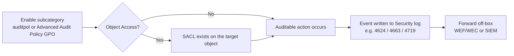

# Windows Audit Policy

Audit policy is the configuration layer that decides *which* security-relevant activities Windows actually records — logon attempts, account changes, privilege use, object access — before any of it can show up as an event. [Windows-Event-Logs](Windows-Event-Logs.md) covers reading and querying the resulting events; this note covers turning the taps on in the first place.

## Overview

Every auditable action in Windows (a logon, a file open, a group membership change) can be logged for its **Success** and/or its **Failure** outcome, independently. A subcategory with both success and failure auditing disabled generates nothing, no matter what happens on the box — this is why a stock Windows Server install is comparatively quiet on the Security log despite plenty of activity occurring.

Audit policy is configured either:

- **Locally**, via `secpol.msc` (Local Security Policy → Security Settings → Advanced Audit Policy Configuration) or `auditpol.exe`.
- **Domain-wide**, via Group Policy (see [Group-Policy(GPO)](../Group-Policy-Objects-GPO/Group-Policy(GPO).md) and [Default-Domain-Policy](../Group-Policy-Objects-GPO/Default-Domain-Policy.md)).

The resulting events land in the **Security** channel of the event log, which [Windows-Event-Logs](Windows-Event-Logs.md) describes how to query with `Get-WinEvent` / `wevtutil`.

The end-to-end pipeline — from turning a subcategory on, through the (optional) SACL prerequisite, to a forwarded event — looks like this:



> [!TIP]
> **Prefer Advanced over Basic**
> On Windows Server 2012 R2 and later, configure everything through Advanced Audit Policy Configuration and set `SCENoApplyLegacyAuditPolicy` so leftover Basic categories cannot silently override your subcategory settings.

## Basic vs Advanced Audit Policy

Windows ships with two overlapping audit policy models, and mixing them is explicitly unsupported.

**Basic Audit Policy** (legacy, `Local Policies\Audit Policy`) — 9 broad categories, each an all-or-nothing success/failure toggle:

| Basic Category |
|---|
| Audit account logon events |
| Audit account management |
| Audit directory service access |
| Audit logon events |
| Audit object access |
| Audit policy change |
| Audit privilege use |
| Audit process tracking |
| Audit system events |

**Advanced Audit Policy Configuration** (`Security Settings\Advanced Audit Policy Configuration`) — the same 9 areas broken into **10 top-level categories and roughly 60 subcategories** (the 10th being *Global Object Access Auditing*, a special resource-SACL feature layered on top of Object Access). Advanced policy lets you enable, say, just *Credential Validation* failures without also turning on every other Account Logon event, which is impossible under the Basic model.

**Do not run both at once.** If Basic categories are configured *and* Advanced subcategories are configured on the same machine, the two can silently conflict. The setting that governs this is:

- GPO path: `Computer Configuration → Policies → Windows Settings → Security Settings → Local Policies → Security Options → "Audit: Force audit policy subcategory settings (Windows Vista or later) to override audit policy category settings"`
- Registry-backed value: `SCENoApplyLegacyAuditPolicy`

Enabling this setting (the Microsoft-recommended default on modern Windows Server) makes the OS honor **only** the Advanced subcategory settings and ignore the Basic category settings — which is why Advanced Audit Policy Configuration is the preferred model on Windows Server 2012 R2 and later.

## The 10 Advanced Audit Policy Categories

| Category | Approx. subcategories | Focus |
|---|---|---|
| Account Logon | 4 | Credential validation against the local SAM or via Kerberos (auth server) |
| Account Management | 6 | User, computer, and group object lifecycle changes |
| Detailed Tracking | 6 | Process creation/termination, DPAPI, RPC calls |
| DS Access | 4 | Reads/writes against AD DS objects — domain controllers only |
| Logon/Logoff | 11 | Interactive/network/RDP/service logons, logoffs, lockouts, special (admin-equivalent) logons |
| Object Access | 14 | File system, registry, SAM, file share, removable storage — **requires a SACL per object**, see below |
| Policy Change | 6 | Changes to audit policy itself, authentication policy, firewall rules |
| Privilege Use | 3 | Use of sensitive/non-sensitive user rights (e.g. `SeDebugPrivilege`, `SeBackupPrivilege`) |
| System | 5 | Security state changes, system integrity, security subsystem extensions |
| Global Object Access Auditing | 2 | Org-wide resource SACLs for the file system and registry, applied without touching every object individually |

## `auditpol.exe` Reference

`auditpol` is the command-line front end for Advanced Audit Policy Configuration — it reads and writes the same policy store the GPO editor does.

| Subcommand | Purpose |
|---|---|
| `/get` | Display the current effective policy for a category or subcategory |
| `/set` | Enable/disable success and/or failure auditing for a category or subcategory |
| `/list` | Enumerate valid category/subcategory names (no state shown) |
| `/backup` | Export the current audit policy to a CSV file |
| `/restore` | Re-apply a policy previously exported with `/backup` |
| `/clear` | Reset the **entire** audit policy to "not configured" |

> [!NOTE]
> **Every command in this block is `# untested` — drawn from Microsoft Learn / standard `auditpol` syntax, not run against a live host in this note. Run `auditpol /backup` first so you can restore.**

```cmd
:: View the full effective audit policy, grouped by category
auditpol /get /category:*

:: View just the Logon/Logoff category
auditpol /get /category:"Logon/Logoff"

:: Enable success and failure auditing for the Logon subcategory
auditpol /set /subcategory:"Logon" /success:enable /failure:enable

:: Enable auditing for Credential Validation (feeds Event ID 4776)
auditpol /set /subcategory:"Credential Validation" /success:enable /failure:enable

:: Enumerate every valid subcategory name — useful before scripting /set calls
auditpol /list /subcategory:* /v

:: Back up the current policy before making changes — always do this first
auditpol /backup /file:C:\Audit\baseline-backup.csv

:: Restore a known-good policy
auditpol /restore /file:C:\Audit\baseline-backup.csv

:: DANGER: resets every category/subcategory to "No Auditing" — blinds the Security
:: log until reconfigured; lab/reset use only, never on a production host
auditpol /clear /y
```

## Key Categories to Enable, Mapped to Event IDs

Enabling a subcategory is what makes the corresponding Event ID in [Windows-Event-Logs](Windows-Event-Logs.md) possible in the first place — the table below connects policy to outcome (IDs quoted here match what's already documented in that note).

| Subcategory | Category | Catches | Event ID(s) |
|---|---|---|---|
| Audit Credential Validation | Account Logon | Username/password validated against local SAM or via NTLM | 4776 |
| Audit Logon | Logon/Logoff | Successful/failed interactive, network, RDP, service logons | 4624 / 4625 |
| Audit Logoff | Logon/Logoff | Session logoff | 4634 |
| Audit Special Logon | Logon/Logoff | Admin-equivalent ("special") privileges assigned to a new logon | 4672 |
| Audit User Account Management | Account Management | Account created / deleted | 4720 / 4726 |
| Audit Security Group Management | Account Management | Member added to a security group (local or global) | 4728 / 4732 |
| Audit Sensitive Privilege Use | Privilege Use | A sensitive privilege (e.g. `SeDebugPrivilege`) was exercised | 4673 |
| Audit File System | Object Access | Handle requested / access attempted on a SACL'd file or folder | 4656 / 4663 |
| Audit Audit Policy Change | Policy Change | The audit policy itself was modified | 4719 |
| Audit Directory Service Access | DS Access | AD object accessed (domain controllers only) | 4662 |

## Deploying via Group Policy

For anything beyond a single workstation, push audit policy through GPO rather than local `auditpol` calls:

```text
Computer Configuration
 → Policies
   → Windows Settings
     → Security Settings
       → Advanced Audit Policy Configuration
         → Audit Policies
           → (Account Logon / Account Management / Logon-Logoff / ...)
```

Link this at the domain level via [Default-Domain-Policy](../Group-Policy-Objects-GPO/Default-Domain-Policy.md) for a baseline that applies everywhere, or scope it to a specific OU (servers, domain controllers, workstations) with its own GPO — see [Group-Policy(GPO)](../Group-Policy-Objects-GPO/Group-Policy(GPO).md) for GPO scoping and precedence mechanics.

Remember to also set `SCENoApplyLegacyAuditPolicy` (the "Audit: Force audit policy subcategory settings..." Security Option, under `Local Policies → Security Options` in the same GPO) so the Advanced subcategory settings you just deployed aren't undermined by leftover Basic Audit Policy configuration on the same machines.

## Object Access Auditing Needs a SACL

Enabling the **Object Access** subcategory (e.g. *Audit File System*) alone logs **nothing**. Advanced Audit Policy only tells Windows to *pay attention* to objects that already have a System Access Control List (SACL) configured — the SACL is what actually names the object, the principal, and which accesses to log.

- `icacls` and PowerShell's `Set-Acl` operate on the **DACL** (who is allowed access) — they are not a SACL-editing tool.
- SACLs are set per object via the GUI: **Properties → Security → Advanced → Auditing tab → Add**, choosing the principal, the access types (Read, Write, Delete, etc.), and Success/Failure.
- Only after both (a) the Object Access subcategory is enabled via `auditpol`/GPO **and** (b) a SACL exists on the specific file, folder, or registry key will access attempts generate 4656/4663-style events.
- **Global Object Access Auditing** (see the category table above) is the org-wide alternative — a single GPO-deployed SACL applied to every file/registry object on a system, useful when per-object SACL management doesn't scale.

## Security Considerations

> [!WARNING]
> **Attackers target the audit configuration itself**
> Audit policy is a defensive control, which makes it an offensive target. `auditpol /clear` — or selectively disabling individual subcategories — blinds the Security log to follow-on activity; clearing the log itself raises **1102** and any change to the audit policy raises **4719**. Both are high-value alerts precisely because a legitimate administrator rarely triggers them, so they belong in every SIEM's detection set. The mirror-image mistake is self-inflicted: enabling **Object Access** success auditing broadly floods the log with legitimate 4663 reads and buries the real signal.

A reasonable baseline (aligned with Microsoft's published audit policy recommendations) is to enable success **and** failure on:

- **Account Logon** (Credential Validation) and **Logon/Logoff** (Logon, Logoff, Account Lockout, Special Logon)
- **Account Management** (User Account Management, Security Group Management)
- **Policy Change** (Audit Policy Change, Authentication Policy Change)
- **Detailed Tracking** → Process Creation (feeds 4688 — pairs with command-line auditing, see [Windows-Event-Logs](Windows-Event-Logs.md))
- **DS Access** on domain controllers only (Directory Service Access / Changes)
- **Object Access**, but only *targeted* — a small set of SACL'd high-value files/keys, not blanket success auditing across a busy file server

That last point is the operational trap: turning on full **Object Access success auditing** across every file share on a busy server generates an enormous volume of 4663 events for entirely legitimate reads, drowning the Security log and any downstream SIEM. Tune SACLs to specific sensitive paths (config files, credential stores, exfil-attractive shares) rather than enabling it broadly.

Forward the resulting events off-box (WEF/WEC or a SIEM) — see [Windows-Event-Logs](Windows-Event-Logs.md) for the anti-forensics reasons this matters (a 1102 audit-log-clear event is useless as evidence if it's the only copy).

## Best Practices

- Use **Advanced Audit Policy Configuration**, not the legacy Basic model, and enforce it with `SCENoApplyLegacyAuditPolicy` so the two cannot conflict.
- Enable **success and failure** on Account Logon, Logon/Logoff, Account Management, Policy Change, and Detailed Tracking → Process Creation as a baseline.
- Run `auditpol /backup` before any change, so a known-good policy can be restored after a mistake or tampering.
- Scope **Object Access** auditing to a small set of SACL'd high-value paths — never blanket-enable success auditing on busy file servers.
- Deploy at scale via [Group-Policy(GPO)](../Group-Policy-Objects-GPO/Group-Policy(GPO).md) (domain-wide or per-OU) and forward events off-box to WEF/WEC or a SIEM.

## Troubleshooting

| Symptom | Likely cause & fix |
|---|---|
| Object Access subcategory enabled but no 4656/4663 events | No SACL on the target object — add auditing entries via Properties → Security → Advanced → Auditing, or use Global Object Access Auditing |
| `auditpol` changes revert after `gpupdate` or reboot | A GPO is enforcing audit policy and overriding local settings — make the change in the GPO instead |
| Expected events missing / Basic and Advanced appear to conflict | Both models configured on one host — enable `SCENoApplyLegacyAuditPolicy` so only Advanced subcategory settings apply |
| Security log rolls over too quickly | Object Access success auditing is too broad — tighten SACLs, increase the log size, and forward events off-box |

## References

- [Microsoft Learn — auditpol](https://learn.microsoft.com/en-us/windows-server/administration/windows-commands/auditpol)
- [Microsoft Learn — Advanced security audit policy settings](https://learn.microsoft.com/en-us/previous-versions/windows/it-pro/windows-10/security/threat-protection/auditing/advanced-security-audit-policy-settings)
- [Microsoft Learn — Security auditing overview](https://learn.microsoft.com/en-us/previous-versions/windows/it-pro/windows-10/security/threat-protection/auditing/security-auditing-overview)
- [Microsoft Learn — System Audit Policy recommendations](https://learn.microsoft.com/en-us/windows-server/identity/ad-ds/plan/security-best-practices/audit-policy-recommendations)
- [Microsoft Learn — icacls](https://learn.microsoft.com/en-us/windows-server/administration/windows-commands/icacls)

## Related

- [Windows-Event-Logs](Windows-Event-Logs.md)
- [Group-Policy(GPO)](../Group-Policy-Objects-GPO/Group-Policy(GPO).md)
- [Default-Domain-Policy](../Group-Policy-Objects-GPO/Default-Domain-Policy.md)
- [Enterprise Windows Infrastructure Security](../Readme.md)
- [NTFS-(New-Technology-File-System)-Permissions](../File-Services-and-DFS/NTFS-(New-Technology-File-System)-Permissions.md)
- [User-Management](User-Management.md)
- [Active-Directory-Domain-Services](../Active-Directory-Domain-Services-AD-DS/Active-Directory-Domain-Services.md)
