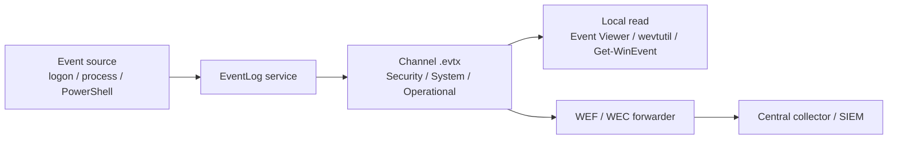

# Windows Event Logs

Windows Event Logs are the primary evidence trail for what happened on a host — for an attacker they're the thing anti-forensics tries to defeat; for a defender they're the backbone of detection and incident response.

## Overview

Logs live as `.evtx` files under `%SystemRoot%\System32\winevt\Logs\` and are organized into **channels**. The three classic channels — Application, Security, and System — are joined by many component-specific channels under `Applications and Services Logs`, most importantly `Microsoft-Windows-PowerShell/Operational` and, if installed, `Microsoft-Windows-Sysmon/Operational`.

What actually lands in those channels depends on configuration: auditing must be **enabled** via `auditpol` / Group Policy for the events that matter (logon, process creation, object access), so a stock install logs far less than a hardened one. Configuring that visibility is the job of [Windows-Audit-Policy](Windows-Audit-Policy.md); erasing it is the job of Anti-Forensics-and-Timestomping.

> [!NOTE]
> **Logging is opt-in, not automatic**
> Windows records only what the audit policy tells it to. The most valuable telemetry — command-line arguments (4688), PowerShell script content (4104), object access (4663) — is **off by default**. If it was never turned on, the evidence simply does not exist, and no amount of `.evtx` parsing will recover it.

## How Logging Works

An event is generated by a source (a logon attempt, a process launch, a service state change), handed to the **Windows Event Log service** (`EventLog`), written to the appropriate channel's `.evtx` file on disk, and — in a hardened environment — forwarded off the host to a central collector before a local attacker can touch it.



> [!IMPORTANT]
> **Forwarded logs survive local tampering**
> Once an event has shipped to a Windows Event Collector (WEF/WEC) or SIEM, clearing or timestomping the local `.evtx` is irrelevant — the record already left the host. Central forwarding is the single most effective control against on-host log destruction.

## Key Event IDs

| Event ID | Channel | Meaning |
|---|---|---|
| 4624 / 4625 | Security | Successful / failed logon (`LogonType` field shows interactive, network, RDP, service, etc.) |
| 4634 / 4647 | Security | Logoff |
| 4672 | Security | Special privileges (admin-equivalent) assigned to new logon |
| 4688 | Security | New process created (needs "Process Creation" auditing + command-line auditing enabled) |
| 4720 / 4726 | Security | User account created / deleted |
| 4732 / 4728 | Security | Member added to a local / global privileged group |
| 1102 | Security | **Audit log cleared** — a top anti-forensics tell, see Anti-Forensics-and-Timestomping |
| 104 | System | Log file cleared (non-Security channels) |
| 7034 / 7036 | System | A service crashed / changed state (start/stop) — flags EDR/Sysmon being killed |
| 4103 / 4104 | PowerShell/Operational | Module logging / **ScriptBlock logging** — captures deobfuscated script content |
| 1 / 3 / 11 / 22 | Sysmon/Operational | Process create / network connect / file create / DNS query |

## Working with Logs

Query and export channels natively on Windows with `wevtutil` and `Get-WinEvent`:

```powershell
# List all available channels
wevtutil el

# Query Security log for failed logons, most recent first
Get-WinEvent -FilterHashtable @{LogName='Security'; Id=4625} -MaxEvents 50

# Pull PowerShell ScriptBlock log entries (reveals decoded/deobfuscated commands)
Get-WinEvent -LogName 'Microsoft-Windows-PowerShell/Operational' |
    Where-Object Id -eq 4104 | Select-Object TimeCreated, Message

# Export a channel for offline analysis
wevtutil epl Security C:\triage\security.evtx

# Enable command-line auditing so 4688 events include the full command line
auditpol /set /subcategory:"Process Creation" /success:enable
```

Triage exported `.evtx` files offline on Linux — no Windows host required:

```bash
# Offline .evtx triage on Linux
python3 -m pip install python-evtx
evtx_dump.py security.evtx | less

# Or use Eric Zimmerman's EvtxECmd / Hayabusa / Chainsaw for rule-driven triage
hayabusa csv-timeline -d ./evtx_export/ -o timeline.csv   # untested
```

## Security Considerations

Event Logs sit on both sides of the fence: the defender's detection surface and the attacker's cleanup target. The offensive playbook (see Anti-Forensics-and-Timestomping) prefers *selectively blinding* logging — disabling an audit subcategory or stopping the collector service — over a hard `wevtutil cl`, because a full channel wipe is loud.

> [!WARNING]
> **Clear events are loud IOCs, not stealth**
> `1102` (Security log cleared) and `104` (other channel cleared) are high-fidelity indicators — a legitimate admin almost never wipes an entire channel. So are `7034`/`7036` service-stop events for `Sysmon` or `EventLog` itself. Treat all of these as alerts, not noise. A capable attacker rarely clears logs; they try to keep events from being generated in the first place, which is why **enabling** the right auditing (and forwarding it) is the real defense.

- **Command-line auditing (4688) is off by default** — without it, process-creation events show the executable but not its arguments, hiding most of what an attacker actually ran.
- **PowerShell ScriptBlock logging (4104)** defeats most obfuscation: it logs the fully deobfuscated script block at execution time, not the (possibly encoded) command that invoked it.
- **Forward logs off the host** (WEF/WEC, Sysmon-to-SIEM) — local `.evtx` tampering is irrelevant once events have shipped centrally.
- Build super-timelines (Plaso/log2timeline, Velociraptor, KAPE + EvtxECmd) to correlate Event Log entries with filesystem MACE timestamps during an investigation. This is where Event Logs meet timestomping detection.

## Best Practices

- Enable **advanced audit policy** for logon, process creation (with command line), privilege use, and object access — you cannot investigate what you never logged. Drive it from [Windows-Audit-Policy](Windows-Audit-Policy.md).
- Turn on **PowerShell module + ScriptBlock logging** to capture deobfuscated attacker tooling.
- **Forward events to a central collector (WEF/WEC or SIEM)** so a wiped or reimaged host does not erase the evidence.
- Alert on the high-fidelity IOCs — `1102`, `104`, and `EventLog`/`Sysmon` service-stop events — rather than burying them in volume.
- Size and retain the Security channel appropriately so busy servers do not roll over before events are collected.

## Troubleshooting

| Symptom | Likely cause & fix |
| --- | --- |
| 4688 events lack the command line | "Include command line in process creation events" not enabled — set the audit subcategory **and** the command-line GPO/registry policy |
| Expected logon/object-access events missing | Corresponding audit subcategory disabled — enable via `auditpol /set` or Advanced Audit Policy GPO |
| PowerShell 4104 entries absent | ScriptBlock logging not enabled — turn on `Microsoft-Windows-PowerShell/Operational` logging via GPO |
| `Get-WinEvent` returns "No events were found" | Channel empty, wrong `LogName`/`Id`, or access denied — run elevated and confirm the channel name with `wevtutil el` |
| Older events silently gone | Channel reached max size and wrapped — increase log size and/or forward events off-host |

## References

- [Windows security auditing overview (Microsoft Learn)](https://learn.microsoft.com/en-us/windows/security/threat-protection/auditing/security-auditing-overview)
- [Advanced security audit policy settings (Microsoft Learn)](https://learn.microsoft.com/en-us/windows/security/threat-protection/auditing/advanced-security-audit-policy-settings)
- [Event 4688: A new process has been created (Microsoft Learn)](https://learn.microsoft.com/en-us/windows/security/threat-protection/auditing/event-4688)
- [PowerShell logging on Windows — about_Logging_Windows (Microsoft Learn)](https://learn.microsoft.com/en-us/powershell/module/microsoft.powershell.core/about/about_logging_windows)

## Related

- [Enterprise Windows Infrastructure Security](../Readme.md) — course hub
- [Windows-Audit-Policy](Windows-Audit-Policy.md) — configure which activities generate these events
- Anti-Forensics-and-Timestomping — the offensive side of log clearing and timestomping
- Windows-Privilege-Escalation — how attackers reach the rights to tamper with logs
- Offensive-Active-Directory-AD-Enumeration — domain-side activity that surfaces in these logs
