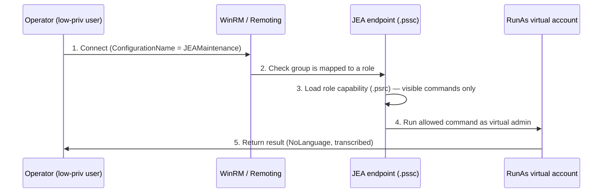

# Constrained Language Mode and JEA

Constrained Language Mode (CLM) and Just Enough Administration (JEA) are two Windows PowerShell lockdown features that enforce least privilege: CLM restricts which language features a session may use, while JEA restricts which commands a user may run over remoting. Together they shrink PowerShell from a general-purpose code-execution engine into a narrowly scoped administrative tool.

## Overview

By default PowerShell runs in **FullLanguage** mode — every cmdlet, every .NET type, and arbitrary script are available. That power is exactly what makes PowerShell a top living-off-the-land technique (see [Offensive-PowerShell](Offensive-PowerShell.md)). CLM and JEA attack the problem from two angles:

- **Constrained Language Mode** limits the *language surface* of a session — blocking arbitrary .NET/COM invocation and `Add-Type` while still allowing core cmdlets and simple scripting. It is enforced automatically when an application-control policy (**WDAC** or **AppLocker**) is in enforcement mode.
- **Just Enough Administration** limits the *command surface* of a [remoting](PowerShell-Remoting.md) endpoint — a delegated, role-based session that exposes only the specific cmdlets, parameters, and values an operator's role needs, typically running under a temporary virtual account.

Both are defensive controls that a penetration tester will also try to enumerate and bypass, so understanding how they are configured is as important as understanding how they fail.

## Constrained Language Mode

CLM is one of PowerShell's four language modes. You can read the current mode from the session:

```powershell
$ExecutionContext.SessionState.LanguageMode
```

| Language mode | What it allows |
| --- | --- |
| **FullLanguage** | Everything — all cmdlets, .NET types, script blocks (default) |
| **ConstrainedLanguage** | Core cmdlets and a small allow-list of .NET types; blocks arbitrary type/COM instantiation and `Add-Type` |
| **RestrictedLanguage** | Cmdlets run, but scripts/operators are heavily limited |
| **NoLanguage** | No script text at all — only cmdlet invocation via the API (used by JEA) |

### What CLM blocks

In ConstrainedLanguage mode a session can still run built-in cmdlets and simple pipelines, but it cannot:

- Instantiate arbitrary .NET types (e.g. `[System.Net.WebClient]::new()`) — only an allow-list of "core" types is permitted
- Call `Add-Type` to compile inline C#
- Create COM objects via `New-Object -ComObject`
- Invoke arbitrary .NET methods used for in-memory payload execution

This is what neuters the classic download-cradle and reflective-loading tradecraft that offensive PowerShell relies on.

> [!IMPORTANT]
> **CLM is enforced by application control, not by itself**
> Setting a language mode by hand is not a security boundary. CLM becomes a real control only when **WDAC** (Windows Defender Application Control) or **AppLocker** is in *enforcement* mode — the application-control engine forces every PowerShell session into ConstrainedLanguage unless the script/module is trusted by policy. The environment variable `__PSLockdownPolicy` can flip language mode for *testing*, but Microsoft explicitly warns it is not an enforcement mechanism.

## Just Enough Administration (JEA)

JEA is a role-based access control model built on PowerShell Remoting. Instead of granting an operator full administrator rights, you publish a **constrained remoting endpoint** that maps their group membership to a limited set of allowed commands.

A JEA deployment has two artifact types:

- **Session configuration file** (`.pssc`) — defines the endpoint: its session type, whether it uses a virtual account, transcription, and which roles map to which security groups. Registered as a named endpoint with `Register-PSSessionConfiguration`.
- **Role capability file** (`.psrc`) — defines a *role*: the visible cmdlets, functions, external commands, and even allowed parameter values. Stored inside a module's `RoleCapabilities` folder.

### Building a JEA endpoint

Create a role capability that exposes only what the role needs:

```powershell
New-PSRoleCapabilityFile -Path 'C:\Program Files\WindowsPowerShell\Modules\JEARoles\RoleCapabilities\Maintenance.psrc'
# then edit VisibleCmdlets / VisibleFunctions / VisibleExternalCommands  # untested
```

Create and register the session configuration that ties the role to a group:

```powershell
New-PSSessionConfigurationFile -Path .\JEAMaintenance.pssc `
  -SessionType RestrictedRemoteServer `
  -RunAsVirtualAccount `
  -TranscriptDirectory 'C:\ProgramData\JEATranscripts' `
  -RoleDefinitions @{ 'CONTOSO\HelpDesk' = @{ RoleCapabilities = 'Maintenance' } }   # untested

Register-PSSessionConfiguration -Name 'JEAMaintenance' -Path .\JEAMaintenance.pssc
```

Connect to the constrained endpoint by name:

```powershell
Enter-PSSession -ComputerName Server01 -ConfigurationName 'JEAMaintenance'
```

Key properties that make JEA safe:

- **`SessionType = RestrictedRemoteServer`** puts the session into **NoLanguage** mode and hides all commands except a minimal built-in set plus the role's visible commands.
- **`RunAsVirtualAccount`** runs actions under a temporary, machine-local virtual admin account — the connecting user never receives those privileges, and the credential does not persist.
- **`TranscriptDirectory`** captures an over-the-shoulder transcript of every JEA session for audit.

### JEA connection flow



## Security Considerations

> [!WARNING]
> **Both controls are bypass targets, not silver bullets**
> - **CLM depends entirely on application control.** If WDAC/AppLocker is misconfigured, in *audit* mode, or has a gap, the session silently falls back to FullLanguage. Classic escapes include invoking a **downgrade to the PowerShell v2 engine** (which predates CLM), executing through a **custom .NET runspace host** that the application-control policy does not cover, or abusing a **trusted signed script** that reflects arbitrary code. A pentester's first move is simply `$ExecutionContext.SessionState.LanguageMode` to see whether a control is even present.
> - **JEA leaks through its allow-list.** A role that exposes a cmdlet capable of running arbitrary code (for example one that writes files, edits scheduled tasks/services, or invokes external binaries) can be chained to break out of the constrained endpoint and act as the powerful virtual account. Over-broad `VisibleCmdlets` or unconstrained parameter values are the common flaw.
> - **AMSI still matters.** CLM raises the bar but does not replace the **Antimalware Scan Interface**; attackers who disable/evade AMSI weaken the surrounding defenses (see [Offensive-PowerShell](Offensive-PowerShell.md)).

Defensive relevance: pair CLM (via WDAC in enforcement) and JEA with the visibility controls in [PowerShell-Logging](PowerShell-Logging.md) — script-block logging (event ID **4104**) records the language mode of executed blocks, and JEA transcripts capture every delegated action. Detection comes from watching for language-mode downgrades, v2 engine launches, and unexpected use of powerful cmdlets inside a JEA session, not from trusting the lockdown alone.

## Best Practices

- Enforce CLM through **WDAC in enforcement mode** (AppLocker as a lighter alternative) — never rely on `__PSLockdownPolicy` or manual mode-setting as a boundary.
- Remove or block the **PowerShell v2 engine** so CLM cannot be downgraded around.
- Design JEA roles with the **least visible commands** possible; avoid cmdlets that can spawn arbitrary code or take free-form script/paths as parameters, and constrain parameter values where you can.
- Use **`RunAsVirtualAccount`** (or a group-managed service account) so operators never hold standing privilege, and enable **`TranscriptDirectory`** on every JEA endpoint.
- Combine with [PowerShell-Logging](PowerShell-Logging.md) and [Execution-Policy-and-Signing](Execution-Policy-and-Signing.md) so lockdown is paired with visibility and code integrity.

## Troubleshooting

| Symptom | Likely cause & fix |
| --- | --- |
| Session unexpectedly in ConstrainedLanguage | WDAC/AppLocker enforcement is active — expected; sign or allow-list trusted scripts to run them full-language |
| `Add-Type` / `New-Object -ComObject` fails | CLM is in effect — refactor to allowed cmdlets, or run from a policy-trusted, signed script |
| JEA connect fails with access denied | Connecting user's group is not in `RoleDefinitions`, or the endpoint isn't registered — verify with `Get-PSSessionConfiguration` |
| Need to preview a user's allowed commands | Use `Get-PSSessionCapability -ConfigurationName <name> -Username <domain\user>` |

## References

- [About Language Modes (Microsoft Learn)](https://learn.microsoft.com/en-us/powershell/module/microsoft.powershell.core/about/about_language_modes)
- [Just Enough Administration (JEA) overview (Microsoft Learn)](https://learn.microsoft.com/en-us/powershell/scripting/learn/remoting/jea/overview)
- [Windows Defender Application Control (WDAC)](https://learn.microsoft.com/en-us/windows/security/application-security/application-control/windows-defender-application-control/wdac)
- [MITRE ATT&CK — T1059.001 PowerShell](https://attack.mitre.org/techniques/T1059/001/)

## Related

- [PowerShell-Remoting](PowerShell-Remoting.md) — the transport JEA endpoints are published over
- [PowerShell-Logging](PowerShell-Logging.md) — script-block logging records language mode; JEA writes transcripts
- [Execution-Policy-and-Signing](Execution-Policy-and-Signing.md) — code integrity that complements CLM
- [Offensive-PowerShell](Offensive-PowerShell.md) — the LOLBin tradecraft CLM and JEA are designed to stop
- [PowerShell-Language-Fundamentals](PowerShell-Language-Fundamentals.md) — the language surface CLM constrains
- [PowerShell-Modules-and-Profiles](PowerShell-Modules-and-Profiles.md) — where JEA role capability files live
- [Enterprise Windows Infrastructure Security](../Readme.md) — course hub
