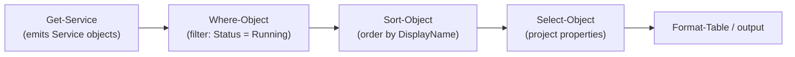

# PowerShell Language Fundamentals

PowerShell is an object-oriented shell and scripting language built on .NET. Unlike text-based shells, its commands (**cmdlets**) emit structured **objects** through a **pipeline**, which is what makes it both the administrator's primary automation tool and the attacker's favourite living-off-the-land shell.

## Overview

Where classic shells pass unstructured text between commands, PowerShell passes **.NET objects** with typed properties and methods. A single statement can filter, sort, and format rich data without brittle string parsing. This same expressiveness — combined with the fact that `powershell.exe`/`pwsh.exe` ship signed and on-box by default — is why PowerShell is a top **[living-off-the-land](Offensive-PowerShell.md)** technique (MITRE ATT&CK **T1059.001**). Understanding the language is the foundation for everything else in this module: [PowerShell-Modules-and-Profiles](PowerShell-Modules-and-Profiles.md), [PowerShell-Remoting](PowerShell-Remoting.md), [Execution-Policy-and-Signing](Execution-Policy-and-Signing.md), [PowerShell-Logging](PowerShell-Logging.md), and [Constrained-Language-Mode-and-JEA](Constrained-Language-Mode-and-JEA.md).

> [!NOTE]
> **Windows PowerShell vs PowerShell (Core)**
> **Windows PowerShell 5.1** (`powershell.exe`) ships in-box on Windows and is built on .NET Framework. **PowerShell 7+** (`pwsh.exe`) is the cross-platform successor built on .NET. The language fundamentals below apply to both; version-specific security features are called out where they differ.

## Cmdlets and Verb-Noun Naming

Cmdlets follow a strict **`Verb-Noun`** convention (for example `Get-Process`, `Set-Item`, `New-Item`), which makes commands discoverable and predictable. Approved verbs come from a controlled list (`Get-Verb`).

```powershell
Get-Command -Verb Get -Noun Process   # discover cmdlets by verb/noun
Get-Help Get-Process -Full             # full help for a cmdlet
Get-Process | Get-Member               # inspect object properties/methods
```

> [!TIP]
> **Discovery is built in**
> `Get-Command`, `Get-Help`, and `Get-Member` are the three cmdlets that let you learn any PowerShell surface without external docs. `Get-Member` is especially useful — it tells you exactly which properties and methods an object exposes to the pipeline.

## The Pipeline and Objects

The pipeline (`|`) passes **objects**, not text, from one cmdlet to the next. Each downstream cmdlet operates on typed properties rather than parsing columns of output.

```powershell
Get-Service |
    Where-Object { $_.Status -eq 'Running' } |
    Sort-Object -Property DisplayName |
    Select-Object -First 5 Name, DisplayName, Status
```

The following diagram shows how objects flow through a pipeline, with each stage refining the object stream.



`$_` (or its alias `$PSItem`) is the **current pipeline object** inside a script block such as the one `Where-Object` uses.

## Variables and Data Types

Variables are prefixed with `$` and are dynamically typed, but can be explicitly cast. PowerShell also exposes **automatic variables** the engine maintains for you.

```powershell
$name  = 'Administrator'      # string
[int]$count = 42              # explicit cast
$list  = @('a','b','c')       # array
$map   = @{ Key = 'Value' }   # hashtable

$PSVersionTable               # engine/version info (automatic variable)
$PSItem                       # current pipeline object (alias of $_)
$args                         # unnamed arguments to a function/script
```

> [!IMPORTANT]
> **$PSVersionTable is your first triage step**
> On any host, `$PSVersionTable.PSVersion` tells you the engine version. This matters for security: PowerShell **2.0** predates AMSI and script-block logging, so an attacker who can invoke it downgrades into a much less observable engine (see Security Considerations).

## Operators and Control Flow

PowerShell uses **named comparison operators** (`-eq`, `-ne`, `-gt`, `-lt`, `-like`, `-match`, `-contains`) rather than symbols, because `>` and `<` are reserved for redirection. Standard control-flow constructs are available.

```powershell
if ($count -gt 10) {
    'high'
} elseif ($count -eq 10) {
    'ten'
} else {
    'low'
}

foreach ($item in $list) { Write-Output $item }

switch -Wildcard ($name) {
    'Admin*' { 'privileged' }
    default  { 'standard' }
}
```

- `-match` uses regular expressions and populates the `$Matches` automatic variable.
- `-like` uses wildcard (`*`, `?`) matching, not regex.
- Comparison operators are **case-insensitive** by default; prefix with `c` (for example `-ceq`) for case-sensitive.

## Functions and Scripts

Reusable logic is packaged as **functions** (in memory or a `.psm1` module) or **scripts** (`.ps1` files). Parameters are declared in a `param()` block.

```powershell
function Get-Square {
    param(
        [Parameter(Mandatory)]
        [int]$Number
    )
    return $Number * $Number
}

Get-Square -Number 9   # -> 81
```

Modules and profiles — how functions are packaged, loaded, and auto-run at startup — are covered in [PowerShell-Modules-and-Profiles](PowerShell-Modules-and-Profiles.md).

## Providers and PSDrives

PowerShell **providers** expose hierarchical data stores (filesystem, registry, certificate store, environment variables) through a uniform drive-and-path model, so the same cmdlets (`Get-ChildItem`, `Get-Item`, `Set-Item`) work across all of them.

```powershell
Get-PSProvider                       # list available providers
Get-ChildItem Env:                   # environment variables as a drive
Get-ChildItem HKLM:\SOFTWARE         # registry via the Registry provider
Get-ChildItem Cert:\LocalMachine\My  # certificate store
```

## Security Considerations

PowerShell's power is dual-use: the same object pipeline and on-box availability that automate a fleet let an attacker run code entirely in memory without dropping tooling to disk.

> [!WARNING]
> **Language-level evasion: version downgrade and in-memory execution**
> - **Engine downgrade** — invoking `powershell.exe -Version 2` starts the 2.0 engine, which **predates AMSI and script-block logging**, silencing much of the telemetry defenders rely on. Detect via **Event ID 400** (engine start) in the *Windows PowerShell* classic log showing `EngineVersion=2.0`, and remove/disable the legacy **PowerShell v2** Windows optional feature so the engine cannot be loaded.
> - **In-memory / fileless execution** — `-EncodedCommand` (Base64) and download cradles run code without a `.ps1` on disk, evading file-based detection. This is why content-based logging matters: **script-block logging (Event ID 4104)** captures the *deobfuscated* script text the engine actually compiled, even for encoded or in-memory input.
> - **AMSI** — the Antimalware Scan Interface lets AV/EDR inspect script content at runtime (PowerShell 5.1+). Attackers attempt to patch or bypass AMSI in-process; monitor for AMSI-tamper patterns rather than trusting it as a boundary.

Defensive relevance is covered in depth in [PowerShell-Logging](PowerShell-Logging.md) (what to enable and what each Event ID captures) and [Constrained-Language-Mode-and-JEA](Constrained-Language-Mode-and-JEA.md) (restricting which language features and cmdlets a session can use). Note that [execution policy](Execution-Policy-and-Signing.md) is **not** a security boundary — it is trivially bypassed and only prevents accidental script execution.

## Best Practices

- Use full `Verb-Noun` cmdlet names and named parameters in saved scripts; reserve aliases (`gci`, `%`, `?`) for interactive use so scripts stay readable and greppable in logs.
- Prefer the object pipeline over text parsing (`Where-Object`/`Select-Object` on properties) — it is both more robust and produces cleaner audit trails.
- Declare typed, `[Parameter(Mandatory)]` inputs and validate them, rather than reading positional `$args`.
- Remove the **Windows PowerShell 2.0** optional feature from managed hosts to eliminate the downgrade-evasion path.
- Treat PowerShell as monitored, not blocked: enable script-block logging and transcription centrally (see [PowerShell-Logging](PowerShell-Logging.md)) so even living-off-the-land activity is recorded.

## Troubleshooting

| Symptom | Likely cause & fix |
| --- | --- |
| `The term '<name>' is not recognized` | Cmdlet's module isn't imported, or it's a typo — run `Get-Command <name>` / `Import-Module` (see [PowerShell-Modules-and-Profiles](PowerShell-Modules-and-Profiles.md)). |
| Comparison with `>` behaves unexpectedly | `>` is redirection, not "greater than" — use `-gt`, `-lt`, `-eq`, etc. |
| `$_ ` is empty inside a loop/block | `$_`/`$PSItem` is only bound inside pipeline script blocks (e.g. `Where-Object`, `ForEach-Object`); use a named `foreach` variable in a `foreach` statement. |
| Script won't run ("running scripts is disabled") | Execution policy — see [Execution-Policy-and-Signing](Execution-Policy-and-Signing.md). |

## References

- Microsoft Learn — What is PowerShell?: https://learn.microsoft.com/powershell/scripting/overview
- Microsoft Learn — About Automatic Variables: https://learn.microsoft.com/powershell/module/microsoft.powershell.core/about/about_automatic_variables
- Microsoft Learn — About Comparison Operators: https://learn.microsoft.com/powershell/module/microsoft.powershell.core/about/about_comparison_operators
- MITRE ATT&CK — T1059.001 (Command and Scripting Interpreter: PowerShell): https://attack.mitre.org/techniques/T1059/001/

## Related

- [PowerShell-Modules-and-Profiles](PowerShell-Modules-and-Profiles.md) — related note (packaging and loading reusable code)
- [PowerShell-Remoting](PowerShell-Remoting.md) — related note (running the language on remote hosts)
- [Execution-Policy-and-Signing](Execution-Policy-and-Signing.md) — related note (what actually gates script execution)
- [PowerShell-Logging](PowerShell-Logging.md) — related note (script-block/module logging and transcription)
- [Constrained-Language-Mode-and-JEA](Constrained-Language-Mode-and-JEA.md) — related note (restricting language features per role)
- [Offensive-PowerShell](Offensive-PowerShell.md) — related note (living-off-the-land tradecraft and detection)
- [Windows-Event-Logs](../Windows-Operating-System-Administration/Windows-Event-Logs.md) — related note (where PowerShell telemetry lands)
- [Enterprise Windows Infrastructure Security](../Readme.md) — course hub
