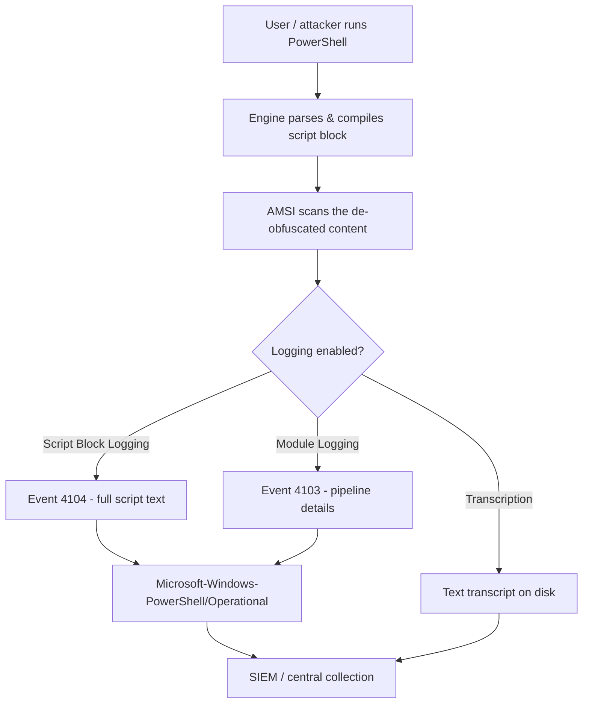

# PowerShell Logging

PowerShell logging is the set of built-in features that record what PowerShell runs — the commands invoked, the raw script text executed, and full session transcripts. Because PowerShell is a top living-off-the-land tool for attackers, its logging is one of the highest-value visibility sources on a Windows host.

## Overview

Left at defaults, PowerShell is nearly opaque: an attacker can run fileless, in-memory code through it and leave little on disk. The logging subsystem closes that gap by capturing execution at several layers — from high-level module activity down to the exact, de-obfuscated script blocks the engine compiled. These features are configured centrally through [Group-Policy(GPO)](../Group-Policy-Objects-GPO/Group-Policy(GPO).md) and surface as Windows events that flow into [Windows-Event-Logs](../Windows-Operating-System-Administration/Windows-Event-Logs.md) (and onward to a SIEM). This note covers the four logging mechanisms, how to enable them, and how attackers try to blind or evade them.

> [!NOTE]
> **Why it matters**
> Script-block logging (Event ID **4104**) records the *actual code* PowerShell executed, after decoding and de-obfuscation. This makes it one of the single most useful detection signals for malicious PowerShell — it defeats Base64 and string-concatenation obfuscation that would otherwise hide intent.

## Logging Mechanisms

PowerShell exposes four distinct, independently configurable logging channels:

| Mechanism | Captures | Primary log | Key Event ID(s) |
|-----------|----------|-------------|-----------------|
| **Module Logging** | Pipeline execution details per configured module | `Microsoft-Windows-PowerShell/Operational` | 4103 |
| **Script Block Logging** | Full text of compiled script blocks (de-obfuscated) | `Microsoft-Windows-PowerShell/Operational` | 4104 (4105/4106 = start/stop) |
| **Transcription** | Full input/output session record to a text file | Text file on disk (not Event Log) | — |
| **Engine / classic logging** | Engine and provider lifecycle, pipeline execution | `Windows PowerShell` (classic) | 400, 403, 600, 800 |

### Module Logging

Records pipeline execution events for the modules you specify. Configure a wildcard (`*`) to log all modules. Useful, but verbose and lower-fidelity than script-block logging — it captures cmdlet invocations and parameters rather than the raw source.

### Script Block Logging

The highest-value channel. When enabled, PowerShell writes the full text of every script block it compiles to Event **4104**, *after* decoding — so a Base64-encoded or concatenated payload is logged in cleartext.

> [!IMPORTANT]
> **Suspicious blocks logged even when disabled**
> Even without script-block logging fully enabled, PowerShell automatically logs script blocks it deems suspicious (for example, calls to `Invoke-Expression`, AMSI internals, or known offensive keywords) as **Warning**-level 4104 events. Turning the feature on captures *everything*; leaving it off does not mean total silence.

### Transcription

`Start-Transcript` (and the GPO "Turn on PowerShell Transcription") writes a running text file of every command and its output for the session — an "over-the-shoulder" record. Point the output directory at a write-only, centrally-collected share so an attacker on the host cannot trivially read or delete history.

```powershell
# Start an on-demand transcript for the current session
Start-Transcript -Path C:\Transcripts\session.txt -Append
# ... work happens here ...
Stop-Transcript
```

### Classic Engine Logging

The legacy `Windows PowerShell` log predates the operational channel and still records engine lifecycle events. It is valuable for one reason in particular: it reveals the **engine version** of each session, which exposes downgrade evasion (see Security Considerations).

| Event ID | Meaning |
|----------|---------|
| 400 | Engine state changed to *Available* (session start) — includes `EngineVersion` |
| 403 | Engine state changed to *Stopped* (session end) |
| 600 | Provider lifecycle (e.g., provider started) |
| 800 | Pipeline execution details |

## Logging Pipeline

How a single command travels from invocation to a stored event:



## Configuration

All four features are set under Group Policy at:

```text
Computer Configuration > Administrative Templates >
Windows Components > Windows PowerShell
```

The policies map to registry values under `HKLM\SOFTWARE\Policies\Microsoft\Windows\PowerShell`:

```text
...\ScriptBlockLogging\EnableScriptBlockLogging = 1 (DWORD)
...\ModuleLogging\EnableModuleLogging          = 1 (DWORD)
...\ModuleLogging\ModuleNames\*                 = *        (log all modules)
...\Transcription\EnableTranscripting          = 1 (DWORD)
...\Transcription\OutputDirectory              = \\server\share\transcripts
...\Transcription\EnableInvocationHeader       = 1 (DWORD)
```

Verify the effective engine version of the current session (relevant for downgrade detection):

```powershell
$PSVersionTable.PSVersion
```

> [!TIP]
> **Prefer GPO over local registry**
> Set these via GPO so the configuration is enforced fleet-wide and reapplies if tampered with locally. Local registry edits are easy for an administrator-level attacker to revert; a GPO refresh restores them.

## Security Considerations

> [!WARNING]
> **Attackers routinely blind PowerShell logging**
> - **Version downgrade** — invoking `powershell.exe -Version 2` starts the v2 engine, which predates script-block logging (4104), so malicious code runs unlogged by that channel. **Detection:** classic Event **400** with `EngineVersion` of `2.0`, or the presence of the v2 engine at all. **Mitigation:** remove the PowerShell v2 / .NET 2.0 optional feature.
> - **Disabling logging** — an attacker with admin rights can flip the registry `Enable*` values to `0` or stop the `Microsoft-Windows-PowerShell/Operational` channel. Maps to MITRE ATT&CK **T1562.002 (Impair Defenses: Disable Windows Event Logging)**. **Detection:** monitor for changes to the PowerShell policy registry keys and for log-clearing (Security Event **1102**, System Event **104**).
> - **AMSI bypass** — tampering with the in-process AMSI so content is not scanned; script-block logging can still capture the block that performs the bypass. **Detection:** 4104 blocks referencing `amsiInitFailed`, `AmsiUtils`, or reflection into `System.Management.Automation`.
> - **Obfuscation** — Base64, string concatenation, and format operators. Script-block logging largely defeats this because it logs the compiled, de-obfuscated text.

On the offensive side, PowerShell itself is MITRE ATT&CK **T1059.001 (Command and Scripting Interpreter: PowerShell)**. Logging is the control that turns that technique from invisible into detectable, which is exactly why evasion targets the logs rather than the technique.

## Best Practices

- Enable **script-block logging, module logging (`*`), and transcription** together via GPO — layered channels are harder to blind than any one alone.
- Ship transcripts to a **write-only, centrally-collected** share, and forward the operational and classic logs to a SIEM so on-host tampering does not erase evidence.
- **Remove PowerShell v2** to eliminate the downgrade-to-unlogged path.
- Alert on **logging-tamper signals** (policy registry changes, log clears 1102/104, engine version 2.0), not just on suspicious script content.
- Combine logging with **Constrained Language Mode and JEA** so that even logged sessions are least-privilege — see [Constrained-Language-Mode-and-JEA](Constrained-Language-Mode-and-JEA.md).

## Troubleshooting

| Symptom | Likely cause & fix |
|---------|-------------------|
| No 4104 events despite enabling the policy | GPO not refreshed (`gpupdate /force`), or the session started before the policy applied — restart the PowerShell session. |
| Expected code appears obfuscated in 4103 but not 4104 | Module logging captures pipeline metadata, not source; script-block logging (4104) is the channel that shows de-obfuscated text. |
| Transcripts missing for some sessions | Output directory unwritable or the session used the v2 engine — check share permissions and remove PowerShell v2. |
| Suspicious-looking 4104 Warning events with logging "off" | Expected: PowerShell auto-logs suspicious blocks as warnings even when full script-block logging is disabled. |

## References

- Microsoft Learn — about_Logging_Windows (PowerShell logging on Windows): https://learn.microsoft.com/en-us/powershell/module/microsoft.powershell.core/about/about_logging_windows
- Microsoft Learn — PowerShell the Blue Team (script-block & transcription logging): https://devblogs.microsoft.com/powershell/powershell-the-blue-team/
- MITRE ATT&CK — T1059.001 Command and Scripting Interpreter: PowerShell: https://attack.mitre.org/techniques/T1059/001/
- MITRE ATT&CK — T1562.002 Impair Defenses: Disable Windows Event Logging: https://attack.mitre.org/techniques/T1562/002/

## Related

- [Enterprise Windows Infrastructure Security](../Readme.md) — course hub
- [Offensive-PowerShell](Offensive-PowerShell.md) — related note (the tradecraft this logging is meant to catch)
- [Constrained-Language-Mode-and-JEA](Constrained-Language-Mode-and-JEA.md) — related note (least-privilege lockdown to pair with logging)
- [Execution-Policy-and-Signing](Execution-Policy-and-Signing.md) — related note (another PowerShell control, not a security boundary)
- [PowerShell-Remoting](PowerShell-Remoting.md) — related note (remote sessions are logged the same way)
- [PowerShell-Language-Fundamentals](PowerShell-Language-Fundamentals.md) — related note (script blocks and the pipeline being logged)
- [PowerShell-Modules-and-Profiles](PowerShell-Modules-and-Profiles.md) — related note (what module logging tracks)
- [Windows-Event-Logs](../Windows-Operating-System-Administration/Windows-Event-Logs.md) — related note (where PowerShell events are stored and queried)
- [Group-Policy(GPO)](../Group-Policy-Objects-GPO/Group-Policy(GPO).md) — related note (how logging is enforced fleet-wide)
