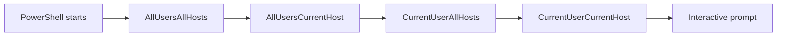

# PowerShell Modules and Profiles

PowerShell **modules** are reusable, self-contained packages of cmdlets, functions, and variables, and **profiles** are scripts that run automatically at shell startup. Together they define what code is available in a session and what runs before the user types anything — which is exactly why both are prime targets for persistence and code-execution abuse.

## Overview

A **module** groups related [cmdlets and functions](PowerShell-Language-Fundamentals.md) so they can be discovered, versioned, and shared. PowerShell locates modules automatically along `$env:PSModulePath` and, since PowerShell 3.0, imports them on demand the first time one of their commands is used (module autoloading). A **profile** is an ordinary `.ps1` script that PowerShell executes at launch to customize the session — aliases, functions, prompt, and imported modules. Because a profile runs on every shell start, it is a well-documented persistence location (MITRE ATT&CK **T1546.013**), and a writable directory on `$env:PSModulePath` is a module-hijacking opportunity.

## Modules

A module is the unit of packaging and distribution in PowerShell. Four common forms exist:

| Module type | File | Description |
|-------------|------|-------------|
| Script module | `.psm1` | PowerShell functions/variables; the most common authored form |
| Binary module | `.dll` | Compiled cmdlets written in C#/.NET |
| Manifest module | `.psd1` | Metadata that describes and wraps a module (version, author, exports) |
| Dynamic module | (in-memory) | Created at runtime with `New-Module`; never touches disk |

### Discovery and PSModulePath

PowerShell searches the directories listed in the `$env:PSModulePath` environment variable (semicolon-separated on Windows). Any module folder found there is available for autoloading.

```powershell
# List the module search paths
$env:PSModulePath -split ';'

# See loaded vs available modules
Get-Module
Get-Module -ListAvailable
```

Typical default locations (paths differ between Windows PowerShell 5.1 and PowerShell 7):

```text
# Current user
$HOME\Documents\PowerShell\Modules            # PowerShell 7
$HOME\Documents\WindowsPowerShell\Modules     # Windows PowerShell 5.1

# All users
$env:ProgramFiles\PowerShell\Modules          # PowerShell 7
$env:ProgramFiles\WindowsPowerShell\Modules   # Windows PowerShell 5.1

# System (shipped) modules
$env:windir\System32\WindowsPowerShell\v1.0\Modules   # Windows PowerShell 5.1
```

### Importing and authoring

```powershell
Import-Module ActiveDirectory        # explicit load (autoloading usually makes this optional)
Get-Command -Module ActiveDirectory  # inspect what a module exports
Remove-Module ActiveDirectory        # unload from the session

# Author a manifest for a script module
New-ModuleManifest -Path .\MyTools\MyTools.psd1 -RootModule 'MyTools.psm1' -ModuleVersion '1.0.0'
Test-ModuleManifest .\MyTools\MyTools.psd1
```

A script module (`.psm1`) controls what it exposes with `Export-ModuleMember`; a manifest (`.psd1`) declares exports and metadata such as `ModuleVersion`, `GUID`, `Author`, `RootModule`, and `FunctionsToExport`. Explicit exports (rather than `*`) keep a module's surface predictable and auditable.

### Installing from a repository

`PowerShellGet` installs modules from repositories such as the PowerShell Gallery (`PSGallery`).

```powershell
Get-PSRepository                 # is PSGallery Trusted or Untrusted?
Find-Module -Name PSReadLine
Install-Module -Name PSReadLine -Scope CurrentUser
Get-InstalledModule
```

> [!TIP]
> **Prefer CurrentUser scope and pinned versions**
> Installing with `-Scope CurrentUser` avoids needing admin rights and keeps third-party code out of the machine-wide, all-users path. Pin versions (`-RequiredVersion`) and review modules before installing — `Install-Module` runs arbitrary code the moment its commands execute.

## Profiles

A profile is a script PowerShell runs at startup. There are four profile scopes, keyed by user (current vs. all) and host (the specific host application vs. all hosts). The `$PROFILE` variable resolves to the **Current User, Current Host** path and exposes the others as properties.

| Scope | `$PROFILE` property | Typical path |
|-------|--------------------|--------------|
| All Users, All Hosts | `$PROFILE.AllUsersAllHosts` | `$PSHOME\profile.ps1` |
| All Users, Current Host | `$PROFILE.AllUsersCurrentHost` | `$PSHOME\Microsoft.PowerShell_profile.ps1` |
| Current User, All Hosts | `$PROFILE.CurrentUserAllHosts` | `$HOME\Documents\PowerShell\profile.ps1` |
| Current User, Current Host | `$PROFILE` / `$PROFILE.CurrentUserCurrentHost` | `$HOME\Documents\PowerShell\Microsoft.PowerShell_profile.ps1` |

> [!NOTE]
> **"Host" means the host application**
> The console, the ISE, and the VS Code integrated terminal are different *hosts*, each with its own current-host profile file name (for example `Microsoft.PowerShellISE_profile.ps1`, `Microsoft.VSCode_profile.ps1`). "Current Host" profiles only apply to the application that loaded them.

Profiles load in order from broadest to narrowest scope, so a user profile can override machine-wide settings:



Creating and inspecting a profile:

```powershell
Test-Path $PROFILE                                   # does one exist?
if (-not (Test-Path $PROFILE)) { New-Item -ItemType File -Path $PROFILE -Force }
notepad $PROFILE                                     # edit it
```

## Security Considerations

> [!WARNING]
> **Profiles and the module path are persistence and execution primitives**
> - **Profile persistence (T1546.013)** — an attacker who can write to a profile file gets code execution every time that user (or every user, for machine-wide profiles) opens PowerShell. The payload runs with the launching user's privileges, silently, before any interactive command.
> - **PSModulePath / module hijacking** — if a writable directory sits *earlier* on `$env:PSModulePath`, or an attacker drops a trojanized `.psm1` into an existing module folder, autoloading can import attacker code the moment a legitimately-named command is invoked (an execution-flow hijack, related to T1574).
> - **Malicious gallery modules** — `Install-Module` from an untrusted or typosquatted source pulls in code that executes with the installer's rights; marking `PSGallery` as *Untrusted* only adds a prompt, not a block.

Detection and mitigation:

- Ensure **[script-block logging](PowerShell-Logging.md)** and transcription are enabled — a profile's contents are captured as they execute, so malicious startup code is visible even though it "runs itself."
- Monitor for creation/modification of profile files and of module directories on `$env:PSModulePath` (file-integrity monitoring). Profile writes by non-admin processes are high-signal.
- Constrain what any startup script can do with **[Constrained Language Mode](Constrained-Language-Mode-and-JEA.md)** and application control (WDAC/AppLocker); see also **[Execution-Policy-and-Signing](Execution-Policy-and-Signing.md)** (execution policy is not a boundary).
- Treat unexpected all-users profiles (`$PSHOME`) as suspicious — writing there requires admin and affects everyone.

## Best Practices

- Author reusable code as modules with an explicit manifest and `FunctionsToExport` list, keep them in version control, and **sign** them (see [Execution-Policy-and-Signing](Execution-Policy-and-Signing.md)).
- Install third-party modules with `-Scope CurrentUser` and a pinned version; review the source and keep `PSGallery` interactions deliberate.
- Keep profiles small, reviewed, and — for shared/admin hosts — under change control; do not paste unverified snippets into `$PROFILE`.
- Audit `$env:PSModulePath` for writable or unexpected entries, and restrict write access to module and profile directories to administrators.
- Enable script-block logging, module logging, and transcription centrally via [Group Policy](../Group-Policy-Objects-GPO/Group-Policy(GPO).md) so module imports and profile execution are recorded.

## Troubleshooting

| Symptom | Likely cause & fix |
|---------|--------------------|
| A cmdlet isn't recognized | Module not on `$env:PSModulePath` or autoloading failed — check `Get-Module -ListAvailable`, then `Import-Module` explicitly |
| `Install-Module` prompts about an untrusted repository | `PSGallery` is marked *Untrusted* — verify the module, then proceed (or `Set-PSRepository` deliberately) |
| Profile changes don't take effect | Edited the wrong scope/host file — confirm the exact path with `$PROFILE | Format-List *` and restart the session |
| Profile fails to load at startup | A statement in the profile threw, or the profile's language features are blocked by Constrained Language Mode — start with `-NoProfile` to isolate, then fix the script |

## References

- Microsoft Learn — about_Modules: https://learn.microsoft.com/powershell/module/microsoft.powershell.core/about/about_modules
- Microsoft Learn — about_PSModulePath: https://learn.microsoft.com/powershell/module/microsoft.powershell.core/about/about_psmodulepath
- Microsoft Learn — about_Profiles: https://learn.microsoft.com/powershell/module/microsoft.powershell.core/about/about_profiles
- MITRE ATT&CK — T1546.013 Event Triggered Execution: PowerShell Profile: https://attack.mitre.org/techniques/T1546/013/

## Related

- [PowerShell-Language-Fundamentals](PowerShell-Language-Fundamentals.md) — related note (cmdlets, pipeline, and objects that modules package)
- [PowerShell-Remoting](PowerShell-Remoting.md) — related note (modules and profiles in remote sessions)
- [Execution-Policy-and-Signing](Execution-Policy-and-Signing.md) — related note (signing modules; execution policy is not a boundary)
- [PowerShell-Logging](PowerShell-Logging.md) — related note (capturing module imports and profile execution)
- [Constrained-Language-Mode-and-JEA](Constrained-Language-Mode-and-JEA.md) — related note (constraining what startup code can do)
- [Offensive-PowerShell](Offensive-PowerShell.md) — related note (profile/module abuse as tradecraft)
- [Group-Policy(GPO)](../Group-Policy-Objects-GPO/Group-Policy(GPO).md) — related note (deploying logging and lockdown centrally)
- [Windows-Event-Logs](../Windows-Operating-System-Administration/Windows-Event-Logs.md) — related note (where logged PowerShell activity surfaces)
- [Enterprise Windows Infrastructure Security](../Readme.md) — course hub
