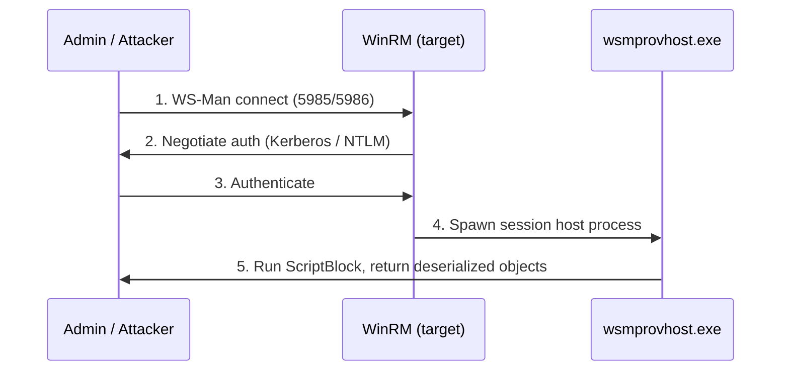

# PowerShell Remoting

PowerShell Remoting is the built-in framework for running PowerShell commands and scripts on remote Windows hosts. It rides on **WS-Management (WS-Man)** over the **WinRM** service by default, and on **SSH** for cross-platform PowerShell 7+. Because it is signed, encrypted, and native to Windows, it is both the administrator's fleet-management channel and one of the most common **lateral-movement** channels in Windows attacks.

## Overview

Remoting lets you administer many machines from one console without RDP or physical access. Commands execute on the remote host and return **deserialized objects** to the caller, so the pipeline still works across the wire. In a domain, remoting authenticates with [Kerberos](../Active-Directory-Domain-Services-AD-DS/Kerberos-Authentication.md) by default (falling back to [NTLM](../Active-Directory-Domain-Services-AD-DS/NTLM.md) outside the domain), and traffic is encrypted at the WS-Man layer even over plain HTTP. The same power that automates patching and inventory is what makes remoting attractive to attackers who already hold valid credentials — it is a living-off-the-land technique that leaves the endpoint's own trusted tooling doing the work.

## How It Works

Remoting has two transports:

- **WinRM (WS-Man)** — the default on Windows. The **WinRM** service listens for WS-Man requests; each incoming session is hosted in a separate **`wsmprovhost.exe`** process on the target.
- **SSH** — available in PowerShell 6+/7 for cross-platform and Linux-to-Windows remoting, configured as a PowerShell **subsystem** in `sshd_config`.

Default WinRM listener ports:

| Transport | Port | Notes |
|-----------|------|-------|
| WinRM HTTP | 5985 | Payload still encrypted at the WS-Man/message layer |
| WinRM HTTPS | 5986 | TLS-wrapped; recommended for untrusted networks |

Enable remoting on the target (run as Administrator):

```powershell
Enable-PSRemoting -Force
```

The two core execution patterns:

```powershell
# Interactive 1:1 session
Enter-PSSession -ComputerName DC01 -Credential (Get-Credential)

# Fan-out: run a command on many hosts at once
Invoke-Command -ComputerName WEB01,WEB02,DB01 -ScriptBlock { Get-Service -Name Spooler }

# Persistent, reusable sessions
$s = New-PSSession -ComputerName WEB01
Invoke-Command -Session $s -ScriptBlock { $env:COMPUTERNAME }
Remove-PSSession $s
```

> [!NOTE]
> **Objects, not text, cross the wire**
> Unlike SSH-to-a-text-shell, `Invoke-Command` returns **deserialized .NET objects**. You can filter, sort, and format results locally with the normal pipeline. Deserialized objects are property snapshots — their live methods do not run on the caller side.

## Authentication and the Double-Hop Problem

In a domain, remoting uses **Kerberos** by default; for non-domain or IP-based targets it falls back to **NTLM**, which requires the client to trust the target via the **TrustedHosts** list.

```powershell
# WSMan drive holds the client config, including TrustedHosts
Set-Item WSMan:\localhost\Client\TrustedHosts -Value "10.10.0.5" -Force
```

The classic limitation is the **double hop**: credentials used to reach the first remote host are **not** delegated onward to a second host (a network logon, logon type 3, cannot forward the user's secrets). Attempting to reach a file share or another server *from within* a remote session fails with access denied. Solutions include **CredSSP**, Kerberos **constrained delegation**, or **resource-based constrained delegation (RBCD)**.

> [!WARNING]
> **CredSSP trades security for convenience**
> CredSSP fixes the double hop by sending the user's **plaintext-equivalent credentials** to the first hop so it can reauthenticate onward. That first hop can now replay those credentials — if it is compromised, so is the account. Prefer Kerberos constrained delegation or RBCD over enabling CredSSP broadly.

## Just Enough Administration (JEA)

Remoting endpoints are defined by **session configurations** (PSSessionConfiguration). JEA uses constrained session configurations to expose only a curated set of cmdlets and parameters, run under a **virtual/temporary account**, so an operator can perform a role without full administrator rights.

```powershell
Get-PSSessionConfiguration          # list registered endpoints
Register-PSSessionConfiguration -Name "RestartService" -Path .\svc.pssc   # untested
```

See [Constrained-Language-Mode-and-JEA](Constrained-Language-Mode-and-JEA.md) for the full JEA and language-mode treatment.

## Architecture



## Security Considerations

> [!WARNING]
> **Remoting is a top lateral-movement channel**
> - **Lateral movement** — with valid credentials or a stolen hash used for pass-the-hash, `Invoke-Command` / `Enter-PSSession` run code on remote hosts with no malware dropped. MITRE ATT&CK tracks this as **T1021.006 (Windows Remote Management)** and **T1059.001 (PowerShell)**.
> - **Fan-out execution** — one command can hit dozens of hosts at once, ideal for mass discovery or deploying payloads across a domain.
> - **In-memory tradecraft** — remote script blocks run in memory, avoiding disk-based detection unless script-block logging is enabled.
> - **Only local admins** connect by default (members of the local Administrators group or the **Remote Management Users** group), so a compromised admin credential is the usual prerequisite.

Defensive controls:

- Restrict who can reach WinRM with host firewall rules and the **Remote Management Users** group; do not add users to it casually.
- Prefer **HTTPS listeners (5986)** on untrusted segments and require Kerberos.
- Enable **script-block logging (Event ID 4104)** and **module/transcription** logging so in-memory activity is recorded — see [PowerShell-Logging](PowerShell-Logging.md).
- Constrain endpoints with **JEA** and **Constrained Language Mode** so a session cannot run arbitrary code — see [Constrained-Language-Mode-and-JEA](Constrained-Language-Mode-and-JEA.md).
- Avoid broad **CredSSP**; scope delegation with Kerberos constrained delegation instead.

## Detection

- **WinRM operational log** — `Microsoft-Windows-WinRM/Operational` records session creation on both client and server.
- **PowerShell operational log** — `Microsoft-Windows-PowerShell/Operational`, **Event ID 4104** (script-block logging) captures the script content executed remotely.
- **Security log** — a remoting connection produces a **network logon (Event ID 4624, logon type 3)** on the target.
- Hunt for unexpected parents of **`wsmprovhost.exe`** and for `wsmprovhost.exe` spawning shells (`cmd.exe`, `powershell.exe`) or network tools.

## Best Practices

- Use **HTTPS (5986)** listeners with valid certificates on any non-isolated network; keep HTTP for trusted management VLANs only.
- Grant remoting via the **Remote Management Users** group and JEA endpoints, not by adding operators to local Administrators.
- Turn on script-block, module, and transcription logging centrally via **[Group-Policy(GPO)](../Group-Policy-Objects-GPO/Group-Policy(GPO).md)** before relying on remoting at scale — visibility first.
- Avoid enabling **CredSSP** as a default; solve the double hop with Kerberos constrained delegation or RBCD.
- Keep **TrustedHosts** empty in domain environments; rely on Kerberos rather than NTLM.

## Troubleshooting

| Symptom | Likely cause & fix |
|---------|--------------------|
| "Cannot connect / WinRM cannot complete the operation" | WinRM not enabled or firewall blocking 5985/5986 — run `Enable-PSRemoting -Force`, verify the listener with `winrm enumerate winrm/config/listener`. |
| Non-domain target refuses auth | Target not in **TrustedHosts** — add it (understand the NTLM risk) or use HTTPS with a cert. |
| Access denied on a second server from inside a session | **Double-hop** — credentials not delegated; use Kerberos constrained delegation or (cautiously) CredSSP. |
| "Access is denied" connecting as a valid user | User is not a local admin / **Remote Management Users** member on the target. |

```cmd
winrm enumerate winrm/config/listener
```

## References

- Microsoft Learn — About Remote (PowerShell Remoting): https://learn.microsoft.com/powershell/module/microsoft.powershell.core/about/about_remote
- Microsoft Learn — Running Remote Commands: https://learn.microsoft.com/powershell/scripting/learn/remoting/running-remote-commands
- Microsoft Learn — Making the Second Hop in PowerShell Remoting: https://learn.microsoft.com/powershell/scripting/learn/remoting/ps-remoting-second-hop
- MITRE ATT&CK — T1021.006 Remote Services: Windows Remote Management: https://attack.mitre.org/techniques/T1021/006/

## Related

- [PowerShell-Language-Fundamentals](PowerShell-Language-Fundamentals.md) — related note (cmdlets, pipeline, and objects that flow across remoting)
- [PowerShell-Modules-and-Profiles](PowerShell-Modules-and-Profiles.md) — related note (modules available inside remote sessions)
- [Execution-Policy-and-Signing](Execution-Policy-and-Signing.md) — related note (why execution policy is not a boundary for remote code)
- [PowerShell-Logging](PowerShell-Logging.md) — related note (script-block logging that captures remote activity)
- [Constrained-Language-Mode-and-JEA](Constrained-Language-Mode-and-JEA.md) — related note (locking down remoting endpoints)
- [Offensive-PowerShell](Offensive-PowerShell.md) — related note (remoting as living-off-the-land tradecraft)
- [Kerberos-Authentication](../Active-Directory-Domain-Services-AD-DS/Kerberos-Authentication.md) — related note (default remoting authentication and delegation)
- [NTLM](../Active-Directory-Domain-Services-AD-DS/NTLM.md) — related note (fallback auth for non-domain remoting)
- [Windows-Event-Logs](../Windows-Operating-System-Administration/Windows-Event-Logs.md) — related note (WinRM, PowerShell, and Security logs used for detection)
- [Group-Policy(GPO)](../Group-Policy-Objects-GPO/Group-Policy(GPO).md) — related note (centrally enabling logging and remoting policy)
- [Enterprise Windows Infrastructure Security](../Readme.md) — course hub
