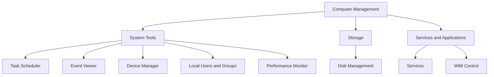

# Computer Management in Windows OS

**Computer Management** is a built-in Microsoft Management Console (MMC) snap-in in Windows that provides a single, centralized console for administering a local or remote computer. It bundles several administrative tools — Event Viewer, Disk Management, Services, Local Users and Groups, and more — into one grouped interface (`compmgmt.msc`).

## Overview

Computer Management is the classic GUI hub for day-to-day host administration on both Windows client and [Windows-Server](Windows-Server.md) editions. Rather than opening each tool separately, an administrator works from one console tree split into three collections: **System Tools**, **Storage**, and **Services and Applications**. Most of the individual snap-ins it hosts are also launchable on their own (for example `services.msc` for [services](Windows-Service.md) or `eventvwr.msc` for Event Viewer), but Computer Management gathers them so a single window can drive the whole box — and, by connecting to another host, a remote box as well.

Because it can attach to a remote computer over RPC/DCOM, Computer Management is both an everyday administration tool and, for an attacker with credentials, a convenient way to inspect and manipulate a target. It complements CLI-based management such as [PowerShell-User-Group-Management](../Windows-Operating-System-Administration/PowerShell-User-Group-Management.md) and remote channels like [Windows-Remote-Management(WinRM)](Windows-Remote-Management(WinRM).md).

## How to Access

You can open Computer Management in several ways:

1. **Via Start Menu** — right-click **Start** and select **Computer Management**.
2. **Via Run dialog** — press `Windows + R`, type `compmgmt.msc`, and press **Enter**.

```cmd
compmgmt.msc
```

3. **Via Control Panel** — go to **Control Panel** > **Administrative / Windows Tools** > **Computer Management**.

## Console Structure

The console tree groups every tool under three top-level nodes.



### 1. System Tools

- **Task Scheduler** — automate tasks based on time or system events (`taskschd.msc`).
- **Event Viewer** — view logs for system, application, and security events (see below).
- **Device Manager** — manage hardware devices and drivers (`devmgmt.msc`).
- **Local Users and Groups** — manage local users and groups; not available in Home editions (`lusrmgr.msc`). See [User-Management](../Windows-Operating-System-Administration/User-Management.md).
- **Performance Monitor** — monitor system performance metrics (`perfmon.msc`).

### 2. Storage

- **Disk Management** (`diskmgmt.msc`):
  - View and configure disk drives and partitions.
  - Create, delete, and format volumes.
  - Change drive letters and paths.
  - Convert between MBR and GPT, or between basic and dynamic disks.
- **Removable Storage** *(older Windows versions)* — manage removable media.

### 3. Services and Applications

- **Services** — start, stop, and configure Windows services (`services.msc`). See [Windows-Service](Windows-Service.md).
- **WMI Control** — manage Windows Management Instrumentation settings.
- **SQL Server Configuration** *(if installed)* — configure SQL Server-related services.

> [!NOTE]
> **Snap-ins are also standalone**
> Nearly every node in Computer Management has its own `.msc` file (`eventvwr.msc`, `diskmgmt.msc`, `services.msc`, `lusrmgr.msc`, …). Computer Management simply aggregates them, which is handy on Server Core-adjacent GUI hosts or when scripting is not an option.

## Event Viewer

**Event Viewer** is the built-in tool for **viewing detailed logs** about system operations and events. It is central to **diagnosing problems**, **monitoring system health**, and **auditing activity** — and it is the first place both administrators and incident responders look after something happens on a host.

### How to Open Event Viewer

1. **Start Menu** — right-click **Start** and select **Event Viewer**.
2. **Run dialog** — press `Windows + R`, type `eventvwr.msc`, and press **Enter**.
3. **Via Computer Management** — expand **System Tools** and click **Event Viewer**.

### Main Categories of Logs

**Windows Logs**

- **Application** — logs from programs (for example, app crashes and errors).
- **Security** — logon, logoff, and security-related events; the key log for auditing.
- **System** — logs from system components (for example, driver failures and shutdowns).
- **Setup** — events related to Windows installations and updates.
- **Forwarded Events** — events collected from other systems (when configured).

**Applications and Services Logs**

- More detailed, per-component logs for specific apps and services (for example, Windows Defender, Microsoft Office, DNS Server).

### Event Types

Each log entry (an **event**) carries:

- **Event ID** — a code identifying the type of event.
- **Level** — the severity of the event:

| Level | Meaning |
|-------|---------|
| **Error** | A significant problem (for example, an app crash) |
| **Warning** | A potential issue, not necessarily critical |
| **Information** | Normal operation message |
| **Audit Success / Audit Failure** | *(Security log only)* success or failure of a security-related action |

### Querying Logs from the CLI

Event logs can also be read without the GUI — useful for scripting and for remote triage.

```powershell
# List the most recent 20 Security events
Get-WinEvent -LogName Security -MaxEvents 20
```

```cmd
:: Query events from the System log with the wevtutil command-line tool
wevtutil qe System /c:20 /rd:true /f:text
```

### Use Cases

- **Troubleshooting** — app crashes, blue-screen (BSOD) errors, hardware issues.
- **Security auditing** — monitor logon attempts, failed access, and unauthorized changes.
- **System monitoring** — detect unusual behavior or system failures.
- **Software debugging** — developers track app behavior and exceptions.

> [!TIP]
> **Filter and export instead of scrolling**
> Use the **Event ID** to search vendor knowledge bases for causes and fixes, filter with **Action > Filter Current Log**, save recurring queries as **Custom Views**, and export logs to `.evtx` (**Action > Save All Events As...**) for offline analysis or sharing.

## Remote Computer Management

Computer Management can administer another machine over the network:

- Right-click **Computer Management (Local)** and select **Connect to another computer...**, then enter the target host name or IP.

This connection uses RPC/DCOM and requires administrative credentials on the target plus the relevant firewall rules (Remote Administration / WMI) to be open. For command-line remote administration, prefer [Windows-Remote-Management(WinRM)](Windows-Remote-Management(WinRM).md) or [OpenSSH-Server-on-Windows](OpenSSH-Server-on-Windows.md).

## Security Considerations

Computer Management concentrates high-value administrative capability — user/group management, service control, disk operations, and full log access — behind one console, so both its use and its logs are security-relevant.

> [!WARNING]
> **A console for defenders and attackers alike**
> - **Security-log tampering** — an attacker with administrative rights can read and, with sufficient privilege, clear the **Security** log to destroy evidence (log clears are themselves recorded as **Event ID 1102**). Forward logs to a SIEM so a local clear does not erase the trail.
> - **Remote connect is credentialed RCE-adjacent** — "Connect to another computer" grants an attacker with valid admin credentials the same service, user, and disk control on a remote host, aiding lateral movement.
> - **Local Users and Groups** exposes local account creation and group membership — a classic persistence and privilege-escalation surface (for example, silently adding an account to **Administrators**).
> - **Service configuration** viewed here maps directly to privilege-escalation classics (unquoted service paths, weak service ACLs). See [Windows-Service](Windows-Service.md).

From a defensive standpoint, the same tool is invaluable: the **Security** log is the primary source for authentication auditing, and service/user review from this console helps detect persistence.

## Best Practices

- Restrict membership of local **Administrators** — only administrators can meaningfully use Computer Management or connect to it remotely.
- Enable and **forward the Security log** (Windows Event Forwarding / SIEM) so local log clears cannot hide activity.
- Review **Local Users and Groups** and **Services** periodically for unexpected accounts, group additions, or service changes.
- Prefer scripted/audited channels (PowerShell, [Windows-Remote-Management(WinRM)](Windows-Remote-Management(WinRM).md)) for repeatable administration; reserve the GUI for interactive one-offs.
- Keep remote-administration firewall rules scoped to management subnets rather than opened broadly.

## Troubleshooting

| Symptom | Likely cause & fix |
|---------|--------------------|
| **Local Users and Groups** node missing | Running a **Home** edition, which omits this snap-in — use `net user` / PowerShell instead |
| "Connect to another computer..." fails | Missing admin rights on the target, or Remote Administration / WMI firewall rules blocked — grant rights and open the rules |
| Disk Management shows a disk as **Offline** / **Foreign** | Disk needs to be brought online or imported — right-click the disk and choose **Online** / **Import Foreign Disks** |
| Event Viewer log is empty or not updating | The corresponding **Windows Event Log** service is stopped — start it under **Services** |

## References

- Microsoft Learn — Overview of Disk Management: https://learn.microsoft.com/en-us/windows-server/storage/disk-management/overview-of-disk-management
- Microsoft Learn — Windows Event Log: https://learn.microsoft.com/en-us/windows/win32/wes/windows-event-log
- Microsoft Learn — Get-WinEvent (PowerShell): https://learn.microsoft.com/en-us/powershell/module/microsoft.powershell.diagnostics/get-winevent

## Related

- [Enterprise Windows Infrastructure Security](../Readme.md) — course hub
- [Windows-Server](Windows-Server.md) — the platform this console administers
- [Windows-Service](Windows-Service.md) — the Windows service model surfaced under Services and Applications
- [User-Management](../Windows-Operating-System-Administration/User-Management.md) — local users and groups administration
- [PowerShell-User-Group-Management](../Windows-Operating-System-Administration/PowerShell-User-Group-Management.md) — CLI equivalent of the same tasks
- [Windows-Remote-Management(WinRM)](Windows-Remote-Management(WinRM).md) — command-line remote management channel
- [OpenSSH-Server-on-Windows](OpenSSH-Server-on-Windows.md) — SSH-based remote management on Windows
- [Group-Policy(GPO)](../Group-Policy-Objects-GPO/Group-Policy(GPO).md) — policy-driven management of local machines
