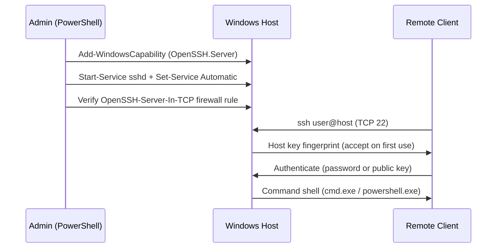

# OpenSSH Server on Windows

OpenSSH Server (`sshd`) is Microsoft's port of the OpenSSH suite, shipped as an optional Windows capability that gives Windows Server and Windows client hosts a native, encrypted SSH remote-management channel. It provides cross-platform remote administration — a Kali or Linux box can drive a Windows host with the same `ssh` tooling used everywhere else.

## Overview

OpenSSH is a Feature on Demand rather than a separately downloaded product: the **client** and **server** components are installed as Windows capabilities and the server runs as the `sshd` Windows service. Once running, it listens on **TCP 22**, authenticates users with passwords or public keys, and drops the caller into a command shell (`cmd.exe` by default, configurable to PowerShell). It sits alongside [Windows-Remote-Management(WinRM)](Windows-Remote-Management(WinRM).md) as one of the two remote-management entry points covered in this module; where WinRM speaks WS-Management over 5985/5986, OpenSSH speaks the standard SSH protocol and interoperates cleanly with non-Windows clients.

Because SSH is, by design, a way to run commands on the host, an enabled `sshd` is both an administrator's daily tool and an attacker's prize for lateral movement and persistence. See the [Windows-Service](Windows-Service.md) model for how `sshd` is managed as a service.

> [!NOTE]
> **Server 2025 ships it enabled-by-default-installed**
> Beginning with **Windows Server 2025**, OpenSSH is installed out of the box and can be toggled from Server Manager (**Local Server → Remote SSH Access**). On Windows Server 2019/2022 and Windows 10/11 it must be added as a capability first.

## How It Works

Setup is a short pipeline: confirm the capability is available, install the server, start and persist the service, ensure the firewall allows port 22, then connect. On modern builds the firewall rule (`OpenSSH-Server-In-TCP`) is created automatically by setup — you verify rather than create it.



## Installation

Run every step from an **elevated PowerShell** session (Run as Administrator).

### Step 1 — Check whether OpenSSH is available

```powershell
Get-WindowsCapability -Online | Where-Object Name -like 'OpenSSH*'
```

Example output when the server is not yet installed:

```text
Name  : OpenSSH.Client~~~~0.0.1.0
State : Installed

Name  : OpenSSH.Server~~~~0.0.1.0
State : NotPresent
```

| State | Meaning |
|-------|---------|
| Installed | The OpenSSH component is present. |
| NotPresent | The OpenSSH component is not installed. |

### Step 2 — Install the OpenSSH Server capability

```powershell
Add-WindowsCapability -Online -Name OpenSSH.Server~~~~0.0.1.0
```

A successful install returns `Online : True` and `RestartNeeded : False`.

### Step 3 — Verify the service exists

```powershell
Get-Service sshd
```

```text
Status   Name   DisplayName
------   ----   -----------
Stopped  sshd   OpenSSH SSH Server
```

## Configuration

### Start the service and persist it

```powershell
# Start now
Start-Service sshd

# Start automatically on boot
Set-Service -Name sshd -StartupType Automatic
```

Confirm it is running:

```powershell
Get-Service sshd
```

```text
Status   Name   DisplayName
------   ----   -----------
Running  sshd   OpenSSH SSH Server
```

### Firewall

Installing OpenSSH Server creates and enables the inbound rule `OpenSSH-Server-In-TCP` (allow TCP 22). Verify it, and only create it if missing:

```powershell
if (!(Get-NetFirewallRule -Name "OpenSSH-Server-In-TCP" -ErrorAction SilentlyContinue)) {
    New-NetFirewallRule -Name 'OpenSSH-Server-In-TCP' -DisplayName 'OpenSSH Server (sshd)' `
        -Enabled True -Direction Inbound -Protocol TCP -Action Allow -LocalPort 22
} else {
    Write-Output "Firewall rule 'OpenSSH-Server-In-TCP' already exists."
}
```

### Confirm the server is listening on port 22

```powershell
Get-NetTCPConnection -LocalPort 22
```

```text
netstat -ano | findstr :22
TCP    0.0.0.0:22      LISTENING
TCP    [::]:22         LISTENING
```

### Key files and the default shell

| Item | Path |
|------|------|
| Server config | `C:\ProgramData\ssh\sshd_config` |
| Host keys | `C:\ProgramData\ssh\` |
| Per-user keys | `C:\Users\<user>\.ssh\authorized_keys` |
| Admin keys | `C:\ProgramData\ssh\administrators_authorized_keys` |

> [!IMPORTANT]
> **Admin key auth uses a shared file, not the profile**
> For any account in the **Administrators** group, `sshd` reads authorized keys from `%ProgramData%\ssh\administrators_authorized_keys` — **not** the user's `~/.ssh/authorized_keys`. That file must be owned by `Administrators`/`SYSTEM` with no write access for other users, or key-based admin logins silently fail.

Windows OpenSSH opens `cmd.exe` by default. To land users in PowerShell instead, set the `DefaultShell` value under the OpenSSH registry key:

```powershell
New-ItemProperty -Path "HKLM:\SOFTWARE\OpenSSH" -Name DefaultShell `
    -Value "C:\Windows\System32\WindowsPowerShell\v1.0\powershell.exe" -PropertyType String -Force
```

### Connect

From the local host:

```powershell
ssh localhost
```

From another machine (Windows or Linux):

```bash
ssh username@<windows-ip-address>
# Example
ssh administrator@192.168.1.100
```

On the first connection you accept the server's host-key fingerprint, then authenticate; a successful login yields a Windows shell prompt such as `domain\username@SERVERNAME C:\Users\username>`.

## Security Considerations

> [!WARNING]
> **An enabled sshd is remote code execution by design**
> Anyone who can reach TCP 22 and authenticate can run arbitrary commands as that user. In offensive terms, OpenSSH on Windows is a clean **lateral movement** and **persistence** channel — a stolen password, a planted key in `administrators_authorized_keys`, or a weak service account all grant an interactive foothold that blends in with legitimate admin traffic.

- **Password auth is brute-forceable and phishable** — internet-exposed or flat-network `sshd` invites credential stuffing. Prefer public-key authentication and disable password auth in `sshd_config` (`PasswordAuthentication no`) where practical.
- **Planted authorized keys are stealthy persistence** — an attacker who writes to `administrators_authorized_keys` keeps access across password resets. Monitor that file's contents and ACLs.
- **Exposure = attack surface** — restrict inbound 22 to management subnets; do not expose `sshd` to untrusted networks. Compare with [Port-Forwarding](../Proxy-Server-Administration/Port-Forwarding.md), which is how an operator would tunnel to an otherwise-unreachable SSH service.
- **Shell = full command execution** — see Remote-Code-Execution-to-Reverse-shell for how SSH access is leveraged as a shell channel post-compromise.
- Log review: `sshd` events land in the `OpenSSH/Operational` event log, and authentication events also surface in the Security log — watch for repeated failed logins and unexpected key-based sessions.

## Best Practices

- **Prefer key-based authentication** and disable password logins in `sshd_config` once keys are deployed.
- **Restrict inbound TCP 22** to management/jump hosts with Windows Firewall; never expose `sshd` directly to the internet.
- **Lock down `administrators_authorized_keys`** — correct ownership (Administrators/SYSTEM) and no world-writable ACLs; audit its contents regularly.
- **Run and patch deliberately** — keep the OpenSSH capability updated, and disable/stop `sshd` on hosts that do not need it to shrink attack surface.
- **Log and alert** on OpenSSH/Operational and Security events for failed and unusual logins.

## Troubleshooting

| Symptom | Likely cause & fix |
|---------|--------------------|
| `Start-Service : Cannot find any service with service name 'sshd'` | OpenSSH Server capability not installed — run `Add-WindowsCapability -Online -Name OpenSSH.Server~~~~0.0.1.0`. |
| `Set-Service : Service sshd was not found` | Same cause — the `sshd` service is only created after the server capability is installed. |
| Connection refused / times out | Service stopped or firewall rule missing/disabled — check `Get-Service sshd` and `Get-NetFirewallRule -Name OpenSSH-Server-In-TCP`. |
| Key-based login as an admin fails | Keys must be in `%ProgramData%\ssh\administrators_authorized_keys` with correct ACLs, not the user's `~/.ssh`. |
| `Add-WindowsCapability` fails | Confirm build (Windows Server 2019+/Windows 10 1809+) with `winver` or `(Get-ComputerInfo).OsBuildNumber`. |

## References

- [Get started with OpenSSH Server for Windows (Microsoft Learn)](https://learn.microsoft.com/en-us/windows-server/administration/openssh/openssh_install_firstuse)
- [OpenSSH in Windows — overview (Microsoft Learn)](https://learn.microsoft.com/en-us/windows-server/administration/openssh/openssh_overview)
- [OpenSSH server configuration for Windows (Microsoft Learn)](https://learn.microsoft.com/en-us/windows-server/administration/openssh/openssh_server_configuration)
- [OpenSSH key management for Windows (Microsoft Learn)](https://learn.microsoft.com/en-us/windows-server/administration/openssh/openssh_keymanagement)

## Related

- [Enterprise Windows Infrastructure Security](../Readme.md) — course hub
- [Windows-Remote-Management(WinRM)](Windows-Remote-Management(WinRM).md) — the other remote-management channel in this module
- [Windows-Service](Windows-Service.md) — how `sshd` is managed as a Windows service
- [Windows-Server](Windows-Server.md) — the platform OpenSSH runs on
- [Port-Forwarding](../Proxy-Server-Administration/Port-Forwarding.md) — exposing/tunneling the SSH service remotely
- Remote-Code-Execution-to-Reverse-shell — SSH as a post-exploitation shell channel
