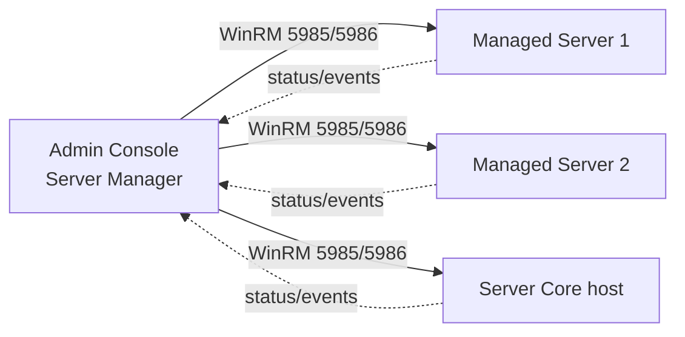

# Server Manager

**Server Manager** is the primary graphical management console shipped with Windows Server. It launches automatically at logon and lets an administrator install and configure server roles and features, monitor the health of local and remote servers, and drive most day-to-day administration from a single dashboard.

## Overview

Server Manager (`ServerManager.exe`) is the successor, on the server side, to the everyday-administration role that [Computer-Management-in-Windows-OS](Computer-Management-in-Windows-OS.md) fills on Windows generally. It was introduced in Windows Server 2008 and heavily rebuilt in Windows Server 2012 to manage **multiple servers at once** from one console. Rather than logging in to each box, an administrator adds servers to a **server pool** and manages them centrally — installing roles, reviewing events and service state, and launching role-specific tools.

The multi-server model is built on **[Windows-Remote-Management(WinRM)](Windows-Remote-Management(WinRM).md)** (WS-Management): Server Manager talks to each managed server over WinRM rather than legacy RPC. It is therefore the natural GUI companion to the [Windows-Server](Windows-Server.md) platform and the PowerShell `ServerManager` module. On **Server Core** and Nano-style installs there is no local Server Manager GUI, so those hosts are administered *remotely* from another server's Server Manager or via PowerShell. Microsoft positions **Windows Admin Center** as the modern browser-based successor, but Server Manager remains the default console on GUI installs.

## Components

Server Manager's navigation pane groups everything into a few standard pages:

- **Dashboard** — the landing page; "Welcome" tile with quick-start tasks (add roles, add servers, create server groups) plus per-role-group status tiles that turn red on manageability, event, service, or performance alerts.
- **Local Server** — properties of the machine you are sitting on: computer name, domain/workgroup, network config, Windows Update state, firewall status, Remote Desktop, and IE Enhanced Security Configuration.
- **All Servers** — every server in the pool, with events, services, and best-practices analyzer (BPA) results aggregated across them.
- **Role and feature pages** — one page per installed role (AD DS, DNS, DHCP, File and Storage Services, IIS, …), each surfacing that role's events, services, and management tools.

> [!NOTE]
> **It manages servers, not itself**
> Server Manager is a *console* over roles and features — the actual work is done by the roles (DNS Server, [AD DS](../Active-Directory-Domain-Services-AD-DS/Active-Directory-Domain-Services.md), etc.) and by WinRM on the remote hosts. Removing Server Manager's GUI does not remove those roles; they keep running and stay manageable by PowerShell.

## How It Works

Adding servers to the pool (**Manage > Add Servers**) supports Active Directory lookup, DNS name, or IP import. Once a server is in the pool, Server Manager polls it over WinRM for status and can install roles on it remotely.



Because remote management rides on WinRM, a target server must have WinRM enabled (it is on by default on modern Windows Server) and be reachable through the firewall, and the admin must hold sufficient rights on that target.

### Adding Roles and Features

The **Add Roles and Features Wizard** (**Manage > Add Roles and Features**) is the most common task. It walks through: installation type (role-based/feature-based vs. Remote Desktop Services), target server selection *from the pool*, roles, features, and confirmation. Selecting a role such as **Active Directory Domain Services** installs the binaries; a post-deployment task (for example, *Promote this server to a domain controller*) then finishes configuration — see [Active-Directory-Domain-Services](../Active-Directory-Domain-Services-AD-DS/Active-Directory-Domain-Services.md).

The same operations are scriptable through the `ServerManager` PowerShell module, which is the only option on Server Core and the better choice for repeatable builds:

```powershell
# List available/installed roles and features
Get-WindowsFeature

# Install a role (with its management tools) on the local server
Install-WindowsFeature -Name AD-Domain-Services -IncludeManagementTools

# Install a role on a remote server in the pool
Install-WindowsFeature -Name DNS -ComputerName SRV02 -IncludeManagementTools

# Remove a feature
Uninstall-WindowsFeature -Name Web-Server
```

## Configuration

Server Manager opens automatically for members of the Administrators group at each logon. To stop that (useful on an interactive-heavy admin box), use **Manage > Server Manager Properties** and tick *Do not start Server Manager automatically at logon*, which sets the per-user value:

```text
HKEY_CURRENT_USER\Software\Microsoft\ServerManager\DoNotOpenServerManagerAtLogon = 1   # untested
```

Machine-wide, the auto-start can also be controlled by Group Policy under *Computer/User Configuration > Administrative Templates > System > Server Manager*.

> [!TIP]
> **Manage down-level and Core servers from one GUI**
> Point a single GUI Windows Server (or a Windows client with the **Remote Server Administration Tools (RSAT)** installed) at your Server Core and headless hosts. You get a dashboard over the whole fleet without installing a GUI on the servers you are protecting.

## Security Considerations

Server Manager concentrates high-value capability — installing roles, changing services, and managing a pool of remote servers — into one console, and it does so over WinRM. That makes both the console and its transport security-relevant.

> [!WARNING]
> **A pool console is a lateral-movement multiplier**
> - **WinRM is remote code execution.** Server Manager manages remote servers over WinRM (5985/5986), the same channel attackers abuse for lateral movement. An admin workstation with a populated server pool is a high-value target: compromising it can hand an attacker managed access to every server in the pool. See [Windows-Remote-Management(WinRM)](Windows-Remote-Management(WinRM).md).
> - **Role installation expands attack surface.** Each role added (IIS, DNS, DHCP, WSUS, print) opens new services and ports. Only install what a server actually needs.
> - **Credentials in transit and at rest.** Remote management uses the operator's credentials; scope those credentials and prefer Kerberos/HTTPS (5986 with a valid cert) over plain HTTP.
> - **Server Core reduces this surface.** Running roles on Server Core (managed remotely) removes the local GUI and shrinks both the patch and attack footprint versus a full desktop experience.

## Best Practices

- Prefer **Server Core** for infrastructure roles and manage them *remotely* from a single Server Manager or RSAT console rather than installing a GUI on each server.
- Install only the roles and features a server needs; audit the pool periodically with `Get-WindowsFeature` and remove unused roles.
- Restrict and harden the WinRM channel Server Manager rides on — scope it to management subnets, require strong auth, and prefer HTTPS (5986).
- Keep membership of local/domain **Administrators** tight, since only administrators can meaningfully use Server Manager or add servers to a pool.
- Script repeatable role deployments with the `ServerManager` PowerShell module so builds are auditable and reproducible.

## Troubleshooting

| Symptom | Likely cause & fix |
| --- | --- |
| Added server shows a **manageability error** (e.g. "WinRM negotiation") | WinRM not reachable/enabled on the target, or firewall blocking 5985/5986 — run `winrm quickconfig` on the target and open the management ports |
| Server Manager is **slow to refresh** the pool | It is polling many servers over WinRM; unreachable/offline hosts stall refresh — remove dead entries or adjust the refresh interval |
| **No Server Manager** on the host | Running **Server Core** (no GUI) — manage it remotely or use the `ServerManager` PowerShell module locally |
| Cannot manage a **down-level** server | Missing WMF/.NET prerequisites for remote management on the older OS — install the required Windows Management Framework version |

## References

- Microsoft Learn — Server Manager: https://learn.microsoft.com/en-us/windows-server/administration/server-manager/server-manager
- Microsoft Learn — Configure Remote Management in Server Manager: https://learn.microsoft.com/en-us/windows-server/administration/server-manager/configure-remote-management-in-server-manager
- Microsoft Learn — Install or Uninstall Roles, Role Services, or Features: https://learn.microsoft.com/en-us/windows-server/administration/server-manager/install-or-uninstall-roles-role-services-or-features

## Related

- [Enterprise Windows Infrastructure Security](../Readme.md) — course hub
- [Windows-Server](Windows-Server.md) — the platform Server Manager administers
- [Windows-Server-Editions](Windows-Server-Editions.md) — editions that ship the console
- [Computer-Management-in-Windows-OS](Computer-Management-in-Windows-OS.md) — the general-purpose host console alongside it
- [Windows-Service](Windows-Service.md) — service state surfaced on the role and All Servers pages
- [Windows-Remote-Management(WinRM)](Windows-Remote-Management(WinRM).md) — the transport behind multi-server management
- [OpenSSH-Server-on-Windows](OpenSSH-Server-on-Windows.md) — alternative remote-management channel
- [Active-Directory-Domain-Services](../Active-Directory-Domain-Services-AD-DS/Active-Directory-Domain-Services.md) — a role installed and promoted from Server Manager
