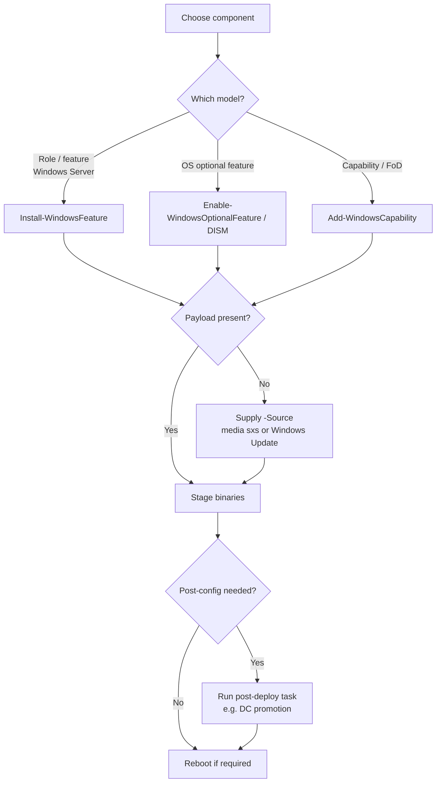

# Windows Features and Roles

**Roles** and **features** are the modular building blocks of a Windows Server installation. A *role* defines the primary function a server performs (domain controller, web server, DNS), while a *feature* is an optional component that supports or enhances a role or the OS itself. This note covers how to add, remove, and audit them across the GUI, PowerShell, and DISM.

## Overview

Windows Server uses a **role-based installation** model: the base OS ships lean, and you turn on only the components a workload needs. This keeps the patch and attack surface small — a design point covered on [Windows-Server](Windows-Server.md). The catalog of individual roles and features (AD DS, IIS, DNS, DHCP, Failover Clustering, RSAT, and so on) is enumerated on that note; this note focuses on the **mechanics of managing them**: the tools, the install/uninstall lifecycle, and the offensive/defensive angle.

Three interfaces do the same job. [Server-Manager](Server-Manager.md) hosts the **Add Roles and Features Wizard** (the GUI). The `ServerManager` PowerShell module (`Install-WindowsFeature`) is the scriptable, remoteable path and the only option on Server Core. **DISM** and its PowerShell wrappers service optional features and capabilities, and can operate on an **offline** (mounted) image as well as the running OS.

## Concepts — Roles vs Features vs Capabilities

Windows uses several overlapping component models. Knowing which one a component belongs to tells you which tool installs it.

| Component type | What it is | Primary tool |
|---|---|---|
| **Role** | Primary server function (AD DS, IIS, DNS, DHCP) | `Install-WindowsFeature`, Server Manager |
| **Role service** | Sub-component of a role (e.g. IIS *Web-Ftp-Server*) | `Install-WindowsFeature`, Server Manager |
| **Feature** | Optional supporting component (.NET, Failover Clustering, RSAT) | `Install-WindowsFeature`, Server Manager |
| **Optional feature** | OS optional feature, servicable on client and server (NetFx3, SMB1) | `Enable-WindowsOptionalFeature` / DISM |
| **Capability (FoD)** | Features on Demand payload pulled on install (RSAT tools, OpenSSH) | `Add-WindowsCapability` |

> [!NOTE]
> **Same word, different scope**
> On Windows **Server**, `Get-WindowsFeature` (the `ServerManager` module) enumerates roles, role services, and features together. On **client** Windows that module does not exist — you use `Get-WindowsOptionalFeature` (DISM) instead. Reaching for `Get-WindowsFeature` on Windows 10/11 is a common source of "term is not recognized" errors.

## How It Works

Installing a role is not a single atomic act. The wizard (or cmdlet) selects the component, verifies the **binary payload** is present, stages the files, and — for roles that need it — leaves a **post-deployment configuration** task. AD DS, for example, installs its binaries first and is only functional after you *promote* the server to a domain controller (see [Active-Directory-Domain-Services](../Active-Directory-Domain-Services-AD-DS/Active-Directory-Domain-Services.md)). Some changes require a **reboot** to finalize.

Payload availability matters. To shrink the disk image, Windows can ship a role's files in a **disabled-with-payload-removed** state (Features on Demand). Enabling it then requires a **source** — Windows Update, or the `sxs` folder on the install media.



## Configuration

### GUI — Server Manager

1. Open **Server Manager** → **Manage** → **Add Roles and Features**.
2. Choose **Role-based or feature-based installation**.
3. Select the target server *from the server pool*.
4. Tick the desired **Roles** and **Features**, then **Install**.

Removal is the mirror task: **Manage** → **Remove Roles and Features**. See [Server-Manager](Server-Manager.md) for the multi-server pool model this wizard runs on.

### PowerShell — the `ServerManager` module (Windows Server)

This is the scriptable, repeatable path and works against remote servers in the pool.

```powershell
# List all roles/features and their install state
Get-WindowsFeature | Format-Table -AutoSize

# Install a role WITH its management tools (RSAT snap-ins / cmdlets)
Install-WindowsFeature -Name AD-Domain-Services -IncludeManagementTools

# Install on a remote server, rebooting if required
Install-WindowsFeature -Name Web-Server -ComputerName SRV02 -IncludeManagementTools -Restart

# Install when the payload was removed (Features on Demand) — point at install media
Install-WindowsFeature -Name NET-Framework-Core -Source "D:\sources\sxs"

# Uninstall a feature (add -Remove to also delete the binary payload from disk)
Uninstall-WindowsFeature -Name Web-Server -Remove
```

> [!IMPORTANT]
> **`-IncludeManagementTools` is easy to forget**
> `Install-WindowsFeature` installs only the role binaries by default. Without `-IncludeManagementTools` you get the running role but none of its consoles or cmdlets — you then have to manage it entirely from another host. Add the switch when you intend to administer the role locally.

### DISM — optional features and offline images

DISM (Deployment Image Servicing and Management) services **optional features** and works on both the running OS (`/Online`) and a mounted offline image. Its PowerShell equivalents are `Get-/Enable-/Disable-WindowsOptionalFeature`.

```cmd
:: List optional features and their state
DISM /Online /Get-Features /Format:Table

:: Enable an optional feature and all of its parents
DISM /Online /Enable-Feature /FeatureName:NetFx3 /All /Source:D:\sources\sxs

:: Disable an optional feature
DISM /Online /Disable-Feature /FeatureName:SMB1Protocol
```

```powershell
# PowerShell (DISM) equivalents — also work on client Windows
Get-WindowsOptionalFeature -Online | Where-Object State -eq 'Enabled'
Enable-WindowsOptionalFeature -Online -FeatureName NetFx3 -All -Source D:\sources\sxs
```

### Capabilities — Features on Demand (RSAT, OpenSSH)

Capabilities are pulled from Windows Update (or a local FoD repository) on install.

```powershell
# List available capabilities (e.g. RSAT, OpenSSH)
Get-WindowsCapability -Online | Where-Object Name -like 'Rsat*'

# Install a capability
Add-WindowsCapability -Online -Name OpenSSH.Server~~~~0.0.1.0   # untested

# Remove it
Remove-WindowsCapability -Online -Name OpenSSH.Server~~~~0.0.1.0   # untested
```

> [!TIP]
> **Prefer offline servicing for golden images**
> When building a base image, enable roles/features against the **mounted WIM** (`DISM /Image:C:\mount ...`) rather than a live host. The image ships ready-to-run, avoids per-server reboots, and gives you a reproducible, auditable build.

## Security Considerations

Every enabled role or feature is code that runs, ports that open, and a component that must be patched. The set of installed roles is effectively a map of a server's attack surface, and enumerating it (`Get-WindowsFeature`) is a standard early post-exploitation step.

> [!WARNING]
> **Installed roles are attack surface**
> - **Minimize footprint.** A **Web Server (IIS)** exposes web attack surface; **Remote Desktop Services** exposes RDP (TCP 3389); **Print and Document Services** enables the Print Spooler (target of critical RCE such as *PrintNightmare*, CVE-2021-34527). Install nothing a workload does not require.
> - **Legacy features are liabilities.** Do not enable **SMB1Protocol** or the **Telnet Client**; remove them where present.
> - **Attackers add roles too.** Installing or re-enabling a role/feature is a persistence and lateral-movement technique (e.g. turning on WSUS, RDS, or [OpenSSH-Server-on-Windows](OpenSSH-Server-on-Windows.md)). Monitor for unexpected role/feature and [service](Windows-Service.md) changes.
> - **Payload removal is defense in depth.** `Uninstall-WindowsFeature -Remove` deletes the binaries from disk, so a removed role cannot simply be re-enabled without a source.

## Best Practices

- Install only what a workload needs; prefer **Server Core** and manage roles remotely from one console.
- Script role deployment with the `ServerManager` module so builds are reproducible and auditable — avoid ad-hoc GUI clicks in production.
- Use `-IncludeManagementTools` when you will administer a role locally; omit it on headless hosts managed from elsewhere.
- Periodically audit the fleet with `Get-WindowsFeature` (or `Get-WindowsOptionalFeature`) and remove unused roles, using `-Remove` to strip payload.
- Keep an FoD/source path (media `sxs` or WSUS/Windows Update) reachable so installs do not fail on missing payload.

## Troubleshooting

| Symptom | Likely cause & fix |
|---|---|
| Install fails: "source files could not be found" (error `0x800f081f`) | Payload removed (Features on Demand). Supply `-Source` (media `sxs`) or allow Windows Update access. |
| `Get-WindowsFeature` not recognized | Running **client** Windows — the `ServerManager` module is Server-only. Use `Get-WindowsOptionalFeature` / `Get-WindowsCapability`. |
| Role installed but not working | Post-deployment configuration or reboot pending — run the post-deploy task (e.g. DC promotion) or reboot. |
| Feature keeps coming back after removal | Payload still on disk — re-run uninstall with `-Remove`, or a Group Policy / config-management tool is re-adding it. |
| Cannot install on a remote server | WinRM unreachable or insufficient rights on the target — see [Windows-Remote-Management(WinRM)](Windows-Remote-Management(WinRM).md) and [Server-Manager](Server-Manager.md). |

## References

- [Install or Uninstall Roles, Role Services, or Features (Microsoft Learn)](https://learn.microsoft.com/en-us/windows-server/administration/server-manager/install-or-uninstall-roles-role-services-or-features)
- [Install-WindowsFeature (PowerShell reference)](https://learn.microsoft.com/en-us/powershell/module/servermanager/install-windowsfeature)
- [Enable or Disable Windows Features using DISM](https://learn.microsoft.com/en-us/windows-hardware/manufacture/desktop/enable-or-disable-windows-features-using-dism)
- [Features on Demand (Microsoft Learn)](https://learn.microsoft.com/en-us/windows-hardware/manufacture/desktop/features-on-demand-v2--capabilities)

## Related

- [Enterprise Windows Infrastructure Security](../Readme.md) — course hub
- [Windows-Server](Windows-Server.md) — the platform and the full roles/features catalog
- [Server-Manager](Server-Manager.md) — the GUI console that hosts the Add Roles and Features Wizard
- [Windows-Server-Editions](Windows-Server-Editions.md) — editions that determine which roles are available
- [Windows-Service](Windows-Service.md) — services the installed roles run as
- [Computer-Management-in-Windows-OS](Computer-Management-in-Windows-OS.md) — general-purpose host administration console
- [Windows-Remote-Management(WinRM)](Windows-Remote-Management(WinRM).md) — transport for remote role installation
- [Active-Directory-Domain-Services](../Active-Directory-Domain-Services-AD-DS/Active-Directory-Domain-Services.md) — a role that requires post-install promotion
