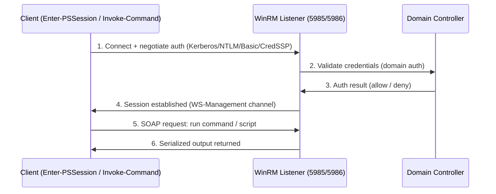

# Windows Remote Management (WinRM)

Windows Remote Management (WinRM) is Microsoft's implementation of the WS-Management protocol, a SOAP-based standard for remote management. It lets administrators remotely execute commands, run scripts, and collect system information over the network using HTTP or HTTPS, and it is the transport that underpins PowerShell Remoting.

## Overview

WinRM exposes a management endpoint over which authenticated clients issue WS-Management (SOAP) requests. In practice it fills the same role on Windows that SSH fills on Linux: a remote command-and-control channel for administration at scale. It is the engine behind PowerShell Remoting (`Enter-PSSession`, `Invoke-Command`) and is relied on by automation platforms such as Ansible, SCCM, and Chef.

Because WinRM authenticates against Windows credentials, it integrates with domain authentication — [Kerberos](../Active-Directory-Domain-Services-AD-DS/Kerberos-Authentication.md) in a domain, falling back to [NTLM](../Active-Directory-Domain-Services-AD-DS/NTLM.md) where Kerberos is unavailable. It sits alongside [OpenSSH-Server-on-Windows](OpenSSH-Server-on-Windows.md) as the two primary remote-management channels for Windows Server.

> [!NOTE]
> **WinRM vs. WS-Management vs. PowerShell Remoting**
> **WS-Management** is the open SOAP standard. **WinRM** is Microsoft's service that implements it. **PowerShell Remoting** is a consumer that rides on top of WinRM — so enabling PowerShell Remoting configures WinRM underneath.

## How It Works

- **Protocol** — SOAP (Simple Object Access Protocol) messages carried over HTTP or HTTPS.
- **Default ports**:
  - **5985** — HTTP (the payload is still authenticated and, for Kerberos/NTLM, message-encrypted, but the transport is not TLS).
  - **5986** — HTTPS (transport encrypted with TLS).
- **Listeners** — WinRM binds one or more listeners (HTTP and/or HTTPS) that accept incoming management requests.
- **Service** — the `WinRM` Windows service must be running and set to start automatically.



## Configuration

WinRM is not always enabled by default. The quickest way to bring it up is:

```powershell
winrm quickconfig
```

This command:

- Starts the WinRM service.
- Sets the service to start automatically.
- Creates a listener on HTTP (port 5985).
- Configures the required firewall exceptions.

For encrypted transport, create an HTTPS listener bound to a server certificate:

```powershell
winrm create winrm/config/Listener?Address=*+Transport=HTTPS @{Hostname="server.example.com";CertificateThumbprint="<CertThumbprint>"}
```

## Authentication Methods

| Method | When used | Notes |
|--------|-----------|-------|
| **Kerberos** | Default in domain environments | Mutual authentication; no password sent over the wire |
| **NTLM** | When Kerberos is unavailable (IP-based, workgroup) | Legacy; see [NTLM](../Active-Directory-Domain-Services-AD-DS/NTLM.md) for the associated risks |
| **Basic** | HTTPS only | Sends username/password — never enable over plain HTTP |
| **CredSSP** | Credential delegation (double-hop scenarios) | Delegates the user's credentials to the remote host; expands exposure if that host is compromised |

## Useful Commands

Check the configured listeners:

```powershell
winrm enumerate winrm/config/listener
```

Restart the service after configuration changes:

```powershell
Restart-Service WinRM
```

Open an interactive remote session (PowerShell Remoting):

```powershell
Enter-PSSession -ComputerName server -Credential user
```

## Common Use Cases

- **PowerShell Remoting** — interactive sessions (`Enter-PSSession`) and fan-out execution (`Invoke-Command`) across many hosts.
- **Automation tooling** — Ansible Windows modules, SCCM, and Chef drive Windows hosts over WinRM.
- **Centralized administration** — managing configuration, services, and inventory across a fleet of Windows servers from one console.

## Security Considerations

> [!WARNING]
> **Remote management is remote code execution**
> WinRM exists to run commands on the server. Anyone who can reach a listener **and** authenticate to it effectively owns the host. This makes WinRM (5985/5986) a prime **lateral-movement** vector in Windows engagements — tools like `evil-winrm` and `crackmapexec` turn a single valid credential or captured hash into an interactive shell.

- Prefer **HTTPS (5986)** with a valid certificate over plain HTTP (5985); avoid **Basic** auth entirely except over TLS.
- Restrict WinRM to management subnets with **firewall rules**, and control who may connect using local/group policy.
- **CredSSP** delegates credentials to the remote host — enable it only when a double-hop genuinely requires it, since a compromised target then holds usable credentials.
- Because WinRM can fall back to [NTLM](../Active-Directory-Domain-Services-AD-DS/NTLM.md), the usual NTLM weaknesses (pass-the-hash, relay) apply; prefer Kerberos and enforce signing where possible.
- See WinRM-Enumeration for how the service is discovered and auth-tested, and Remote-Code-Execution-to-Reverse-shell for how a foothold is turned into a shell.

## Best Practices

- Enable HTTPS listeners on port 5986 with valid certificates; disable or firewall off plain HTTP where feasible.
- Require strong authentication (Kerberos in-domain) and disable Basic auth unless it is strictly needed over TLS.
- Scope access with firewall rules to dedicated management subnets or jump hosts.
- Reserve CredSSP for confirmed double-hop needs, not as a default.
- Audit and monitor WinRM connections and configuration changes for anomalous remote sessions.

## Troubleshooting

| Symptom | Likely cause & fix |
|---------|--------------------|
| `Enter-PSSession` / `Invoke-Command` fails to connect | WinRM service stopped or no listener — run `winrm quickconfig` and verify with `winrm enumerate winrm/config/listener` |
| Connection refused or times out | Firewall blocking 5985/5986 — allow the port on the management subnet |
| HTTPS listener fails to start | Missing or wrong certificate thumbprint — confirm the cert exists and re-create the listener |
| Auth fails from a non-domain or IP-addressed client | Kerberos unavailable — falls back to NTLM; the client may need the host added to `TrustedHosts` |
| Config changes not taking effect | Restart the service: `Restart-Service WinRM` |

## References

- [Windows Remote Management (WinRM) — Microsoft Learn](https://learn.microsoft.com/en-us/windows/win32/winrm/portal)
- [Installation and Configuration for Windows Remote Management](https://learn.microsoft.com/en-us/windows/win32/winrm/installation-and-configuration-for-windows-remote-management)
- [about_Remote — PowerShell Remoting](https://learn.microsoft.com/en-us/powershell/module/microsoft.powershell.core/about/about_remote)

## Related

- [Enterprise Windows Infrastructure Security](../Readme.md) — course hub
- [OpenSSH-Server-on-Windows](OpenSSH-Server-on-Windows.md) — alternative remote-access channel
- [PowerShell-User-Group-Management](../Windows-Operating-System-Administration/PowerShell-User-Group-Management.md) — WinRM drives PowerShell Remoting
- [Windows-Service](Windows-Service.md) — the service model WinRM runs under
- [Kerberos-Authentication](../Active-Directory-Domain-Services-AD-DS/Kerberos-Authentication.md) — default WinRM authentication in a domain
- [NTLM](../Active-Directory-Domain-Services-AD-DS/NTLM.md) — legacy fallback authentication and its risks
- Remote-Code-Execution-to-Reverse-shell — turning WinRM access into a shell
- WinRM-Enumeration — discovering and auth-testing the WinRM service
