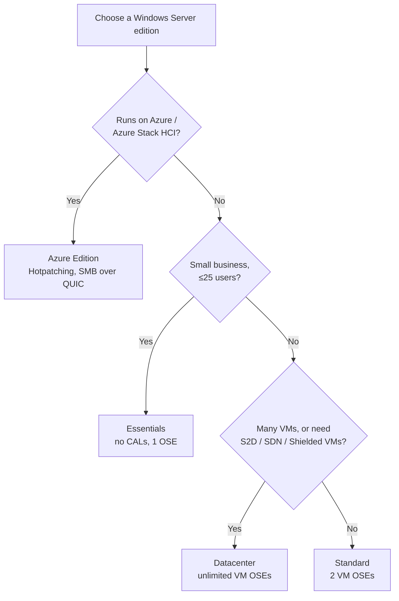

# Windows Server Editions Comparison

This note outlines the key differences between the most commonly used editions of **Windows Server** — Standard, Datacenter, Essentials, Azure Edition, and the legacy Nano Server — to help choose the right edition for a workload.

## Overview

Windows Server ships in several editions that share the same core OS but differ in virtualization rights, licensing model, feature set, and cost. Choosing an edition is primarily a decision about **virtualization density**, **advanced datacenter features**, and **licensing budget**. The edition sits underneath everything else in this module — the same [Windows-Server](Windows-Server.md) binaries host roles such as [Active-Directory-Domain-Services](../Active-Directory-Domain-Services-AD-DS/Active-Directory-Domain-Services.md), and the edition (together with [Server-Hardware](Server-Hardware.md) sizing and the chosen installation option) sets the ceiling on what a host can legally and technically run.

An important distinction: **edition** (Standard / Datacenter / Essentials / Azure) governs licensing and feature entitlements, while the **installation option** (Server Core vs. Desktop Experience) governs how much of the OS footprint is installed. They are chosen independently.

## Editions

### Windows Server Editions Comparison Table

| Edition                   | Best For                          | Virtualization | Licensing Model | Key Features                                                                 | Limitations                            |
|---------------------------|------------------------------------|----------------|------------------|------------------------------------------------------------------------------|----------------------------------------|
| **Datacenter**            | Large-scale & highly virtualized   | Unlimited VMs  | Core-based        | Shielded VMs, Storage Spaces Direct, SDN, Hyper-V, Hotpatching (Azure only) | Higher cost, requires Software Assurance|
| **Standard**              | Small to medium-sized businesses   | 2 VMs          | Core-based        | File/print services, basic Hyper-V, Active Directory, Windows Admin Center  | No advanced virtualization or SDN      |
| **Essentials**            | Small businesses (≤25 users)       | 1 physical/VM  | Server license     | Simple setup, user limit of 25 users/50 devices, no CALs required            | Limited users/devices, no AD Trusts    |
| **Azure Edition**         | Hybrid/cloud-first environments    | Unlimited VMs  | Azure subscription | Hotpatching, SMB over QUIC, Azure Arc integration                            | Runs only on Azure Stack HCI or Azure  |
| **Nano Server** *(legacy)*| Containers, cloud-native setups    | Container only | N/A               | Extremely lightweight, remote-only management                                | No local login, deprecated in newer versions |

### Feature Highlights

| Feature                           | Standard | Datacenter | Essentials | Azure Edition |
|-----------------------------------|----------|------------|------------|----------------|
| Hyper-V Virtualization            | ✓        | ✓          | △ Basic    | ✓              |
| Shielded Virtual Machines         | ✗        | ✓          | ✗          | ✓              |
| Storage Spaces Direct             | ✗        | ✓          | ✗          | ✓              |
| Software-Defined Networking (SDN) | ✗        | ✓          | ✗          | ✓              |
| Active Directory Domain Services  | ✓        | ✓          | ✓          | ✓              |
| Windows Admin Center              | ✓        | ✓          | ✓          | ✓              |
| Hotpatching                       | ✗        | △ (Azure)  | ✗          | ✓              |

> [!NOTE]
> Legend:
> △ = Very limited or restricted use
> ✓ = Supported
> ✗ = Not Supported

> [!IMPORTANT]
> The Feature Highlights symbols were reconstructed to match the documented Microsoft support matrix, verify against [Compare Windows Server Editions](https://learn.microsoft.com/en-us/windows-server/get-started/editions-comparison) for the exact release you are licensing.

## Licensing

### Licensing Notes

- **CALs (Client Access Licenses)** are required for Standard and Datacenter, **not required** for Essentials.
- **Server Core** is not a separate edition, but an **installation option** for Standard and Datacenter.
- **Nano Server** is deprecated for use outside of containers.
- Standard and Datacenter are licensed **per physical core** (minimum 16 cores per server, 8 cores per processor); Datacenter unlocks unlimited virtual OSEs on the licensed host, whereas Standard grants **2 virtual OSEs** per fully-licensed host.

### Sample Prices

|Edition / License Type|Details|Approx Price in India|
|---|---|---|
|**Windows Server 2022 Datacenter (2-core license)**|Retail reseller quote|~ **₹61,716** ([TradeIndia](https://www.tradeindia.com/products/windows-server-2022-datacenter-2-core-c8902058.html?utm_source=chatgpt.com "Windows Server 2022 Datacenter - 2 Core at 61716.00 INR in New Delhi \| Nkg Solution"))|
|**Windows Server 2022 Standard (16-core + 10 CALs)**|License + CALs|~ **₹1,42,735** incl. GST ([Microsoft](https://www.microsoft.com/en-IN/p/windows-server-2022-standard-cal/dg7gmgf0d6m5?utm_source=chatgpt.com "Windows Server 2022 Standard CAL"))|
|**Windows Server 2022 Standard (16-core) via HPE ROK**|OEM / Reseller Option Kit|~ **₹1,04,145** (ex-GST) ([ServerSupply India](https://serversupply.in/product/hpe-microsoft-windows-server-2022-standard-rok-16-core-p46171-371/?utm_source=chatgpt.com "HPE Microsoft Windows Server 2022 NEW Standard ROK 16 Core - P46171-371 - Server Supply India Pvt Ltd"))|
|**Windows Server 2025 Datacenter (24-core)**|Newer edition, larger core count|~ **₹12,34,190** incl. GST/import duties ([Tanotis](https://www.tanotis.com/products/microsoft-windows-server-datacenter-2025-24-core?utm_source=chatgpt.com "Buy in India Microsoft Windows Server Datacenter 2025 (24-Core) – Tanotis"))|

## Choosing an Edition

The decision usually collapses to a few questions about scale, virtualization, and where the workload runs:

> [!TIP]
> **Standard vs. Datacenter is a density question**
> Both editions share almost the same feature set for a physical role; the split is about **virtualization density** (2 VM OSEs on Standard vs. unlimited on Datacenter) and the software-defined datacenter features (Storage Spaces Direct, SDN, Shielded VMs). Buy Standard and re-license to Datacenter only once VM count or those features justify it.

## Security Considerations

> [!WARNING]
> **Edition and install option shape the attack surface**
> The **installation option** you pick has direct security consequences. **Server Core** (available for Standard and Datacenter) omits the GUI shell, Internet Explorer/Edge, and much of the graphical stack — that means fewer components to patch and a smaller attack surface than Desktop Experience. Choosing Desktop Experience "for convenience" on an internet-facing or domain-controller role needlessly widens what an attacker can reach.

- **Server Core reduces exposure** — fewer binaries and services translate to fewer CVEs to patch and fewer local privilege-escalation primitives (an attacker on a Core box has no `explorer.exe`/browser to abuse).
- **Datacenter-only defenses** — Shielded VMs and the Host Guardian Service protect guest VMs from a compromised or malicious fabric admin; these are unavailable on Standard, so highly-sensitive guests belong on a Datacenter host.
- **Azure Edition hotpatching** applies many security updates without a reboot, shrinking the window where a host runs unpatched — reboots are when patches actually take effect elsewhere.
- **Nano Server is deprecated** for general server use; a host running it outside a supported container scenario is likely unmanaged and unpatched — a classic stale-host finding.
- **Edition/build is fingerprintable** — an attacker enumerating a host (SMB, RDP banners, `systeminfo`, SMBv1 exposure) can infer edition and build to map which vulnerabilities apply, so consistent patching across editions matters more than the edition choice itself.

## Best Practices

> [!TIP]
> - Pick **Standard** for physical/lightly-virtualized workloads (up to 2 VM OSEs per license); pick **Datacenter** once you run many VMs on a host or need Storage Spaces Direct / SDN / Shielded VMs.
> - Use **Server Core** rather than Desktop Experience where possible, smaller footprint, fewer patches, smaller attack surface.
> - License by physical cores (minimum 16 cores per server, 8 per processor) and add CALs for Standard/Datacenter.
> - Reserve **Essentials** for genuinely small environments (≤25 users) and avoid it where you need AD trusts or plan to grow past its device limits.
> - Verify feature entitlements against the current Microsoft comparison matrix for the exact release before purchasing — features move between editions across versions.

## Troubleshooting

| Symptom | Likely cause & fix |
| --- | --- |
| Extra Hyper-V guests won't activate / show as non-genuine | Ran past the licensed VM OSE count (2 on Standard) — add Standard licenses to the host or move to Datacenter |
| Shielded VMs / Storage Spaces Direct / SDN options unavailable | Feature is Datacenter-only — host is running Standard/Essentials; upgrade the edition |
| Essentials refuses new users past a limit | Hard cap of 25 users / 50 devices, and no AD trusts — the environment has outgrown Essentials; move to Standard |
| Hotpatching not offered | Only available on Azure Edition (and Datacenter Azure scenarios) — not present on on-prem Standard/Datacenter |
| Can't RDP to a GUI on a new server | Host was installed as **Server Core** (no Desktop Experience) — manage it remotely via WinRM/[Windows-Service](Windows-Service.md) tooling or reinstall with Desktop Experience |

## References

- [Compare Windows Server Editions – Microsoft Learn](https://learn.microsoft.com/en-us/windows-server/get-started/editions-comparison)
- [Windows Server licensing overview – Microsoft](https://www.microsoft.com/en-us/windows-server/pricing)
- [Server Core vs. Desktop Experience installation options – Microsoft Learn](https://learn.microsoft.com/en-us/windows-server/get-started/install-options-server-core-desktop-experience)
- [Windows Server Documentation](https://learn.microsoft.com/en-us/windows-server/)

## Related
- [Enterprise Windows Infrastructure Security](../Readme.md) — course hub and map of content
- [Windows-Server](Windows-Server.md) — parent topic for the server OS — related note
- [Server-Hardware](Server-Hardware.md) — sizing cores/RAM for the chosen edition — related note
- [Windows-Operating-System-Editions](../Fundamental-Of-Operating-System/Windows-Operating-System-Editions.md) — client-side counterpart — related note
- [Windows-Evaluation-Center](../Lab-Setup-and-Virtualization/Windows-Evaluation-Center.md) — where server trials are obtained — related note
- [Active-Directory-Domain-Services](../Active-Directory-Domain-Services-AD-DS/Active-Directory-Domain-Services.md) — a primary role every edition can host — related note
