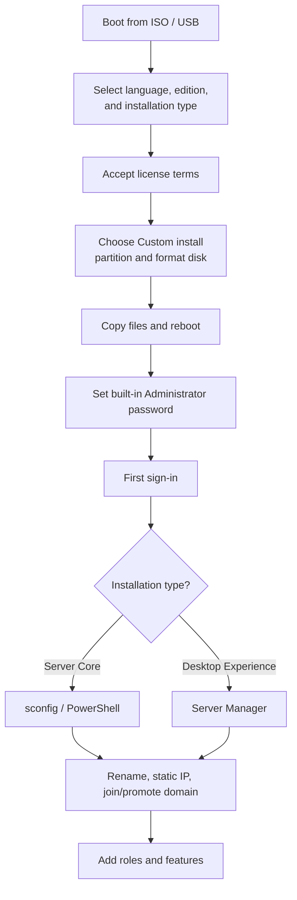

# Windows Server Installation

Windows Server Installation is the process of provisioning the Windows Server operating system onto physical or virtual hardware — choosing an edition and installation type, laying out disks, and completing initial configuration before any roles are added. It is the first step in standing up every infrastructure service in this course.

## Overview

Installation is where the two decisions that shape a server's whole lifecycle are made: which **edition** to license (see [Windows-Server-Editions](Windows-Server-Editions.md)) and which **installation type** to deploy — **Server Core** (no desktop GUI) or **Desktop Experience** (full GUI). Both flow from the same setup media but produce very different management surfaces. Hardware sizing (see [Server-Hardware](Server-Hardware.md)) must be settled first, because Setup only checks minimums.

Once the base OS is installed, roles such as [Active-Directory-Domain-Services](../Active-Directory-Domain-Services-AD-DS/Active-Directory-Domain-Services.md), DNS, and IIS are added later through [Server-Manager](Server-Manager.md) or PowerShell — Windows Server follows a **role-based installation** model (see [Windows-Server](Windows-Server.md)) where the base image stays lean and you add only what a workload needs.

## Installation Types

Windows Server Setup offers two installation options for most editions:

| Type | Description | When to use |
|------|-------------|-------------|
| **Server Core** | No desktop GUI; managed via command line, [Windows-Remote-Management(WinRM)](Windows-Remote-Management(WinRM).md), and remote tools (RSAT / Windows Admin Center). Smaller footprint, fewer patches, smaller attack surface. | Default for infrastructure roles (AD DS, DNS, DHCP, Hyper-V). |
| **Desktop Experience** | Full graphical shell, [Server-Manager](Server-Manager.md), MMC consoles, and local browser. Easier for hands-on administration. | When a GUI or a GUI-dependent application is required. |

> [!TIP]
> **Server Core is not reversible**
> On modern Windows Server you cannot convert between Server Core and Desktop Experience after installation — the choice is made once, at install time. Pick deliberately, and lean toward Server Core to shrink the attack surface where no local GUI is needed.

## Installation Methods

- **Interactive (attended)** — boot from ISO/USB and step through the Windows Setup wizard. Fine for one-off or lab builds.
- **Unattended (answer file)** — supply an `autounattend.xml` answer file so Setup runs with no prompts. Built with the Windows System Image Manager (part of the Windows ADK).
- **Image-based deployment** — capture a generalized reference image (after `sysprep`) and deploy it at scale with **Windows Deployment Services (WDS)**, **MDT**, or **Configuration Manager**.
- **Cloud / virtual** — deploy from a marketplace image or template in Azure, VMware, or Hyper-V; the OS is preinstalled and you complete first-boot configuration only.

## How It Works

The following diagram shows the high-level flow of an interactive installation from media to a manageable server.



### Requirements (minimums)

Setup enforces only baseline minimums; production sizing should exceed these considerably (see [Server-Hardware](Server-Hardware.md)).

| Resource | Minimum |
|----------|---------|
| Processor | 1.4 GHz, 64-bit, with NX/DEP, CMPXCHG16b, and SLAT support |
| RAM | 512 MB (2 GB for the Desktop Experience option) |
| Disk | 32 GB minimum available |
| Firmware | UEFI 2.3.1c + Secure Boot supported (Trusted Boot / TPM 2.0 recommended) |

> [!NOTE]
> **Verify hardware compatibility first**
> Confirm the CPU meets the 64-bit and virtualization-extension requirements before installing — modern Windows Server will not install on unsupported processors, and roles like Hyper-V need SLAT.

## Post-Installation Configuration

The first sign-in uses the built-in **Administrator** account with the password set during Setup. Initial configuration then covers hostname, network, updates, and domain membership.

On **Server Core**, the text-menu tool `sconfig` drives the common first steps:

```cmd
sconfig
```

Equivalent steps in PowerShell — rename the host and set a static IP (adjust interface and addresses to your environment):

```powershell
# Rename the computer, then reboot
Rename-Computer -NewName "SRV01" -Restart   # untested

# Assign a static IPv4 address and gateway
New-NetIPAddress -InterfaceAlias "Ethernet" -IPAddress 10.10.10.10 -PrefixLength 24 -DefaultGateway 10.10.10.1   # untested

# Point DNS at the domain controller
Set-DnsClientServerAddress -InterfaceAlias "Ethernet" -ServerAddresses 10.10.10.5   # untested
```

Check and activate the installed edition:

```powershell
# Show the current edition
Get-WindowsEdition -Online   # untested

# Show the licensing / activation status
slmgr.vbs /dlv   # untested
```

> [!IMPORTANT]
> **Static identity before promotion**
> A server destined to become a Domain Controller needs a **static IP address**, a resolvable **hostname**, and correct **DNS** settings *before* AD DS is installed and promoted. See [Active-Directory-Domain-Services](../Active-Directory-Domain-Services-AD-DS/Active-Directory-Domain-Services.md) for the deployment and promotion steps.

## Security Considerations

A freshly installed server is at its most exposed: default settings, no patches, and a powerful local Administrator account.

> [!WARNING]
> **Harden before exposing to the network**
> - **Patch immediately** — an unpatched image is vulnerable to known exploits the moment it is reachable. Apply updates before joining it to production networks.
> - **Rename and protect the built-in Administrator** — it is a universally known target for password-guessing and lateral movement.
> - **Prefer Server Core** — no browser, no shell GUI, and far fewer components means a smaller [service](Windows-Service.md) surface and fewer monthly patches.
> - **Lock down remote management** — [Windows-Remote-Management(WinRM)](Windows-Remote-Management(WinRM).md) and OpenSSH are remote code execution by design; restrict them to management subnets and require strong authentication.
> - **Avoid installing unneeded roles/features** — every added role expands the attack surface an attacker can enumerate and abuse.

## Best Practices

- Install the **minimum edition and role set** required; add roles later via [Server-Manager](Server-Manager.md) or PowerShell rather than a "kitchen-sink" build.
- Use **Server Core** for infrastructure roles to reduce patch and attack surface.
- Standardize builds with an **answer file or golden image** for repeatability and consistent hardening.
- Set a **static IP, hostname, and DNS**, then fully **patch** the host before it hosts any service.
- Document the edition, activation key source, installed roles, and baseline configuration for each server.

## Troubleshooting

| Symptom | Likely cause & fix |
|---------|--------------------|
| Setup reports the disk cannot be selected / "Windows can't be installed" | Missing storage-controller driver (RAID/NVMe) — load the vendor driver at the partition screen, or switch the controller mode in firmware. |
| "This PC can't run Windows Server" at the edition screen | CPU lacks a required feature (64-bit, NX/DEP, SLAT) or firmware setting disabled — enable virtualization/NX in UEFI or use supported hardware. |
| No GUI after first boot | Server Core was installed (expected). Manage with `sconfig`, PowerShell, or remote tools — it cannot be converted to Desktop Experience. |
| Server shows "Windows is not activated" | Activation not completed — set a valid product key and activate with `slmgr.vbs /ipk` then `/ato`, or use KMS/AD-based activation. |
| Domain promotion fails after install | Static IP/DNS not configured, or DNS cannot resolve the domain — fix the network identity first, then retry promotion. |

## References

- Microsoft Learn — Install Windows Server: https://learn.microsoft.com/windows-server/get-started/install-windows-server
- Microsoft Learn — Windows Server system requirements: https://learn.microsoft.com/windows-server/get-started/hardware-requirements
- Microsoft Learn — Install Server Core: https://learn.microsoft.com/windows-server/administration/server-core/server-core-install
- Microsoft Learn — Configure Server Core with sconfig: https://learn.microsoft.com/windows-server/administration/server-core/server-core-sconfig

## Related

- [Enterprise Windows Infrastructure Security](../Readme.md) — course hub
- [Windows-Server](Windows-Server.md) — related note (the operating system being installed)
- [Windows-Server-Editions](Windows-Server-Editions.md) — related note (edition and licensing choice)
- [Server-Hardware](Server-Hardware.md) — related note (sizing the host before install)
- [Server-Manager](Server-Manager.md) — related note (post-install role management)
- [Windows-Service](Windows-Service.md) — related note (the service model on the installed host)
- [Windows-Remote-Management(WinRM)](Windows-Remote-Management(WinRM).md) — related note (managing the server remotely)
- [Active-Directory-Domain-Services](../Active-Directory-Domain-Services-AD-DS/Active-Directory-Domain-Services.md) — related note (a primary role deployed after install)
