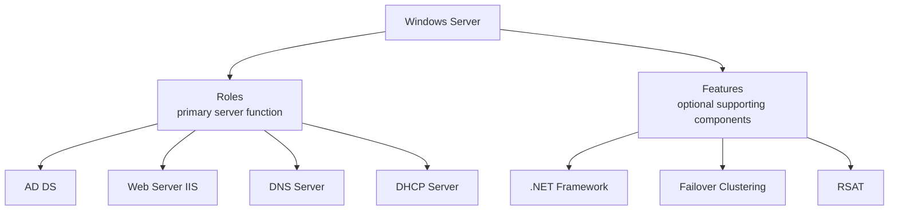

# Windows Server

**Windows Server** is a family of server operating systems developed by Microsoft. It is designed to manage enterprise-level networking, storage, applications, and security.

## Overview

Windows Server uses a **role-based installation** model: you install only the roles and features a workload requires, keeping the system lean and reducing the attack surface.

### Common Uses of Windows Server

- Hosting websites and web applications (e.g., using IIS).
- File and storage management.
- Active Directory (user/group management and authentication).
- Remote Desktop Services.
- DNS, DHCP, and other infrastructure services.

### Popular Versions

- **Windows Server 2025** (latest Long-Term Servicing Channel version)
- **Windows Server 2022**
- **Windows Server 2019**
- **Windows Server 2016**
- Older versions: 2012 R2, 2012, 2008 R2, 2008, 2003 R2, 2003 etc.

### Key Features

| Feature                               | Description                                                  |
|-------------------------------------|--------------------------------------------------------------|
| **Active Directory**                | Centralized user and group management.                      |
| **IIS (Internet Information Services)** | Web server for hosting sites (ASP.NET, PHP, static content). |
| **Hyper-V**                        | Virtualization platform similar to VMware.                   |
| **PowerShell**                     | Command-line shell and scripting for automation.             |
| **Windows Admin Center**           | Web-based management tool for servers and clusters.          |
| **Failover Clustering**            | Provides high availability and load balancing.               |

## Concepts

### Roles and Features

- Windows Server uses a **Role-Based Installation** model, enabling you to install only what is necessary to keep the system lean and secure.



### What are Roles?

- **Roles** define the primary function of a server. A single server can have multiple roles installed.

#### Common Server Roles

| Role                                  | Description                                                |
|-------------------------------------|------------------------------------------------------------|
| **Active Directory Domain Services (AD DS)** | Manages users, computers, groups, and provides domain services. |
| **Web Server (IIS)**                 | Hosts websites and web applications using Internet Information Services. |
| **DHCP Server**                     | Assigns dynamic IP addresses to devices on the network.     |
| **DNS Server**                     | Resolves domain names to IP addresses.                      |
| **File and Storage Services**       | Centralized file sharing and storage management.             |
| **Hyper-V**                        | Enables virtualization to run multiple OSes on the same hardware. |
| **Print and Document Services**     | Centralized print server management.                         |
| **Remote Desktop Services (RDS)**   | Enables remote access to desktop sessions or applications.   |
| **Windows Deployment Services (WDS)** | Deploys Windows operating systems remotely over the network. |
| **Fax Server**                    | Sends and receives faxes using server-based hardware or virtual modems. |
| **Network Policy and Access Services (NPAS)** | Provides network access authentication, authorization, and accounting. |

### What are Features?

- **Features** are optional components that support or enhance roles. They provide additional capabilities but are not primary server functions themselves.

#### Common Server Features

| Feature                             | Description                                                |
|-----------------------------------|------------------------------------------------------------|
| **.NET Framework**                 | Required for many Windows-based applications.               |
| **Windows Server Backup**          | Enables scheduled or manual system and data backups.        |
| **Failover Clustering**            | Provides high availability for applications and services.   |
| **Group Policy Management**        | Allows centralized management of user and computer configurations. |
| **Telnet Client**                  | Enables remote command-line connections using Telnet.       |
| **Windows PowerShell**             | Scripting language and shell for automation.                 |
| **BitLocker Drive Encryption**     | Provides data protection through drive encryption.           |
| **Network Load Balancing**         | Distributes traffic across multiple servers.                 |
| **SMB Direct**                    | High-performance, low-latency file sharing using RDMA-capable NICs. |
| **SNMP Services**                  | Enables network management using SNMP protocol.              |
| **Windows Defender Features**      | Built-in antivirus and malware protection.                   |

## Administration

### How to Add Roles and Features

1. Open **Server Manager**.
2. Click **Manage** > **Add Roles and Features**.
3. Follow the wizard steps:
   - Choose **Role-based or feature-based installation**.
   - Select the target server.
   - Choose desired **Roles** and **Features**.
4. Click **Install** and wait for completion.

> [!NOTE]
> **Screenshot**
> 

> [!TIP]
> **Where to go deeper**
> See [Windows-Features-and-Roles](Windows-Features-and-Roles.md) for the full add/remove workflow (GUI, DISM, and PowerShell) and [Server-Manager](Server-Manager.md) for the console that hosts this wizard.

### Total Common Windows Server Roles

|Role Name|Description|
|---|---|
|Active Directory Domain Services (AD DS)|User, computer, and policy management.|
|Active Directory Certificate Services (AD CS)|Public key infrastructure (PKI) and certificate management.|
|Active Directory Federation Services (AD FS)|Single sign-on (SSO) and identity federation.|
|Active Directory Lightweight Directory Services (AD LDS)|Lightweight directory for directory-enabled apps.|
|Application Server|Host and manage applications and services.|
|DHCP Server|Assigns dynamic IP addresses.|
|DNS Server|Resolves domain names.|
|Fax Server|Manage fax services.|
|File and Storage Services|File shares, storage pools, and disk management.|
|Hyper-V|Virtualization platform.|
|Network Policy and Access Services (NPAS)|Network access authentication and policy enforcement.|
|Print and Document Services|Centralized printer management.|
|Remote Access|VPN and DirectAccess services.|
|Remote Desktop Services (RDS)|Remote desktop and application delivery.|
|Volume Activation Services|Manage Windows license activation.|
|Web Server (IIS)|Hosting web applications and websites.|
|Windows Deployment Services (WDS)|Remote OS deployment.|
|Windows Server Update Services (WSUS)|Manage Windows updates.|
|Windows System Resource Manager (WSRM)|Manage system resources allocation.|

### Total Common Windows Server Features

|Feature Name|Description|
|---|---|
|.NET Framework|Required for many Windows applications.|
|BitLocker Drive Encryption|Encrypt drives for security.|
|BranchCache|Optimize WAN bandwidth by caching content.|
|Failover Clustering|High availability clustering.|
|Group Policy Management|Manage Group Policies centrally.|
|Network Load Balancing|Distribute traffic across multiple servers.|
|Remote Server Administration Tools (RSAT)|Tools for remote management of Windows servers.|
|SMB Direct|High-speed file sharing over RDMA networks.|
|Telnet Client|Command-line access to remote systems.|
|Windows Defender Antivirus|Built-in malware protection.|
|Windows PowerShell|Command-line shell and scripting.|
|Windows Server Backup|Backup and recovery tools.|
|Windows System Resource Manager (WSRM)|Resource management.|
|Simple Network Management Protocol (SNMP)|Network monitoring.|
|User Interfaces and Infrastructure|Desktop Experience features (if GUI is needed).|
|Windows Process Activation Service (WAS)|Underlying service for IIS and application hosting.|

## PowerShell

- If you want a **full exhaustive official list**, you can also get it by running PowerShell on a Windows Server:

```powershell
Get-WindowsFeature | Format-Table -AutoSize
```

- This command will show **all roles and features** installed and available.

## Security Considerations

> [!IMPORTANT]
> **Roles are attack surface**
> The role-based model is a security control: install only the roles a server actually needs. Every extra role or feature widens the attack surface and adds patching obligations.

Windows Server is the highest-value target on most networks — a compromised server (especially one running [Active-Directory-Domain-Services](../Active-Directory-Domain-Services-AD-DS/Active-Directory-Domain-Services.md)) often means domain-wide compromise. From an offensive standpoint, the enabled roles enumerate the paths in: a **Web Server (IIS)** exposes web attack surface, **Remote Desktop Services (RDS)** exposes RDP (TCP 3389) for credential attacks, and remote-management channels ([Windows-Remote-Management(WinRM)](Windows-Remote-Management(WinRM).md), [OpenSSH-Server-on-Windows](OpenSSH-Server-on-Windows.md)) are prime lateral-movement vectors.

> [!WARNING]
> **Legacy and default-on components are liabilities**
> - **Print and Document Services** enables the Print Spooler, which has been the subject of critical remote-code-execution flaws (for example, **PrintNightmare**, CVE-2021-34527) — disable the spooler on servers that do not print.
> - **SMBv1** and the **Telnet Client** are obsolete, unauthenticated-adjacent protocols; do not install them and remove SMBv1 where present.
> - **WSUS** and deployment roles (WDS) distribute software widely — if compromised they become a fleet-wide code-execution channel.
> - Every unpatched or unnecessary role is a foothold; defenders should minimise installed roles and monitor for unexpected role/service changes.

## Best Practices

- Install only the roles and features a workload requires; prefer **Server Core** to shrink the GUI attack and patch surface.
- Keep the server patched and centrally managed (WSUS / update management), and reboot promptly for pending updates.
- Run services under **least-privilege service accounts** (gMSA where possible) rather than highly privileged accounts.
- Restrict and segment management interfaces (RDP, WinRM, SSH) to dedicated admin subnets and require strong authentication.
- Remove or never install legacy components such as **SMBv1** and the **Telnet Client**.

## Troubleshooting

| Symptom | Likely cause & fix |
| --- | --- |
| Role/feature install fails with "source files could not be found" | Features on Demand payload missing — supply `-Source` (install media / `sxs` folder) or allow access to Windows Update. |
| `Get-WindowsFeature` is not recognized | The `ServerManager` module is only present on Windows **Server**; the cmdlet is unavailable on client Windows. |
| Install completes but role inactive | A reboot is pending — check `Install-WindowsFeature -Restart` or reboot manually to finalize. |

## References

- [Windows Server documentation (Microsoft Learn)](https://learn.microsoft.com/en-us/windows-server/)
- [Install or Uninstall Roles, Role Services, or Features (Microsoft Learn)](https://learn.microsoft.com/en-us/windows-server/administration/server-manager/install-or-uninstall-roles-role-services-or-features)
- [Get-WindowsFeature (PowerShell reference)](https://learn.microsoft.com/en-us/powershell/module/servermanager/get-windowsfeature)

## Related
- [Enterprise Windows Infrastructure Security](../Readme.md) — course hub and map of content
- [Windows-Server-Editions](Windows-Server-Editions.md) — the available server editions — related note
- [Windows-Server-Installation](Windows-Server-Installation.md) — installing the server OS — related note
- [Windows-Features-and-Roles](Windows-Features-and-Roles.md) — adding and removing roles/features — related note
- [Server-Manager](Server-Manager.md) — the primary management console — related note
- [Group-Policy(GPO)](../Group-Policy-Objects-GPO/Group-Policy(GPO).md) — managed from domain controllers — related note
- Offensive-Active-Directory — attacking AD running on Windows Server — related note
