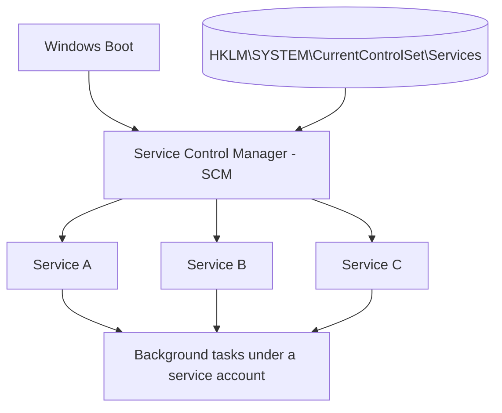

# Windows Service

A **Windows Service** is a background application that runs independently of a user's login session. Services typically start automatically when Windows boots and continue running without requiring user interaction. They provide core operating-system functions, server roles, networking, security, and application-specific functionality.

## Overview

Windows Services are long-running processes managed by the **Service Control Manager (SCM)**. They can start at boot, run with no user logged in, and execute under different security accounts — from the highly privileged **Local System** down to constrained accounts like **Local Service** or a domain **[managed service account](../Active-Directory-Domain-Services-AD-DS/Managing-Domain-Users-and-Groups-with-PowerShell.md)**. Administrators drive services through graphical consoles such as [Computer Management](Computer-Management-in-Windows-OS.md), the **Service Control (`sc`)** utility, or **PowerShell**, and configuration for every service is persisted under the [Windows Registry](../Windows-Commands/Windows-Registry.md) at `HKLM\SYSTEM\CurrentControlSet\Services`.

Because services run silently, often with high privilege, and can be started or reconfigured remotely, they are equally central to day-to-day administration and to offensive tradecraft — misconfigured services are a classic local privilege-escalation vector.

## Key Characteristics

- Runs in the background.
- Starts automatically, manually, or can be disabled.
- Can run without any user logged in.
- Managed by the **Service Control Manager (SCM)**.
- Can run under different security accounts.
- Supports automatic recovery after failure.
- Can be controlled locally or remotely.

## Service Architecture

The **SCM** (`services.exe`) starts at boot, reads service configuration from the registry, and launches each service under its configured account. It then tracks state and handles start/stop/pause control requests.



## Common Windows Services

| Service | Description |
|---|---|
| DHCP Client | Obtains IP addresses from DHCP servers |
| DNS Client | Resolves DNS names |
| Windows Update | Downloads and installs updates |
| Print Spooler | Manages print jobs |
| Remote Desktop Services | Enables Remote Desktop |
| Windows Defender | Antivirus protection |
| Event Log | Records Windows events |
| Task Scheduler | Executes scheduled tasks |
| IIS World Wide Web Publishing Service | Hosts websites |
| Windows Time | Synchronizes system time |

## Service Startup Types

| Startup Type | Description |
|---|---|
| Automatic | Starts during system boot |
| Automatic (Delayed Start) | Starts shortly after boot |
| Manual | Starts only when required |
| Disabled | Cannot be started until enabled |

## Service States

| State | Description |
|---|---|
| Running | Service is active |
| Stopped | Service is not running |
| Paused | Service execution temporarily suspended |
| Starting | Service is starting |
| Stopping | Service is stopping |

## Service Accounts

Windows services run under security accounts.

| Account | Description |
|---|---|
| Local System | Highest local privileges |
| Local Service | Limited privileges; anonymous network access |
| Network Service | Limited local privileges; authenticates to network as computer account |
| User Account | Runs using a specific user account |
| Group Managed Service Account (gMSA) | Domain-managed account for services without password management |

> [!IMPORTANT]
> **The account is the privilege**
> A service's power on the host is the power of the account it runs as. A service running as **Local System** that an attacker can influence is effectively `NT AUTHORITY\SYSTEM` — the reason service misconfigurations are such a prized privilege-escalation target. Prefer **Local Service**, **Network Service**, or a **gMSA** and grant Local System only when genuinely required.

## Managing Services

### Services Console (GUI)

Open:

```cmd
services.msc
```

Features:

- Start service
- Stop service
- Restart service
- Pause service
- Change startup type
- Configure recovery options
- View dependencies

### Task Manager

```text
Ctrl + Shift + Esc
```

Navigate to the **Services** tab.

### Computer Management

```cmd
compmgmt.msc
```

Navigate:

```text
Services and Applications
    └── Services
```

See [Computer-Management-in-Windows-OS](Computer-Management-in-Windows-OS.md) for the full console.

## Service Control Commands

### List Services

```cmd
sc query
```

List all services (including stopped):

```cmd
sc query state= all
```

> [!NOTE]
> **Mind the space in `sc` syntax**
> The `sc` utility requires a space **after** the `=` in options (`state= all`, `start= auto`, `binPath= "..."`) and **no** space before it. Omitting or misplacing the space is the most common `sc config` / `sc create` error.

### Query Specific Service

```cmd
sc query WinDefend
```

### Start Service

```cmd
sc start Spooler
```

### Stop Service

```cmd
sc stop Spooler
```

### Restart Service

```cmd
net stop Spooler
net start Spooler
```

### Configure Startup Type

Automatic:

```cmd
sc config Spooler start= auto
```

Manual:

```cmd
sc config Spooler start= demand
```

Disabled:

```cmd
sc config Spooler start= disabled
```

## PowerShell Service Management

### List Services

```powershell
Get-Service
```

### Running Services

```powershell
Get-Service | Where-Object Status -eq Running
```

### Service Information

```powershell
Get-Service Spooler
```

### Start / Stop / Restart

```powershell
Start-Service Spooler
Stop-Service Spooler
Restart-Service Spooler
```

### Set Startup Type

```powershell
Set-Service Spooler -StartupType Automatic
```

Available values: `Automatic`, `Manual`, `Disabled`.

## Viewing Detailed Service Information

### Command Prompt

```cmd
sc qc Spooler
```

Displays the binary path, start type, dependencies, and service account.

### PowerShell

```powershell
Get-CimInstance Win32_Service
```

Specific service:

```powershell
Get-CimInstance Win32_Service -Filter "Name='Spooler'"
```

## Service Dependencies

Some services depend on others. View dependencies:

```cmd
sc enumdepend Spooler
```

Or in **Services (`services.msc`)** under **Properties → Dependencies**.

## Creating and Deleting a Service

Register an executable as a service:

```cmd
sc create MyService binPath= "C:\Tools\MyService.exe"
```

Delete the service:

```cmd
sc delete MyService
```

## Recovery Options

Configure what Windows does if a service fails:

- Restart the service
- Restart the computer
- Run a program
- Take no action

Configured via **`services.msc` → Service Properties → Recovery**.

## Viewing Service Logs

Event Viewer:

```cmd
eventvwr.msc
```

Navigate to **Windows Logs → System** and filter by **Service Control Manager** or the service name.

## Windows Service Registry Location

Service configuration is stored in the registry:

```text
HKEY_LOCAL_MACHINE
└── SYSTEM
    └── CurrentControlSet
        └── Services
```

Each service has its own key containing its startup type, image path, dependencies, service account, and description. See [Windows-Registry](../Windows-Commands/Windows-Registry.md).

## Security Considerations

Services are one of the most heavily abused local privilege-escalation surfaces on Windows. Because the SCM launches service binaries with the service's (often SYSTEM) token, any attacker-controlled input into that launch path — the binary, its path, its arguments, or the ability to reconfigure the service — becomes code execution as that account.

> [!WARNING]
> **Common service-based privilege-escalation vectors**
> - **Unquoted service paths** — a `binPath` with spaces and no quotes (e.g. `C:\Program Files\My App\svc.exe`) lets Windows try `C:\Program.exe` first; a writable parent directory means arbitrary code runs as the service account. See Unquoted-Service-Path-Vulnerability.
> - **Insecure service permissions (`binPath`)** — if a low-privileged user holds `SERVICE_CHANGE_CONFIG`, they can repoint the binary and restart the service as SYSTEM. See Insecure-Service-Permissions(binPath).
> - **Weak file/folder permissions** — a writable service executable can simply be overwritten. See Insecure-File-Permissions-Service-Executable-Files-Path.
> - **DLL hijacking** — a service that loads a DLL from a writable or search-order-controlled path executes attacker code in its context. See Dynamic-Link-Library-Hijacking(DLL-Hijacking).
> - **Registry-based escalation** — write access to a service's `HKLM\...\Services\<name>` key (especially `ImagePath`) is equivalent to changing its binary. See Service-Escalation-via-Registry.

Defensively, audit service ACLs and `binPath` values, quote all executable paths, keep binaries in directories only administrators can write, and prefer constrained/managed service accounts over Local System. Tools like `sc qc`, `accesschk`, and PowerUp surface these misconfigurations quickly. See Services-Exploitation for the full offensive workflow.

## Best Practices

- Run services with the **least privilege** required; avoid **Local System** unless necessary, and prefer **gMSA** for domain services.
- **Quote executable paths** and store service binaries in directories writable only by administrators.
- **Disable unused services** to reduce attack surface, and keep enabled services patched.
- **Review service permissions** (both the service object and its files/registry key) regularly for weak ACLs.
- **Monitor** service failures, unexpected `binPath` changes, and SCM start/stop events in the System log.

## Troubleshooting

| Symptom | Likely cause & fix |
|---|---|
| Service won't start | Check state and error with `sc query <Name>`; review the System log via `eventvwr.msc` |
| `sc config` / `sc create` rejects arguments | Missing space after `=` (`start= auto`, `binPath= "..."`) — fix the `sc` syntax |
| Service starts then stops immediately | A dependency failed — check `sc enumdepend <Name>` and the dependent services |
| Service marked "Disabled" | Re-enable with `sc config <Name> start= demand` (or `auto`) before starting |
| Wrong/failing binary | Verify the path with `sc qc <Name>` or `(Get-CimInstance Win32_Service -Filter "Name='<Name>'").PathName` |

Quick diagnostic commands:

```powershell
Get-WinEvent -LogName System -MaxEvents 50
```

```cmd
sc query <ServiceName>
sc qc <ServiceName>
sc enumdepend <ServiceName>
```

## Common Administrative Commands

| Task | Command |
|---|---|
| Open Services | `services.msc` |
| List services | `sc query` |
| Query a service | `sc query <ServiceName>` |
| View configuration | `sc qc <ServiceName>` |
| Start a service | `sc start <ServiceName>` |
| Stop a service | `sc stop <ServiceName>` |
| Restart a service | `Restart-Service <ServiceName>` |
| Change startup type | `Set-Service <ServiceName> -StartupType Automatic` |
| Create a service | `sc create <Name> binPath= "<Path>"` |
| Delete a service | `sc delete <Name>` |
| View logs | `eventvwr.msc` |
| List services (PowerShell) | `Get-Service` |
| Detailed service information | `Get-CimInstance Win32_Service` |

## References

- Microsoft Learn — Services (Service Control Manager): https://learn.microsoft.com/windows/win32/services/services
- Microsoft Learn — Service Security and Access Rights: https://learn.microsoft.com/windows/win32/services/service-security-and-access-rights
- Microsoft Learn — `sc.exe` (Service Control) command: https://learn.microsoft.com/windows-server/administration/windows-commands/sc-config
- Microsoft Learn — `Get-Service` (PowerShell): https://learn.microsoft.com/powershell/module/microsoft.powershell.management/get-service

## Related

- [Enterprise Windows Infrastructure Security](../Readme.md) — course hub
- [Computer-Management-in-Windows-OS](Computer-Management-in-Windows-OS.md) — related note (managing services via the console)
- [Windows-Registry](../Windows-Commands/Windows-Registry.md) — related note (where service config is stored)
- [Windows-Remote-Management(WinRM)](Windows-Remote-Management(WinRM).md) — related note (remote service control)
- Services-Exploitation — related note (offensive service-abuse workflow)
- Unquoted-Service-Path-Vulnerability — related note (privilege-escalation vector)
- Insecure-Service-Permissions(binPath) — related note (weak service ACLs)
- Dynamic-Link-Library-Hijacking(DLL-Hijacking) — related note (DLL-based service abuse)
